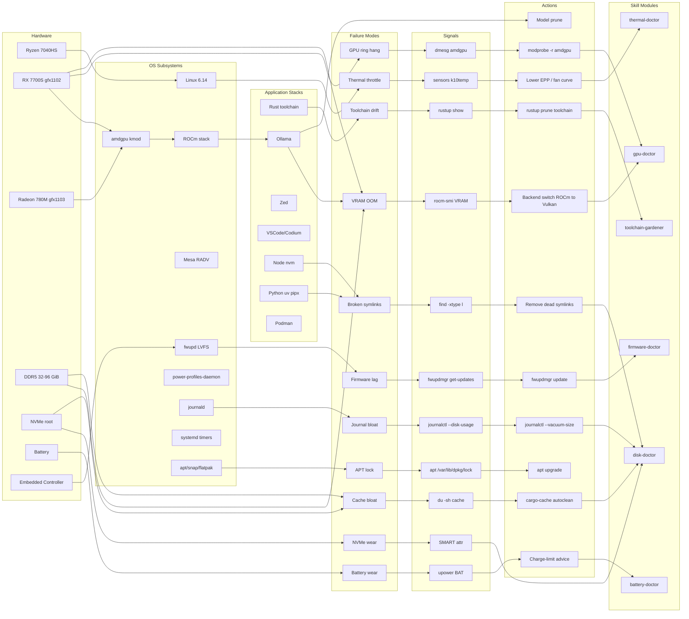
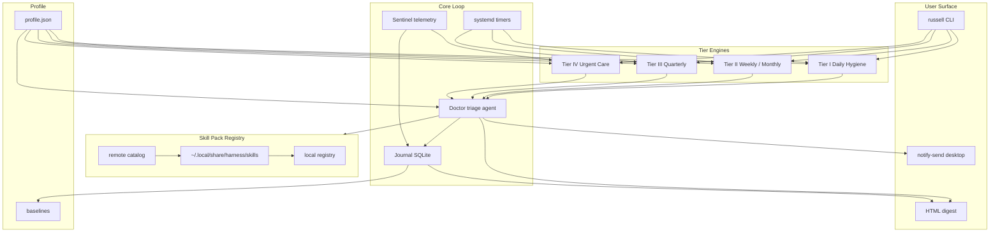
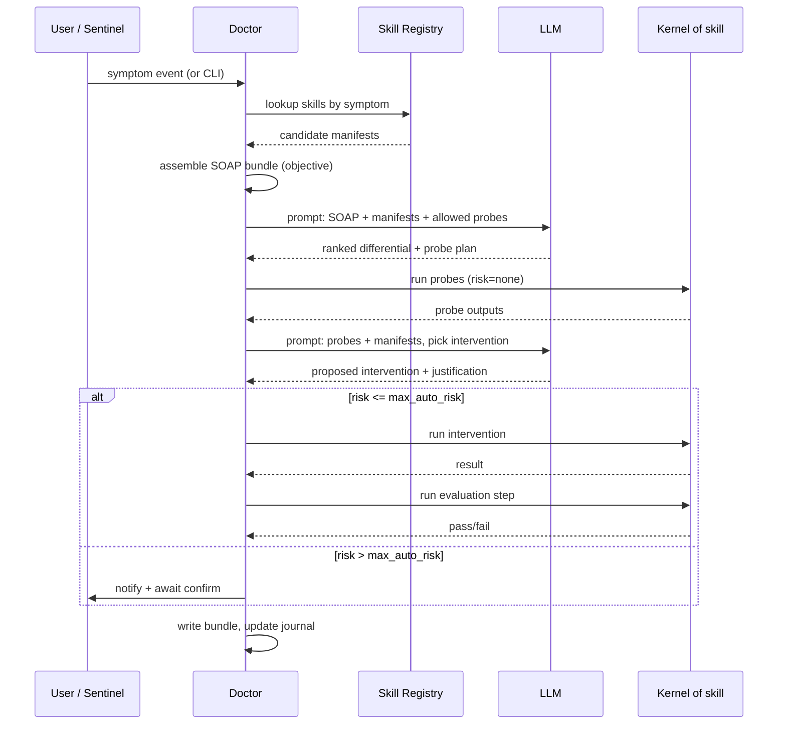
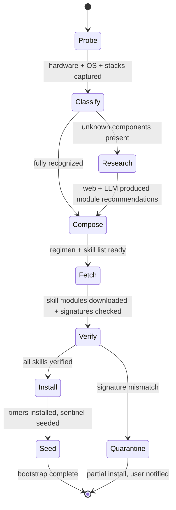
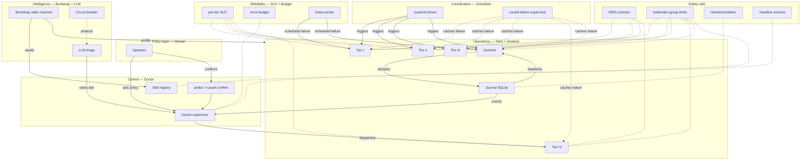

# The Cybernetic Health Harness

> A self-adaptive maintenance framework for a Framework 16 / AMD RDNA3 / Ubuntu workstation used as a local AI/ML development machine.
>
> This is a **design document**, not an implementation. Code blocks are illustrative blueprints, not production-complete. Version numbers, flag names, and kernel specifics should be verified against current upstream before any code lands.

---

## 1. Executive Summary

This document specifies **Russell**, a cybernetic health harness that turns a loose collection of periodic shell scripts (`~/Clones/scripts/`) into a closed feedback loop of sensing → evaluating → acting → learning, with explicit escalation when the loop encounters conditions it cannot resolve autonomously.

The harness targets a **Framework Laptop 16** (AMD Ryzen 7040HS-class CPU, Radeon RX 7700S dGPU expansion module on `gfx1102`, Radeon 780M iGPU on `gfx1103`, 32–96 GiB DDR5, NVMe storage) running **Ubuntu 25.04 "Plucky Puffin"** (kernel ~6.14), used primarily for local LLM inference/fine-tuning, Rust development (Zed, VSCode, rust-analyzer), and browser-based research.

> **Discrepancy note:** The adjacent [`MACHINE_PROFILE.md`](MACHINE_PROFILE.md:1) documents an empirically-observed Ryzen AI 9 HX 370 / Radeon 890M / Ubuntu 25.10 configuration on this operator's actual laptop. The gap between the *stated target profile* and the *observed machine* is itself a design validator: **the bootstrap must detect the real hardware at install time rather than assuming it.** Throughout this document, references to "7040HS/RX 7700S/780M/25.04" are to the *class* of machine — the harness reads from `/sys`, `dmidecode`, `lspci`, `rocminfo`, and `/etc/os-release` to personalize the regimen.

Four capabilities define the system:

1. **Cadenced hygiene** — daily, weekly, monthly, quarterly routines driven by `systemd` timers.
2. **Continuous symptom detection** — lightweight telemetry (SQLite + EWMA baselines) that fires alerts when battery, thermal, GPU, I/O, memory, or storage signals cross thresholds.
3. **A specialist diagnostic agent** — triggered by symptoms or user invocation, loads versioned *skill modules* (YAML-manifested playbooks) keyed to the observed symptom, runs them with an LLM-assisted triage loop, produces an evidence bundle, and hands off to a human if the skill-recommended action exceeds its safety budget.
4. **Self-profiling bootstrap** — hardware/OS/workload fingerprinting followed by web + LLM-assisted research that compiles a personalized regimen and downloads the matching skill modules.

All actions are **idempotent, dry-runnable, structured-logged, and reversible where meaningful**. The guiding heuristic is medical: *first, do no harm*; if uncertain, fail explicit, preserve evidence, notify the human, and wait.

---

## 2. Metaphor & Framing

The harness borrows the anatomy of **primary-care medicine**:

| Medical concept | Harness analogue |
|---|---|
| Chart / intake | `~/.local/state/harness/profile.json` — hardware, OS, installed stacks |
| Vitals | Continuous telemetry: temps, battery wear, free RAM, VRAM, NVMe SMART |
| Daily hygiene | Tier I tasks: shower/floss-class — trash, thumbnail, trivial caches |
| Annual physical | Tier III quarterly routine — SMART long self-test, btrfs scrub, firmware audit |
| Triage | Symptom detector + severity classifier (ESI-inspired) |
| Specialist referral | Skill module invoked by the Doctor |
| SOAP note | Evidence bundle: Subjective, Objective, Assessment, Plan |
| Differential diagnosis | LLM-assisted hypothesis list narrowed by rule-out probes |
| "First, do no harm" | Safety rails: dry-run default, rollback, confirmation gate for destructive actions |

The metaphor is not decoration — it directly shapes the module boundaries (Tier I–IV), the escalation protocol, the log schema (SOAP-style), and the default refusal posture.

---

## 3. Research Findings

Curated, cited-by-name, with confidence markers. Treat **any version numbers as needing upstream verification**.

### 3.1 Ubuntu 25.04 "Plucky Puffin"

- **Power management default:** Ubuntu 25.04 GNOME ships `power-profiles-daemon` (PPD). Canonical has been discussing `tuned-ppd` (a tuned shim presenting the PPD D-Bus API) as the longer-term default, but as of 25.04 this is **likely still PPD on GNOME desktops** — verify with `systemctl status power-profiles-daemon`. **Do not run TLP and PPD concurrently**; they contend for the same sysfs knobs.
- **Snap/flatpak/APT coexistence:** Ubuntu increasingly ships core desktop apps as Snaps (Firefox, Thunderbird). Flatpak is user-installed. The harness must iterate all three for upgrade orchestration.
- **APT:** Plucky defaults to `apt` 3.x with the new solver; `apt-get` remains scriptable. `unattended-upgrades` handles security patches by default — the harness should *not* duplicate that, only verify it's functioning.
- **Firmware:** `fwupd` + LVFS is first-class for Framework hardware. `fwupdmgr refresh` + `fwupdmgr get-updates` is the canonical probe; staging is handled via `fwupdmgr update`.
- **Kernel:** 25.04 ships a 6.14-series HWE kernel [verify against current upstream]. Expect amdgpu regressions and fixes to move at HWE cadence.

### 3.2 Framework 16 Specifics

- **Embedded Controller:** The **`fw-ectool`** project (third-party) and Framework's signed EC firmware updates via `fwupd` expose fan curve, charge limit, and keyboard matrix controls. Writing EC registers directly is hazardous; prefer LVFS updates.
- **Fan curves:** The `fw-fanctrl` community project offers user-space curves; stock firmware is usually adequate on AMD variants. Reports of loud fans post-suspend usually trace to stale EC state — a suspend/resume cycle or EC reset clears them.
- **Fingerprint reader:** `libfprint` support for the Framework 16 reader has historically trailed hardware release [confidence: medium]. Verify with `fprintd-enroll` before enabling PAM integration.
- **Expansion modules:** PCIe topology can legitimately change between boots (the dGPU module can be removed). The harness must tolerate topology change rather than alert on it — it should diff against the *last-known-good* profile and ask, not cry wolf.
- **Known issues:** s2idle (`mem_sleep_default=s2idle`) has shown higher idle drain than `deep` on early firmware. `cat /proc/cmdline` to check; `mem_sleep_default=deep` is a common mitigation.

### 3.3 AMD RDNA3 + ROCm

- **GPU identities:** RX 7700S = `gfx1102` (Navi 33). Radeon 780M = `gfx1103` (Phoenix APU). Neither is on ROCm's *official* support list in the way `gfx1100` (7900 XT/X) is — they are "tolerated" via the **`HSA_OVERRIDE_GFX_VERSION=11.0.0`** (or 11.0.2) escape hatch for the dGPU and `HSA_OVERRIDE_GFX_VERSION=11.0.3` for the iGPU (verify against current ROCm matrix).
- **Kernel module:** `amdgpu` is in-tree. Check `dmesg -t | grep amdgpu` for ring-hang or VM-page-fault entries as primary signals.
- **rocm-smi:** authoritative for temp / power / VRAM / engine-busy. Pair with `amd-smi` (newer) where available.
- **Mesa RADV / ACO:** For Vulkan workloads (llama.cpp Vulkan backend, games). `RADV_PERFTEST=` and `MESA_VK_DEVICE_SELECT=` env knobs are common toggles.
- **ROCm/Ollama known hazard:** Recent ROCm releases have shown VRAM over-allocation regressions on Navi 3x / Strix iGPUs with Ollama. The legacy `scripts/ollama/` directory already includes a backend-toggle (ROCm → Vulkan) workaround; keep that pattern as a Tier-IV skill module.
- **Reset path:** When the GPU ring hangs, recovery escalates from `rocm-smi --gpureset` → `modprobe -r amdgpu && modprobe amdgpu` (requires no display server) → reboot. Never attempt the middle step while a user session is active on that GPU.

### 3.4 Thermal, Power, Pstate

- **amd-pstate-epp** is the upstream CPU frequency driver. Valid EPP values: `performance`, `balance_performance`, `balance_power`, `power`. Default on battery tends to `balance_power`.
- **CoreCtrl** (AMD-focused GUI) and **ryzenadj** (low-level PBO/TDP tweaks) exist but are high-risk; the harness should **observe and recommend**, not auto-apply.
- **lm-sensors / `sensors`** remains the pragmatic temperature feed. `k10temp` driver exposes Tctl; `amdgpu` exposes GPU edge/junction/memory temps.

### 3.5 Rust Toolchain Hygiene

- **Multiple toolchains accumulate:** `rustup toolchain list` frequently shows 4–6 installed. Anything not referenced by `rust-toolchain.toml` in active projects should be flagged for removal.
- **Caches:**
  - `~/.cargo/registry/{cache,src}` — `cargo-cache --autoclean` keeps this bounded.
  - `~/.cargo/bin` — treat as precious; never auto-prune.
  - Per-project `target/` directories — dominate disk. **`sccache`** (shared compilation cache) + aggressive **`CARGO_TARGET_DIR=~/.cache/cargo-target`** consolidation is the high-leverage move. `cargo-sweep` prunes by last-access time.
- **rustup update** is idempotent and safe; schedule weekly.

### 3.6 Editor Drift

- **Zed:** Config under `~/.config/zed/`. Auto-updates itself (Preview channel on this host). Extension IDs and their last-update times are readable from `~/.local/share/zed/extensions/` [verify path — may differ per Zed version].
- **VSCode / VSCodium:** `code --list-extensions --show-versions`. AI-coding extensions churn fast (Cline/Roo/Kilo/Continue/Copilot). Weekly `code --update-extensions` equivalent is not a CLI flag — VSCode updates on launch; Codium honors its own cadence.

### 3.7 Disk / FS

- **Root is ext4** in the stated profile. `e2scrub_all.timer` runs LVM snapshot-backed fsck monthly on systems that have LVM; on plain ext4 partitions, rely on boot-time `fsck` and SMART.
- **btrfs scrub** only applies if btrfs is mounted — detect, don't assume.
- **`fstrim.timer`** is enabled by default on Ubuntu; verify weekly cadence.
- **SMART:** `smartctl -H` for self-assessment; `smartctl -A` for attributes; `nvme smart-log` for NVMe-specific counters (media errors, percentage-used). Schedule short self-test weekly, long self-test quarterly.

### 3.8 Containers

- **Docker or Podman:** Both ship. Podman is rootless-friendly and ships in Ubuntu main. `docker system prune` / `podman system prune` are the analogues.
- **Image bloat:** `docker images --filter "dangling=true"`, `docker builder prune`, and volume pruning are weekly-class.

### 3.9 Journald, systemd Timers, Logs

- **Journal retention:** `SystemMaxUse=` in `/etc/systemd/journald.conf`. A 500 MiB cap is a reasonable default for a dev workstation.
- **systemd-timer over cron:** Timers offer `Persistent=true` (catches missed runs after suspend/shutdown), `RandomizedDelaySec=` (jitter), dependency ordering via `Requires=`/`After=`, and native journald integration. Cron has none of these; the harness standardizes on timers.
- **OnCalendar semantics:** `daily`, `weekly`, `monthly`, or explicit `*-*-* 03:00:00`. Combined with `Persistent=true`, a laptop that was asleep at 03:00 runs the unit at next resume.

### 3.10 LLM Tooling

- **Ollama:** `ollama list`, `ollama ps`, model dir typically `~/.ollama/models` (or `/usr/share/ollama/.ollama/models`). Large model files are the dominant disk hog after cargo targets.
- **llama.cpp:** Vulkan backend often outperforms ROCm on Navi 33 for certain quantizations [confidence: medium, verify].
- **HF cache:** `~/.cache/huggingface/hub` — prune by last-access date.

---

## 4. Legacy `Clones/scripts` Reconnaissance & Migration Table

Inventory of what was found, and its disposition under Russell.

| Legacy artefact | Size / role | Still useful? | Disposition | Notes |
|---|---|---|---|---|
| [`maintain.sh`](../scripts/maintain.sh:1) | One-command wrapper invoking health → update → cleanup | Partially | **Supersede** | Replaced by `russell daily` / `russell weekly` CLI backed by systemd timers; the linear wrapper pattern is retained for interactive use. |
| [`system-health-check.sh`](../scripts/system-health-check.sh:1) | ~330 LOC Bash audit: memory, disk, GPU, Docker, Node, Python, Rust, systemd, kernel | Yes | **Modernize** | Decompose into telemetry probes (each a small script emitting structured JSON) + a dashboard assembler. Thresholds become EWMA baselines. |
| [`system-cleanup.sh`](../scripts/system-cleanup.sh:1) | ~250 LOC: symlinks, npm/pip/uv/cargo caches, Docker, trash, thumbnails | Yes | **Modernize** | Split into per-domain cleanup skill modules with uniform dry-run + size-accounting contract. |
| [`system-tune.sh`](../scripts/system-tune.sh:1) | ~160 LOC sudo-required: sysctl, limits, THP, journald, APT | Yes | **Modernize** | Convert each tuning to an *idempotent assertion* with pre/post state capture. Move to Tier II review + apply, not silent reapply. |
| [`system-update.sh`](../scripts/system-update.sh:1) | ~185 LOC: apt, rustup, nvm, npm, pipx, uv, ollama | Yes | **Modernize** | Orchestrate via a DAG: each ecosystem is a module with `check → plan → apply → verify` phases. Rust/nvm global-reinstall-after-upgrade is brittle — replace with volta-style shims or explicit pinning. |
| `ollama/ollama-backend-toggle.sh` | Toggle Ollama between ROCm and Vulkan backends via systemd drop-in | Yes | **Keep** (promote) | Becomes the canonical `skill: gpu-backend-switch` Tier-IV module. |
| `ollama/ollama-benchmark.sh` | Timed prompt benchmark across backends | Yes | **Keep** | Becomes the evaluation harness the Doctor runs after a backend switch. |
| `ollama/ollama-rocm-revert.sh` | Revert systemd drop-in to ROCm | Yes | **Keep** | Becomes the rollback half of `gpu-backend-switch`. |
| `ollama/ollama-vulkan-switch.sh` | Switch to Vulkan | Yes | **Keep** | Becomes the forward half of `gpu-backend-switch`. |
| `ollama-bench-results/*` | Historical benchmark artefacts | Evidence | **Archive** | Move to `~/.local/state/harness/evidence/legacy/` verbatim. |
| `README.md` | Project README | Superseded | **Archive** | Superseded by this document + the harness CLI's `--help`. |

**Migration key:** *Keep* = copy verbatim into the new layout; *Modernize* = re-implement under the new contract (structured logs, idempotent, dry-run); *Supersede* = delete after feature parity verified; *Archive* = move to `evidence/legacy/` for provenance.

No destructive migration is taken until the new module for a given legacy script passes a differential test: run both on a representative state, assert equivalent observable effect (file states, log contents) modulo structured-output differences.

---

## 5. Knowledge Graph (v1)

A pre-reflection conceptual graph linking hardware nodes → OS subsystems → application stacks → failure modes → maintenance actions → diagnostic signals → specialist skills.



### Node/edge table (normalized)

| From | Relation | To |
|---|---|---|
| Ryzen 7040HS | runs-on | Linux 6.14 |
| RX 7700S | driven-by | amdgpu kmod |
| amdgpu kmod | exposes | ROCm stack |
| ROCm stack | used-by | Ollama |
| Ollama | at-risk-of | VRAM OOM |
| VRAM OOM | detected-by | rocm-smi VRAM |
| rocm-smi VRAM | triggers | Backend switch |
| Backend switch | belongs-to | gpu-doctor |
| gpu-doctor | escalates-to | Human |
| Battery | wears-via | cycle count / design-capacity-ratio |
| Battery wear | detected-by | upower BAT |
| upower BAT | triggers | Charge-limit advice |
| Charge-limit advice | belongs-to | battery-doctor |
| NVMe | wears-via | TBW / media-errors |
| NVMe wear | detected-by | SMART attr |
| SMART attr | triggers | disk-doctor |
| fwupd LVFS | produces | Firmware lag |
| Firmware lag | detected-by | fwupdmgr get-updates |

(Table truncated for readability; full enumeration lives in `drafts/graph.v1.json` alongside the Mermaid source.)

---

## 6. System Architecture



**Key architectural choices:**

- **One source of truth for "what is this machine?"** — `~/.local/state/harness/profile.json`, produced by the bootstrap, consumed by every tier.
- **One event stream** — SQLite under `~/.local/state/harness/journal.db`, append-only, each row structured (severity, category, skill_id, evidence_ref).
- **Skills are data, not code** — a skill module is a YAML manifest plus referenced scripts under `~/.local/share/harness/skills/<id>/`. New skills can arrive without touching the core.
- **Core is small** — scheduler, telemetry collector, journal writer, doctor dispatcher, CLI. Everything domain-specific lives in skills.

---

## 7. Scheduler / Clock Design

**Why systemd timers, not cron:**

| Property | cron | systemd timer |
|---|---|---|
| Laptop-aware (catches missed runs) | no | `Persistent=true` |
| Jitter to avoid thundering herd | no | `RandomizedDelaySec=` |
| Dependency ordering | no | `Requires=`, `After=`, `Wants=` |
| Unified logging | MAILTO/stdout redirection | native journald |
| Dry-run introspection | `crontab -l` | `systemctl list-timers`, `systemd-analyze calendar` |
| Per-unit failure policy | none | `OnFailure=`, `StartLimitIntervalSec=` |
| Resource control | none | `CPUQuota=`, `IOWeight=`, `Nice=` |

All Russell timers are **user-scoped** (`systemctl --user`), not system-scoped, with exceptions for `fwupdmgr update` and apt operations that intrinsically need root. User scope keeps the blast radius contained and avoids PolKit prompts.

**Base timer schema:**

```ini
# ~/.config/systemd/user/russell-daily.timer
[Unit]
Description=Russell daily hygiene
Documentation=file:///home/mdz-axolotl/Clones/russell/cybernetic-health-harness.md

[Timer]
OnCalendar=*-*-* 03:30:00
RandomizedDelaySec=30m
Persistent=true
AccuracySec=1m
Unit=russell-daily.service

[Install]
WantedBy=timers.target
```

The corresponding service:

```ini
# ~/.config/systemd/user/russell-daily.service
[Unit]
Description=Russell daily hygiene runner
After=network-online.target
Wants=network-online.target
OnFailure=russell-failure@%n.service

[Service]
Type=oneshot
Environment=RUSSELL_TIER=daily
Nice=10
IOSchedulingClass=best-effort
IOSchedulingPriority=7
ExecStart=%h/.local/bin/russell run --tier daily
StandardOutput=journal
StandardError=journal
```

A templated `russell-failure@.service` captures stderr, packages an evidence bundle, and dispatches a `notify-send` — **failure itself is a first-class event**.

---

## 8. Telemetry & Symptom Detection

The **Sentinel** is a lightweight collector (Python or Rust; Python chosen for illustrative ease) invoked every 5 minutes by `russell-sentinel.timer`. It writes a row per probe into `journal.db`.

**Schema (SQLite):**

```sql
CREATE TABLE samples (
  ts           INTEGER NOT NULL,    -- unix seconds
  probe        TEXT NOT NULL,       -- 'cpu_temp', 'vram_used_mib', ...
  value_num    REAL,
  value_text   TEXT,
  unit         TEXT,
  PRIMARY KEY (ts, probe)
);
CREATE INDEX samples_probe_ts ON samples(probe, ts);

CREATE TABLE events (
  ts          INTEGER NOT NULL,
  severity    TEXT NOT NULL CHECK(severity IN ('info','warn','alert','crit')),
  category    TEXT NOT NULL,
  skill_id    TEXT,
  summary     TEXT NOT NULL,
  evidence    TEXT,                 -- path to bundle under ~/.local/state/harness/evidence/
  resolved_ts INTEGER
);

CREATE TABLE baselines (
  probe      TEXT PRIMARY KEY,
  ewma_mean  REAL,
  ewma_var   REAL,
  p50        REAL,
  p95        REAL,
  p99        REAL,
  updated_ts INTEGER
);
```

**Probes (minimum viable set):**

| Probe | Source | Frequency |
|---|---|---|
| `cpu_temp_c` | `sensors -j` → `k10temp` | 5 min |
| `cpu_epp` | `/sys/devices/.../energy_performance_preference` | 5 min |
| `mem_available_mib` | `/proc/meminfo` | 5 min |
| `swap_used_mib` | `/proc/meminfo` | 5 min |
| `gpu_temp_edge_c` | `rocm-smi -t --json` | 5 min |
| `gpu_vram_used_mib` | `rocm-smi --showmeminfo vram --json` | 5 min |
| `gpu_busy_pct` | `rocm-smi -u --json` | 5 min |
| `nvme_percentage_used` | `nvme smart-log /dev/nvme0n1 -o json` | 1 hr |
| `nvme_media_errors` | idem | 1 hr |
| `disk_root_used_pct` | `df --output=pcent /` | 30 min |
| `battery_cycle_count` | `/sys/class/power_supply/BAT1/cycle_count` | 1 hr |
| `battery_energy_full_wh` | `/sys/class/power_supply/BAT1/energy_full` | 1 hr |
| `journal_size_mib` | `journalctl --disk-usage` | 6 hr |
| `amdgpu_ring_hang_count` | `dmesg -T` grep in last 5 min | 5 min |

**Baselines:** For each probe, the Sentinel maintains an EWMA mean + variance and rolling p50/p95/p99 over 30 days. Alerts are symmetric-sigma + rule-based:

- `alert` if `value > mean + 3·stdev` AND exceeds the probe-specific hard threshold.
- `crit` if value crosses a *known-dangerous* hard threshold regardless of baseline (e.g., `cpu_temp_c > 95`, `nvme_percentage_used > 90`, `disk_root_used_pct > 95`).
- `warn` on soft thresholds or baseline drift (e.g., 3-day mean shift >20%).

Rule definitions live under `~/.config/harness/rules.d/*.toml` — user-editable, version-controllable.

---

## 9. Tier I — Daily Hygiene

**Cadence:** 03:30 local, Persistent=true, RandomizedDelaySec=30m. Runs unattended. Total budget: <60 seconds on healthy system, <5 minutes worst case.

| Module | Purpose | Action | Idempotent? | Dry-run? | Rollback |
|---|---|---|---|---|---|
| `daily/symptom-sweep` | Evaluate latest sentinel samples against rules | emit events; no mutation | yes | n/a | n/a |
| `daily/trash-empty` | Empty desktop trash (if >7 days, >100 MiB) | `gio trash --empty` with age/size guard | yes | yes | none (destructive by nature; age gate is the safety) |
| `daily/thumbnails-prune` | Prune `~/.cache/thumbnails` items older than 30 days | `find -atime +30 -delete` | yes | yes | none |
| `daily/broken-symlinks` | Report (not remove) dead `~/.local/bin` links | `find ~/.local/bin -xtype l` | yes | n/a | n/a |
| `daily/gpu-sanity` | Confirm `rocm-smi` responsive, no ring-hang in `dmesg` | read-only | yes | n/a | n/a |
| `daily/digest-desktop` | One-line `notify-send` summary if any warnings | read-only | yes | n/a | n/a |

**Guarantees:** Tier I is strictly read-only except for trash and thumbnails, both of which respect age/size thresholds and have explicit dry-run. Broken-symlink removal lives in Tier II; Tier I only *reports*, because an unexpected symlink death often indicates a broken install the user should see before automation masks it.

---

## 10. Tier II — Weekly / Monthly Routines

**Weekly cadence:** Sunday 04:00, Persistent=true. **Monthly:** 1st of month 04:30.

| Module | Cadence | Purpose |
|---|---|---|
| `weekly/toolchain-update` | weekly | `rustup update stable`; `nvm install --lts --reinstall-packages-from=current`; `uv self update`; `pipx upgrade-all`. Snapshot pre-state to enable rollback. |
| `weekly/cache-janitor` | weekly | `cargo-cache --autoclean`; `cargo-sweep -t 30 ~/src`; `pip cache purge`; `uv cache prune`; Docker/Podman `system prune -f --filter "until=720h"`. |
| `weekly/broken-symlinks-heal` | weekly | Remove the dead links Tier I has been reporting, after 7 consecutive daily sightings (hysteresis). |
| `weekly/apt-upgrade` | weekly | `sudo apt update && sudo apt upgrade -y --with-new-pkgs`; hold kernels during heavy workload windows. Delegated via PolKit action with narrow scope. |
| `weekly/snap-flatpak` | weekly | `snap refresh --list`, `flatpak update --assumeyes`. |
| `weekly/smart-short` | weekly | `smartctl -t short /dev/nvme0n1` + 24 h later read results. |
| `monthly/editor-extensions` | monthly | Report version drift of Codium/Zed extensions; no auto-update of AI tools (they change behavior). |
| `monthly/sysctl-assert` | monthly | Idempotently reassert the `system-tune.sh` knobs (swappiness=10, inotify, limits). Captures diff. |
| `monthly/log-retention-audit` | monthly | Check `journalctl --disk-usage`; vacuum to 500 MiB if over. |
| `monthly/model-usage-report` | monthly | `ollama list` + last-access times; flag models not touched in 90 days for user approval to prune. |

Each module emits a per-run JSON log to `~/.local/state/harness/runs/<timestamp>-<module>.json` with `{ started, ended, action, diff, bytes_before, bytes_after, exit }`.

---

## 11. Tier III — Quarterly Checkups

**Cadence:** 1st day of calendar quarter 05:00. Interactive-consent gated: Tier III writes a proposal to `~/.local/state/harness/proposals/` and sends a `notify-send` — the user runs `russell review` to accept or defer.

| Module | Purpose |
|---|---|
| `quarterly/smart-long` | `smartctl -t long /dev/nvme0n1` (hours; runs only on AC, screen unlocked). |
| `quarterly/firmware-audit` | `fwupdmgr refresh && fwupdmgr get-updates`; proposes `fwupdmgr update` with release-notes summary (LLM-assisted). |
| `quarterly/rust-toolchain-prune` | `rustup toolchain list` vs. `rust-toolchain.toml` references across `~/src` and `~/Clones`; propose removals. |
| `quarterly/docker-image-reap` | Images untagged, not-used-by container, not-based-by anything current → propose removal. |
| `quarterly/os-release-audit` | Check distro EOL cadence (non-LTS Ubuntu ≈ 9 mo support). Warn 3 months before EOL. |
| `quarterly/battery-report` | Design vs. current capacity ratio, cycle count trajectory. Recommend charge limit (`fwupd` EC setting) if wear rate exceeds baseline. |
| `quarterly/backup-verify` | If Timeshift/rsnapshot configured: check last-successful-snapshot age and integrity-probe one restored file. |
| `quarterly/chaos-probe` | *Deliberate, scheduled* small failure: kill ollama and confirm restart policy works; fill `/tmp` to 90% and verify alerts fire. (see §17, Chaos Engineering influence). |

---

## 12. Tier IV — Urgent Care / Specialist Diagnostic Agent

**Invocation triggers** (in priority order):

1. A `crit` event from the Sentinel.
2. User runs `russell doctor [symptom]`.
3. A Tier I–III module returns `escalate` instead of `ok`/`warn`/`fail`.

**The Doctor is a small supervisor** (Rust or Python), not the LLM itself. The LLM is a *tool it calls*. The supervisor:

1. Loads the *symptom profile* from the triggering event.
2. Queries the local skill registry for modules tagged with that symptom class.
3. Assembles a **SOAP-shaped evidence bundle**:
   - *Subjective*: user-provided context, if any (`--note "ollama hangs after 10 min"`).
   - *Objective*: last 60 minutes of relevant samples; `dmesg` tail; `systemctl status` of relevant units; `lsblk`; `rocminfo`; `sensors -j`.
   - *Assessment*: LLM-assisted differential. The LLM is given the SOAP, the skill manifests, and the list of allowed probe commands, and is asked to rank hypotheses.
   - *Plan*: a sequence of *probes* (read-only) and *interventions* (mutations) pulled from the skill manifests, each annotated with a risk band.
4. Executes the *probes* automatically; halts before *interventions* of band `high` or above.
5. Writes the full bundle to `~/.local/state/harness/evidence/<id>/` and notifies the user.

### 12.1 Skill module manifest schema (YAML)

```yaml
# ~/.local/share/harness/skills/gpu-doctor/manifest.yaml
id: gpu-doctor
version: 0.3.1
authored: 2026-04-17
min_harness_version: 0.1.0
symptoms:
  - amdgpu_ring_hang
  - vram_oom
  - ollama_cuda_error
  - rocm_hsa_missing
applies_when:
  - pci_vendor: 0x1002
  - gfx_target_any: [gfx1100, gfx1101, gfx1102, gfx1103]
probes:
  - id: rocminfo_snapshot
    cmd: ["rocminfo"]
    risk: none
    capture: stdout
  - id: dmesg_amdgpu
    cmd: ["sh", "-c", "dmesg -T | grep -i amdgpu | tail -200"]
    risk: none
  - id: rocm_smi_all
    cmd: ["rocm-smi", "--showallinfo", "--json"]
    risk: none
  - id: ollama_status
    cmd: ["systemctl", "status", "ollama"]
    risk: none
interventions:
  - id: restart_ollama
    cmd: ["systemctl", "restart", "ollama"]
    risk: low
    rollback: none_needed
    idempotent: true
  - id: switch_backend_vulkan
    cmd: ["bash", "scripts/switch-vulkan.sh"]
    risk: medium
    rollback_id: switch_backend_rocm
    idempotent: true
    requires_confirmation: true
  - id: switch_backend_rocm
    cmd: ["bash", "scripts/switch-rocm.sh"]
    risk: medium
    idempotent: true
  - id: amdgpu_reload
    cmd: ["bash", "scripts/amdgpu-reload.sh"]
    risk: high
    preconditions:
      - no_active_graphical_session
      - on_ac_power
    requires_confirmation: true
    rollback: reboot
safety:
  max_auto_risk: low
  require_human_for:
    - amdgpu_reload
    - switch_backend_vulkan
evaluation:
  after_intervention:
    - id: ollama_smoke
      cmd: ["ollama", "run", "--nowordwrap", "tinyllama", "ping"]
      timeout: 30s
      expect_exit: 0
references:
  - https://rocm.docs.amd.com/
  - https://github.com/ollama/ollama/issues
```

**Risk bands:** `none` (observational), `low` (auto-reversible), `medium` (reversible with recorded rollback), `high` (may require reboot / loss of session), `critical` (destructive / data-loss-possible). The Doctor's `max_auto_risk` is per-skill and defaults to `low` globally. Anything above requires a `russell confirm <evidence_id>` from the human.

### 12.2 LLM-assisted triage loop



**Safety rails:**

- The LLM *never* generates shell commands directly. It selects *probe IDs* and *intervention IDs* from the manifest. If it hallucinates an ID, the dispatcher rejects.
- Network egress for LLM calls is opt-in; offline mode falls back to a local model served by Ollama + a smaller, rule-based differential.
- All LLM inputs/outputs are logged verbatim in the evidence bundle.
- A *human handoff* is required whenever: risk > max_auto_risk, the LLM confidence is <0.6 (self-reported), or two consecutive interventions failed.

---

## 13. Self-Profiling Bootstrap

The bootstrap is a **state machine** run once at install and re-runnable on demand (`russell bootstrap`):



**Probe** gathers:

```bash
dmidecode -t bios -t system -t baseboard
lscpu -J
lspci -nnvmm
rocminfo 2>/dev/null; amd-smi static 2>/dev/null
lsblk -J -o NAME,SIZE,MODEL,SERIAL,TYPE,FSTYPE,MOUNTPOINT
cat /etc/os-release /proc/cmdline /proc/meminfo
systemctl list-units --type=service --state=loaded
command -v rustup cargo nvm node npm uv pipx ollama zed code codium podman docker
rustup toolchain list 2>/dev/null
```

**Classify** matches against a local catalog (`~/.local/share/harness/catalog/hardware.toml`) of known silicon → default skill recommendations. A fingerprint miss triggers **Research**.

**Research** is the one phase that requires network. It performs web queries (LVFS device pages, Arch/Ubuntu wiki, upstream bug trackers) and an LLM synthesis to generate a draft skill-module recommendation list. Output is a *human-reviewable proposal*, not auto-applied.

**Fetch** downloads skills from a configured remote registry (default: a Git repo of manifests + scripts). Signatures verified with a pinned public key.

**Install** writes timers, systemd units, and the initial `profile.json`.

**Seed** runs a one-shot Sentinel cycle to populate `samples` and compute the first baseline (cold-start baseline is flagged `provisional` until 7 days of data accrue).

---

## 14. Logging, Reporting, Observability

**File layout:**

```
~/.local/state/harness/
├── profile.json           # one source of truth for what this machine is
├── journal.db             # SQLite: samples, events, baselines
├── runs/
│   └── 2026-04-17T0330-weekly.json
├── evidence/
│   └── 20260417-vram-oom-a3f1/
│       ├── soap.md
│       ├── samples.json
│       ├── dmesg.log
│       ├── rocm-smi.json
│       └── llm-transcript.jsonl
└── proposals/
    └── 2026-Q2-firmware-update.md
```

**Log record (one JSON-line per event):**

```json
{
  "ts": "2026-04-17T03:30:12Z",
  "schema": "harness.event.v1",
  "run_id": "ad8c…",
  "tier": "daily",
  "module": "daily/gpu-sanity",
  "severity": "info",
  "action": "observe",
  "inputs": {"probe": "rocm-smi"},
  "outputs": {"gpu_count": 2, "ring_hangs_last_5min": 0},
  "evidence_ref": null,
  "duration_ms": 341
}
```

**Weekly digest:** Every Sunday 09:00, `russell digest` composes a human-readable Markdown digest + HTML dashboard to `~/.local/state/harness/digest/YYYY-WNN.html`. Sections: vitals, actions taken, exceptions, recommended human actions, trends (sparkline SVGs rendered locally).

**Desktop notifications:** Only on `warn`/`alert`/`crit` severity, throttled by category (no more than one notification per category per hour), suppressed during presentation mode (detected via `gsettings get org.gnome.desktop.interface presentation-mode` or equivalent).

---

## 15. Safety: Idempotency, Dry-Run, Rollback

Every module, regardless of tier, conforms to the **IDRS contract**:

- **I — Idempotent**: running it twice produces the same end state. Enforced by a module-level self-check: `russell run --module X --verify-idempotent` runs it twice and diffs.
- **D — Dry-Run**: `--dry-run` flag emits the would-do log but makes zero mutations. Enforced at the dispatcher: `os.environ["RUSSELL_DRY_RUN"]=1` is consulted by the helper lib `harness::mutate`.
- **R — Rollback**: every mutating step captures pre-state as an evidence artefact. For config file edits, a `.bak` copy with manifest timestamp. For systemd drop-ins, `systemd-run --unit=revert-X` template. For `apt` mutations, relies on `apt-history` + `/var/log/dpkg.log`.
- **S — Structured log**: already covered (§14).

**Kill switches:**

- `~/.config/harness/disable` (empty file) → all timers become no-ops on next trigger.
- `russell pause <module> --until "2026-05-01"` → per-module cooldown.
- `OnFailure=russell-failure@.service` for every unit → one failed run cannot cascade.

**Default posture:** **observe > recommend > act**. Any module with a `risk: high` intervention defaults to *propose* mode, not *apply*, for the first 30 days after a fresh bootstrap (honeymoon window).

---

## 16. Representative Blueprints (code)

Four concrete sketches. These are **illustrative**, not complete. Verify flags against current tool versions.

### 16.1 Daily GPU sanity check (Bash)

```bash
#!/usr/bin/env bash
# daily/gpu-sanity.sh — Tier I read-only GPU wellness probe
set -euo pipefail
IFS=$'\n\t'

STATE_DIR="${XDG_STATE_HOME:-$HOME/.local/state}/harness"
RUN_ID="$(date -u +%Y%m%dT%H%M%SZ)-gpu-sanity"
OUT="$STATE_DIR/runs/$RUN_ID.json"
mkdir -p "$(dirname "$OUT")"

emit() { jq -nc --arg ts "$(date -u +%FT%TZ)" "$@"; }

status="ok"; details=()

# 1. rocm-smi alive?
if ! rocm-smi --showuse --json >/tmp/rsmi.$$.json 2>/dev/null; then
  status="fail"; details+=("rocm-smi unresponsive")
else
  vram_used=$(jq '[.[] | .["VRAM Total Used Memory (B)"] // 0] | max // 0' /tmp/rsmi.$$.json)
  vram_total=$(jq '[.[] | .["VRAM Total Memory (B)"] // 0] | max // 1' /tmp/rsmi.$$.json)
  pct=$(( 100 * vram_used / vram_total ))
  [ "$pct" -ge 95 ] && { status="alert"; details+=("VRAM ${pct}%"); }
fi

# 2. ring hangs in last 5 minutes?
hangs=$(journalctl --since="5 minutes ago" -k --no-pager 2>/dev/null \
        | grep -Ec 'amdgpu.*(ring.*timeout|VM_L2_PROTECTION_FAULT|GPU reset)' || true)
[ "$hangs" -gt 0 ] && { status="alert"; details+=("${hangs} ring hang(s)"); }

# 3. gfx target detectable?
if ! rocminfo 2>/dev/null | grep -q 'gfx1102\|gfx1103\|gfx1100'; then
  status="warn"; details+=("no expected gfx target in rocminfo")
fi

emit --arg run "$RUN_ID" --arg status "$status" \
     --argjson details "$(printf '%s\n' "${details[@]:-}" | jq -Rnc '[inputs]')" \
     '{run_id:$run, schema:"harness.event.v1", tier:"daily",
       module:"daily/gpu-sanity", severity:$status, details:$details, ts:$ts}' > "$OUT"

rm -f /tmp/rsmi.$$.json
[ "$status" = "ok" ] || notify-send -u normal "Russell: GPU $status" "${details[*]}"
exit 0
```

### 16.2 Weekly Rust toolchain update (Python)

```python
#!/usr/bin/env python3
"""weekly/toolchain-update.py — idempotent Rust toolchain refresh with rollback."""
from __future__ import annotations
import json, os, shlex, shutil, subprocess, sys, time
from pathlib import Path

STATE = Path(os.environ.get("XDG_STATE_HOME", Path.home() / ".local/state")) / "harness"
RUNS  = STATE / "runs"; RUNS.mkdir(parents=True, exist_ok=True)
DRY   = os.environ.get("RUSSELL_DRY_RUN") == "1"

def run(cmd: list[str], capture=True) -> subprocess.CompletedProcess:
    if DRY and cmd[0] in {"rustup", "cargo"} and cmd[1] in {"update", "install", "uninstall"}:
        return subprocess.CompletedProcess(cmd, 0, "[dry-run]", "")
    return subprocess.run(cmd, text=True, capture_output=capture, check=False)

def toolchains() -> list[str]:
    out = run(["rustup", "toolchain", "list"]).stdout or ""
    return [ln.split()[0] for ln in out.splitlines() if ln.strip()]

def rustc_version() -> str:
    return (run(["rustc", "--version"]).stdout or "").strip()

record = {
    "ts": time.strftime("%FT%TZ", time.gmtime()),
    "schema": "harness.event.v1",
    "tier": "weekly",
    "module": "weekly/toolchain-update",
    "dry_run": DRY,
    "pre": {"toolchains": toolchains(), "rustc": rustc_version()},
}

if shutil.which("rustup") is None:
    record["severity"] = "info"; record["action"] = "skipped_no_rustup"
else:
    before = rustc_version()
    r = run(["rustup", "update", "stable"])
    if r.returncode != 0:
        record.update(severity="fail", action="rustup_update_failed",
                      stderr=r.stderr[-2000:])
    else:
        after = rustc_version()
        changed = before != after
        record.update(severity="info" if not changed else "info",
                      action="updated" if changed else "unchanged",
                      before=before, after=after)

record["post"] = {"toolchains": toolchains(), "rustc": rustc_version()}

out = RUNS / f"{record['ts']}-toolchain-update.json"
out.write_text(json.dumps(record, indent=2))
print(out)
sys.exit(0 if record.get("severity") != "fail" else 1)
```

### 16.3 Telemetry collector (Python, sketch)

```python
#!/usr/bin/env python3
"""sentinel.py — 5-minute telemetry probe."""
import json, sqlite3, subprocess, time, os
from pathlib import Path

DB = Path.home() / ".local/state/harness/journal.db"
DB.parent.mkdir(parents=True, exist_ok=True)
conn = sqlite3.connect(DB); conn.executescript("""
CREATE TABLE IF NOT EXISTS samples(
  ts INTEGER, probe TEXT, value_num REAL, value_text TEXT, unit TEXT,
  PRIMARY KEY(ts, probe));
""")

def sh(cmd):  # returns stdout or "" on any failure
    try: return subprocess.check_output(cmd, text=True, timeout=10)
    except Exception: return ""

def probe_cpu_temp():
    out = sh(["sensors", "-j"])
    if not out: return None
    try:
        j = json.loads(out)
        for chip, data in j.items():
            if "k10temp" in chip:
                return float(data["Tctl"]["temp1_input"])
    except Exception: return None

def probe_vram():
    out = sh(["rocm-smi", "--showmeminfo", "vram", "--json"])
    try:
        j = json.loads(out)
        vals = [int(v.get("VRAM Total Used Memory (B)", 0)) for v in j.values()
                if isinstance(v, dict)]
        return max(vals) / (1024 * 1024) if vals else None
    except Exception: return None

def probe_disk_root():
    out = sh(["df", "--output=pcent", "/"])
    try:  return float(out.strip().splitlines()[-1].rstrip("%"))
    except Exception: return None

def probe_journal():
    out = sh(["journalctl", "--disk-usage"])
    # "Archived and active journals take up 432.1M in the file system."
    import re; m = re.search(r"([\d.]+)([KMG])", out)
    if not m: return None
    n, u = float(m.group(1)), m.group(2)
    return n * {"K": 1/1024, "M": 1, "G": 1024}[u]

PROBES = {
    "cpu_temp_c": (probe_cpu_temp, "C"),
    "gpu_vram_used_mib": (probe_vram, "MiB"),
    "disk_root_used_pct": (probe_disk_root, "percent"),
    "journal_size_mib": (probe_journal, "MiB"),
}

now = int(time.time())
rows = []
for name, (fn, unit) in PROBES.items():
    try: v = fn()
    except Exception: v = None
    if v is not None:
        rows.append((now, name, float(v), None, unit))

with conn:
    conn.executemany("INSERT OR REPLACE INTO samples VALUES (?,?,?,?,?)", rows)

print(json.dumps({"ts": now, "captured": [r[1] for r in rows]}))
```

### 16.4 Specialist triage dispatcher (Python, sketch)

```python
#!/usr/bin/env python3
"""doctor.py — dispatch a skill module against a symptom event."""
import json, os, subprocess, sys, time, uuid, yaml
from pathlib import Path

SKILLS = Path.home() / ".local/share/harness/skills"
EVIDENCE = Path.home() / ".local/state/harness/evidence"
MAX_AUTO_RISK = {"none": 0, "low": 1, "medium": 2, "high": 3, "critical": 4}

def load_skills():
    for m in SKILLS.glob("*/manifest.yaml"):
        yield yaml.safe_load(m.read_text())

def match(symptom, skill):
    return symptom in skill.get("symptoms", [])

def run_step(step, bundle_dir):
    rec = {"id": step["id"], "cmd": step["cmd"], "started": time.time()}
    try:
        r = subprocess.run(step["cmd"], capture_output=True, text=True, timeout=120)
        rec["rc"] = r.returncode
        rec["stdout"] = r.stdout[-4000:]; rec["stderr"] = r.stderr[-2000:]
    except Exception as e:
        rec["error"] = str(e); rec["rc"] = -1
    rec["ended"] = time.time()
    (bundle_dir / f"{step['id']}.json").write_text(json.dumps(rec, indent=2))
    return rec

def triage(symptom: str, user_note: str = ""):
    evid_id = time.strftime("%Y%m%dT%H%M%SZ") + "-" + symptom + "-" + uuid.uuid4().hex[:4]
    bundle = EVIDENCE / evid_id; bundle.mkdir(parents=True)
    skills = [s for s in load_skills() if match(symptom, s)]
    if not skills:
        (bundle / "soap.md").write_text(f"# SOAP\n\nNo skill matches symptom `{symptom}`.\n")
        return evid_id, "no_skill"
    skill = skills[0]  # rank by version / specificity in real impl
    (bundle / "skill.yaml").write_text(yaml.safe_dump(skill))

    # Objective: probes (risk=none)
    probes = [p for p in skill.get("probes", []) if p.get("risk", "none") == "none"]
    for p in probes: run_step(p, bundle)

    # Proposed plan: interventions filtered by auto-risk
    cap = MAX_AUTO_RISK[skill.get("safety", {}).get("max_auto_risk", "low")]
    auto, deferred = [], []
    for i in skill.get("interventions", []):
        (auto if MAX_AUTO_RISK[i.get("risk", "low")] <= cap and not i.get("requires_confirmation")
         else deferred).append(i)

    results = [run_step(i, bundle) for i in auto]

    # Evaluation
    for ev in skill.get("evaluation", {}).get("after_intervention", []):
        run_step(ev, bundle)

    soap = [
        f"# SOAP — {evid_id}",
        f"## Subjective\n{user_note or '(none)'}",
        f"## Objective\nProbes run: {[p['id'] for p in probes]}",
        f"## Assessment\nSkill: {skill['id']} v{skill['version']}",
        f"## Plan\nAuto-applied: {[i['id'] for i in auto]}\nDeferred for confirmation: {[i['id'] for i in deferred]}",
    ]
    (bundle / "soap.md").write_text("\n\n".join(soap))
    return evid_id, ("pending_confirm" if deferred else "resolved")

if __name__ == "__main__":
    symptom = sys.argv[1]; note = sys.argv[2] if len(sys.argv) > 2 else ""
    evid, state = triage(symptom, note)
    print(json.dumps({"evidence_id": evid, "state": state}))
```

### 16.5 Matching systemd units

```ini
# ~/.config/systemd/user/russell-sentinel.timer
[Unit]
Description=Russell telemetry Sentinel

[Timer]
OnBootSec=2min
OnUnitActiveSec=5min
AccuracySec=30s
Unit=russell-sentinel.service

[Install]
WantedBy=timers.target
```

```ini
# ~/.config/systemd/user/russell-sentinel.service
[Unit]
Description=Russell telemetry collector
ConditionACPower=|true

[Service]
Type=oneshot
Nice=15
IOSchedulingClass=best-effort
ExecStart=%h/.local/bin/russell-sentinel
StandardOutput=journal
StandardError=journal
```

```ini
# ~/.config/systemd/user/russell-failure@.service
[Unit]
Description=Russell failure capture for %i
[Service]
Type=oneshot
ExecStart=%h/.local/bin/russell failure-bundle %i
```

---

## 17. Reflection — Exemplars & Influencers

| Exemplar | Core idea | Relevance to Russell |
|---|---|---|
| **Google SRE (SLO/error budget, toil)** | Reliability is measurable; toil must be actively budgeted down. | Each tier owns an SLO (e.g., "Tier I runs complete ≥95% of days, <60s budget"). Toil = human time on routine maintenance; measured and tracked quarterly. |
| **Erlang/OTP (let it crash, supervisors)** | Isolate failure; restart quickly; state lives in long-lived supervisors. | `systemd` is the supervisor; each module is a process designed to fail loud, fast, and restart-safe. `OnFailure=russell-failure@.service` captures the let-it-crash evidence. |
| **NixOS (reproducibility, atomic rollback)** | Config as expression; swap generations instantly. | `profile.json` + skill manifests are the "expression"; every mutation captures pre-state so generations can be rolled back. Harness isn't NixOS but borrows the generational posture. |
| **ChromeOS A/B auto-update** | Two banks, one active; flip atomically; auto-rollback on boot-fail. | The skill-pack update flow: new manifests install alongside, are verified against a canary symptom, only then atomically promoted. |
| **Netflix Chaos Engineering** | Deliberate, bounded failure injection builds confidence in recovery. | `quarterly/chaos-probe` module: small scheduled failures (kill ollama, fill /tmp, unplug AC) to verify alerting + restart actually work. |
| **Nygard — *Release It!*** | Circuit breaker, bulkhead, steady state, fail fast, timeouts. | LLM calls wrapped in a circuit breaker; per-skill bulkheads via cgroup/systemd resource limits; steady state = journal retention, evidence rotation; fail fast = timeouts on every probe. |
| **Toyota Production System / jidoka** | Andon cord; automation with a human touch; poka-yoke. | Any `risk>=medium` stops the line — the human is notified, not overridden. `russell confirm` is the andon cord. Manifest schema = poka-yoke: invalid skills can't load. |
| **Medical triage (ESI, SOAP, ddx)** | Structured severity levels; disciplined note-taking; rank hypotheses. | Severity ladder maps to ESI-1 (crit) … ESI-5 (info). Evidence bundles are SOAP. LLM produces ranked differential, not a single answer. |
| **Immutable infrastructure** | Replace, don't patch. | Skills are *data*; a "patch" is a new version of the manifest, not a hand-edit. |
| **Viable System Model (Beer)** | Five recursive systems: operations, coordination, control, intelligence, policy. | Tiers I–IV map approximately: Sentinel = operations, timers = coordination, Doctor = control, Bootstrap = intelligence, the human = policy. |

---

## 18. Philosophical Grounding (principle → decision → mechanism)

| Principle | Design decision | Concrete mechanism |
|---|---|---|
| SRE error budget | Each tier has an SLO; breaches halt non-essential work | `russell budget` command; `OnFailure` bumps `budget_used` in SQLite; quarterly report |
| SRE toil reduction | Every manual step is a candidate for skill module promotion | `russell toil log` command records human time per incident |
| Let-it-crash | Modules fail loud; supervisor restarts; state is external | Every ExecStart is fail-fast; SQLite + files hold state, not process memory |
| Supervision tree | Nested failure domains | `russell-failure@.service` captures any Tier unit; Doctor supervises skills |
| NixOS reproducibility | Profile + manifests fully describe intended state | `profile.json` committed to user's own Git; skill registry is versioned |
| Atomic rollback | Every mutation has a reverse | IDRS contract §15; `rollback_id` in manifest |
| A/B promotion | Skill updates shadow-tested before activation | Bootstrap's Verify→Install→Seed path runs a smoke probe before flipping symlink |
| Chaos Engineering | Scheduled bounded failures | `quarterly/chaos-probe` |
| Circuit breaker | LLM + network ops can be switched off on sustained failure | Counter + last-N errors; opens for 15 min on 3 consecutive failures |
| Bulkhead | One runaway module cannot starve others | `CPUQuota=20%`, `MemoryMax=512M` on every Russell service unit |
| Steady state | Finite disk/time budgets | Evidence rotated after 180 days; journal capped 500 MiB; samples downsampled after 30 days |
| Fail fast | Timeouts everywhere | `TimeoutStartSec=` on units; `subprocess.run(..., timeout=)` in code |
| Jidoka / andon | Human stops the line for nontrivial changes | `requires_confirmation` + `russell confirm` |
| Poka-yoke | Invalid input can't cause harm | Manifest schema validation; dispatcher refuses IDs not in loaded manifest |
| ESI triage | Severity is quantized, not continuous | `info|warn|alert|crit` — rules bind to thresholds, not freeform LLM output |
| SOAP notes | Disciplined evidence format | `soap.md` template in every evidence bundle |
| Differential diagnosis | Multiple hypotheses ranked, not single answer | LLM prompt explicitly asks for top-3 with probes to rule out |
| Immutable infra | Skills are data, not code | Manifest-driven dispatcher |
| VSM | Five-layer separation | Sentinel ≠ Timers ≠ Doctor ≠ Bootstrap ≠ Human |

---

## 19. Revised Knowledge Graph (v2, post-reflection)

The v1 graph captured the *mechanical* topology (hardware → failure → signal → action). The v2 graph overlays the **principle layer** and the **control boundaries** that reflection introduced.



Principle edges (dashed) and control edges (solid) are separated so the reader can see the *governing* structure independent of the *executing* structure. This is the VSM lens.

---

## 20. Implementation Roadmap

Success criteria per phase are empirical — each phase ships with a `russell self-test` assertion suite.

### Phase 0 — Foundations (skeleton, read-only)
- Package skeleton: CLI, profile.json writer, Sentinel, SQLite journal.
- Ship with `list`, `status`, `profile`, `digest` read-only subcommands.
- **Success:** 7 consecutive days of Sentinel samples; baselines computed; digest renders.

### Phase 1 — Tier I Daily Hygiene
- Port legacy health-check probes into the probe registry.
- Three modules live: `symptom-sweep`, `gpu-sanity`, `digest-desktop`.
- **Success:** 30 consecutive days of successful daily runs, zero unplanned mutations.

### Phase 2 — Tier II Weekly/Monthly
- Cache janitor, toolchain updater, apt-upgrade wrapper, broken-symlink healer (with 7-day hysteresis).
- IDRS contract enforced by `russell run --verify-idempotent`.
- **Success:** 4 consecutive weekly cycles with diff-able evidence; no legacy-script parity regressions.

### Phase 3 — Doctor + first two skill modules
- Doctor supervisor, manifest schema, registry loader.
- Skills: `gpu-doctor` (promoted from `scripts/ollama/`), `disk-doctor`.
- LLM integration behind circuit breaker; offline-first default.
- **Success:** 1 synthetic symptom (via chaos-probe) successfully triaged end-to-end; evidence bundle complete.

### Phase 4 — Bootstrap + remote skill registry
- Bootstrap state machine; signed manifest fetch; hardware catalog seeded.
- **Success:** `russell bootstrap` on a fresh VM reproduces the full regimen.

### Phase 5 — Tier III + chaos
- Quarterly modules; `chaos-probe` with three canned faults.
- **Success:** chaos runs recover without human intervention.

### Phase 6 — Migration cutover
- Legacy `~/Clones/scripts/` deprecated; archived under `evidence/legacy/`.
- **Success:** `maintain.sh` prints a deprecation banner pointing at `russell daily`.

---

## 21. Appendix: Glossary & References

### Glossary

- **EPP** — Energy Performance Preference, a hint to `amd-pstate-epp` (values: performance, balance_performance, balance_power, power).
- **EWMA** — Exponentially-Weighted Moving Average.
- **ESI** — Emergency Severity Index, a 5-level triage scale.
- **IDRS** — Idempotent / Dry-run / Rollback / Structured-log — the four properties every Russell module must satisfy.
- **SOAP** — Subjective, Objective, Assessment, Plan — clinical note format.
- **Skill module** — a YAML manifest + referenced scripts encoding one diagnostic playbook.
- **VSM** — Stafford Beer's Viable System Model.

### Referenced tools (verify names/flags against current upstream)

- `fwupdmgr`, `fwupd`, LVFS
- `rocm-smi`, `amd-smi`, `rocminfo`
- `rustup`, `cargo`, `cargo-cache`, `cargo-sweep`, `sccache`
- `journalctl`, `systemd-analyze`, `systemctl`
- `nvme-cli`, `smartctl`, `fstrim`
- `sensors`, `lm-sensors`, `k10temp`
- `amd-pstate-epp`, `power-profiles-daemon`, `tuned-ppd` (if adopted)
- `snap`, `flatpak`, `apt`
- `notify-send`, `gio`

### Primary reading (all to be re-verified)

- Framework Community / fwupd LVFS device pages for Framework 16
- ROCm Documentation — supported hardware matrix and `HSA_OVERRIDE_GFX_VERSION` notes
- Arch / Ubuntu wiki entries for amdgpu, amd-pstate, power-profiles-daemon
- systemd man pages: `systemd.timer(5)`, `systemd.exec(5)`
- *Site Reliability Engineering* (Beyer et al.), chapters on SLOs and toil
- Nygard, *Release It!* (2nd ed.) — stability patterns
- Beer, *Brain of the Firm* — Viable System Model
- Medical triage references: ESI Implementation Handbook v4, SOAP notes primer

### Notable uncertainties flagged

1. Whether Ubuntu 25.04's default power daemon is strictly PPD vs. tuned-ppd at release.
2. Exact `HSA_OVERRIDE_GFX_VERSION` values suitable for `gfx1102` and `gfx1103` across ROCm versions.
3. Current `libfprint` support state for the Framework 16 reader.
4. Zed's exact extensions directory (version-dependent).
5. The observed machine (MACHINE_PROFILE.md) runs Ubuntu 25.10 with HX 370 / Radeon 890M — the *target* profile in this document is the 25.04 / 7040HS / RX 7700S / 780M class. The bootstrap resolves this at install time; design decisions are profile-parameterized.
6. Whether `nvm install --lts --reinstall-packages-from=current` reliably preserves global state across major-version upgrades (legacy script suggests brittleness).

---

*End of document.*
