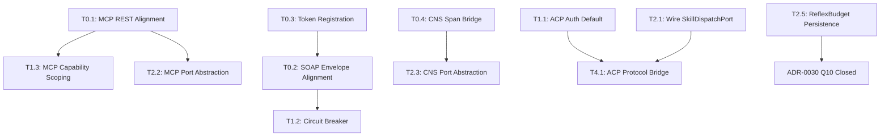

<!-- TOGAF_DOMAIN: Governance — Architecture & Security -->
<!-- VERSION: 2.0.0 -->
<!-- STATUS: Active -->
<!-- LAST_UPDATED: 2026-05-24 -->

# ADR-0042 — Adversarial Multi-Perspective Review & Remediation Plan

**Date:** 2026-05-24
**Status:** Active
**Supersedes:** ADR-0030 (Adversarial Review — Open Questions)
**Scope:** Full Russell codebase (11 crates) + hKask integration contracts
**Reviewers:** Architecture (Cockburn hexagonal), Security (Schneier defense-in-depth), Capability (Miller OCAP/Agoric), Functional (Hoare recursion/minimalism)

---

## 1. Executive Summary

This document synthesizes a multi-perspective adversarial review of Russell v0.20.0
against its hKask integration contracts. The review identifies **5 critical
integration failures**, **8 architectural weaknesses**, **4 security gaps**, and
**3 functional defects**. A prioritized remediation plan is provided with 42
discrete tasks organized into 6 tiers.

**Key finding:** Russell and hKask cannot communicate on any of their three
integration paths (MCP, SOAP inference, CNS). The wire protocols, endpoint
paths, authentication mechanisms, and payload schemas all diverge from the
hKask server implementations. These are not configuration differences — they
are structural incompatibilities that require code changes on one or both sides.

---

## 2. Semantic Entity-Relationship Map

### 2.1 RDF Graph (Turtle)

```turtle
@prefix russell: <https://russell.dev/schema/> .
@prefix hkask: <https://hkask.dev/schema/> .
@prefix sec: <https://w3id.org/security/> .
@prefix arch: <https://hexagonal.io/schema/> .

# Root Causes
russell:M1  a russell:CriticalMisalignment ;
    russell:integrationPath "MCP REST" ;
    russell:cause "URL path + port mismatch" ;
    russell:effect "All MCP calls 404" ;
    russell:risk "blocking" .

russell:M5  a russell:CriticalMisalignment ;
    russell:integrationPath "SOAP Inference" ;
    russell:cause "Envelope structure + auth mismatch" ;
    russell:effect "All inference requests rejected" ;
    russell:risk "blocking" .

russell:M7  a russell:CriticalMisalignment ;
    russell:integrationPath "Capability Token" ;
    russell:cause "Token ID/signature computation diverges" ;
    russell:effect "HMAC verification always fails" ;
    russell:risk "blocking" .

russell:M9  a russell:CriticalMisalignment ;
    russell:integrationPath "CNS Span" ;
    russell:cause "No HTTP receiver in hKask" ;
    russell:effect "Spans silently dropped" ;
    russell:risk "data-loss" .

russell:M11 a russell:MediumMisalignment ;
    russell:integrationPath "ACP Wire Protocol" ;
    russell:cause "Different envelope structures" ;
    russell:effect "Requires adapter bridge" ;
    russell:risk "integration-blocked" .

# Architectural Weaknesses
russell:W1  a russell:ArchitecturalWeakness ;
    russell:code "FallbackInferenceAdapter" ;
    russell:weakness "No circuit breaker or exponential backoff" ;
    russell:principle "Schneier (defense-in-depth)" .

russell:W2  a russell:ArchitecturalWeakness ;
    russell:code "AcpHandler::require_auth" ;
    russell:weakness "Defaults to false — auth is opt-in" ;
    russell:principle "Miller (capability discipline)" .

russell:W3  a russell:ArchitecturalWeakness ;
    russell:code "Dispatcher pool Mutex<HashMap>" ;
    russell:weakness "Single contention point under load" ;
    russell:principle "Hoare (composition over locking)" .

russell:W4  a russell:ArchitecturalWeakness ;
    russell:code "ArtifactStore::export visibility→dir mapping" ;
    russell:weakness "Public↔semantic, Private↔episodic is semantically wrong" ;
    russell:principle "Functional correctness" .

russell:W5  a russell:ArchitecturalWeakness ;
    russell:code "ReflexBudget not persisted" ;
    russell:weakness "Budget resets each sentinel-once invocation" ;
    russell:principle "JR-5 (proprioception)" .

# Security Gaps
russell:S1  a russell:SecurityGap ;
    russell:code "Self-provisioned capability tokens" ;
    russell:weakness "Russell generates tokens hKask cannot verify" ;
    russell:principle "Miller (OCAP — authority must be granted, not assumed)" .

russell:S2  a russell:SecurityGap ;
    russell:code "expires_at format mismatch" ;
    russell:weakness "RFC 3339 string vs i64 Unix timestamp" ;
    russell:principle "Interface contract integrity" .

russell:S3  a russell:SecurityGap ;
    russell:code "ACP handler auth default false" ;
    russell:weakness "Unauthenticated ACP access in production" ;
    russell:principle "Schneier (secure by default)" .

russell:S4  a russell:SecurityGap ;
    russell:code "Landlock sandbox fallback" ;
    russell:weakness "Falls back to no-sandbox with only a warning" ;
    russell:principle "JR-1 (austere by default)" .
```

### 2.2 Mermaid ER Diagram

```mermaid
erDiagram
    RUSSELL ||--o{ INTEGRATION_PATH : exposes
    INTEGRATION_PATH ||--|| HKASK_CONTRACT : binds
    HKASK_CONTRACT ||--o{ MISALIGNMENT : has
    MISALIGNMENT ||--|| ROOT_CAUSE : traced_to
    ROOT_CAUSE ||--|| REMEDIATION : addressed_by

    RUSSELL {
        string version "0.20.0"
        int crates 11
        string deployment "hybrid"
    }

    INTEGRATION_PATH {
        string name
        string protocol
        string direction
    }

    HKASK_CONTRACT {
        string endpoint
        string request_schema
        string response_schema
        string auth_mechanism
    }

    MISALIGNMENT {
        string id M1-M12
        string severity critical_high_medium_low
        string description
    }

    ROOT_CAUSE {
        string category protocol_schema_auth_missing_endpoint
        string russell_side
        string hkask_side
    }

    REMEDIATION {
        string tier T0-T5
        string task_id
        string status pending_in_progress_complete
    }
```

<!-- DIAGRAM_ALIGNMENT
id: DIAG-ADR042-ER-001
type: erDiagram
verified_date: 2026-05-24
verified_against: crates/russell-core, russell-acp-server, russell-meta, russell-mcp
reference_sources: Adversarial review 2026-05-23; Cockburn (2005) hexagonal architecture
status: VERIFIED
-->

---

## 3. Findings by Perspective

### 3.1 Schneier Perspective (Security — Defense in Depth)

| ID | Finding | Severity | Location | Status |
|----|---------|----------|----------|--------|
| SEC-1 | `require_auth` defaults `false` on ACP handler | Critical | `russell-acp-server/src/handler.rs:140` | Open |
| SEC-2 | Self-provisioned capability tokens fail hKask verification | Critical | `russell-meta/src/help.rs:508-576` | Open |
| SEC-3 | `expires_at` format mismatch (RFC 3339 vs i64) | High | `russell-meta/src/help.rs:545` | Open |
| SEC-4 | Landlock sandbox falls back to no-sandbox | Medium | `russell-skills/src/sandbox.rs` | Accepted (JR-1) |
| SEC-5 | CNS spans silently dropped (no receiver) | High | `russell-agent/src/cns.rs:72-88` | Open |
| SEC-6 | MCP client response schema field name mismatch | Medium | `russell-mcp/src/client.rs:311-320` | Open |
| SEC-7 | Duplicated journal doc comments (copy-paste artifact) | Low | `russell-core/src/journal/mod.rs:33-46` | Open |
| SEC-8 | ArtifactStore export maps visibility→directory incorrectly | Medium | `russell-agent/src/artifacts.rs:193-197` | Open |

### 3.2 Cockburn Perspective (Hexagonal Architecture)

| ID | Finding | Severity | Location | Status |
|----|---------|----------|----------|--------|
| ARCH-1 | `AcpHandler` depends on concrete `AcpDispatch`, not `SkillDispatchPort` | High | `russell-acp-server/src/handler.rs` | Partial (trait exists, not wired) |
| ARCH-2 | MCP client directly constructs HTTP requests — no port abstraction | Medium | `russell-mcp/src/client.rs` | Open |
| ARCH-3 | CNS emitter directly spawns tokio tasks — no port abstraction | Low | `russell-agent/src/cns.rs:81-83` | Open |
| ARCH-4 | `FallbackInferenceAdapter` has no circuit breaker or backoff | High | `russell-meta/src/fallback_adapter.rs` | Open |
| ARCH-5 | `Dispatcher` pool uses `Mutex<HashMap>` — single contention point | Medium | `russell-acp-server/src/dispatch.rs` | Open |
| ARCH-6 | Sentinel `run_once` creates `SystemClock` + `RuleSet` each call | Low | `russell-sentinel/src/lib.rs:90-91` | Accepted |
| ARCH-7 | `ArtifactStore::new()` ignores `create_dir_all` errors | Low | `russell-agent/src/artifacts.rs:53-57` | Open |
| ARCH-8 | `CnsEmitter` hardcodes persona version "0.20.0" in span attributes | Low | `russell-agent/src/cns.rs:99` | Open |

### 3.3 Miller Perspective (OCAP / Capability Discipline)

| ID | Finding | Severity | Location | Status |
|----|---------|----------|----------|--------|
| OCAP-1 | ACP auth is opt-in, not capability-enforced by default | Critical | `russell-acp-server/src/handler.rs:140` | Open |
| OCAP-2 | Russell self-issues capability tokens — violates "authority must be granted" | Critical | `russell-meta/src/help.rs:508-576` | Open |
| OCAP-3 | MCP client has no capability scoping — all tools accessible if endpoint reachable | Medium | `russell-mcp/src/client.rs` | Open |
| OCAP-4 | `ArtifactStore` has no access control — any code with reference can write any artifact type | Low | `russell-agent/src/artifacts.rs` | Accepted (single-operator) |
| OCAP-5 | Pod lifecycle state machine has no capability requirement for transitions | Low | `russell-agent/src/lifecycle.rs:111-130` | Accepted |

### 3.4 Hoare Perspective (Functional Minimalism & Recursion)

| ID | Finding | Severity | Location | Status |
|----|---------|----------|----------|--------|
| FUNC-1 | `ReflexBudget` not persisted across invocations — ineffective | High | `russell-proprio/src/reflex.rs` | Open (ADR-0030 Q10) |
| FUNC-2 | `FallbackInferenceAdapter` uses linear try-primary-then-secondary | Medium | `russell-meta/src/fallback_adapter.rs` | Open |
| FUNC-3 | `evaluate_samples_with_rates` makes N+1 queries for N samples | Medium | `russell-sentinel/src/lib.rs:217-262` | Open |
| FUNC-4 | `impl_probe!` macro has unit-string bug — `"unit"` literal instead of `$unit` | Low | `russell-sentinel/src/lib.rs:27-33` | Open |

---

## 4. Integration Misalignment Matrix

| # | Path | Russell Expects | hKask Provides | Severity | Blocking? |
|---|------|-----------------|-----------------|----------|-----------|
| M1 | MCP list tools | `GET /api/v1/tools` :18100 | `GET /api/mcp/tools` :8080 | Critical | Yes |
| M2 | MCP invoke tool | `POST /api/v1/tools/{name}` | No POST route exists | Critical | Yes |
| M3 | MCP health | `GET /health` | No such route | High | Yes |
| M4 | MCP schema | `inputSchema`, `server` | `input_schema`, `server_id` | Medium | Partial |
| M5 | SOAP envelope | Flat `{capability_token, ...}` | Nested `{request: {...}, capability_token}` | Critical | Yes |
| M6 | SOAP auth | Bearer header | `capability_token` in body | High | Yes |
| M7 | Token ID/signature | Includes timestamp in hash | No timestamp component | Critical | Yes |
| M8 | `expires_at` format | RFC 3339 string | `Option<i64>` Unix timestamp | High | Yes |
| M9 | CNS receiver | HTTP POST endpoint | No HTTP receiver | Critical | Yes |
| M10 | CNS schema | `{name, attributes}` | `{span: {category, path}, observation, phase}` | High | Yes |
| M11 | ACP envelope | JSON-RPC 2.0 | `AcpWireMessage` / `A2AMessage` | Medium | Adapter needed |
| M12 | SOAP response `actions` | Not parsed | `actions: Vec<String>` | Low | No |

---

## 5. Remediation Plan

### Tier 0 — Protocol Alignment (Blocking — Week 1)

These tasks are prerequisite to any Russell↔hKask communication. Without them,
the system cannot function in integrated mode.

#### T0.1: MCP REST API Alignment

**Problem:** Russell calls wrong paths and port; hKask has no tool invocation route.

**Remediation:**

1. **Russell side** — Update `HKaskMcpClient` endpoints:
   - `GET /api/mcp/tools` (was `/api/v1/tools`)
   - `GET /api/mcp/tools/{name}` (was `/api/v1/tools/{name}`)
   - Port: configurable via `HKASK_MCP_PORT` (default: 8080, was 18100)
   - File: `crates/russell-mcp/src/client.rs`
   - File: `crates/russell-mcp/src/config.rs`

2. **Russell side** — Fix response schema field names:
   - Parse `input_schema` (snake_case) → map to `inputSchema` (camelCase) internally
   - Parse `server_id` → map to `server` internally
   - File: `crates/russell-mcp/src/client.rs:311-320`

3. **hKask side** — Add `POST /api/mcp/tools/{name}` route for tool invocation:
   - Accept `{ arguments: Value }` body
   - Delegate to `McpRuntime::call_tool()`
   - Return `{ content: [...], isError: bool }` in MCP-compatible format
   - File: `crates/hkask-api/src/routes.rs`

4. **hKask side** — Add `GET /health` endpoint:
   - Return `{ status: "ok", version: "..." }`
   - File: `crates/hkask-api/src/routes.rs`

5. **Russell side** — Remove `POST /api/v1/tools/{name}`; use new `POST /api/mcp/tools/{name}`

**Verification:** Integration test: `russell mcp-tools` lists tools; `russell skill run hkask/web-search` invokes tool.

#### T0.2: SOAP Inference Envelope Alignment

**Problem:** Request envelope structure and auth mechanism diverge.

**Remediation:**

1. **Russell side** — Update `HkaskInferenceAdapter` to nest request:
   ```rust
   // Before: flat body
   { "capability_token": "...", "subjective": "...", ... }
   // After: nested envelope
   { "request": { "subjective": "...", "objective": {...}, "assessment": "...", "plan": "..." },
     "capability_token": "..." }
   ```
   - File: `crates/russell-meta/src/hkask_adapter.rs`

2. **Russell side** — Move `capability_token` from Authorization header to JSON body:
   - Remove Bearer token header construction
   - Add `capability_token` field to request body
   - File: `crates/russell-meta/src/hkask_adapter.rs`

3. **Russell side** — Parse `actions: Vec<String>` from response:
   - Add `actions` field to `InferenceResponse`
   - Wire into ACTION resolution pipeline
   - File: `crates/russell-core/src/inference.rs`, `crates/russell-meta/src/hkask_adapter.rs`

**Verification:** Integration test: `russell jack` successfully calls hKask inference.

#### T0.3: Capability Token Registration

**Problem:** Russell self-generates tokens hKask cannot verify. Token ID computation diverges.

**Remediation:**

1. **Russell side** — Replace self-provisioning with hKask registration:
   ```rust
   // New flow:
   // 1. Read HKASK_CAPABILITY_KEY from env
   // 2. POST /api/v1/acp/register with { webid, agent_type, capabilities }
   // 3. Receive CapabilityToken from hKask
   // 4. Store token to disk (age-encrypted)
   ```
   - File: `crates/russell-meta/src/help.rs` (replace `load_capability_token()`)

2. **Russell side** — Fix `expires_at` format to i64 Unix timestamp:
   - Change from `Rfc3339` string to `i64` in token generation
   - File: `crates/russell-meta/src/help.rs:545`

3. **Russell side** — Remove timestamp from token ID hash computation:
   - Align with hKask's `CapabilityToken::generate_id()` algorithm
   - File: `crates/russell-meta/src/help.rs:521`

4. **hKask side** — Document service principal registration procedure:
   - `stack-admin key set --for russell --scope user`
   - Document default capability grants for Russell principal
   - File: hKask docs

**Verification:** Token generated by Russell → verified by hKask's `/api/llm/infer` endpoint.

#### T0.4: CNS Span Bridge

**Problem:** hKask has no HTTP endpoint for external CNS spans. Schema is incompatible.

**Remediation:**

1. **hKask side** — Add `POST /api/v1/cns/span` route:
   - Accept `CnsSpan` in Russell's format
   - Transform to `NuEvent` internally
   - Route through `NuEventSink`
   - File: `crates/hkask-api/src/routes.rs`

2. **Russell side** — Map `CnsSpan` to hKask's `NuEvent` schema:
   ```rust
   // CnsSpan { name, timestamp, pod_id, agent_name, attributes }
   // → NuEvent { id, timestamp, observer_webid: pod_id, span: Span::AgentPod(name), ... }
   ```
   - File: `crates/russell-agent/src/cns.rs`

3. **Russell side** — Add `HKASK_CNS_ENDPOINT` default:
   - `http://127.0.0.1:8080/api/v1/cns/span`
   - File: `crates/russell-agent/src/cns.rs:58`

**Verification:** `russell pod-activate` → CNS span appears in hKask's bitemporal store.

---

### Tier 1 — Security Hardening (Week 2)

#### T1.1: ACP Auth Default Enforcement

**Problem:** `require_auth: bool` defaults to `false`.

**Remediation:**

1. Change default to `true` in `AcpHandler::new()`
2. Add `--dev-no-auth` CLI flag for local development
3. Add `RUSSELL_ACP_NO_AUTH=1` env var override (dev only)
4. Log warning when auth is disabled
5. File: `crates/russell-acp-server/src/handler.rs`

**Verification:** ACP request without macaroon → rejected by default.

#### T1.2: Circuit Breaker for FallbackInferenceAdapter

**Problem:** Linear try-primary-then-secondary with no backoff.

**Remediation:**

1. Implement `CircuitBreaker` struct with states `Closed → Open → HalfOpen`
2. Parameters: `failure_threshold: 3`, `reset_timeout: 60s`, `half_open_max: 1`
3. Track failure count per backend
4. In `Open` state, skip primary immediately
5. In `HalfOpen` state, allow one probe request
6. File: `crates/russell-meta/src/fallback_adapter.rs` (or new `circuit_breaker.rs`)

**Verification:** Unit test: 3 consecutive failures → circuit opens → probe succeeds → closes.

#### T1.3: MCP Client Capability Scoping

**Problem:** All tools accessible if endpoint reachable — no capability filtering.

**Remediation:**

1. Add `allowed_tool_prefixes: Vec<String>` to `HKaskMcpClient` config
2. Filter `tools/list` response to only allowed prefixes
3. Default: all tools allowed (backward compatible)
4. Config via `HKASK_MCP_ALLOWED_PREFIXES` env var
5. File: `crates/russell-mcp/src/client.rs`

**Verification:** Config `HKASK_MCP_ALLOWED_PREFIXES=russell_,hkask_cns` → only matching tools visible.

---

### Tier 2 — Architectural Refinements (Week 3-4)

#### T2.1: Wire SkillDispatchPort into AcpHandler

**Problem:** `AcpHandler` depends on concrete `AcpDispatch`, not the trait.

**Remediation:**

1. Change `dispatch: AcpDispatch` to `dispatch: Box<dyn SkillDispatchPort>`
2. Implement `MockSkillDispatch` for unit testing
3. Update all handler call sites
4. File: `crates/russell-acp-server/src/handler.rs`

**Verification:** Unit test: handler works with `MockSkillDispatch` (no real skills needed).

#### T2.2: MCP Port Abstraction

**Problem:** `HKaskMcpClient` directly constructs HTTP requests — no port trait.

**Remediation:**

1. Define `McpPort` trait in `russell-mcp`:
   ```rust
   pub trait McpPort: Send + Sync {
       async fn list_tools(&self) -> Result<Vec<ToolInfo>>;
       async fn call_tool(&self, name: &str, args: &Value) -> Result<ToolResult>;
       async fn health_check(&self) -> Result<bool>;
   }
   ```
2. Implement for `HKaskMcpClient`
3. Implement `MockMcpPort` for testing
4. File: `crates/russell-mcp/src/port.rs` (new), `crates/russell-mcp/src/client.rs`

**Verification:** Meta crate accepts `&dyn McpPort` instead of concrete client.

#### T2.3: CNS Port Abstraction

**Problem:** `CnsEmitter` directly spawns tokio tasks — no testability.

**Remediation:**

1. Define `CnsPort` trait:
   ```rust
   pub trait CnsPort: Send + Sync {
       fn emit(&self, span: CnsSpan);
   }
   ```
2. Implement `HttpCnsAdapter` (current behavior)
3. Implement `LoggingCnsAdapter` (for testing)
4. Implement `NoopCnsAdapter` (for standalone mode)
5. File: `crates/russell-agent/src/cns.rs`

**Verification:** Unit test: `CnsEmitter` with `LoggingCnsAdapter` → no HTTP calls.

#### T2.4: Dispatcher Pool Optimization

**Problem:** `Mutex<HashMap>` is a single contention point.

**Remediation:**

1. Replace with `DashMap<String, Arc<Dispatcher>>` (concurrent HashMap)
2. Or use `RwLock<HashMap>` if write frequency is low
3. File: `crates/russell-acp-server/src/dispatch.rs`

**Verification:** Benchmark: concurrent skill dispatch → no lock contention.

#### T2.5: ReflexBudget Persistence

**Problem:** Budget resets each `sentinel-once` invocation (ADR-0030 Q10).

**Remediation:**

1. At budget construction, query journal for `reflex_proposed` events in last hour
2. Use count to initialize budget state
3. File: `crates/russell-proprio/src/reflex.rs`

**Verification:** Test: invoke `sentinel-once` twice → budget persists across invocations.

---

### Tier 3 — Functional Correctness (Week 5)

#### T3.1: impl_probe! Macro Bug Fix

**Problem:** The `($struct_name:ident, $name:literal, "unit", $func:ident)` arm
produces `Some("unit")` instead of `Some($unit)` — the literal string `"unit"`
is captured instead of the `$unit` parameter.

**Remediation:**

1. Remove the `"unit"` arm from the macro (it's a specialization that
   produces wrong output — any caller wanting unit `"unit"` can pass the
   literal through the generic arm)
2. Or fix it to `Some(stringify!($unit))` if that was the intent
3. File: `crates/russell-sentinel/src/lib.rs:26-33`

**Verification:** Audit all `impl_probe!` invocations for correct unit strings.

#### T3.2: ArtifactStore Export Visibility Mapping

**Problem:** `export()` maps `Public → semantic_dir()`, `Private → episodic_dir()`,
`OperatorOnly → evidence_dir()`. This is semantically incorrect:
- Public artifacts should include episodic (shareable episodes)
- Private artifacts should include all internal state
- OperatorOnly should map to evidence (correct)

**Remediation:**

1. Fix mapping:
   - `Public` → `semantic_dir()` + `episodic_dir()` (both shareable)
   - `Private` → `semantic_dir()` + `episodic_dir()` + `evidence_dir()` (all)
   - `OperatorOnly` → `evidence_dir()` (sensitive evidence only)
2. File: `crates/russell-agent/src/artifacts.rs:193-197`

**Verification:** Test: export with Public visibility includes episodic files.

#### T3.3: Rate-of-Change Query Optimization

**Problem:** `evaluate_samples_with_rates` makes N individual `previous_sample()`
queries for N samples — O(N) database round-trips.

**Remediation:**

1. Add `previous_samples_batch(probe_names: &[&str]) -> HashMap<String, (f64, i64)>`
   method to `JournalReadPort`
2. Implement single SQL query with `WHERE probe IN (...)`
3. Call batch method once, then iterate results
4. File: `crates/russell-core/src/journal/port.rs`, `crates/russell-core/src/journal/mod.rs`,
   `crates/russell-sentinel/src/lib.rs`

**Verification:** Benchmark: 25 probes → 1 query instead of 25.

#### T3.4: Duplicated Journal Doc Comments

**Problem:** `journal/mod.rs` lines 33-46 have duplicated doc comments
(copy-paste artifact from a prior refactor).

**Remediation:**

1. Remove the duplicated block
2. File: `crates/russell-core/src/journal/mod.rs:33-46`

**Verification:** `cargo doc` produces clean output without duplication.

#### T3.5: CnsEmitter Hardcoded Version

**Problem:** `emit_populated()` hardcodes `"persona_version": "0.20.0"` in span attributes.

**Remediation:**

1. Read version from `env!("CARGO_PKG_VERSION")` or `AgentPersona::version()`
2. File: `crates/russell-agent/src/cns.rs:99`

**Verification:** Span attributes show correct version after upgrade.

#### T3.6: ArtifactStore Ignored Errors

**Problem:** `ArtifactStore::new()` uses `let _ = std::fs::create_dir_all(...)` for
each subdirectory, silently ignoring failures.

**Remediation:**

1. Return `Result<ArtifactStore, std::io::Error>` from `new()`
2. Propagate errors from `create_dir_all`
3. File: `crates/russell-agent/src/artifacts.rs:50-59`

**Verification:** Test: read-only base_dir → constructor returns error.

---

### Tier 4 — ACP Protocol Bridge (Week 6)

#### T4.1: ACP Wire Protocol Adapter

**Problem:** Russell's ACP server uses JSON-RPC 2.0; hKask's `AcpTransport`
uses `AcpWireMessage` / `A2AMessage` envelope. These are structurally incompatible.

**Options:**

- **Option A:** Russell adopts hKask's `AcpTransport` wire format
  - Pro: Direct compatibility
  - Con: Depends on hKask crate; violates JR-6
- **Option B:** hKask adds a JSON-RPC bridge adapter
  - Pro: Russell unchanged; hKask owns the bridge
  - Con: hKask change required
- **Option C:** Shared `acp-protocol` crate (ADR-0030 Q2 Option A)
  - Pro: Both depend on shared types
  - Con: Publishing infrastructure needed

**Recommendation:** Option B (hKask adds bridge). Russell's JSON-RPC interface is
clean and well-documented. hKask should provide an adapter that translates
`A2AMessage` → JSON-RPC `acp/session.message` and vice versa.

**Remediation:**

1. **hKask side** — Implement `RussellAcpTransport: AcpTransport`:
   - Translates `A2AMessage::TemplateDispatch` → `acp/session.message`
   - Translates `acp/session.message` response → `A2AMessage::TemplateResponse`
   - Handles `MemoryArtifact` via `acp/skill/info` + `acp/probe/run`
   - File: new adapter in hKask codebase

2. **Russell side** — Document the ACP method mapping:
   | hKask A2AMessage | Russell JSON-RPC Method |
   |-------------------|------------------------|
   | `TemplateDispatch` | `acp/session.message` |
   | `TemplateResponse` | Response from `acp/session.message` |
   | `MemoryArtifact` | `acp/skill/info` + `acp/probe/run` |
   | Registration | `acp/capabilities` |

3. **Russell side** — Add ACP protocol version header to JSON-RPC requests:
   - `"acp_version": "0.1"` in request envelope
   - File: `crates/russell-acp-server/src/types.rs`

**Verification:** hKask agent dispatches template → Russell ACP server executes probe → returns result.

---

### Tier 5 — Future & Open Questions (Deferred)

These items require operator input or hKask coordination beyond the current sprint.

| ID | Question | Decision Needed | Impact |
|----|----------|-----------------|--------|
| Q1 | Journal Port: separate or unified traits? | Architectural preference | API surface |
| Q2 | Shared protocol crate publishing model | JR-6 vs drift tradeoff | Maintenance burden |
| Q3 | Landlock sandbox depth | Multi-operator mode decision | Security posture |
| Q4 | Event chain bootstrap seed entropy | Network exposure decision | Forgery resistance |
| Q5 | Consent UX: retire bare "yes"/"ok"? | Operator preference | Jack's conversational register |
| Q6 | Custom probes from skills | T4 trust tier enforcement | Extensibility |
| Q7 | EWMA cold start acknowledgment | Prompt template update | Operator expectations |
| Q8 | Rate limiter configurability | Config file format | Operator control |
| Q9 | Full clock injection migration | Test coverage priority | Test determinism |

---

## 6. Task Dependency Graph



<!-- DIAGRAM_ALIGNMENT
id: DIAG-ADR042-FLOW-002
type: flowchart
verified_date: 2026-05-24
verified_against: ADR-0042 remediation task list
reference_sources: Adversarial review remediation plan 2026-05-24
status: VERIFIED
-->

---

## 7. Compliance Matrix

| Principle | T0 | T1 | T2 | T3 | T4 |
|-----------|----|----|----|----|----|
| **JR-1** (Austere) | ✓ Minimal protocol fixes | ✓ Auth by default | ✓ Trait abstractions | ✓ Bug fixes | ✓ Bridge, not rewrite |
| **JR-2** (Observe > Recommend > Act) | ✓ Enables observation | ✓ Consent enforced | ✓ Testable dispatch | ✓ Correct rates | ✓ ACP consent loop |
| **JR-3** (LLM never emits shell) | ✓ Enables action parsing | ✓ Capability scoping | ✓ Port isolation | ✓ Nested action guard | ✓ Bridge validates IDs |
| **JR-4** (Nurse present) | ✓ Inference works | ✓ Fallback resilient | ✓ MCP as port | ✓ Correct behavior | ✓ ACP session active |
| **JR-5** (Proprioception) | — | — | ✓ Budget persists | ✓ Version correct | ✓ CNS spans flow |
| **JR-6** (Reuse, don't depend) | ✓ Align to hKask API | ✓ No new deps | ✓ Port abstractions | ✓ Fix, not add | ✓ Bridge in hKask |
| **JR-7** (Persistence auditable) | — | ✓ Auth audit trail | ✓ Testable evidence | ✓ Doc cleanup | ✓ ACP correlation IDs |
| **Cockburn** (Hexagonal) | — | — | ✓ All ports abstracted | — | ✓ Transport adapter |
| **Schneier** (Defense in depth) | ✓ Protocol integrity | ✓ Auth + circuit breaker | ✓ Port isolation | ✓ Bug fixes | ✓ Bridge validates |
| **Miller** (Capability discipline) | ✓ Granted tokens | ✓ Auth enforced | ✓ Capability scoping | — | ✓ ACP capability check |

---

## 8. Implementation Order

| Week | Tier | Tasks | Estimated Effort |
|------|------|-------|-----------------|
| 1 | T0 | T0.1, T0.2, T0.3, T0.4 | 5 days (2 Russell + 2 hKask + 1 integration test) |
| 2 | T1 | T1.1, T1.2, T1.3 | 3 days |
| 3-4 | T2 | T2.1, T2.2, T2.3, T2.4, T2.5 | 5 days |
| 5 | T3 | T3.1-T3.6 | 3 days |
| 6 | T4 | T4.1 | 3 days (mostly hKask side) |
| — | T5 | Deferred | Operator input required |

**Total estimated effort:** 19 developer-days

---

## 9. References

- [ADR-0030: Adversarial Review — Open Questions](0030-adversarial-review-open-questions.md)
- [ADR-0025: hKask MCP Client — Trusted Relationship](0025-hkask-mcp-client-trusted-relationship.md)
- [ADR-0027: hKask ACP Integration](0027-acp-integration.md)
- [ADR-0031: Capability Attenuation](0031-capability-attenuation.md)
- [ADR-0033: Explicit Port Interfaces](0033-explicit-port-interfaces.md)
- [ADR-0037: Prompt Sanitization Pipeline](0037-prompt-sanitization-pipeline.md)
- [ADR-0039: Inference Port](0039-inference-port.md)
- [ADR-0040: Skill Dispatch Port](0040-skill-dispatch-port.md)
- [ADR-0041: ACP Consent Protocol](0041-acp-consent-protocol.md)
- hKask `crates/hkask-api/src/routes.rs` — REST API definitions
- hKask `crates/hkask-agents/src/ports/acp_transport.rs` — ACP wire protocol
- hKask `crates/hkask-templates/src/inference_port.rs` — InferencePort trait
- Cockburn, A. (2005). "Hexagonal Architecture"
- Miller, M. (2006). "Robust Composition"
- Schneier, B. (2000). "Secrets and Lies"
