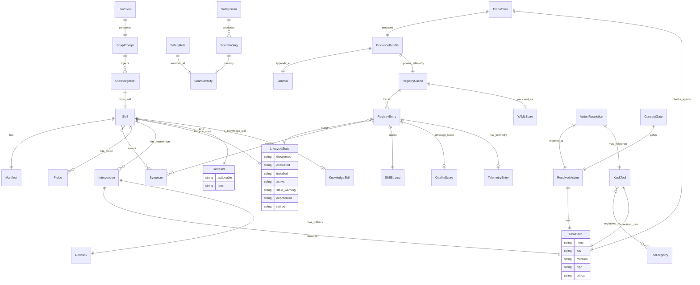
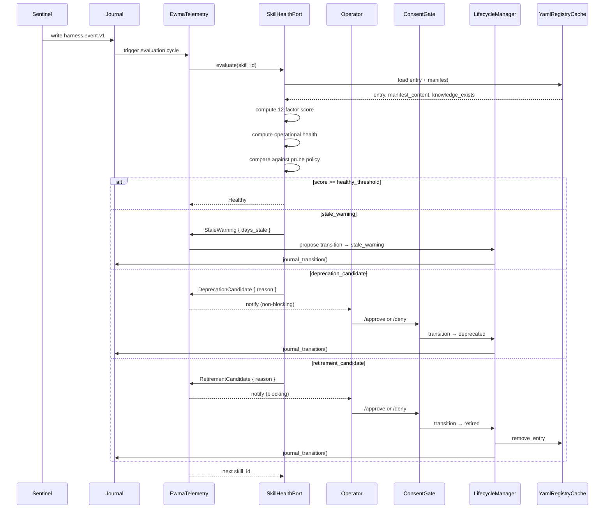
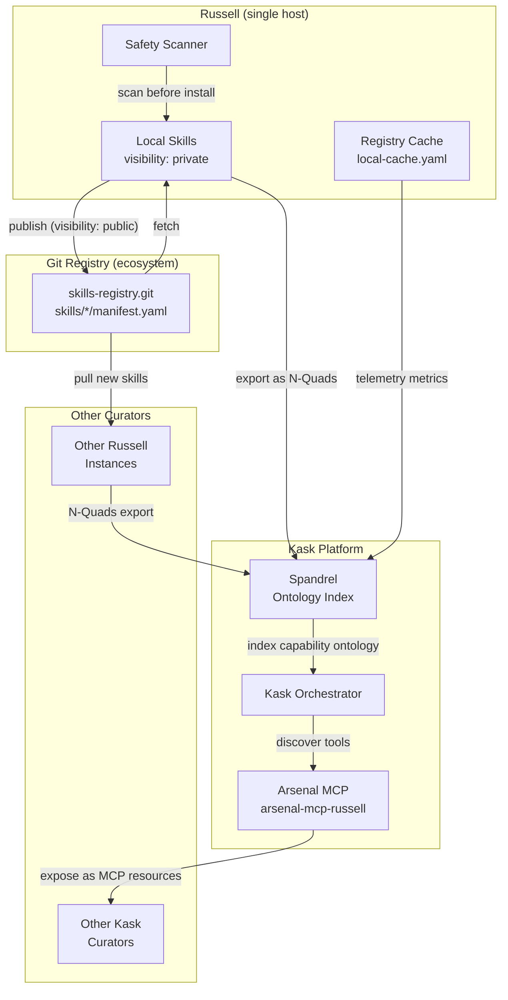
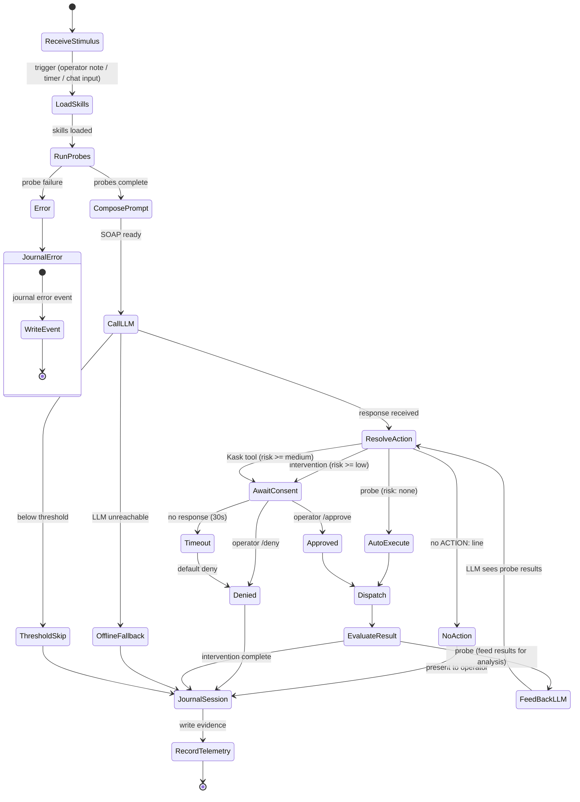
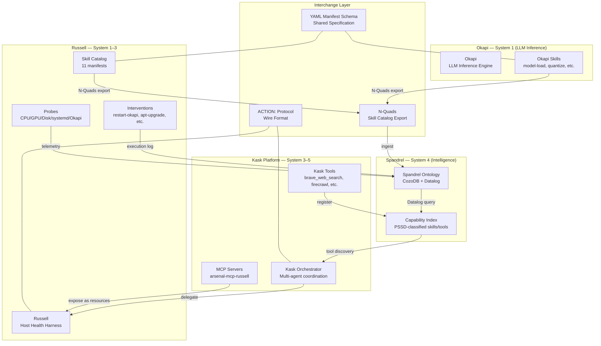

<!-- TOGAF_DOMAIN: Application Architecture -->
<!-- VERSION: 1.0.0 -->
<!-- STATUS: Active -->
<!-- LAST_UPDATED: 2026-05-15 -->

# Russell Skill System — Semantic Analysis, Redesign & Refactoring

> **Date:** 2026-05-15
> **Scope:** crates `russell-skills`, `russell-meta`, `russell-cli`
> **JR Principles impacted:** JR-1, JR-3, JR-6, JR-7
> **Status:** Analysis — no code changes

---

## Task 1: Semantic Decomposition of the Current Skill System

### 1.1 Entity-Relationship Diagram (Mermaid)



### 1.2 Cognitive Cycle Data Flow (Mermaid)

```mermaid
flowchart LR
    subgraph "System 1 — Ops"
        SENTINEL[Sentinel<br/>samples rows]
    end

    subgraph "System 2 — Coordination"
        JOURNAL[(Journal<br/>harness.event.v1)]
        SAMPLES[(samples)]
        BASELINES[EWMA<br/>Baselines]
    end

    subgraph "System 3 — Control (Nurse)"
        SOAP[SoapPrompt<br/>System+Objective+Subjective]
        LLM[LlmClient ::port::<br/>OkapiClient ::adapter::]
        RESOLVE[ActionResolution<br/>ACTION: parser]
        CONSENT[ConsentGate<br/>/approve | /deny]
        DISPATCH[Dispatcher<br/>SubprocessExecutor]
        EVIDENCE[EvidenceBundle<br/>SOAP folder]
    end

    subgraph "System 3* — Audit"
        REGISTRY[RegistryCache<br/>YAML]
        TELEMETRY[Telemetry<br/>EWMA counters]
    end

    subgraph "System 4 — Intelligence"
        SKILLS[SkillLoader<br/>YAML manifests]
        KNOWLEDGE[KnowledgeInjector<br/>KNOWLEDGE.md]
        KASK[HKaskMcpClient<br/>tools/list]
    end

    SENTINEL -->|"writes"| JOURNAL
    SENTINEL -->|"inserts"| SAMPLES
    SAMPLES -->|"read"| SOAP
    JOURNAL -->|"read events"| SOAP
    JOURNAL -->|"read baselines"| BASELINES
    BASELINES -->|"threshold compare"| SOAP
    SKILLS -->|"inject knowledge"| KNOWLEDGE
    KNOWLEDGE -->|"append to prompt"| SOAP
    KASK -->|"available tools"| SOAP
    SOAP -->|"call"| LLM
    LLM -->|"response"| RESOLVE
    RESOLVE -->|"ResolvedAction"| CONSENT
    CONSENT -->|"approved"| DISPATCH
    CONSENT -->|"denied"| JOURNAL
    DISPATCH -->|"run_and_journal"| EVIDENCE
    EVIDENCE -->|"append"| JOURNAL
    EVIDENCE -->|"record_execution"| REGISTRY
    REGISTRY -->|"telemetry"| TELEMETRY
    TELEMETRY -->|"read by"| SOAP
```

### 1.3 Root Causes of Organic Complexity

**(a) Monolithic files.** `dispatch.rs` (1062 lines), `registry/mod.rs` (554 lines + 3 submodules), `action.rs` (871 lines), `help.rs` (568 lines), and `workshop.rs` in the CLI (~1272 lines) concentrate many concerns into single files. `registry/mod.rs` hosts cache load/save, symptom lookup, coverage gap analysis, status filtering, upsert/remove, `with_update` pattern, execution recording, quality scoring, lifecycle journaling, AND re-exports from submodules — the `RegistryCache` impl block is a god object.

**(b) Implicit type distinctions.** The `SkillKind` enum was recently added (`Actionable | Lens`) but the manifest loader still infers `Lens` from empty probe/intervention arrays as a fallback when `kind` is not explicitly set. Knowledge-only skills (`ubuntu-jack`, `pragmatic-cybernetics`, `pragmatic-semantics`) and probe-bearing skills (`okapi-watcher`, `skill-manager`, `sysadmin`) share the same `Skill` struct with no type-level distinction. `skill.is_lens()` / `skill.is_actionable()` are runtime checks rather than type-level guarantees. Meta-skills (`skill-manager`) are indistinguishable from ordinary actionable skills at the type level.

**(c) Dual entry-point divergence.** `russell jack` (`crates/russell-cli/src/commands/help.rs`) executes skills inline — it resolves the ACTION, runs the probe via `execute_probe_capture`, feeds results back to Jack, and exits. `russell chat` (`crates/russell-cli/src/commands/chat/execute.rs`) constructs a `PendingAction` through a consent gate, uses a different dispatcher instantiation pattern, and feeds results into the chat history rather than a fresh LLM call. The consent flow, sudo prompting, and evidence bundle writing are implemented twice.

**(d) Deferred features creating dead code paths.** The `RegistrySource` struct and `RegistryKind` enum exist but the `fetch` pipeline (`fetch → safety-scan → evaluate → install`) is incomplete. The `adapt` workshop command is partially implemented. Remote registry integration has the data model but no adapter. The `skills/pragmatic-semantics/references/` contains full Datalog/PSSD/N-Quads reference material used only as LLM knowledge — not as executable inference.

**(e) Safety scanner embedded in registry module.** `registry/safety.rs` is a standalone submodule with its own tests, which is correct — but it's imported only via `registry/mod.rs` re-exports. The scanner has no standalone `trait SafetyScanner` port that could be swapped, tested in isolation, or reused in the CLI's `workshop.rs` without going through the `registry` module.

### 1.4 Drivers of the Current Design

| Driver | Code manifestation |
|---|---|
| **JR-1 (Austerity)** | `Skill` struct is flat and small; no framework deps beyond `serde`; `parse_manifest` is a free function, not an object hierarchy |
| **JR-3 (LLM never emits shell)** | `ActionResolution` parses `ACTION:` lines by regex; resolves against loaded `Skill` manifests; emits `ResolvedAction` with pre-validated `cmd: Vec<String>` |
| **JR-6 (No cross-crate deps)** | `russell-meta` imports `russell-skills` and `russell-core`; `russell-cli` imports `russell-meta`, `russell-skills`, `russell-core`, `russell-mcp`. Circular deps impossible by crate topology |
| **JR-7 (Auditable persistence)** | `journal_transition()` writes `harness.event.v1` for every lifecycle state change; `run_and_journal()` writes evidence bundles; registry cache is rebuildable from manifests + journal |
| **IDRS contract** | `dispatch.rs` implements `DryRun` gate, `RollbackStrategy` chain, `run_and_journal()` evidence bundle, `run_intervention_with_rollback()` reverse execution |
| **Poka-yoke** | `parse_manifest()` refuses unknown symptoms via `SYMPTOMS` constant; refuses unreferenced scripts; refuses id/directory mismatch; all errors are `LoadError` — no partial loads |
| **Kask MCP bilateral integration** | `ResolvedAction::KaskTool` variant with risk band from annotations; `KaskToolInfo` struct; `collect_kask_tool_infos()` in both `help.rs` and `chat/`; `action::resolve_with_kask()` resolves both skill and Kask actions |

---

## Task 2: Ideal-State Architecture Design (Green-Field Reference Model)

### 2.1 Domain Ports (Traits)

```rust
// ─── Skill Loading ────────────────────────────────────────

#[async_trait]
pub trait SkillLoader: Send + Sync {
    async fn load_all(&self) -> Result<Vec<Skill>, LoadError>;
    fn load_one(&self, skill_id: &SkillId) -> Result<Skill, LoadError>;
    fn parse_manifest(&self, yaml: &str, dir_name: &str) -> Result<Skill, String>;
}

// ─── Skill Registry ───────────────────────────────────────

#[async_trait]
pub trait SkillRegistry: Send + Sync {
    async fn upsert(&self, skill_id: &SkillId, entry: RegistryEntry) -> Result<(), RegistryError>;
    async fn remove(&self, skill_id: &SkillId) -> Result<(), RegistryError>;
    async fn find_by_symptom(&self, symptom: &str) -> Vec<RegistryEntry>;
    async fn find_by_status(&self, status: LifecycleStatus) -> Vec<(SkillId, RegistryEntry)>;
    async fn coverage_gaps(&self, all_symptoms: &[&str]) -> Vec<SymptomClass>;
    async fn atomic_update(&self, f: Box<dyn FnOnce(&mut RegistryCache) + Send>)
        -> Result<(), RegistryError>;
}

// ─── Safety Scanning ──────────────────────────────────────

pub trait SafetyScanner: Send + Sync {
    fn scan_manifest(&self, content: &str) -> SafetyScan;
    fn scan_knowledge(&self, content: &str) -> SafetyScan;
    fn has_blocking_findings(&self, scan: &SafetyScan) -> bool;
}

// ─── Skill Dispatching ────────────────────────────────────

#[async_trait]
pub trait SkillDispatcher: Send + Sync {
    async fn run_probe(&self, req: ProbeRequest) -> Result<RunOutcome, DispatchError>;
    async fn run_intervention(&self, req: InterventionRequest)
        -> Result<RollbackOutcome, DispatchError>;
    fn check_risk(&self, risk: RiskBand, max_allowed: RiskBand) -> Result<(), RiskError>;
}

// ─── Lifecycle Management ─────────────────────────────────

#[async_trait]
pub trait LifecycleManager: Send + Sync {
    async fn transition(&self, skill_id: &SkillId, to: LifecycleStatus, reason: &str)
        -> Result<(), LifecycleError>;
    async fn evaluate(&self, skill_id: &SkillId) -> Result<QualityReport, LifecycleError>;
}

// ─── Telemetry Recording ──────────────────────────────────

#[async_trait]
pub trait TelemetryRecorder: Send + Sync {
    async fn record_probe(&self, skill_id: &SkillId, outcome: TelemetryOutcome)
        -> Result<(), TelemetryError>;
    async fn record_intervention(&self, skill_id: &SkillId, outcome: TelemetryOutcome)
        -> Result<(), TelemetryError>;
    async fn freshness_score(&self, skill_id: &SkillId) -> f64;
    async fn quality_score(&self, skill_id: &SkillId) -> f64;
}

// ─── Knowledge Injection ──────────────────────────────────

#[async_trait]
pub trait KnowledgeInjector: Send + Sync {
    async fn inject(&self, prompt: &mut SystemPrompt, skills: &[Skill], symptoms: &[&str])
        -> InjectionReport;
    async fn rank_by_relevance(&self, skills: &[Skill], symptoms: &[&str])
        -> Vec<KnowledgeRank>;
}

// ─── Prompt Composition ───────────────────────────────────

#[async_trait]
pub trait PromptComposer: Send + Sync {
    async fn compose_system(&self, persona: &PersonaId, injected: &InjectionReport)
        -> Result<SystemPrompt, PromptError>;
    async fn compose_objective(&self, ctx: PromptContext)
        -> Result<Objective, PromptError>;
    async fn compose_soap(&self, system: SystemPrompt, objective: Objective, subjective: Subjective)
        -> Result<SoapPrompt, PromptError>;
}

// ─── Action Resolution ────────────────────────────────────

pub trait ActionResolver: Send + Sync {
    fn resolve(&self, llm_response: &str, skills: &[Skill], kask_tools: &[KaskToolInfo])
        -> Option<Result<ResolvedAction, ActionError>>;
}

// ─── Consent Gate ─────────────────────────────────────────

#[async_trait]
pub trait ConsentGate: Send + Sync {
    async fn await_consent(&self, action: &ResolvedAction) -> ConsentDecision;
}

// ─── Quality Evaluation ───────────────────────────────────

pub trait QualityEvaluator: Send + Sync {
    fn evaluate(&self, entry: &RegistryEntry, manifest: &str, has_knowledge: bool) -> f64;
    fn explain(&self, entry: &RegistryEntry, manifest: &str) -> QualityReport;
}

// ─── Remote Discovery ─────────────────────────────────────

#[async_trait]
pub trait RemoteDiscovery: Send + Sync {
    async fn list_skills(&self, source: &RegistrySource) -> Result<Vec<SkillSummary>, DiscoveryError>;
    async fn fetch_manifest(&self, source: &RegistrySource, slug: &str)
        -> Result<RawManifest, DiscoveryError>;
    async fn fetch_knowledge(&self, source: &RegistrySource, slug: &str)
        -> Result<String, DiscoveryError>;
}

// ─── Skill Distribution ───────────────────────────────────

#[async_trait]
pub trait SkillDistribution: Send + Sync {
    async fn publish(&self, skill: &Skill, target: DistributionTarget)
        -> Result<SkillRef, DistributionError>;
    async fn fetch(&self, skill_ref: &SkillRef)
        -> Result<RawManifest, DistributionError>;
    async fn list_remote(&self, source: &RegistrySource, query: Option<&str>)
        -> Vec<SkillSummary>;
    fn export_as_nquads(&self, skills: &[Skill], entries: &[RegistryEntry]) -> String;
}
```

### 2.2 Driven Adapters

| Port | Adapter | Crate | Implementation |
|---|---|---|---|
| `SkillLoader` | `FilesystemLoader` | `russell-skills` | Reads `skills/*/manifest.yaml`, validates, returns `Skill` |
| `SkillRegistry` | `YamlRegistryCache` | `russell-skills` | Load/save `local-cache.yaml`, atomic `with_update` pattern |
| `SafetyScanner` | `HeuristicScanner` | `russell-skills` | 7-rule regex/string-matching (current `safety.rs`) |
| `SkillDispatcher` | `SubprocessDispatcher` | `russell-skills` | `std::process::Command`, env scrubbing, timeouts, dry-run |
| `LifecycleManager` | `JournaledLifecycle` | `russell-skills` | Transitions via `journal_transition()`, journal-auditable |
| `TelemetryRecorder` | `EwmaTelemetry` | `russell-skills` | EWMA on probe durations, counters, freshness scoring |
| `QualityEvaluator` | `SixFactorScorer` | `russell-skills` | 6-factor rubric (manifest, probe, intervention, rollback, script, doc) |
| `KnowledgeInjector` | `ScoredKnowledgeInjector` | `russell-meta` | Relevance scoring, token budgeting, truncation (currently in `prompt.rs`) |
| `PromptComposer` | `MiniJinjaComposer` | `russell-meta` | Template registry with `[inference]` headers (currently in `prompt_registry.rs`) |
| `ActionResolver` | `RegexActionResolver` | `russell-meta` | `ACTION:` regex + skill/kask lookup (currently in `action.rs`) |
| `ConsentGate` | `ReadlineConsentGate` | `russell-cli` | `/approve`, `/deny`, natural language consent in chat REPL |
| `RemoteDiscovery` | `GitRepoAdapter` | `russell-skills` | Git fetch + `skills/` directory scan (incomplete) |
| `RemoteDiscovery` | `HttpIndexAdapter` | `russell-skills` | HTTP directory listing + download (incomplete) |
| `SkillDistribution` | `LocalFilesystemAdapter` | `russell-skills` | Copy to `~/.local/share/harness/skills/` (current) |
| `SkillDistribution` | `HKaskMcpAdapter` | `russell-mcp` | `arsenal-mcp-russell` → expose as MCP resources |
| `SkillDistribution` | `NQuadsExporter` | `russell-skills` | Serialize skill catalog as N-Quads |

### 2.3 Type-Level Skill Taxonomy

```rust
/// The kind of skill — a type discriminant, not a runtime check.
#[derive(Debug, Clone, Copy, PartialEq, Eq)]
pub enum SkillKind {
    /// Has probes and/or interventions — executable runbook.
    Actionable,
    /// Knowledge-only — KNOWLEDGE.md injected into system prompt.
    /// No probes, no interventions.
    Lens,
    /// Manages other skills (install, prune, retire, build).
    /// Has probes and interventions but operates on the skill lifecycle
    /// rather than on the host.
    Meta,
}

impl Skill {
    /// Type-level guarantee: a `ProbeSkill` always has at least one probe.
    pub fn into_actionable(self) -> Option<ProbeSkill> { ... }

    /// Type-level guarantee: a `KnowledgeSkill` has no probes/interventions.
    pub fn into_lens(self) -> Option<KnowledgeSkill> { ... }

    /// Type-level guarantee: a `MetaSkill` has probes/interventions.
    pub fn into_meta(self) -> Option<MetaSkill> { ... }
}

pub struct ProbeSkill {
    pub id: SkillId,
    pub version: String,
    pub symptoms: Vec<String>,
    pub probes: Vec<Probe>,            // Non-empty guarantee
    pub interventions: Vec<Intervention>,
    pub safety: Safety,
}

pub struct KnowledgeSkill {
    pub id: SkillId,
    pub version: String,
    pub symptoms: Vec<String>,
    // No probes/interventions fields — structurally impossible
}

pub struct MetaSkill {
    pub id: SkillId,
    pub version: String,
    pub symptoms: Vec<String>,
    pub probes: Vec<Probe>,
    pub interventions: Vec<Intervention>,
    pub safety: Safety,
    pub manages_lifecycle: bool,
}
```

### 2.4 Hexagonal Architecture (Mermaid)

```mermaid
flowchart TB
    subgraph "Driving Adapters (russell-cli)"
        CLI_JACK["russell jack<br/>(single-shot)"]
        CLI_CHAT["russell chat<br/>(multi-turn)"]
        CLI_WORKSHOP["russell workshop<br/>(interactive)"]
        CLI_SKILL["russell skill<br/>(CRUD)"]
    end

    subgraph "Application Layer (russell-meta)"
        NURSE["Nurse Orchestrator<br/>SkillExecutionService"]
    end

    subgraph "Domain Layer (russell-skills)"
        direction TB

        PORT_SKILL_LOADER["::port:: SkillLoader"]
        PORT_REGISTRY["::port:: SkillRegistry"]
        PORT_SAFETY["::port:: SafetyScanner"]
        PORT_DISPATCH["::port:: SkillDispatcher"]
        PORT_LIFECYCLE["::port:: LifecycleManager"]
        PORT_TELEMETRY["::port:: TelemetryRecorder"]
        PORT_QUALITY["::port:: QualityEvaluator"]
        PORT_INJECTOR["::port:: KnowledgeInjector"]
        PORT_COMPOSER["::port:: PromptComposer"]
        PORT_RESOLVER["::port:: ActionResolver"]
        PORT_CONSENT["::port:: ConsentGate"]
        PORT_DISCOVERY["::port:: RemoteDiscovery"]
        PORT_DISTRIBUTION["::port:: SkillDistribution"]
    end

    subgraph "Driven Adapters"
        FS_LOADER["FilesystemLoader ::adapter::"]
        YAML_CACHE["YamlRegistryCache ::adapter::"]
        HEURISTIC_SCAN["HeuristicScanner ::adapter::"]
        SUBPROCESS["SubprocessDispatcher ::adapter::"]
        JOURNALED_LC["JournaledLifecycle ::adapter::"]
        EWMA_TEL["EwmaTelemetry ::adapter::"]
        SIX_FACTOR["SixFactorScorer ::adapter::"]
        SCORED_INJ["ScoredKnowledgeInjector ::adapter::"]
        JINJA_COMPOSER["MiniJinjaComposer ::adapter::"]
        REGEX_RESOLVER["RegexActionResolver ::adapter::"]
        READLINE_CONSENT["ReadlineConsentGate ::adapter::"]
        GIT_DISCOVER["GitRepoAdapter ::adapter::"]
        LOCAL_DIST["LocalFilesystemAdapter ::adapter::"]
        HKASK_MCP_ADAPTER["HKaskMcpAdapter ::adapter::"]
        NQUADS_EXPORT["NQuadsExporter ::adapter::"]
    end

    subgraph "External Systems"
        FS["Filesystem<br/>skills/"]
        JOURNAL_EXT[(Journal<br/>SQLite)]
        OKAPI["Okapi<br/>LLM"]
        KASK_PLATFORM["Kask Platform<br/>MCP"]
        GIT_REGISTRY["Git Registry<br/>ecosystem"]
    end

    CLI_JACK --> NURSE
    CLI_CHAT --> NURSE
    CLI_WORKSHOP --> NURSE
    CLI_SKILL --> NURSE

    NURSE --> PORT_SKILL_LOADER
    NURSE --> PORT_REGISTRY
    NURSE --> PORT_SAFETY
    NURSE --> PORT_DISPATCH
    NURSE --> PORT_LIFECYCLE
    NURSE --> PORT_TELEMETRY
    NURSE --> PORT_QUALITY
    NURSE --> PORT_INJECTOR
    NURSE --> PORT_COMPOSER
    NURSE --> PORT_RESOLVER
    NURSE --> PORT_CONSENT
    NURSE --> PORT_DISCOVERY
    NURSE --> PORT_DISTRIBUTION

    PORT_SKILL_LOADER --> FS_LOADER
    PORT_REGISTRY --> YAML_CACHE
    PORT_SAFETY --> HEURISTIC_SCAN
    PORT_DISPATCH --> SUBPROCESS
    PORT_LIFECYCLE --> JOURNALED_LC
    PORT_TELEMETRY --> EWMA_TEL
    PORT_QUALITY --> SIX_FACTOR
    PORT_INJECTOR --> SCORED_INJ
    PORT_COMPOSER --> JINJA_COMPOSER
    PORT_RESOLVER --> REGEX_RESOLVER
    PORT_CONSENT --> READLINE_CONSENT
    PORT_DISCOVERY --> GIT_DISCOVER
    PORT_DISTRIBUTION --> LOCAL_DIST
    PORT_DISTRIBUTION --> KASK_MCP_ADAPTER
    PORT_DISTRIBUTION --> NQUADS_EXPORT

    FS_LOADER --> FS
    YAML_CACHE --> FS
    SUBPROCESS --> FS
    JOURNALED_LC --> JOURNAL_EXT
    EWMA_TEL --> YAML_CACHE
    JINJA_COMPOSER --> OKAPI
    REGEX_RESOLVER --> OKAPI
    GIT_DISCOVER --> GIT_REGISTRY
    KASK_MCP_ADAPTER --> KASK_PLATFORM
```



### 2.5 RDF Ontology (N-Quads)

```
# Named graph: <https://russell.local/ontology/skills/>

<https://russell.local/skill/okapi-watcher> <http://www.w3.org/1999/02/22-rdf-syntax-ns#type> <https://russell.local/ontology/Skill> .
<https://russell.local/skill/okapi-watcher> <https://russell.local/ontology/hasProbe> <https://russell.local/probe/probe-health> .
<https://russell.local/skill/okapi-watcher> <https://russell.local/ontology/hasIntervention> <https://russell.local/intervention/restart-okapi> .
<https://russell.local/skill/okapi-watcher> <https://russell.local/ontology/coversSymptom> <https://russell.local/symptom/llm_slow> .
<https://russell.local/skill/okapi-watcher> <https://russell.local/ontology/lifecycleState> "active" .
<https://russell.local/skill/okapi-watcher> <https://russell.local/ontology/riskBand> "low" .
<https://russell.local/skill/okapi-watcher> <https://russell.local/ontology/version> "0.3.0" .

<https://russell.local/skill/ubuntu-jack> <http://www.w3.org/1999/02/22-rdf-syntax-ns#type> <https://russell.local/ontology/KnowledgeSkill> .
<https://russell.local/skill/ubuntu-jack> <https://russell.local/ontology/coversSymptom> <https://russell.local/symptom/apt_stale> .
<https://russell.local/skill/ubuntu-jack> <https://russell.local/ontology/lifecycleState> "active" .

<https://russell.local/skill/skill-manager> <http://www.w3.org/1999/02/22-rdf-syntax-ns#type> <https://russell.local/ontology/MetaSkill> .
<https://russell.local/skill/skill-manager> <https://russell.local/ontology/hasProbe> <https://russell.local/probe/list-skills> .
<https://russell.local/skill/skill-manager> <https://russell.local/ontology/hasIntervention> <https://russell.local/intervention/install> .
<https://russell.local/skill/skill-manager> <https://russell.local/ontology/managesLifecycle> "true" .

# Quality telemetry via reification
<https://russell.local/quality/okapi-watcher> <http://www.w3.org/1999/02/22-rdf-syntax-ns#type> <http://www.w3.org/ns/prov#Entity> .
<https://russell.local/quality/okapi-watcher> <https://russell.local/ontology/qualityScore> "0.85"^^<http://www.w3.org/2001/XMLSchema#float> .
<https://russell.local/quality/okapi-watcher> <https://russell.local/ontology/freshnessScore> "1.0"^^<http://www.w3.org/2001/XMLSchema#float> .
<https://russell.local/quality/okapi-watcher> <https://russell.local/ontology/probeSuccessRate> "0.98"^^<http://www.w3.org/2001/XMLSchema#float> .
```

---

## Task 3: Gap Analysis — Current vs. Ideal

| Port | Current State | File(s) | Refactoring Required |
|---|---|---|---|
| `SkillLoader` | **Exists and correct** | `russell-skills/src/lib.rs` (947 lines) | Extract trait-bound `FilesystemLoader` from free functions `load_all`, `parse_manifest` |
| `SkillRegistry` | **Exists but entangled** | `russell-skills/src/registry/mod.rs` (554 lines) | Factor into `cache.rs`, `lifecycle.rs`, `telemetry.rs`, `quality.rs`, `safety.rs` — each behind its own trait |
| `SafetyScanner` | **Exists but entangled** | `russell-skills/src/registry/safety.rs` (291 lines) | Promote to standalone trait; decouple from `registry` module re-exports |
| `SkillDispatcher` | **Exists but entangled** | `russell-skills/src/dispatch.rs` (1062 lines) | Factor into `executor.rs`, `idrs.rs`, `risk.rs` |
| `LifecycleManager` | **Exists and correct** | `russell-skills/src/registry/lifecycle.rs` (85 lines) | Minor: extract trait; state machine is clean and small |
| `TelemetryRecorder` | **Exists but entangled** | `russell-skills/src/registry/health.rs` (321 lines) + `registry/mod.rs` delegate methods | Combine EWMA functions + exec recording into a trait-backed adapter |
| `QualityEvaluator` | **Exists but entangled** | `russell-skills/src/registry/health.rs` (321 lines) | Extract 6-factor scoring into its own adapter; add operational health factors |
| `KnowledgeInjector` | **Exists but entangled** | `russell-meta/src/prompt.rs` (670 lines) as `append_skill_knowledge_scored()` | Extract into struct with relevance ranking, token budgeting, audit logging |
| `PromptComposer` | **Partial** | `russell-meta/src/prompt_registry.rs` (601 lines) + `prompt.rs` | Has MiniJinja template registry but some paths still use `writeln!()` |
| `ActionResolver` | **Exists and correct** | `russell-meta/src/action.rs` (871 lines) | Trait extraction; `ResolvedAction` variant for meta-skills needed |
| `ConsentGate` | **Exists but duplicated** | `russell-cli/src/commands/chat/consent.rs` + `help.rs` inline consent | Unify into a single trait used by both `russell jack` and `russell chat` |
| `RemoteDiscovery` | **Partially implemented** | `russell-skills/src/registry/mod.rs` (`RegistrySource`, `RegistryKind` structs) | Wire adapter — Git fetch, safety scan, evaluate → install pipeline incomplete |
| `SkillDistribution` | **Missing entirely** | None | New port: publish/fetch/list_remote/verify_signature; privacy model (`visibility: private/ecosystem/public`); N-Quads export |
| `SkillHealthPort` | **Missing entirely** | Fragments in `health.rs` + `workshop.rs` | New port: `evaluate()`, `is_stale()`, `should_prune()`, `freshness_score()`, `coverage_gaps()` unified |
| `PromptRegistryPort` | **Missing entirely** | `prompt_registry.rs` is concrete, no trait | Trait for `compose_system`, `compose_objective`, template loading; runtime-loadable templates |
| `SkillExecutionService` | **Missing entirely** | Both `help.rs` and `chat/execute.rs` have divergent execution | Unify into single service called by both entry points |

---

## Task 4: Refactoring Plan — Registry, Lifecycle & Discovery

### 4.1 Factor `registry.rs` → Submodules

Current state: `registry/mod.rs` (554 lines) + submodules `lifecycle.rs` (85), `safety.rs` (291), `health.rs` (321) = 1251 lines total. The `RegistryCache` struct owns cache load/save + all delegate methods.

**Proposed crate-internal module tree:**

```
russell-skills/src/
├── lib.rs                    # SkillKind enum, Skill struct, manifest parser
├── symptom_catalog.rs        # SYMPTOMS constant (unchanged)
├── dispatch/
│   ├── mod.rs                # Re-exports
│   ├── executor.rs           # SubprocessExecutor (via port)
│   ├── idrs.rs               # IDRS wrapper (dry-run gate, evidence bundle, rollback chain)
│   └── risk.rs               # RiskBand comparison, consent requirement determination
├── registry/
│   ├── mod.rs                # RegistryCache struct only; thin re-export layer
│   ├── cache.rs              # YAML load/save, atomic update, upsert/remove
│   ├── lifecycle.rs          # LifecycleStatus enum + journal_transition (unchanged)
│   ├── telemetry.rs          # EWMA recording, counters, freshness scoring
│   ├── quality.rs            # 6-factor scoring rubric + new operational health factors
│   └── safety.rs             # SafetyScan, ScanFinding, ScanSeverity, 7-rule scanner
├── ports/
│   ├── mod.rs
│   ├── skill_loader.rs       # trait SkillLoader
│   ├── skill_registry.rs     # trait SkillRegistry
│   ├── safety_scanner.rs     # trait SafetyScanner
│   ├── skill_dispatcher.rs   # trait SkillDispatcher
│   ├── lifecycle_manager.rs  # trait LifecycleManager
│   ├── telemetry_recorder.rs # trait TelemetryRecorder
│   ├── quality_evaluator.rs  # trait QualityEvaluator
│   ├── remote_discovery.rs   # trait RemoteDiscovery
│   └── skill_distribution.rs # trait SkillDistribution
└── adapters/
    ├── mod.rs
    ├── filesystem_loader.rs   # FilesystemLoader
    ├── yaml_registry_cache.rs # YamlRegistryCache
    ├── heuristic_scanner.rs   # HeuristicScanner
    ├── subprocess_dispatcher.rs # SubprocessDispatcher
    ├── journaled_lifecycle.rs # JournaledLifecycle
    ├── ewma_telemetry.rs      # EwmaTelemetry
    ├── six_factor_scorer.rs   # SixFactorScorer
    ├── git_repo_adapter.rs    # GitRepoAdapter
    ├── local_filesystem_adapter.rs # LocalFilesystemAdapter
    └── nquads_exporter.rs     # NQuadsExporter
```

### 4.2 Factor `dispatch.rs` → Submodules

Current: 1062 lines conflating subprocess spawn, IDRS wrapping, risk comparison, and evidence bundle writing.

**Proposed decomposition:**

```rust
// executor.rs — pure subprocess execution
pub struct SubprocessExecutor {
    skill_dir: PathBuf,
    dry_run: DryRun,
    sudo_password: Option<String>,
    stdin_content: Option<String>,
}

impl SubprocessExecutor {
    pub fn run(&self, cmd: &[String], timeout: Duration, env_scrub: bool) -> RunOutcome;
}

// idrs.rs — IDRS contract wrapper
pub struct IdrsWrapper<E: SubprocessExecutor> {
    executor: E,
    journal: JournalWriter,
    evidence_base: PathBuf,
}

impl<E: SubprocessExecutor> IdrsWrapper<E> {
    pub fn run_and_journal(&self, req: &DispatchRequest) -> Result<RunOutcome, DispatchError>;
    pub fn run_intervention_with_rollback(&self, req: &DispatchRequest)
        -> Result<RollbackOutcome, DispatchError>;
}

// risk.rs — risk comparison
pub fn check_risk(risk: RiskBand, max_allowed: RiskBand) -> Result<(), RiskError>;
pub fn requires_consent(risk: RiskBand, max_allowed: RiskBand, requires_human_for: &[String], action_id: &str) -> bool;
```

### 4.3 Unify Dual Entry Points

Extract `SkillExecutionService` in `russell-meta`:

```rust
/// Unified skill execution — called by both `russell jack` and `russell chat`.
pub struct SkillExecutionService {
    dispatcher: Box<dyn SkillDispatcher>,
    registry: Box<dyn SkillRegistry>,
    telemetry: Box<dyn TelemetryRecorder>,
}

impl SkillExecutionService {
    /// Execute a resolved action with full IDRS compliance.
    /// Works identically for single-shot (`russell jack`) and multi-turn (`russell chat`).
    pub async fn execute(
        &self,
        action: &ResolvedAction,
        consent: ConsentDecision,
    ) -> Result<ExecutionResult, ExecutionError>;

    /// Run a probe and return captured output for injection into LLM context.
    pub async fn run_probe_capture(
        &self,
        skill_id: &SkillId,
        probe_id: &ProbeId,
    ) -> Result<ProbeOutput, ExecutionError>;

    /// Run an intervention with rollback chain.
    pub async fn run_intervention(
        &self,
        skill_id: &SkillId,
        intervention_id: &str,
        consent: ConsentDecision,
    ) -> Result<InterventionResult, ExecutionError>;
}
```

The CLI commands become thin wrappers:

```rust
// russell jack (help.rs) — single-shot
pub async fn run(paths: &Paths, note: Option<&str>) -> Result<()> {
    let service = SkillExecutionService::new(paths);
    let skills = service.loader.load_all().await?;
    let kask_tools = collect_kask_tool_infos(paths).await;
    let prompt = service.composer.compose_soap(reader, profile, note, &skills, &kask_tools).await?;
    let response = service.llm.chat(&prompt).await?;
    if let Some(action) = service.action_resolver.resolve(&response.content, &skills, &kask_tools) {
        let result = service.execute(&action, ConsentDecision::AutoApprove).await?;
        // feed result back to LLM for analysis
    }
    Ok(())
}

// russell chat (chat/execute.rs) — multi-turn
pub async fn execute_pending_action(...) -> Option<String> {
    let service = SkillExecutionService::new(paths);
    let result = service.execute(&pending.action, ConsentDecision::UserApproved).await?;
    Some(format_results_for_chat_history(result))
}
```

### 4.4 Encode Skill Taxonomy at Type Level

Replace the current `SkillKind` enum (which is set at parse time but then discarded — all skills are `Skill` structs) with a parsed ADT:

```rust
pub enum LoadedSkill {
    Actionable(ActionableSkill),
    Lens(LensSkill),
    Meta(MetaSkill),
}

impl LoadedSkill {
    pub fn id(&self) -> &str { /* delegate */ }
    pub fn symptoms(&self) -> &[String] { /* delegate */ }
    pub fn kind(&self) -> SkillKind { /* delegate */ }

    /// Only actionable skills have probes to dispatch.
    pub fn probes(&self) -> Option<&[Probe]> {
        match self {
            Self::Actionable(s) => Some(&s.probes),
            Self::Meta(s) => Some(&s.probes),
            Self::Lens(_) => None,
        }
    }

    /// Only actionable skills have interventions to dispatch.
    pub fn interventions(&self) -> Option<&[Intervention]> {
        match self {
            Self::Actionable(s) => Some(&s.interventions),
            Self::Meta(s) => Some(&s.interventions),
            Self::Lens(_) => None,
        }
    }
}
```

The `Skill` struct becomes: (a) kept for backward compat with tests, or (b) removed in favor of the ADT. The manifest loader returns `LoadedSkill` instead of `Skill`.

### 4.5 Implement `RemoteDiscoveryAdapter`

Wire the existing `RegistrySource` + `RegistryKind` to a `GitRepoAdapter`:

```rust
pub struct GitRepoAdapter {
    config: RegistrySources,
    work_dir: PathBuf,
}

#[async_trait]
impl RemoteDiscovery for GitRepoAdapter {
    async fn list_skills(&self, source: &RegistrySource) -> Result<Vec<SkillSummary>, DiscoveryError> {
        let repo_dir = self.clone_or_fetch(source).await?;
        let manifest_paths = glob(&format!("{}/skills/*/manifest.yaml", repo_dir.display()))?;
        // Parse each manifest for id, version, symptoms, description
        Ok(manifests)
    }

    async fn fetch_manifest(&self, source: &RegistrySource, slug: &str)
        -> Result<RawManifest, DiscoveryError> {
        let repo_dir = self.clone_or_fetch(source).await?;
        let path = repo_dir.join("skills").join(slug).join("manifest.yaml");
        let yaml = std::fs::read_to_string(&path)?;
        Ok(serde_yaml::from_str(&yaml)?)
    }
}
```

The workshop `fetch` command becomes: `fetch → SafetyScanner::scan → evaluate → confirm → SkillRegistry::upsert`.

---

## Task 5: Refactoring Plan — Evaluation, Health & Pruning (OKH Extension)

### 5.1 SkillHealthPort Trait

```rust
pub struct QualityReport {
    pub skill_id: SkillId,
    pub overall_score: f64,
    pub factors: Vec<FactorScore>,
    pub operational_health: OperationalHealth,
    pub recommendation: LifecycleRecommendation,
}

pub struct OperationalHealth {
    pub probe_success_rate_ewma: f64,
    pub mean_probe_latency_ms: f64,
    pub mean_probe_latency_baseline_ms: f64,
    pub time_since_last_execution_days: Option<f64>,
    pub intervention_rollback_rate: f64,
    pub anomaly_correlation_score: f64,  // how well this skill's probes correlate with Sentinel-detected anomalies
}

pub enum LifecycleRecommendation {
    Healthy,
    NeedsEvaluation,
    StaleWarning { days_stale: i64 },
    DeprecationCandidate { reason: String },
    RetirementCandidate { reason: String, superseded_by: Option<SkillId> },
}

#[async_trait]
pub trait SkillHealthPort: Send + Sync {
    async fn evaluate(&self, skill_id: &SkillId) -> Result<QualityReport, HealthError>;
    async fn is_stale(&self, skill_id: &SkillId) -> Result<bool, HealthError>;
    async fn should_prune(&self, skill_id: &SkillId, policy: &PrunePolicy)
        -> Result<PruneRecommendation, HealthError>;
    async fn freshness_score(&self, skill_id: &SkillId) -> f64;
    async fn coverage_gaps(&self) -> Vec<SymptomClass>;
    async fn evaluate_all(&self) -> Result<Vec<QualityReport>, HealthError>;
}
```

### 5.2 Extended Scoring Rubric with Operational Health

Current 6 factors:
1. Manifest completeness (0.20)
2. Probe coverage (0.25)
3. Intervention coverage (0.20)
4. Rollback quality (0.15)
5. Script quality (0.10)
6. Documentation (0.10)

Extended 12 factors (6 static + 6 operational):
7. Probe success rate EWMA (0.08)
8. Mean probe latency vs baseline (0.05)
9. Time since last execution (0.04)
10. Intervention rollback frequency (0.04)
11. Sentinel anomaly correlation (0.06)
12. Freshness (days since authored) (0.03)

Total weight: 0.70 static + 0.30 operational = 1.00.

### 5.3 Pruning Policies as Declarative TOML

```toml
# ~/.local/share/harness/rules.d/pruning.toml

[pruning]
max_stale_days = 180
min_freshness_score = 0.3
min_probe_success_rate = 0.5
auto_deprecate_threshold = 0.2   # overall quality < 0.2 → auto-deprecate
auto_retire_threshold = 0.05     # overall quality < 0.05 → auto-retire
min_probe_runs_for_health = 10   # don't evaluate health with < 10 runs

[safety]
protect_bundled = true            # never auto-prune bundled skills
protect_meta = true               # never auto-prune meta-skills (skill-manager)
max_auto_prune_per_run = 3        # maximum skills to auto-prune in one evaluation cycle

[operator_overrides]
# Operator can pin specific skills
pinned = ["skill-manager", "okapi-watcher"]
# Operator can force-deprecate
force_deprecate = []
```

### 5.4 Integration with `scenario-tester`

The `scenario-tester` skill's evaluation pipeline maps to the new port:

```
scenario-tester::run → Sentinel::measure → Journal::append → HealthPort::evaluate → threshold_compare → LifecycleRecommendation
```

### 5.5 OKH Observability — Evaluation Flow (Mermaid)



---

## Task 6: Refactoring Plan — Sharing, Privacy & Distribution

### 6.1 SkillDistribution Port

```rust
pub enum DistributionTarget {
    LocalFilesystem,
    GitRepo { url: String, branch: String },
    HKaskMcp { curator: String },
}

pub struct SkillRef {
    pub skill_id: SkillId,
    pub source_url: String,
    pub version: String,
    pub sha256: String,
    pub visibility: SkillVisibility,
}

#[derive(Debug, Clone, Copy, PartialEq, Eq)]
pub enum SkillVisibility {
    Private,    // Local only (default)
    Ecosystem,  // Shared within Kask ecosystem
    Public,     // Publishable to remote registries
}

#[derive(Debug, Clone)]
pub struct SkillSummary {
    pub skill_id: SkillId,
    pub version: String,
    pub description: String,
    pub symptom_count: u32,
    pub probe_count: u32,
    pub intervention_count: u32,
    pub quality_score: Option<f64>,
    pub visibility: SkillVisibility,
}

#[async_trait]
pub trait SkillDistribution: Send + Sync {
    async fn publish(&self, skill: &LoadedSkill, target: DistributionTarget)
        -> Result<SkillRef, DistributionError>;
    async fn fetch(&self, skill_ref: &SkillRef)
        -> Result<(RawManifest, Option<String>), DistributionError>;
    async fn list_remote(&self, source: &RegistrySource, query: Option<&str>)
        -> Result<Vec<SkillSummary>, DistributionError>;
    async fn verify_signature(&self, manifest: &str, key: &str)
        -> Result<bool, DistributionError>;
    fn export_catalog_as_nquads(&self, skills: &[LoadedSkill], entries: &[RegistryEntry]) -> String;
}
```

### 6.2 Privacy Model

Default: `visibility: private`. Added to manifest schema:

```yaml
id: okapi-watcher
version: 0.3.0
visibility: ecosystem  # private | ecosystem | public
...
```

Safety scanner blocks publishing skills containing:
- Host-specific paths (e.g., `/home/mdz-axolotl/`, `~/Clones/Okapi/`)
- Environment variable names (e.g., `$HOME`, `$API_KEY`)
- SSH key references
- Private IP addresses

### 6.3 Adapters

| Adapter | Implementation |
|---|---|
| `LocalFilesystemAdapter` | Copy to `~/.local/share/harness/skills/<id>/` |
| `GitRepoAdapter` | `git clone` + `cp -r skills/<id>/` |
| `HKaskMcpAdapter` | Expose skill manifests as MCP resources via `arsenal-mcp-russell` |
| `NQuadsExporter` | Serialize skill catalog + registry entries as N-Quads |

### 6.4 Distribution Topology (Mermaid)



---

## Task 7: Refactoring Plan — Prompt Integration, Cognitive Cycle & Template Registry

### 7.1 Prompt Registry as a Port

```rust
#[async_trait]
pub trait PromptRegistry: Send + Sync {
    async fn load_template(&self, name: &str) -> Result<TemplateWithHint, PromptError>;
    async fn compose_system(&self, persona: &PersonaId, knowledge_slots: &[KnowledgeSlot])
        -> Result<SystemPrompt, PromptError>;
    async fn compose_objective(&self, ctx: &PromptContext)
        -> Result<Objective, PromptError>;
    async fn compose_subjective(&self, operator_input: &str)
        -> Subjective;
    async fn render(&self, system: &SystemPrompt, objective: &Objective, subjective: &Subjective)
        -> Result<SoapPrompt, PromptError>;
}

pub struct PromptContext {
    pub reader: JournalReader,
    pub profile: Option<Profile>,
    pub loaded_skills: Vec<LoadedSkill>,
    pub kask_tool_names: Vec<(String, Option<String>)>,
    pub baselines: HashMap<ProbeId, EwmaBaseline>,
    pub events: Vec<Event>,
    pub arcs: Vec<ReflexArc>,
}
```

### 7.2 Knowledge Injection as a First-Class Concern

Replace `append_skill_knowledge_scored()` (free function in `prompt.rs`, 67 lines of string manipulation):

```rust
pub struct ScoredKnowledgeInjector {
    token_budget: usize,   // e.g., 8192 tokens for knowledge section
    summarizer: Option<Box<dyn TextSummarizer>>,  // optional truncation
}

#[async_trait]
impl KnowledgeInjector for ScoredKnowledgeInjector {
    async fn inject(&self, prompt: &mut SystemPrompt, skills: &[LoadedSkill], symptoms: &[&str])
        -> InjectionReport {
        let ranked = self.rank_by_relevance(skills, symptoms).await;
        let mut injected = Vec::new();
        let mut tokens_used = 0;

        for rank in ranked {
            let content = load_knowledge_md(&rank.skill_id)?;
            let tokens = count_tokens(&content);
            if tokens_used + tokens > self.token_budget {
                // Truncate or summarize
                let truncated = self.summarizer.as_ref()
                    .map(|s| s.summarize(&content, self.token_budget - tokens_used))
                    .unwrap_or_else(|| truncate_to_tokens(&content, self.token_budget - tokens_used));
                injected.push(KnowledgeSlot { skill_id: rank.skill_id, content: truncated, relevance: rank.score });
                break;
            }
            injected.push(KnowledgeSlot { skill_id: rank.skill_id, content, relevance: rank.score });
            tokens_used += tokens;
        }

        // Append to system prompt with provenance header
        for slot in &injected {
            writeln!(prompt, "\n<!-- KNOWLEDGE: {} (relevance: {:.2}) -->", slot.skill_id, slot.relevance);
            writeln!(prompt, "{}", slot.content);
        }

        InjectionReport { slots: injected, tokens_used, skills_skipped: (ranked.len() - injected.len()) }
    }
}
```

### 7.3 Prompt Templates as Versioned Artifacts

Move from `include_str!("../prompts/templates/soap.md.j2")` to runtime-loadable templates:

```yaml
# ~/.config/harness/prompts/manifest.yaml
templates:
  soap:
    version: "1.2.0"
    path: "soap.md.j2"
    min_harness_version: "0.1.0"
    inference:
      temperature: 0.2
      max_tokens: 4096
  chat_objective:
    version: "1.1.0"
    path: "chat_objective.md.j2"
    inference:
      temperature: 0.3
      max_tokens: 8192
```

The `PromptRegistry` trait's `load_template()` checks disk first, falls back to compiled-in. Version tracking enables A/B testing via `RUSSELL_TEMPLATE_VERSION=soap@1.3.0-rc1`.

### 7.4 ACTION Protocol Formalization

Current: regex-based extraction in `action.rs` (lines 250-350). Proposed: formal grammar:

```
ACTION: <namespace>/<id>[/<sub-id>]
  Arguments:
    {"key": "value", ...}

Namespaces:
  skill/<skill-id>/<probe-or-intervention>  — local skill dispatch
  kask/<tool-name>                          — Kask MCP tool call
  skill-manager/<verb>                      — skill lifecycle management

Examples:
  ACTION: skill/okapi-watcher/probe-health
  ACTION: kask/brave_web_search
    Arguments:
      {"query": "gpu drivers crash nvidia"}
  ACTION: skill-manager/install
    Arguments:
      {"slug": "ubuntu-jack", "source": "russell-official"}
```

Implementation: struct-based parser with `serde` for arguments:

```rust
pub struct ActionSpec {
    pub namespace: ActionNamespace,
    pub id: String,
    pub sub_id: Option<String>,
    pub arguments: Option<serde_json::Value>,
}

pub enum ActionNamespace {
    Skill,
    Kask,
    SkillManager,
}

impl FromStr for ActionSpec { ... }
```

### 7.5 Cognitive Cycle as a State Machine (Mermaid)



### 7.6 Guard Conditions

| Transition | Guard Condition |
|---|---|
| `RunProbes → ComposePrompt` | All probes in manifest completed (or failed gracefully) |
| `ResolveAction → AutoExecute` | `action.risk_band() == RiskBand::None` AND `is_probe()` |
| `ResolveAction → AwaitConsent` | `action.risk_band() >= RiskBand::Low` OR `requires_human` |
| `Dispatch → EvaluateResult` | Exit code checked; rollback applied if needed |
| `EvaluateResult → FeedBackLLM` | Action is probe → inject results into next LLM call |
| `FeedBackLLM → ResolveAction` | Token budget remaining for this cycle |
| `CallLLM → ThresholdSkip` | `EscalateMin::satisfied_by(severity_counts)` is false |
| `CallLLM → OfflineFallback` | `oai_client` returns error, `Backend::Offline` |

---

## Task 8: Implementation — Idiomatic Rust Patterns

### 8.1 Ports as Traits

```rust
// static dispatch (preferred at call sites)
pub async fn run_help(
    loader: &impl SkillLoader,
    registry: &impl SkillRegistry,
    dispatcher: &impl SkillDispatcher,
    ...
) -> Result<HelpOutcome> { ... }

// dynamic dispatch (only at composition root in cli/main.rs)
pub struct Application {
    loader: Box<dyn SkillLoader>,
    registry: Box<dyn SkillRegistry>,
    dispatcher: Box<dyn SkillDispatcher>,
    ...
}
```

### 8.2 Error Handling

Per-port error enums using `thiserror`:

```rust
#[derive(Debug, thiserror::Error)]
pub enum RegistryError {
    #[error("cannot read registry cache {path}: {source}")]
    Read { path: PathBuf, #[source] source: std::io::Error },
    #[error("cannot parse registry cache {path}: {message}")]
    Parse { path: PathBuf, message: String },
    #[error("cannot serialize registry cache: {message}")]
    Serialize { message: String },
    #[error("cannot write registry cache {path}: {source}")]
    Write { path: PathBuf, #[source] source: std::io::Error },
}

// Application layer composition via anyhow
pub async fn run_help(...) -> Result<HelpOutcome> {
    let skills = loader.load_all()
        .await
        .context("loading skill manifests")?;
    ...
}
```

### 8.3 Builder Pattern for SoapPrompt

```rust
pub struct SoapPromptBuilder {
    system: Option<SystemPrompt>,
    objective: Option<Objective>,
    subjective: Option<Subjective>,
    temperature: Option<f64>,
    max_tokens: Option<u32>,
}

impl SoapPromptBuilder {
    pub fn new() -> Self { Self::default() }

    pub fn system(mut self, s: SystemPrompt) -> Self { self.system = Some(s); self }
    pub fn objective(mut self, o: Objective) -> Self { self.objective = Some(o); self }
    pub fn subjective(mut self, s: Subjective) -> Self { self.subjective = Some(s); self }
    pub fn temperature(mut self, t: f64) -> Self { self.temperature = Some(t); self }
    pub fn max_tokens(mut self, m: u32) -> Self { self.max_tokens = Some(m); self }

    pub fn build(self) -> Result<SoapPrompt, PromptError> {
        Ok(SoapPrompt {
            system: self.system.ok_or(PromptError::MissingSystem)?,
            subjective: self.subjective.unwrap_or_default(),
            objective: self.objective.ok_or(PromptError::MissingObjective)?,
            rendered: format_system("{}\n\n{}\n\n{}", self.system, self.objective, self.subjective),
            temperature: self.temperature,
            max_tokens: self.max_tokens,
        })
    }
}
```

### 8.4 Newtype Wrappers

```rust
#[derive(Debug, Clone, PartialEq, Eq, Hash, Serialize, Deserialize)]
pub struct SkillId(pub String);

#[derive(Debug, Clone, PartialEq, Eq, Hash)]
pub struct ProbeId(pub String);

#[derive(Debug, Clone, PartialEq, Eq, Hash)]
pub struct SymptomClass(pub String);

#[derive(Debug, Clone, PartialEq, Eq, Hash)]
pub struct PersonaId(pub String);

impl std::fmt::Display for SkillId {
    fn fmt(&self, f: &mut std::fmt::Formatter<'_>) -> std::fmt::Result {
        write!(f, "{}", self.0)
    }
}
```

### 8.5 Module Structure

```
russell-skills/src/
├── lib.rs
├── symptom_catalog.rs
├── types.rs              # SkillId, ProbeId, SymptomClass, SkillKind, RiskBand, etc.
├── manifest.rs           # RawManifest, Skill, Probe, Intervention, Rollback (parsed types)
├── dispatch/
│   ├── mod.rs
│   ├── executor.rs
│   ├── idrs.rs
│   └── risk.rs
├── registry/
│   ├── mod.rs
│   ├── cache.rs
│   ├── lifecycle.rs
│   ├── telemetry.rs
│   ├── quality.rs
│   └── safety.rs
├── ports/
│   ├── mod.rs
│   ├── skill_loader.rs
│   ├── skill_registry.rs
│   ├── safety_scanner.rs
│   ├── skill_dispatcher.rs
│   ├── lifecycle_manager.rs
│   ├── telemetry_recorder.rs
│   ├── quality_evaluator.rs
│   ├── remote_discovery.rs
│   └── skill_distribution.rs
└── adapters/
    ├── mod.rs
    ├── filesystem_loader.rs
    ├── yaml_registry_cache.rs
    ├── heuristic_scanner.rs
    ├── subprocess_dispatcher.rs
    ├── journaled_lifecycle.rs
    ├── ewma_telemetry.rs
    ├── six_factor_scorer.rs
    ├── git_repo_adapter.rs
    ├── local_filesystem_adapter.rs
    └── nquads_exporter.rs

russell-meta/src/
├── lib.rs
├── client.rs             # LlmClient trait, Backend enum, ClientConfig, SoapPrompt, LlmResponse
├── oai_client.rs         # OkapiClient impl
├── mock.rs               # MockClient
├── fallback.rs           # OfflineFallback
├── error.rs              # DoctorError (→ MetaError)
├── action.rs             # ActionResolver trait, ResolvedAction, ActionSpec parser
├── prompt.rs             # SOAP composition functions
├── prompt_registry.rs    # PromptRegistry trait, MiniJinjaComposer adapter
├── health.rs             # SkillHealthPort trait, SixFactorScorer adapter
├── ports/
│   ├── mod.rs
│   ├── knowledge_injector.rs
│   ├── prompt_composer.rs
│   ├── action_resolver.rs
│   ├── consent_gate.rs
│   └── skill_health.rs
├── service.rs            # SkillExecutionService (unifies jack + chat)
└── orchestrator.rs       # NurseOrchestrator (cognitive cycle state machine)
```

### 8.6 Test Strategy

For each port, define a mock adapter + contract test:

```rust
// Mock adapter for SkillRegistry
pub struct MockRegistry {
    skills: Arc<Mutex<HashMap<SkillId, RegistryEntry>>>,
}

#[async_trait]
impl SkillRegistry for MockRegistry {
    async fn upsert(&self, skill_id: &SkillId, entry: RegistryEntry) -> Result<(), RegistryError> {
        self.skills.lock().unwrap().insert(skill_id.clone(), entry);
        Ok(())
    }
    // ... other methods
}

// Contract/property test using proptest
#[cfg(test)]
mod contract_tests {
    use proptest::prelude::*;

    proptest! {
        #[test]
        fn upsert_then_find_returns_same_entry(
            skill_id in "[a-z][a-z0-9-]{3,20}",
            version in "[0-9]+\\.[0-9]+\\.[0-9]+",
            symptom in "[a-z_]{5,30}",
        ) {
            let registry = YamlRegistryCache::new_temp();
            let entry = RegistryEntry::new_default(
                LifecycleStatus::Active,
                version,
                vec![symptom.clone()],
                SkillSource::Workshop,
                "2026-05-15",
                false,
            );
            let id = SkillId(skill_id.clone());
            rt.block_on(registry.upsert(&id, entry.clone())).unwrap();
            let found = rt.block_on(registry.find_by_symptom(&symptom));
            prop_assert!(!found.is_empty());
            prop_assert_eq!(found[0].version, version);
        }
    }
}
```

---

## Task 9: Validation — Reference Model Fitness for Kask Ecosystem

### 9.1 VSM Layer Mapping

| VSM Layer | Russell Component | Port(s) | Status |
|---|---|---|---|
| **System 1 (Operations)** | Sentinel — collects samples, writes journal | `TimerSource` (already abstracted) | Complete |
| **System 2 (Coordination)** | Timer daemon, rule engine thresholds, baseline computation | `RuleSet`, `compute_baselines` | Complete |
| **System 3 (Control)** | Nurse cognitive cycle — SOAP → LLM → action → dispatch | `PromptComposer`, `ActionResolver`, `SkillDispatcher` | 80% complete |
| **System 3* (Audit)** | Registry cache, lifecycle journaling, telemetry | `SkillRegistry`, `LifecycleManager`, `TelemetryRecorder` | 90% complete |
| **System 4 (Intelligence)** | Skill loader, knowledge injection, Kask MCP bridge, remote discovery | `SkillLoader`, `KnowledgeInjector`, `RemoteDiscovery`, `SkillDistribution` | 60% complete (remote + sharing incomplete) |
| **System 5 (Policy)** | Operator (consent gate, pruning policies, symptom catalog) | `ConsentGate`, `PrunePolicy` (TOML) | 70% complete (policies partially TOML-ized) |

**Verdict:** The redesigned port structure completes System 3* (auditable telemetry with `TelemetryRecorder`), System 4 (remote discovery + distribution), and strengthens System 3 (unified execution service). The only incomplete layer is System 5, which requires the operator to define declarative pruning/visibility/distribution policies.

### 9.2 Semantic Interoperability

**N-Quads export is consumable by Spandrel:**

```turtle
# Russell skill catalog → Spandrel ontology index
<https://russell.local/skill/okapi-watcher> rdf:type harness:Skill .
<https://russell.local/skill/okapi-watcher> harness:hasProbe <https://russell.local/probe/probe-health> .
<https://russell.local/probe/probe-health> harness:coversSymptom <https://russell.local/symptom/llm_slow> .
```

These triples are directly ingestible into Spandrel's `semantic_facts` CozoDB relation (from `datalog-store.md` §2):

```cozo
?[subject, predicate, object, confidence, prov_source] :=
    *semantic_facts{subject, predicate, object, confidence, prov_source, valid_to},
    valid_to > $now, graph = "russell/skills"
```

**PSSD SVO decomposition of skill manifestations:**

| Skill Manifest Field | PSSD Decomposition | Example |
|---|---|---|
| `id` | Subject of all capability triples | `okapi-watcher` |
| `probes[].id` | `(skill, hasProbe, probe_id)` | `(okapi-watcher, hasProbe, probe-health)` |
| `symptoms[]` | `(skill, coversSymptom, symptom_class)` | `(okapi-watcher, coversSymptom, llm_slow)` |
| `interventions[].risk` | `(intervention, hasRisk, risk_band)` | `(restart-okapi, hasRisk, low)` |
| `interventions[].rollback` | `(intervention, hasRollbackStrategy, strategy)` | `(restart-okapi, hasRollbackStrategy, none_needed)` |

**Datalog inference:** Spandrel can reason over the Russell skill graph:

```cozo
# Find all skills covering a symptom that have interventions with rollback
?[skill, intervention, rollback] :=
    *semantic_facts{subject: skill, predicate: "harness:coversSymptom", object: "llm_slow"},
    *semantic_facts{subject: skill, predicate: "harness:hasIntervention", object: intervention},
    *semantic_facts{subject: intervention, predicate: "harness:hasRollbackStrategy", object: rollback}
```

### 9.3 Cross-Repository Reuse (JR-6)

The skill manifest YAML schema, lifecycle state machine, and IDRS contract are **specification artifacts**, not Rust code:

| Artifact | Can be adopted by Okapi/Kask without importing `russell-skills` |
|---|---|
| `manifest.yaml` schema | Yes — YAML specification document |
| Lifecycle state machine (`discovered → retired`) | Yes — state diagram + valid transitions table |
| IDRS contract (I/D/R/S) | Yes — `docs/standards/safety.md` is a standalone standard |
| `ACTION: skill/<id>/<probe>` grammar | Yes — wire protocol, not a crate dependency |
| N-Quads interchange format | Yes — standard RDF serialization, zero-code adoption |

### 9.4 OKH Compliance

| OKH Observability Convention | Russell Mapping |
|---|---|
| **Probe-level metrics** | `TelemetryRecorder::record_probe()` → EWMA duration, success rate |
| **Health scoring** | `SkillHealthPort::evaluate()` → 12-factor `QualityReport` |
| **Freshness/staleness** | `freshness_score()` → 0.0–1.0 based on probe runs and failure rate |
| **Coverage gaps** | `SkillRegistry::coverage_gaps()` → list of uncovered symptoms |
| **Anomaly correlation** | `OperationalHealth::anomaly_correlation_score` — how well skill probes align with Sentinel-detected anomalies |
| **Lifecycle transitions** | `LifecycleManager::transition()` → journal-auditable state changes |
| **Unified dashboard** | N-Quads export → Spandrel ontology → single pane of glass for Russell skills, Kask MCP tools, Okapi model endpoints |

### 9.5 Kask Ecosystem Skill Topology (Mermaid)



---

## Task 10: Open Questions & Underspecified Aspects

### 10.1 Skill Versioning and Migration

When the manifest schema evolves (adding `visibility`, `SkillKind`, `depends_on`):
- **Current:** No schema version field on manifests. Backward compat via `#[serde(default)]`.
- **Risk:** Adding required fields breaks existing installed skills.
- **Recommendation:** Add `schema_version: "1.0"` to manifests before any breaking changes. Define migration: `russell skill migrate` reads old schema, writes new schema.

### 10.2 Multi-Host Skill Coordination

- **Current:** Single-host. Registry cache is per-machine at `~/.local/share/harness/registry/local-cache.yaml`.
- **Future:** hKask fleet orchestration. The `SkillDistribution` port's `HKaskMcpAdapter` is the right boundary. Per-host registry caches remain; fleet-level catalog is via Spandrel's ontology index accessed through hKask MCP.

### 10.3 Skill Composition and Chaining

- **Current:** No `depends_on` field. Composition is LLM-mediated (Jack decides to run `probe-models` then `probe-health`).
- **Question:** Should `sysadmin/clean-apt-cache` declare `depends_on: [sysadmin/check-disk]` as a precondition?
- **Recommendation:** Don't add declarative composition yet (JR-1). LLM-mediated composition works for the current scale (11 skills). Add `depends_on` only when the operator observes incorrect chaining in practice.

### 10.4 LLM-Generated Skills and Safety

- **Current:** `skill-manager` meta-skill can `build` new skills. Safety scanner catches known bad patterns (prompt injection, pipe-to-shell, destructive rm, secret exfiltration, unsafe permissions, forceful kill).
- **Risk:** Subtle logic errors in LLM-authored probe scripts (e.g., race conditions, incorrect exit code handling, unchecked `set -e`).
- **Recommendation:** LLM-generated skills start at `LifecycleStatus::Discovered` (not `Installed`). Operator must manually transition `discovered → evaluated → installed`. Add a "dry-run on sample data" evaluation step in the workshop.

### 10.5 Semantic Skill Matching vs. Symptom Catalog

- **Current:** Hardcoded 97-entry `SYMPTOMS` catalog. Any manifest referencing an unknown symptom gets a `LoadError::UnknownSymptom` (poka-yoke).
- **Tension:** `pragmatic-semantics` describes vector-similarity + PSSD constraint matching for tool discovery.
- **Recommendation:** Keep the rigid catalog as the **safety floor** (poka-yoke). Add soft skill matching as a **semantic ceiling** — if a symptom is not in the catalog, don't reject the manifest; instead, use semantic matching (embedding distance from known symptoms + PSSD decomposition of the unknown symptom description) to suggest the closest catalogued symptoms. Operator approves or rejects.

### 10.6 Prompt Template Governance

- **Current:** Templates are compiled-in via `include_str!()`.
- **Proposed:** Runtime-loadable templates with version tracking.
- **Question:** Who governs template changes?
- **Recommendation:** Compiled-in templates are the authoritative baseline. Operator overrides in `~/.config/harness/prompts/` take precedence. Version field enables automatic fallback to compiled-in if the override template is incompatible (`min_harness_version` check). No approval workflow needed — operator owns their machine.

### 10.7 Telemetry Retention and Archival

- **Current:** Registry cache tracks EWMA and counters indefinitely. No retention policy.
- **Recommendation:** Add a 90-day rolling window for EWMA freshness (only consider executions in the last 90 days). Telemetry older than 90 days is archived to journal events (JR-7), not kept in the YAML cache. The `EwmaTelemetry` adapter uses `JournalReader` to query recent executions.

### 10.8 Formal Ontology Adoption

- **Current:** `pragmatic-semantics` contains extensive reference material about RDF, OWL-RL, Datalog, N-Quads, and CozoDB. This material is consumed as LLM knowledge, not as executable code.
- **Question:** At what point does Russell adopt an executable ontology engine?
- **Cost/benefit analysis:**
  - **Cost:** Adding CozoDB as a dependency, maintaining schema migrations, learning curve for Datalog queries.
  - **Benefit:** Inference over skill capabilities (which skills cover which symptoms, transitive closure of skill dependencies, temporal reasoning about skill freshness).
  - **Threshold:** Adopt when the symptom catalog grows beyond ~200 entries AND multiple Kask curators are sharing skills. The current scale (97 symptoms, 11 skills) does not justify an ontology engine.
- **Recommendation:** Defer. The N-Quads export is the right boundary — it enables Spandrel to index Russell's skills without Russell needing an ontology engine. Russell remains austere (JR-1).

---

## Summary of Proposed Crate Structure

### `russell-skills` crate

| Current Files | Lines | Proposed |
|---|---|---|
| `lib.rs` | 947 | Split into `types.rs` (SkillKind, RiskBand, SkillId, etc.) + `manifest.rs` (parse, validate) |
| `dispatch.rs` | 1062 | `dispatch/executor.rs` + `dispatch/idrs.rs` + `dispatch/risk.rs` |
| `registry/mod.rs` | 554 | `registry/cache.rs` + thin re-export layer |
| `registry/lifecycle.rs` | 85 | Unchanged |
| `registry/health.rs` | 321 | `registry/telemetry.rs` + `registry/quality.rs` |
| `registry/safety.rs` | 291 | Promoted to `adapters/heuristic_scanner.rs` behind `ports/safety_scanner.rs` |
| `symptom_catalog.rs` | 177 | Unchanged |
| *(new)* `ports/` | — | 9 trait files (`skill_loader.rs`, `skill_registry.rs`, etc.) |
| *(new)* `adapters/` | — | 10 adapter files (`filesystem_loader.rs`, `yaml_registry_cache.rs`, etc.) |

### `russell-meta` crate

| Current Files | Lines | Proposed |
|---|---|---|
| `prompt.rs` | 670 | Remove `append_skill_knowledge_scored()`; `compose()` delegates to `PromptComposer` + `KnowledgeInjector` ports |
| `prompt_registry.rs` | 601 | Extract `PromptRegistry` trait; `MiniJinjaComposer` becomes an adapter |
| `action.rs` | 871 | Extract `ActionResolver` trait; add formal `ActionSpec` parser |
| `help.rs` | 568 | Become thin wrapper around `SkillExecutionService` |
| *(new)* `service.rs` | — | `SkillExecutionService` — unified execution for jack + chat |
| *(new)* `orchestrator.rs` | — | Cognitive cycle state machine |
| *(new)* `ports/` | — | `knowledge_injector.rs`, `prompt_composer.rs`, `action_resolver.rs`, `consent_gate.rs`, `skill_health.rs` |

### `russell-cli` crate

| Current Files | Lines | Proposed |
|---|---|---|
| `commands/help.rs` | 355 | Thin wrapper: `SkillExecutionService::run_jack()` |
| `commands/chat/execute.rs` | 408 | Thin wrapper: `SkillExecutionService::execute(action)` via `PendingAction` |
| `commands/chat/consent.rs` | ~150 | Extract `ReadlineConsentGate` — impl `ConsentGate` trait |
| `commands/workshop.rs` | ~1272 | Use `SkillRegistry`, `SafetyScanner`, `LifecycleManager` ports instead of direct `RegistryCache` |

---

*End of analysis. This document is a reference model and refactoring plan. No code changes have been applied. Each task should become an ADR or a tracked issue before implementation begins.*
