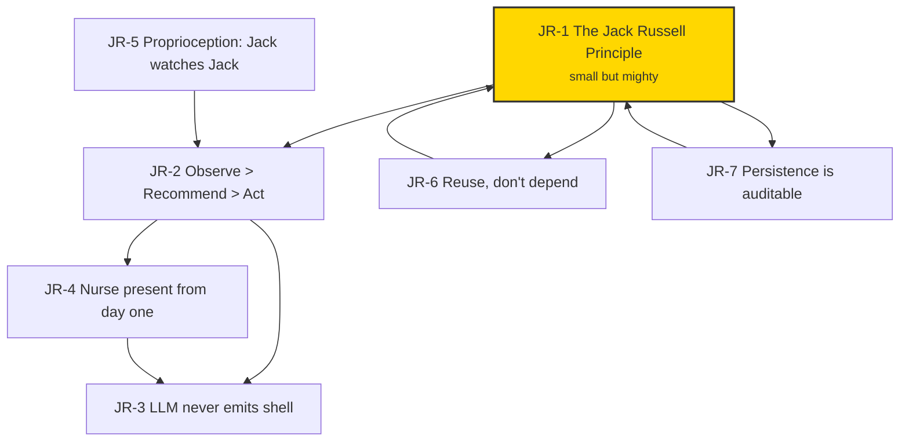

# Russell Architecture Principles Catalog

<!-- TOGAF_DOMAIN: Cross-cutting — Architecture Principles -->
<!-- VERSION: 1.0.0 -->
<!-- STATUS: Active -->
<!-- LAST_UPDATED: 2026-04-18 -->

**Version:** 1.0.0
**Status:** Active
**TOGAF Phase:** Preliminary / Phase A — Architecture Vision
**Audience:** Architects, developers, contributors, AI agents

---

## 1. Introduction

These are the principles Russell is built from. They are deliberately
few, each expressed in one short clause plus a justification and
consequence.

Russell is a cybernetic health harness for a single Linux AI/ML
workstation. He has one eye on the host, one eye on himself, and —
when he needs help he cannot give himself — one phone line to a
local LLM (default: Okapi; OpenRouter opt-in).

He is **small**. That is the most important thing about him.

> *Though she be but little, she is fierce.* — Shakespeare,
> *A Midsummer Night's Dream* III.ii.

## 2. How to read this catalog

Principles are numbered `JR-N` (Jack Russell). Each has:

- **Statement** — the rule.
- **Rationale** — why.
- **Consequence** — what the rule costs and what it buys.
- **Linked ADRs** — where the rule is mechanised.

When two principles conflict, the lower number wins. JR-1 is the
top rule. Nothing overrides JR-1 except an explicit ADR that
supersedes this catalog.

## 3. Foundational Principles

### JR-1 — The Jack Russell Principle

**Statement.** *Though she be but little, she is fierce.* Russell
is austere by default. Every feature must earn its place against
the cost it adds to boot time, binary size, cognitive load, and
attack surface. We prefer **one small, resilient loop that always
runs** over five clever loops that sometimes do. When in doubt,
cut.

**Rationale.** A Jack Russell terrier is a 12-inch dog that runs
all day, catches rats, never gets bored, never needs a team. The
wrong response to "we need more" is usually "we need less,
better." The design document
([`cybernetic-health-harness.md`](../../cybernetic-health-harness.md))
describes a rich system; this principle says implementation
sequences it *cautiously*, proving each loop before adding the
next.

**Consequence.** Cost: fewer features shipped per quarter. Buy:
a system that works when you are not watching it, whose failure
modes you can name, and that does not collapse under its own
weight.

**Linked ADRs.** ADR-0001 (scope), ADR-0013 (workspace layout).

### JR-2 — Observe > Recommend > Act

**Statement.** Russell's default posture is **observe > recommend >
act**. Any mutation is the exception, not the rule. Any mutation
must satisfy IDRS (Idempotent, Dry-runnable, Rollback-able,
Structured-logged).

**Rationale.** *Primum non nocere.* A health harness that breaks
the patient is worse than no harness. The triage ladder — observe,
then recommend, then (only sometimes, and only under cap) act —
is a first-rule-of-medicine discipline applied to automation.

**Consequence.** Cost: Russell will not magically fix things. Buy:
Russell will not magically break things.

**Linked ADRs.** ADR-0008, ADR-0011.

### JR-3 — The LLM never emits shell

**Statement.** The LLM is a consultant, never an executor. It may
rank a differential, compose a summary, or explain a symptom. It
may not generate shell commands the dispatcher executes. When
skills land (post-MVP), the LLM will select from **known IDs
registered in loaded manifests**; an unknown ID is rejected at the
boundary.

**Rationale.** A single hallucinated `rm -rf` is a career-ending
event for a health harness. The way to prevent it is structural,
not hopeful.

**Consequence.** Cost: Russell cannot improvise a fix the
manifests do not know about. Buy: no single LLM misstep becomes a
mutation.

**Linked ADRs.** ADR-0008.

### JR-4 — Small but present: the Nurse

**Statement.** Russell must be able to **cry for help** from day
one. The Nurse is a single verb (`russell jack`) that assembles
the current observations, sends them through the LLM router
(default: local Okapi, opt-in: OpenRouter with ZDR), writes
the round-trip to disk, and prints the response. It does not
act. It does not parse. It does not dispatch. It **notices**.

**Rationale.** A system that *can never* check in never does.
Russell's nurse-channel must already exist in habit form from
day one — the operator should be able to ask "how's the
machine?" and get an answer, not a configuration wizard.

**Consequence.** Cost: one round-trip to the configured LLM
backend per `russell jack`, one persona file. Buy: Russell's
operator is never alone with a wedged machine — Jack can at
least *say* what he sees.

**Linked ADRs.** ADR-0008, ADR-0016.

### JR-5 — Proprioception: Jack watches Jack

**Statement.** Russell watches himself the same way he watches the
host. Even in MVP, one self-vital always exists: **"did the
Sentinel run when it was supposed to?"** As he grows, the set
grows — but the first vital is non-optional.

**Rationale.** A controller that cannot detect its own degraded
state will confidently report on a host while itself being the
most broken service on the box. Proprioception is the nervous
system.

**Consequence.** Cost: one extra row-type in the journal, one
extra check per Sentinel cycle. Buy: no silent Russell failure.

**Linked ADRs.** ADR-0015.

### JR-6 — Reuse, don't depend

**Statement.** Russell **copies** code from upstream workspaces
(`peripheral`, `slate/stack`, `arsenal`) rather than depending on
them. Every copy is registered in
[`docs/operations/REUSE_MANIFEST.md`](../operations/REUSE_MANIFEST.md)
with its source path, upstream commit at copy time, local
modifications, and sync policy.

**Rationale.** Russell's operator is *one person*. A dependency
graph that reaches into three other workspaces is a failure mode
waiting to happen. Copy-with-provenance gives us:

- Zero transitive-breakage risk from unrelated upstream work.
- Russell can be built offline.
- Upstream bug fixes are a deliberate port, not a surprise.

**Consequence.** Cost: we maintain a sync manifest and
periodically rebase copies against upstream. Buy: Russell stays
small, self-contained, and always-builds.

**Linked ADRs.** ADR-0013 (workspace), ADR-0017.

### JR-7 — Persistence is auditable

**Statement.** Everywhere Russell remembers something, it is
documented — what table, what file, what schema version, what
retention. There are no hidden caches, no "temporary" state files
that become permanent, no state that persists without a row in
[`docs/specifications/PERSISTENCE_CATALOG.md`](../specifications/PERSISTENCE_CATALOG.md).

**Rationale.** An operator cannot reason about their machine if
Russell holds state they cannot see. JR-1 austerity requires that
every byte of persistence be load-bearing and named.

**Consequence.** Cost: one more document to keep current. Buy: a
full `rm -rf ~/.local/state/harness/` always cleanly resets
Russell. No orphans, no surprises.

**Linked ADRs.** ADR-0004, ADR-0006.

## 4. Corollaries

These fall out of the principles above. They are worth stating
because reviewers can cite them directly.

- **C-1: "First do no harm" is a refusal posture, not a slogan.**
  When a skill is unsure, it refuses. When the LLM is
  low-confidence, the Doctor defers. When proprioception reports
  a degraded Russell, the host Sentinel keeps collecting but the
  Doctor halts. (JR-2, JR-5.)
- **C-2: Persistence is SQLite.** One database, one writer, one
  place to look. (JR-7, ADR-0004.)
- **C-3: Copy with citation; sync with intent.** Never
  copy-and-forget. Every imported file carries a comment header
  pointing at the upstream source and the REUSE_MANIFEST row
  that governs it. (JR-6.)
- **C-4: The persona is a file, not a framework.** Jack's voice
  lives in `crates/russell-doctor/prompts/jack.md`. Changing his
  voice is editing one file; it is a reviewed change, not a
  setting. (JR-1, JR-4.)

## 5. Relationship Map

<!-- DIAGRAM_ALIGNMENT
id: DIAG-PRINCIPLES-REL-001
type: flowchart
verified_date: 2026-04-18
verified_against: this document §3
reference_sources: Russell authorship 2026
status: VERIFIED
-->

JR-1 roots the tree. Everything else either mechanises it or
follows from it.

## 6. TOGAF Domain Mapping

| Principle | TOGAF Phase | Artifact |
|---|---|---|
| JR-1 | Preliminary / Phase A | This catalog, `MVP_SPEC.md` |
| JR-2 | Phase C (IS) / Governance | ADR-0008, Safety standard |
| JR-3 | Phase C (IS) | ADR-0008 |
| JR-4 | Phase C (IS) | ADR-0016 *(to-be-authored)*, Doctor spec |
| JR-5 | Phase G (Governance) | ADR-0015, proprio archive |
| JR-6 | Phase D (Technology) | ADR-0013, `REUSE_MANIFEST.md` |
| JR-7 | Phase C (Data) | ADR-0004, ADR-0006, `PERSISTENCE_CATALOG.md` |

## 7. Amending the Catalog

Adding or altering a principle requires a superseding ADR that
cites this catalog and the specific JR-N being changed. Principles
are never deleted silently; they move to an archive block at the
bottom of this file with the superseding ADR referenced.
