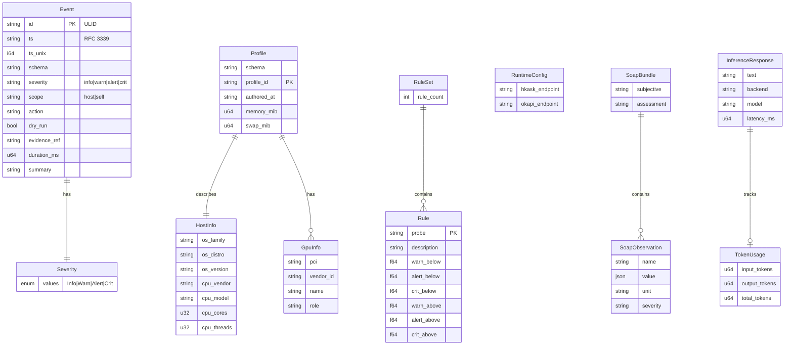
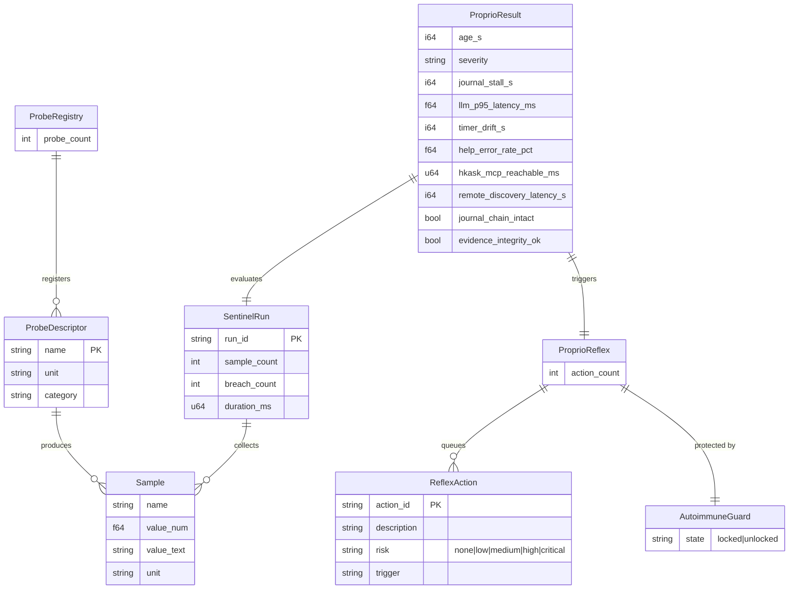
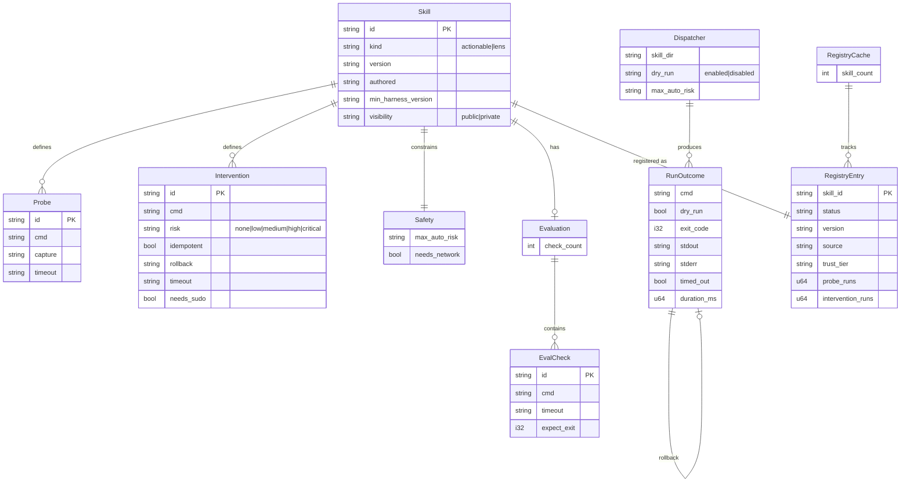
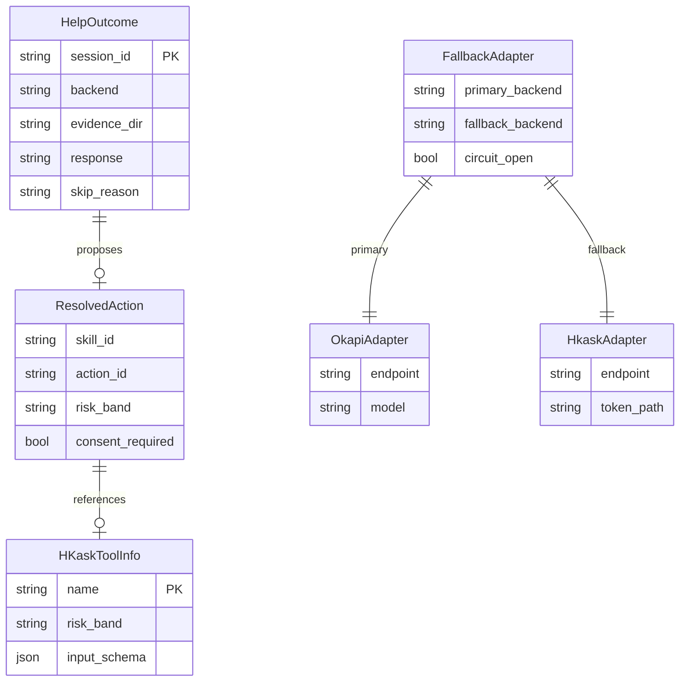
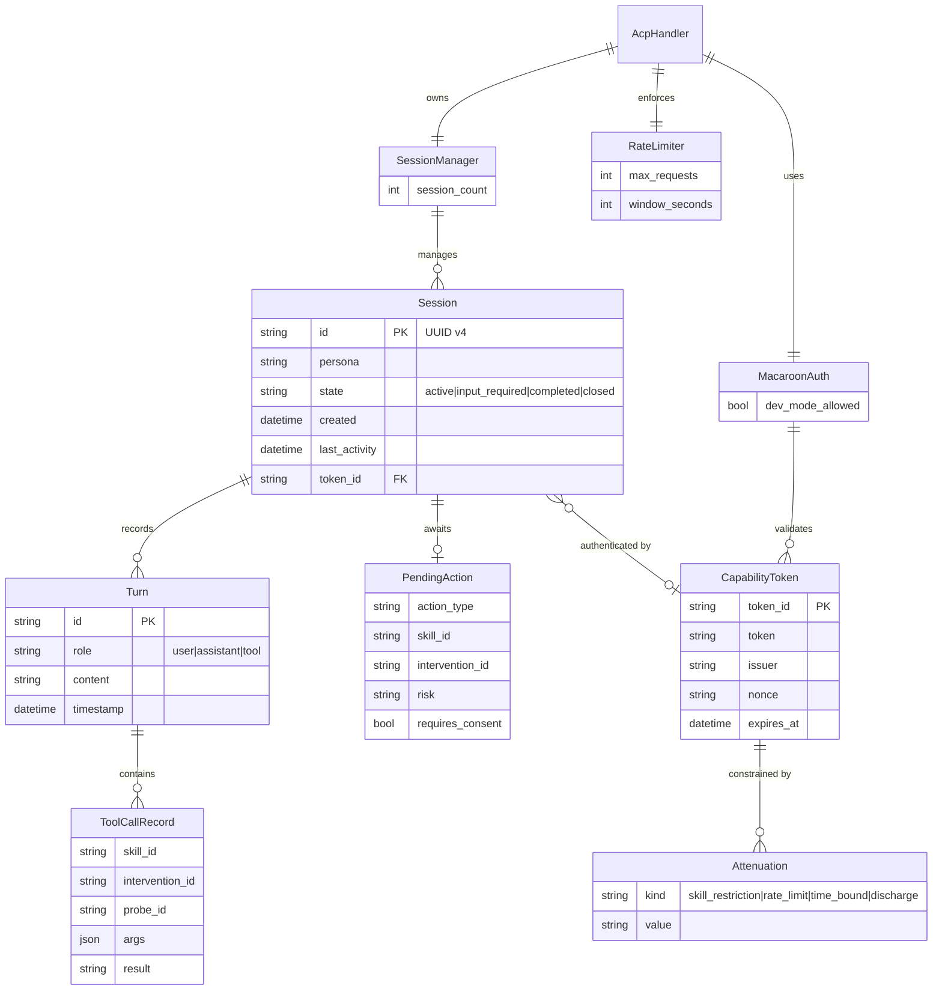
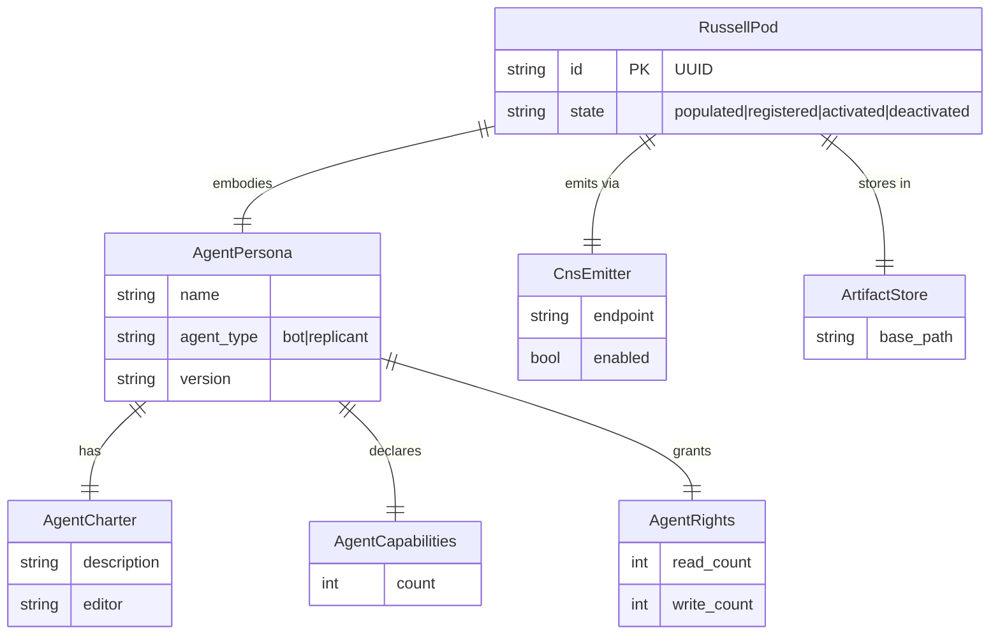
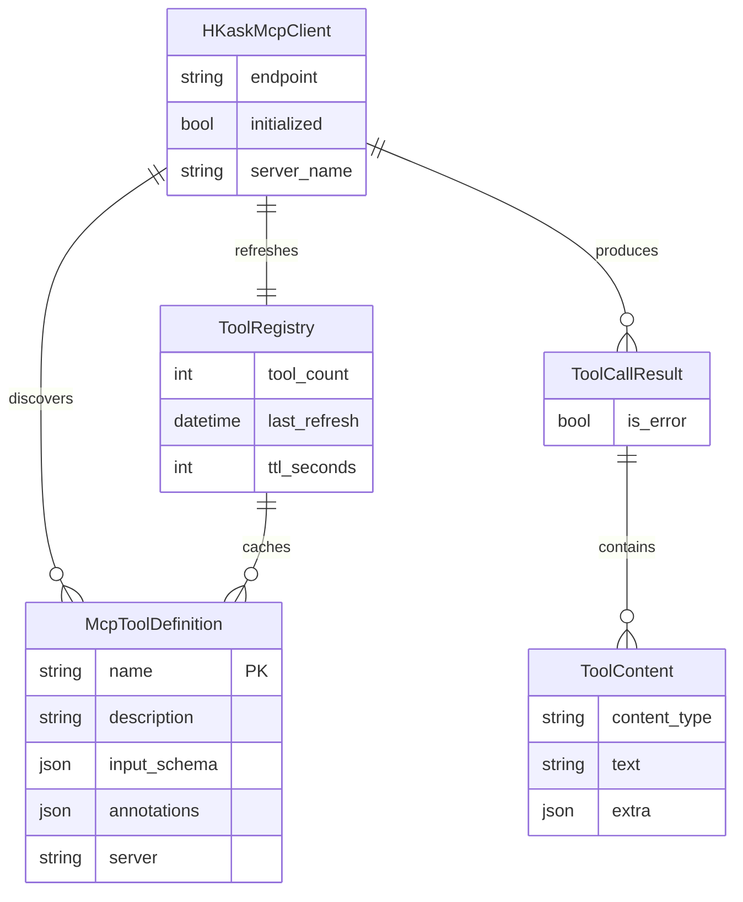
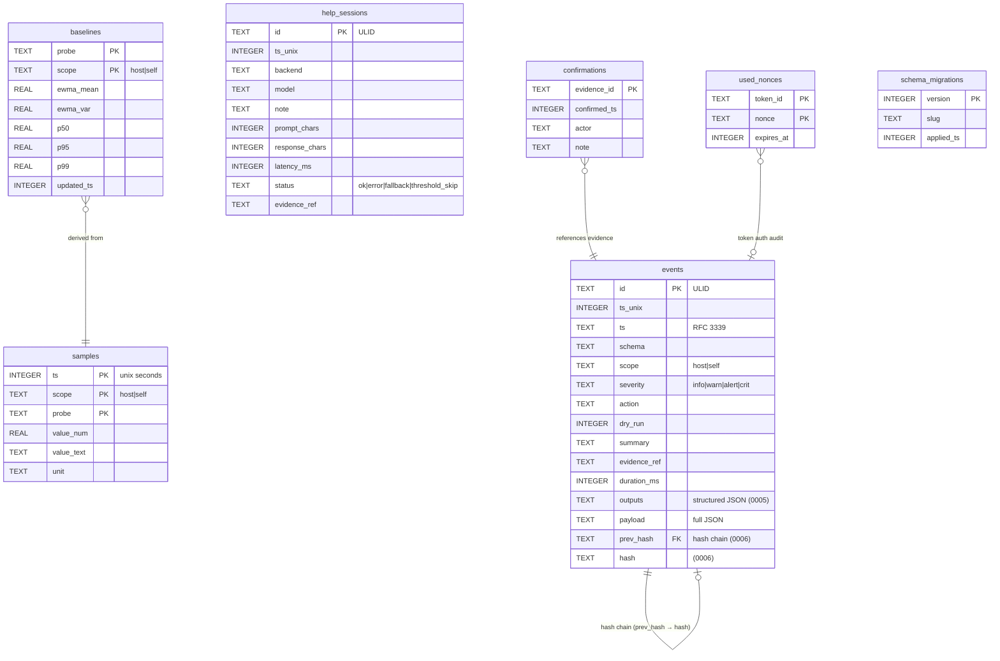

<!-- TOGAF_DOMAIN: Technology — Data Architecture -->
<!-- VERSION: 1.0.0 -->
<!-- STATUS: Active -->
<!-- LAST_UPDATED: 2026-05-24 -->

# Subsystem Entity Relationship Diagrams

Nine Mermaid ER diagrams mapping Russell's domain model to its Rust
type system and SQLite schema. Each diagram satisfies the
`DIAGRAM_ALIGNMENT` contract defined in
[`../standards/DOCUMENTATION_STANDARDS.md`](../standards/DOCUMENTATION_STANDARDS.md) §4.

---

## 1. Core Domain Model

<!-- DIAGRAM_ALIGNMENT
id: DIAG-CORE-ER-001
type: erDiagram
verified_date: 2026-05-24
verified_against: crates/russell-core/src/event.rs, profile.rs, rule/mod.rs, inference.rs
reference_sources: Cockburn (2005) Ports & Adapters; russell-core crate
status: VERIFIED
-->

---

## 2. Observation Layer

<!-- DIAGRAM_ALIGNMENT
id: DIAG-OBS-ER-002
type: erDiagram
verified_date: 2026-05-24
verified_against: crates/russell-sentinel/src/probes/mod.rs, crates/russell-proprio/src/lib.rs, crates/russell-proprio/src/reflex.rs
reference_sources: Ashby (1956) Law of Requisite Variety; Beer (1972) VSM
status: VERIFIED
-->

---

## 3. Skill System

<!-- DIAGRAM_ALIGNMENT
id: DIAG-SKILL-ER-003
type: erDiagram
verified_date: 2026-05-24
verified_against: crates/russell-skills/src/lib.rs, dispatch.rs, registry/mod.rs
reference_sources: Nix derivations; Ansible playbook structure; ADR-0024
status: VERIFIED
-->

---

## 4. Metacognitive Layer (The Nurse)

<!-- DIAGRAM_ALIGNMENT
id: DIAG-META-ER-004
type: erDiagram
verified_date: 2026-05-24
verified_against: crates/russell-meta/src/lib.rs, help.rs, action.rs, fallback_adapter.rs
reference_sources: Brooks (1991) subsumption architecture; ADR-0026
status: VERIFIED
-->

---

## 5. ACP Server

<!-- DIAGRAM_ALIGNMENT
id: DIAG-ACP-ER-005
type: erDiagram
verified_date: 2026-05-24
verified_against: crates/russell-acp-server/src/session.rs, handler.rs, auth.rs, types.rs
reference_sources: Birgisson et al. (2014) Macaroons; ADR-0027, ADR-0041
status: VERIFIED
-->

---

## 6. Agent Pod

<!-- DIAGRAM_ALIGNMENT
id: DIAG-AGENT-ER-006
type: erDiagram
verified_date: 2026-05-24
verified_against: crates/russell-agent/src/persona.rs, lifecycle.rs, pod.rs
reference_sources: hKask Agent Pod specification; ADR-0045
status: VERIFIED
-->

---

## 7. MCP Client

<!-- DIAGRAM_ALIGNMENT
id: DIAG-MCP-ER-007
type: erDiagram
verified_date: 2026-05-24
verified_against: crates/russell-mcp/src/client.rs, registry.rs, types.rs
reference_sources: Model Context Protocol specification; ADR-0003, ADR-0025
status: VERIFIED
-->

---

## 8. Journal Persistence (SQLite Schema)

<!-- DIAGRAM_ALIGNMENT
id: DIAG-JOURNAL-ER-008
type: erDiagram
verified_date: 2026-05-24
verified_against: crates/russell-core/src/journal/migrations.rs
reference_sources: SQLite documentation; ADR-0004; PERSISTENCE_CATALOG.md
status: VERIFIED
-->

---

## 9. CLI Dispatch Layer

```mermaid
erDiagram
    Cli {
        string name "russell"
        string version
    }
    Command {
        int variant_count "20"
    }
    Paths {
        string base "from_env()"
    }
    HandlerStatus {
        string function "status::run"
        string crate_dep "russell-core"
        string async "no"
    }
    HandlerPod {
        string functions "status, activate, deactivate, persona_show, artifacts_list, artifacts_export"
        string crate_dep "russell-agent, russell-core"
        string async "activate, deactivate"
    }
    HandlerList {
        string function "list::run"
        string crate_dep "russell-core"
        string async "no"
    }
    HandlerDigest {
        string function "digest::run"
        string crate_dep "russell-core"
        string async "no"
    }
    HandlerSentinel {
        string function "sentinel_once::run"
        string crate_dep "russell-sentinel, russell-core"
        string async "no"
    }
    HandlerHelp {
        string function "help::run"
        string crate_dep "russell-meta, russell-core"
        string async "yes"
    }
    HandlerSkill {
        string functions "skill::list, skill::run"
        string crate_dep "russell-skills, russell-core"
        string async "run only"
    }
    HandlerSkillLifecycle {
        string functions "install_skill, prune_skill"
        string crate_dep "russell-skills, russell-core"
        string async "no"
    }
    HandlerProprio {
        string function "proprio::run"
        string crate_dep "russell-proprio, russell-core"
        string async "yes"
    }
    HandlerSelfTriage {
        string function "self_triage::run"
        string crate_dep "russell-meta, russell-proprio, russell-core"
        string async "yes"
    }
    HandlerDocs {
        string function "docs::run"
        string crate_dep "russell-core"
        string async "no"
    }
    HandlerVerify {
        string function "verify::run"
        string crate_dep "russell-core"
        string async "no"
    }

    Cli ||--|| Command : "parses via clap"
    Cli ||--|| Paths : "resolves"
    Command ||--o| HandlerStatus : "Status"
    Command ||--o| HandlerPod : "6 pod subcommands"
    Command ||--o| HandlerList : "List"
    Command ||--o| HandlerDigest : "Digest"
    Command ||--o| HandlerSentinel : "SentinelOnce"
    Command ||--o| HandlerHelp : "Jack"
    Command ||--o| HandlerSkill : "SkillList, SkillRun"
    Command ||--o| HandlerSkillLifecycle : "SkillInstall, SkillPrune"
    Command ||--o| HandlerProprio : "Proprio"
    Command ||--o| HandlerSelfTriage : "SelfTriage"
    Command ||--o| HandlerDocs : "Docs"
    Command ||--o| HandlerVerify : "VerifyJournal"
```

<!-- DIAGRAM_ALIGNMENT
id: DIAG-CLI-ER-009
type: erDiagram
verified_date: 2026-05-24
verified_against: crates/russell-cli/src/main.rs, crates/russell-cli/src/commands/mod.rs
reference_sources: Clap Parser/Subcommand derive macros; ADR-0003 (lift paths)
status: VERIFIED
-->

---

## References

- Cockburn, A. (2005). *Hexagonal Architecture*.
- Beer, S. (1972). *Brain of the Firm*.
- Ashby, W.R. (1956). *An Introduction to Cybernetics*.
- Brooks, R. (1991). "Intelligence without representation." *AI Journal*.
- Birgisson, A. et al. (2014). "Macaroons: Cookies with Contextual Caveats."
- Model Context Protocol specification. <https://modelcontextprotocol.io>
- Russell ADRs: 0003, 0004, 0024, 0025, 0026, 0027, 0041, 0045.
