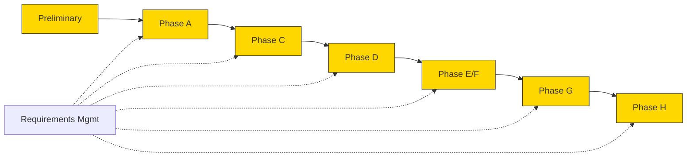

# Russell TOGAF Traceability Matrix

<!-- TOGAF_DOMAIN: Cross-cutting — Architecture Governance -->
<!-- VERSION: 1.0.0 -->
<!-- STATUS: Active -->
<!-- LAST_UPDATED: 2026-04-18 -->

This matrix maps Russell's **small** documentation corpus onto
TOGAF ADM phases. Russell does not have 40 architecture
documents. It has a handful, each load-bearing.[^togaf]

[^togaf]: The Open Group. (2022). *TOGAF Standard, 10th Edition*.
§38 Architecture Content Framework. https://www.opengroup.org/togaf

## 1. ADM Coverage Map

<!-- DIAGRAM_ALIGNMENT
id: DIAG-TRACE-ADM-001
type: flowchart
verified_date: 2026-04-18
verified_against: docs/README.md §2
reference_sources: The Open Group (2022) TOGAF §5
status: VERIFIED
-->

Phase B (Business Architecture) is deliberately skipped: Russell
is not a business concern.

## 2. Phase → Document Mapping

| TOGAF Phase | Russell Documents | Notes |
|---|---|---|
| **Preliminary** — Principles, Standards | [`PRINCIPLES_CATALOG.md`](PRINCIPLES_CATALOG.md), [`../standards/*.md`](../standards/) | JR-1 … JR-7 live here |
| **Phase A** — Architecture Vision | [`../../cybernetic-health-harness.md`](../../cybernetic-health-harness.md), [`PRINCIPLES_CATALOG.md`](PRINCIPLES_CATALOG.md), [`overview.md`](overview.md) | The full vision and the current shape |
| **Phase B** — Business Architecture | *(skipped)* | Single-operator tool; no business concern |
| **Phase C** — IS (Data + Application) | [`../specifications/PERSISTENCE_CATALOG.md`](../specifications/PERSISTENCE_CATALOG.md), [`overview.md`](overview.md) | What is persisted and how the crates fit |
| **Phase D** — Technology | [`../adr/0009-tokio-runtime.md`](../adr/deferred/0009-tokio-runtime.md) *(deferred)*, [`../adr/0010-observability-stack.md`](../adr/deferred/0010-observability-stack.md) *(deferred)*, [`../operations/REUSE_MANIFEST.md`](../operations/REUSE_MANIFEST.md) | Tech choices + copy register |
| **Phase E/F** — Migration | [`../../cybernetic-health-harness.md` §20](../../cybernetic-health-harness.md), [`../status/CONSOLIDATED-STATUS.md`](../status/CONSOLIDATED-STATUS.md) | Roadmap and where we are |
| **Phase G** — Governance | [`../status/CONSOLIDATED-STATUS.md`](../status/CONSOLIDATED-STATUS.md), [`../standards/safety.md`](../standards/safety.md), [`../../AGENTS.md`](../../AGENTS.md) | The "don't break the patient" discipline |
| **Phase H** — Change Management | [`../adr/`](../adr/) (ADRs 0001, 0002, 0004, 0006, 0008, 0011, 0013, 0015 active; 7 others deferred) | Locked decisions |
| **Requirements Mgmt** | [`../specifications/MVP_SPEC.md`](../specifications/MVP_SPEC.md), [`../specifications/PERSISTENCE_CATALOG.md`](../specifications/PERSISTENCE_CATALOG.md) | The pinned boundary |

## 3. Principle → Phase Anchoring

Each JR principle (see [`PRINCIPLES_CATALOG.md`](PRINCIPLES_CATALOG.md))
has an anchor document per TOGAF phase.

| Principle | Preliminary | A | C | D | G | H |
|---|---|---|---|---|---|---|
| JR-1 Jack Russell | ● | ● |   |   |   | ADR-0001, ADR-0013 |
| JR-2 Observe first |   |   |   |   | ● | ADR-0008, ADR-0011 |
| JR-3 No shell |   |   |   |   |   | ADR-0008 |
| JR-4 Doctor present |   | ●  | ● |   |   | ADR-0008, ADR-0016 *(to be authored)* |
| JR-5 Proprioception |   |   |   |   | ● | ADR-0015 |
| JR-6 Reuse |   |   |   | ● |   | ADR-0013, ADR-0017 *(to be authored)* |
| JR-7 Persistence audited |   |   | ● |   |   | ADR-0004, ADR-0006 |

## 4. Coverage Gaps

- **Phase B** is deliberately empty (see §2).
- **Phase A** could grow a separate Vision document distinct from
  the design doc; deferred until Russell has enough history to
  warrant one.
- **Phase C — Application Architecture** is currently covered
  only by `overview.md`. A dedicated Application Architecture
  document will be authored when MVP completes and Phase 2
  skills begin to land.

## 5. Maintenance

This matrix is reviewed whenever:

- A new authoritative document is added (the new doc declares
  its `togaf_phase`; this matrix gets a row).
- An ADR is added, superseded, or deferred.
- A principle is added, amended, or deprecated.

Staleness threshold: 90 days, per
[`../standards/DOCUMENTATION_STANDARDS.md`](../standards/DOCUMENTATION_STANDARDS.md) §8.
