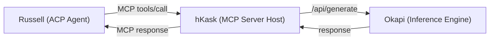

<!-- TOGAF_DOMAIN: Application Architecture -->
<!-- VERSION: 1.2.0 -->
<!-- STATUS: Active -->
<!-- LAST_UPDATED: 2026-05-23 -->

# Ecosystem Integration — hKask & Okapi Reference Model

> Defines the interfaces that make Russell's skill registry a hKask ecosystem
> reference model: MCP tool exposure, Okapi LLM skill routing, cross-project
> skill portability, and OKH span bridging.
>
> **Architecture:** Russell → hKask → Okapi (Russell accesses Okapi through hKask as an ACP agent)
>
> Version: 1.2.0 | 2026-05-23

---

## 1. hKask MCP Tool Exposure

Per the Model Context Protocol specification (Anthropic, 2024), MCP tool
servers expose typed capabilities over JSON-RPC 2.0 on stdio transports.
Russell's tool servers follow this contract.

### New MCP Server: `arsenal-mcp-russell-skills`

Extends the existing `arsenal-mcp-russell` (7 tools reading Russell's journal)
with a new skill-inventory MCP server exposing skill metadata to hKask's
Curator (Duncan) and the `stack-control-plane`.

#### MCP Tool Definitions

```
arsenal-mcp-russell-skills (MCP server, localhost loopback)
├── skill_inventory          ← List all installed skills with health
├── skill_detail             ← Get one skill's manifest + health + lifecycle
├── skill_health             ← Get aggregated health for one or all skills
├── skill_lifecycle_history  ← Get lifecycle transition history from journal
├── skill_symptoms           ← List symptoms and coverage gaps
├── skill_export_bundle      ← Export a skill as .rsk.tar.gz (read-only to caller)
└── skill_evaluation_result  ← Get latest evaluation (scenario test results)
```

#### `skill_inventory` Tool Schema

```json
{
  "name": "skill_inventory",
  "description": "List all installed skills with health summaries.",
  "inputSchema": {
    "type": "object",
    "properties": {
      "status_filter": {
        "type": "string",
        "enum": ["active", "stale_warning", "deprecated", "all"],
        "description": "Filter by lifecycle status. Default: active."
      }
    }
  }
}
```

**Output:**
```json
{
  "skills": [
    {
      "skill_id": "okapi-watcher",
      "version": "0.1.0",
      "kind": "Actionable",
      "status": "active",
      "symptoms": ["llm_slow", "resource_exhaustion", "gpu_fallback_to_cpu"],
      "health": {
        "quality_score": 0.85,
        "reliability": 0.92,
        "probe_runs": 340,
        "last_probe_run_at": "2026-05-15T08:55:00"
      }
    }
  ]
}
```

#### `skill_health` Tool Schema

```json
{
  "name": "skill_health",
  "description": "Get aggregated health assessment for skills.",
  "inputSchema": {
    "type": "object",
    "properties": {
      "skill_id": {
        "type": "string",
        "description": "Optional. If omitted, returns health for all active skills."
      }
    }
  }
}
```

**Output:**
```json
{
  "skills": {
    "okapi-watcher": {
      "quality_score": 0.85,
      "reliability": 0.92,
      "latency_p95_ms": 350.0,
      "freshness_days": 5,
      "safety_posture": "pass",
      "staleness_days": 145,
      "probe_runs": 340,
      "intervention_runs": 12
    }
  }
}
```

### Duncan (Curator) Integration

Duncan — hKask's infrastructure Curator — uses `skill_inventory` and `skill_health`
to surface Russell skill state in the hKask dashboard:

```
Duncan's dashboard
  ├── Russell host group → skill health cards
  ├── Per-skill: quality_score gauge, reliability sparkline, staleness countdown
  └── Alert: skill staleness_days < 0 → notify operator
```

### `stack-control-plane` Integration

hKask's control plane queries `skill_lifecycle_history` to detect version drift:

```
stack-control-plane
  ├── Periodic: skill_inventory (all hosts)
  ├── Diff: skill version mismatch across hosts → flag for reconciliation
  └── Action: propose skill export from canonical host → import to drifters
```

### 1.1 hLexicon Terminology & Governance

Russell skills declare hLexicon terms (WordAct/FlowDef/KnowAct) in their `hlexicon.yaml` manifests. These terms are **allocated** (not budgeted) by hKask's governance model:

- **Allocation:** 75 terms allocated across 3 domains (currently 80, with 5 git evolution terms exceeding allocation)
- **Governance:** `hKask/registry/registries/hlexicon-governance.yaml` defines the `term_allocation` section
- **Expansion:** When hKask extends hLexicon (e.g., spec-curation terms), Russell skills may adopt new terms without code changes

**Key distinction:** Vocabulary terms carry allocation, not consumption. A term like `curate` does not deplete with use — operators deliberately place and reuse it infinitely. This differs from consumable resources like `reflex_budget` or `token_budget`, which deplete with use.

**Reference:** hKask `docs/architecture/hKask-hLexicon.md` and `docs/plans/LEXICON_TERMINOLOGY_CHANGE.md`

---

## 2. Okapi LLM Skill Routing

### Architecture: Russell → hKask → Okapi

Russell does **not** connect directly to Okapi. All inference requests flow through hKask, following the indirect invocation pattern described by Birgisson et al. (2014) for capability-based authorization:



<!-- DIAGRAM_ALIGNMENT
id: DIAG-RUSSELL-OKAPI-001
type: flowchart
verified_date: 2026-05-24
verified_against: russell/docs/architecture/ecosystem-integration.md; ADR-0025; ADR-0027
reference_sources: ADR-0025 (MCP client), ADR-0027 (ACP integration)
status: VERIFIED
-->

### MCP Server: `hkask-mcp-inference`

hKask exposes inference capabilities to Russell via MCP:

| MCP Tool | Okapi Endpoint | Purpose |
|----------|----------------|---------|
| `inference/generate` | `/api/generate` | Completion generation |
| `inference/chat` | `/api/chat` | Chat completion |
| `inference/embed` | `/api/embed` | Embedding generation |
| `inference/rerank` | `/api/rerank` | Document reranking |

### Russell Request Flow

1. Russell sends MCP request to hKask: `inference/generate`
2. hKask validates request, applies capability-based auth
3. hKask routes to Okapi via HTTP POST `/api/generate`
4. Okapi processes request, returns response
5. hKask parses response, applies confidence routing if configured
6. hKask returns MCP response to Russell

### Benefits of Indirect Architecture

| Benefit | Description |
|---------|-------------|
| **Unified authentication** | Russell inherits hKask's capability tokens |
| **Centralized routing** | hKask can route to Okapi, OpenRouter, or other backends |
| **Capability discovery** | hKask exposes Okapi capabilities via MCP |
| **Observability** | All requests traced through hKask CNS spans |
| **Confidence routing** | hKask can escalate low-confidence responses |

Okapi's request context gains a `skill-hint` JSON field that maps active symptoms
→ loaded skill KNOWLEDGE.md injection. This enables downstream Okapi consumers
(not just Russell) to use the skill registry for prompt augmentation.

**Note:** Russell does not set `skill-hint` directly. hKask adds it when routing requests.

#### Okapi API Extension

```
POST /api/v1/chat/completions
{
  "model": "default",
  "messages": [...],
  "skill_hint": {
    "active_symptoms": ["llm_slow", "resource_exhaustion"],
    "skill_registry_path": "~/.local/share/harness/registry/local-cache.yaml",
    "skills_dir": "~/.local/share/harness/skills/",
    "budget_tokens": 3000
  }
}
```

The `skill_hint` block is **optional**. When present, Okapi:

1. Loads `RegistryCache` from `skill_registry_path`
2. Queries `lookup_symptom()` for each active symptom
3. Reads `KNOWLEDGE.md` from `skills_dir/<skill_id>/KNOWLEDGE.md`
4. Scores relevance using `score_knowledge_relevance()` 
5. Injects knowledge into the system prompt under the `knowledge` key
6. Emits `okh.llm.knowledge_injection` span with skill IDs and token estimates

#### Response header

```
X-Skills-Injected: okapi-watcher,ubuntu-doctor
X-Knowledge-Tokens: 1847
```

### OpenRouter / Remote Backend Support

When using OpenRouter instead of local Okapi, Russell forwards the `skill_hint` block
as a custom header to Russell's prompt assembler. The `PromptAssembler` port
handles knowledge injection before the prompt leaves the machine — OpenRouter
never sees raw skill data.

---

## 3. Cross-Project Skill Portability

### Manifest Schema as Ecosystem Contract

The manifest.yaml schema is the hKask ecosystem's skill contract, following the declarative package specification pattern used in Nix derivations (Dolstra, 2006) and Ansible playbooks:

```yaml
id: <kebab-case-id>       # required — unique identifier
version: <semver>          # required — semantic version
authored: <ISO 8601>       # required — creation date
symptoms: [<id>, ...]      # required — poka-yoke enforced
kind: actionable | lens    # optional — default: actionable
applies_when:              # optional — profile preconditions
  os_family: linux
probes:                    # optional — diagnostic steps
  - id: <probe-id>
    cmd: [<argv>, ...]
    timeout: 30s
interventions:             # optional — mutating steps
  - id: <intervention-id>
    cmd: [<argv>, ...]
    risk: none | low | medium | high | critical
    rollback: <rollback-id> | none_needed | reboot
safety:                    # optional — risk constraints
  max_auto_risk: low
evaluation:                # optional — post-intervention checks
  - id: <check-id>
    cmd: [<argv>, ...]
```

**Compatibility guarantee:** Any tool that can parse this YAML schema can load a
skill written for Russell. This includes:

- **Russell** (`FilesystemSkillLoader`): native loader
- **hKask** (future `SkillLoader` adapter): same schema, different dispatch
- **Okapi** (prompt injection only): reads `symptoms` and `kind`, ignores probes/interventions
- **Third-party** (web-based skill browser): renders manifest metadata

### Loader Compatibility Matrix

| Tool | Loads manifest | Executes probes? | Executes interventions? | Injects knowledge? |
|---|---|---|---|---|
| Russell | Yes | Yes (IDRS-gated) | Yes (IDRS + consent) | Yes (scored + budgeted) |
| hKask (proposed) | Yes | Yes (hKask governance) | Yes (hKask governance) | Yes |
| Okapi | Yes | No | No | Yes (via skill_hint) |
| Web browser | Yes | No | No | No |

---

## 4. OKH Span Bridging

### Span Namespace

Russell emits OKH spans following OpenTelemetry semantic conventions
(OpenTelemetry Authors, 2021), via the same `tracing` layer hKask uses:

```
okh.<layer>.<module>.<signal>
```

Russell-specific spans:

```
okh.skill.load.all           ← SkillLoader::load_all()
okh.skill.load.one           ← SkillLoader::load_one()
okh.skill.validate           ← SkillValidator::validate()
okh.skill.eval.quality       ← quality score
okh.skill.eval.reliability   ← EWMA reliability
okh.skill.eval.latency       ← p95 latency
okh.skill.eval.freshness     ← days since install
okh.skill.eval.safety        ← safety posture
okh.skill.eval.staleness     ← days to threshold
okh.skill.eval.complete      ← composite assessment
okh.skill.dispatch.probe     ← probe execution
okh.skill.dispatch.intervention ← intervention execution
okh.skill.dispatch.rollback  ← rollback execution
okh.skill.lifecycle.transition ← state transition
```

### hKask Observability Integration

hKask's observability surface (Loki + Grafana) picks up Russell skill health natively
because both systems use the same `tracing` subscriber:

```
Russell (tracing spans) → OpenTelemetry collector → Loki → Grafana
hKask    (tracing spans) → OpenTelemetry collector → Loki → Grafana
                                         ↑
                                   shared OTEL collector
                                   (same Span ID format)
```

### Grafana Dashboard Queries

```
# Skill health across hosts
okh_skill_eval_complete_total{quality_score > 0.8}
  → "Healthy skills"

# Skill staleness alerts
okh_skill_eval_staleness{staleness_days < 0}
  → "Stale skills"

# Dispatch latency p95
histogram_quantile(0.95, okh_skill_dispatch_probe_duration_seconds)
  → "Probe latency p95 across fleet"

# Reliability degradation
okh_skill_eval_reliability{reliability < 0.7}
  → "Unreliable skills"
```

---

## 5. Integration Architecture Summary

### Russell → hKask → Okapi Data Flow

```
┌─────────────────────────────────────────────────────────────────────┐
│                        KASK ECOSYSTEM                                │
│                                                                      │
│  ┌──────────────┐    ┌──────────────┐    ┌──────────────────────┐   │
│  │   Russell     │    │   hKask       │    │   Okapi              │   │
│  │   (ACP agent) │    │   (MCP host)  │    │   (inference engine) │   │
│  │               │    │               │    │                      │   │
│  │  - Skills     │    │  - MCP tools  │    │  - LLM inference     │   │
│  │  - Journal    │    │  - Routing    │    │  - LoRA adapters     │   │
│  │  - Probes     │    │  - Auth       │    │  - Embeddings        │   │
│  └──────┬───────┘    └──────┬───────┘    └──────────┬────────────┘   │
│         │                   │                        │               │
│         │ MCP tools/call    │ HTTP POST /api/*       │               │
│         │ (loopback)        │ (127.0.0.1:11435)      │               │
│         ▼                   ▼                        ▼               │
│  ┌──────────────────────────────────────────────────────────────┐   │
│  │                Shared Infrastructure                          │   │
│  │                                                                │   │
│  │  - Manifest YAML schema (ecosystem contract)                   │   │
│  │  - OKH tracing spans (opentelemetry → Loki → Grafana)          │   │
│  │  - .rsk.tar.gz bundle format (portable skill unit)             │   │
│  │  - REUSE_MANIFEST.md (provenance across operator boundaries)   │   │
│  └──────────────────────────────────────────────────────────────┘   │
└─────────────────────────────────────────────────────────────────────┘
```

**Key Design Decision:** Russell does not connect directly to Okapi. All inference requests flow through hKask's MCP infrastructure. This provides:
- Unified authentication and capability-based security
- Centralized routing (hKask can route to Okapi, OpenRouter, or other backends)
- Consistent observability via CNS spans
- Confidence-based escalation handled by hKask

## References

- Anthropic. (2024). *Model Context Protocol Specification*. <https://modelcontextprotocol.io>
- Birgisson, A. et al. (2014). "Macaroons: Cookies with Contextual Caveats for Decentralized Authorization in the Cloud." *NDSS Symposium*.
- Dolstra, E. (2006). *The Purely Functional Software Deployment Model*. PhD thesis, Utrecht University.
- OpenTelemetry Authors. (2021). *OpenTelemetry Semantic Conventions*. <https://opentelemetry.io/docs/concepts/semantic-conventions/>
