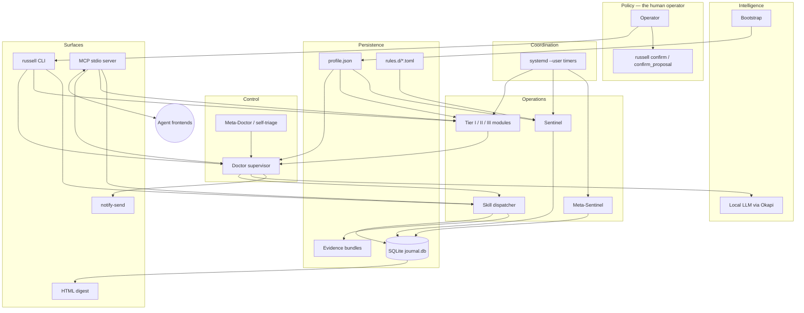
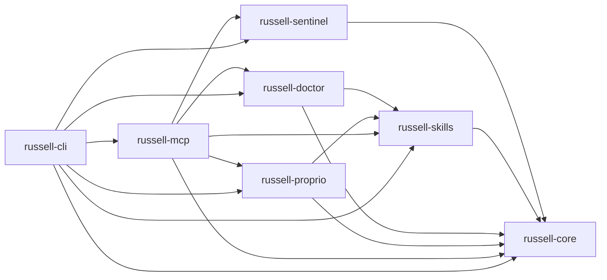

<!-- TOGAF_DOMAIN: Architecture Vision -->
<!-- VERSION: 1.1.0 -->
<!-- STATUS: Active -->
<!-- LAST_UPDATED: 2026-05-06 -->

<!--
audience: contributors orienting themselves before editing code
last-reviewed: 2026-04-17
-->

# Architecture overview

This document summarises **how the locked decisions fit together**
right now. It does not re-derive them; for that, read the relevant
ADRs. It also does not replace the canonical design document
([`cybernetic-health-harness.md`](../../cybernetic-health-harness.md));
when the two disagree, the ADR wins. When an ADR is silent, the
design document wins. When both are silent, file an ADR.

## 1. What Russell is, in one diagram

<!-- DIAGRAM_ALIGNMENT
id: DIAG-OVERVIEW-001
type: flowchart
verified_date: 2026-05-13
verified_against: AGENTS.md §5 (VSM layers); ADR-0004, ADR-0006, ADR-0008, ADR-0013, ADR-0015
reference_sources: PRINCIPLES_CATALOG.md JR-1 through JR-7; cybernetic-health-harness.md
status: VERIFIED
-->

The five VSM layers — Policy, Intelligence, Control, Coordination,
Operations — are not just diagramming convenience. Each layer has
a corresponding ADR and a corresponding area of the code:

| VSM layer | Locked decision | Code home |
|---|---|---|
| Policy | [ADR-0005](../adr/deferred/0005-privileged-operations.md), [safety.md](../standards/safety.md) | `russell-cli` confirm flow, kill switches |
| Intelligence | [ADR-0008](../adr/0008-llm-triage-never-emits-shell.md) | `russell-doctor::openrouter`, `russell-core::profile` |
| Control | [ADR-0007](../adr/deferred/0007-yaml-manifest-subprocess-skill-model.md), [ADR-0015](../adr/0015-proprioception-self-health.md) | `russell-doctor`, `russell-proprio` (MVP self-vital) |
| Coordination | [ADR-0009](../adr/deferred/0009-tokio-runtime.md) + systemd timers | Unit files under `units/`; timers are OS-level |
| Operations | [ADR-0004](../adr/0004-sqlite-journal.md), [ADR-0006](../adr/0006-profile-abstraction.md) | `russell-sentinel`, `russell-skills` |

## 2. Crate topology

<!-- DIAGRAM_ALIGNMENT
id: DIAG-OVERVIEW-002
type: flowchart
verified_date: 2026-05-13
verified_against: ADR-0013 (rust-workspace-layout); cargo.toml dependency declarations
reference_sources: PRINCIPLES_CATALOG.md JR-6 (reuse over dependency)
status: VERIFIED
-->

<!-- DIAGRAM_ALIGNMENT
id: DIAG-OVERVIEW-002
type: flowchart
verified_date: 2026-05-13
verified_against: ADR-0013 (rust-workspace-layout); cargo.toml dependency declarations
reference_sources: PRINCIPLES_CATALOG.md JR-6 (reuse over dependency)
status: VERIFIED
-->

See [ADR-0013](../adr/0013-rust-workspace-layout.md). No crate
depends on `russell-cli`. The dependency DAG is rooted at
`russell-core`.

## 3. Data plane

Three on-disk artifacts are canonical; everything else is
derived.

### 3.1 `profile.json`

- Path: `~/.local/state/harness/profile.json`.
- Author: the Bootstrap.
- Readers: every tier, the Doctor, the Sentinel, the MCP server.
- Schema: [ADR-0006](../adr/0006-profile-abstraction.md).
- Invariant: mutations happen only through the Bootstrap state
  machine. Everywhere else the profile is read-only.

### 3.2 `journal.db`

- Path: `~/.local/state/harness/journal.db`.
- Engine: SQLite with WAL + `synchronous=NORMAL`
  ([ADR-0004](../adr/0004-sqlite-journal.md)).
- Tables: `samples`, `events`, `baselines`, `confirmations`,
  `migrations`. `proprio_samples` and `proprio_events` mirror
  the first two but with `scope='self'`
  ([ADR-0015](../adr/0015-proprioception-self-health.md)).
- Writer: serialized through a single `spawn_blocking` task in
  `russell-core::journal::writer`. Readers use a connection
  pool.
- Migrations are forward-only, zero-padded, never edited after
  merge.

### 3.3 Evidence bundles

- Path: `~/.local/state/harness/evidence/<evidence_id>/`.
- Contents: `soap.md`, `skill.yaml`, per-probe JSON, per-
  intervention JSON, `llm-transcript.jsonl`,
  system-snapshot files (`dmesg.log`, `rocm-smi.json`, etc.).
- Referenced from journal events via `evidence_ref`.
- Expire 90 days after their final state transition, except
  bundles marked `archive`.

## 4. Control plane

### 4.1 Timers (systemd --user)

Russell runs under user-scoped systemd with one exception:
`weekly/apt-upgrade` escalates through a narrow PolKit action
([ADR-0005](../adr/deferred/0005-privileged-operations.md)). All timers
declare `Persistent=true` + `RandomizedDelaySec=` so a sleeping
laptop catches up without thundering herd.

### 4.2 CLI and MCP, two views of the same actions

Every CLI subcommand has a matching MCP tool unless an ADR
explicitly justifies the asymmetry. This is a hard rule so
agents and humans never diverge in capability. The MCP surface
is catalogued in
[`../archive/mcp-surface.md`](../archive/mcp-surface.md).

### 4.3 The Doctor

The Doctor is a **supervisor**, not an LLM wrapper. Its loop:

1. Receive a symptom (Sentinel crit event, CLI, tier
   escalation, proprioception).
2. Load matching skill manifests.
3. Run all `risk: none` probes.
4. Compose the Objective section of the SOAP bundle.
5. Ask the LLM to rank a differential **over the manifest's
   probe and intervention IDs**. Never over freeform text.
6. Execute interventions whose risk is at or below the
   effective cap (per-skill, honeymoon, global), skipping
   those with `requires_confirmation`.
7. Run evaluation steps; if they fail, execute rollbacks.
8. Write the SOAP bundle; emit journal events; notify.

The LLM never emits shell
([ADR-0008](../adr/0008-llm-triage-never-emits-shell.md)).

## 5. Observation plane

The Sentinel fires every 5 minutes via `russell-sentinel.timer`.
It consults `rules.d/*.toml` to compute severity from each
probe's value against the EWMA baseline. Samples and any
generated events land in the journal.

The Meta-Sentinel (`russell-proprio`) observes Russell himself.
In MVP it implements one self-vital: `sentinel_last_run_age_s`
(seconds since the last host sample landed in the journal). It
runs BEFORE host probes in each cycle so the measurement is
never stale-by-one. Full meta-Sentinel (timer drift, dispatcher
latency, journal-writer lag, subprocess zombies, LLM round-trip
times, MCP error rate) is deferred to Phase 4. See
[`../archive/proprioception.md`](../archive/proprioception.md)
for the aspirational design.

## 6. Honeymoon and first 30 days

Russell is deliberately cautious for the first 30 days after
bootstrap. Effective `max_auto_risk` is clamped to `low` for any
skill with `risk: high` interventions, regardless of manifest
settings. Rationale: baselines need data to be meaningful;
without them the Doctor lacks the evidence to justify an
aggressive intervention.

## 7. Where to put a new feature

| Kind of change | Code home | Docs to update |
|---|---|---|
| New probe | `russell-sentinel::probes` | `overview.md` §3.2 if schema changes; ADR if new hardware class |
| New skill | `skills/<id>/` | `AGENTS.md` §6; new symptom-class ADR if introducing one |
| New MCP tool | `russell-mcp::tools` | [`../archive/mcp-surface.md`](../archive/mcp-surface.md); ADR |
| New CLI subcommand | `russell-cli::commands` | `CONTRIBUTING.md` §9; mirror in MCP if user-facing |
| New self-health vital | `russell-proprio::probes` | [`../archive/proprioception.md`](../archive/proprioception.md); ADR if new failure class |

## 8. Kask integration surface

Russell's journal (`~/.local/state/harness/journal.db`) is read by
`arsenal-mcp-russell` — an MCP tool server that lives in the Kask
repo (`~/Clones/kask`). It exposes 6 tools:

| MCP tool | Purpose |
|---|---|
| `russell_host_snapshot` | Latest sample from each host probe |
| `russell_journal_query` | Arbitrary time-range query over samples |
| `russell_recent_events` | Recent `harness.event.v1` rows |
| `russell_probe_history` | Time-series for a single probe |
| `russell_health_summary` | Aggregated health status |
| `russell_curator_assess` | Duncan's structured health assessment |

**Duncan** is an infrastructure Curator in Kask's
`stack-control-plane` that calls `russell_curator_assess` to
produce health reports with findings and recommendations.

**Integration boundary:** no cross-crate dependency. Russell does
not import Kask; Kask does not import Russell. The MCP tool server
reads the SQLite journal in read-only mode. Russell is unaware of
Kask's existence.

See [`../proposals/russell-kask-integration.md`](../proposals/russell-kask-integration.md)
for the full design.

## 9. What this document is not

- Not a spec. The spec is the ADRs plus the design document.
- Not an API reference. That lives in rustdoc.
- Not a roadmap. That lives in
  [`cybernetic-health-harness.md`](../../cybernetic-health-harness.md)
  §20.
