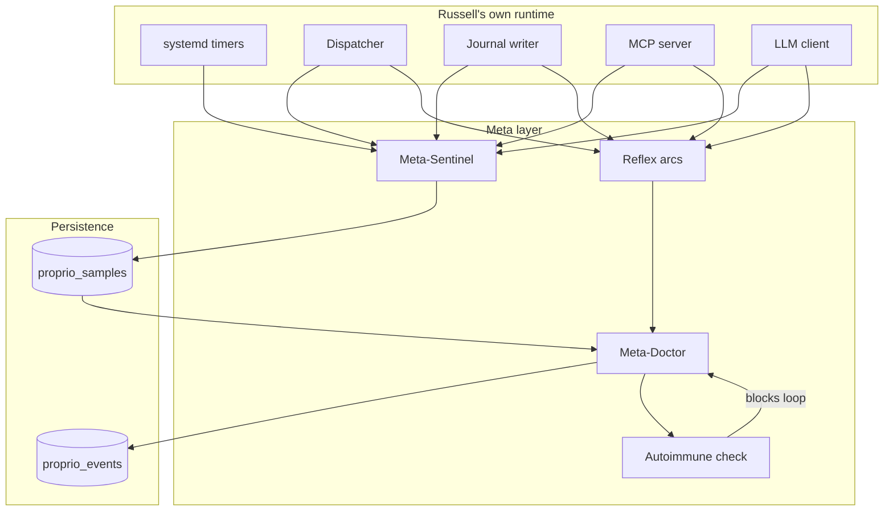

<!--
audience: contributors wiring Russell's self-health
last-reviewed: 2026-04-17
-->

# Proprioception — Russell's reflexive nervous system

> Proprioception: "the sense, stimulated by bodily movements and
> tensions, that tells an organism where its own parts are and what
> they are doing." — Oliver Sacks, paraphrased.

A doctor who cannot feel their own hand cannot safely hold a
scalpel. Russell watches itself the same way it watches the host.
This document is the **design-locked** view of that self-health
apparatus; the underlying decision is
[ADR-0015](../adr/0015-proprioception-self-health.md).

## 1. Why proprioception is first-class

Russell runs timers, subprocesses, a SQLite writer, an MCP server,
and an LLM client. Any of them can silently degrade:

- A skill subprocess hangs on a kernel call and never returns.
- The SQLite journal's WAL grows because a writer holds a txn
  open during a long LLM call.
- A systemd timer drifts because `RandomizedDelaySec=` is
  miscomputed on a laptop that suspended through its trigger.
- The MCP transport misbehaves and the agent frontend spins on
  retries.
- The LLM's local Ollama instance goes slow after a model
  reload.

Without proprioception, Russell would diagnose the host while
itself being the most degraded service on the box. With
proprioception, a degraded component is a symptom class Russell
can triage — using the very same machinery.

## 2. Components

| Name | Role |
|---|---|
| **Meta-Sentinel** | Continuous low-cost telemetry over Russell's own runtime. Same 5-min cadence as the host Sentinel; writes to `proprio_samples`. |
| **Meta-Doctor** | A Doctor run whose subject is Russell itself. Consumes self-symptoms, produces SOAP bundles with `scope: self`, appends to `proprio_events`. |
| **Reflex arcs** | Fast-path handlers for faults that cannot wait for the next cadence: a subprocess watchdog, a journal-writer deadlock guard, an MCP request-timeout aborter. |
| **Autoimmune check** | Recursion guard that prevents self-triage from invoking itself in a loop. |

## 3. Vitals (meta-Sentinel probes)

The minimum viable set. Every vital feeds an EWMA baseline and a
rule in `rules.d/self.toml`.

| Vital | Source | Default thresholds |
|---|---|---|
| `timer_drift_s` | `systemctl --user show <unit> --property=LastTriggerUSec` vs. expected cadence. | `warn` if p95 > 60s over 24h; `alert` at 300s. |
| `dispatcher_lag_ms` | Time from a skill spawn request to subprocess `exec()`. | `warn` at p95 > 250ms; `alert` at 1s. |
| `journal_writer_lag_ms` | Time enqueued → time committed, per write. | `warn` at p95 > 100ms; `alert` at 1s. |
| `journal_size_mib` | `stat journal.db` + WAL. | `warn` at 500 MiB; `alert` at 2 GiB. |
| `mcp_error_rate_pct` | Errors / total MCP requests in the last hour. | `warn` > 2%; `alert` > 10%. |
| `mcp_request_p95_ms` | In-process histogram. | `warn` > 500ms; `alert` > 5000ms. |
| `llm_rtt_ms` | `tracing` span around the Ollama call. | `warn` p95 > 4s; `alert` p95 > 15s. |
| `subprocess_zombies` | Count of `<defunct>` skill subprocesses. | `warn` > 0; `alert` > 3. |
| `unit_failed_count` | `systemctl --user --failed` filter on `russell-*`. | `warn` > 0; `alert` > 1. |
| `confirm_backlog` | Count of pending proposals older than 6h. | `warn` > 3; `alert` > 10. |

All of the above are **non-mutating**. The meta-Sentinel is
strictly observational — it uses `ps`, `/proc`, `systemctl show`,
and in-process tracing counters. No shell, no reflection magic.

## 4. Reflex arcs

Reflex arcs are the fast path. They fire when a vital crosses a
*hard* limit that makes waiting until the next Sentinel cadence
unacceptable.

| Arc | Trigger | Action | Rollback |
|---|---|---|---|
| **Skill watchdog** | Subprocess elapsed > manifest `timeout` × 1.5 | SIGTERM → wait 5s → SIGKILL; mark the run `interrupted` | none needed (process is gone) |
| **Journal writer unstick** | Writer queue non-draining for 60s | Rotate to a fresh WAL file via `PRAGMA wal_checkpoint(TRUNCATE)`; if that fails, quiesce and signal the Meta-Doctor | revert: reopen DB |
| **MCP slow-loris aborter** | Single MCP request > 30s | Cancel the request's tokio task; return `error.code: internal` | none needed |
| **LLM stall** | One Ollama call > 60s | Cancel; Doctor falls back to rule-based differential | none needed |

Every reflex arc emits a `harness.event.v1` with
`scope: self, severity: warn+`. The operator sees them in the
weekly digest under a "Russell saw itself wobble" section.

## 5. Meta-Doctor

Same supervisor as the host Doctor, same SOAP structure, same
IDRS contract. Differences:

- **Subject:** Russell, not the host.
- **Symptom source:** `proprio_events` with `severity >= warn`,
  reflex-arc firings, or the `self_triage` MCP tool.
- **Skill set:** skills under `skills/self/` with `scope: self`
  in their manifest. Examples:
  - `self/journal-compactor` — vacuums, truncates WAL on
    threshold breach. `risk: low`.
  - `self/timer-rekick` — enables / restarts a flapping user
    timer. `risk: low`.
  - `self/subprocess-reaper` — cleans up defunct children of
    the dispatcher. `risk: low`.
- **Output:** SOAP bundle under
  `~/.local/state/harness/evidence/self/<evidence_id>/`; written
  to `proprio_events`, not `events`.

## 6. Autoimmune check

The one new invariant proprioception introduces: **self-triage
must never invoke self-triage**.

Enforcement:

1. Every meta-Doctor run takes a process-wide `AutoimmuneGuard`.
2. While the guard is held, any call to `self_triage` / meta-
   Doctor returns `error.code: autoimmune_block` and journals a
   `proprio.autoimmune.blocked` event.
3. The guard is released on run completion, abnormal or
   normal. A lost guard (panic) is detected by the next
   meta-Sentinel cycle and logged as
   `proprio.autoimmune.guard_lost`; the reflex arc re-arms it.

Counter-example of what the guard prevents: a hung subprocess
triggers the watchdog reflex arc, which triggers the meta-Doctor,
which loads a skill whose own probe hangs, which would trigger
another watchdog reflex arc, which would trigger a second
meta-Doctor run. That second run is blocked; the problem
escalates to the operator via `notify-send` instead.

## 7. Integration with the rest of Russell

- **Journal schema:** `proprio_samples` and `proprio_events`
  mirror `samples` / `events` column-for-column. Queries that
  want "everything including Russell" UNION the tables; the
  default `journal_query` MCP tool excludes `scope: self`
  unless the caller opts in.
- **Baselines:** live in the same `baselines` table with a
  `scope` column.
- **Digest:** the weekly digest ends with a "Self" section;
  the operator sees a one-line summary of Russell's
  own week (drift, restarts, reflex firings).
- **MCP surface:** see
  [`mcp-surface.md`](mcp-surface.md) §3.7.

## 8. Rules file (`rules.d/self.toml`)

The default rules ship with Russell; the operator can override
per-vital thresholds by dropping a file into
`~/.config/harness/rules.d/`. Rules use the same shape as host
rules (ADR-0012), with an added `scope = "self"` field.

## 9. Checklist for new loops

When you add a new loop — a timer, a worker task, a subprocess
pool, a retry wrapper, an LLM call — before merging, answer:

- [ ] Which meta-Sentinel vital tells me this loop is healthy?
- [ ] What EWMA baseline does it feed, and which rule trips?
- [ ] What reflex arc fires if it wedges before the next
      Sentinel cadence?
- [ ] Under what condition would the meta-Doctor triage invoke
      itself, and how is that prevented by the autoimmune
      check?
- [ ] Is the new vital listed in this file's §3 and exposed via
      `self_status`?

If any checkbox stays empty, file an ADR that explains why.

## 10. Non-goals

Proprioception is about **observation and soft correction of
Russell's own runtime**. It does not:

- Modify host state outside Russell's own files / units.
- Auto-restart components without an explicit reflex arc
  definition.
- Substitute for host-level monitoring of the Linux workstation
  itself; that is the host Sentinel's job.
- Expose privileged operations; meta-Doctor skills run under the
  user bus like everything else.
