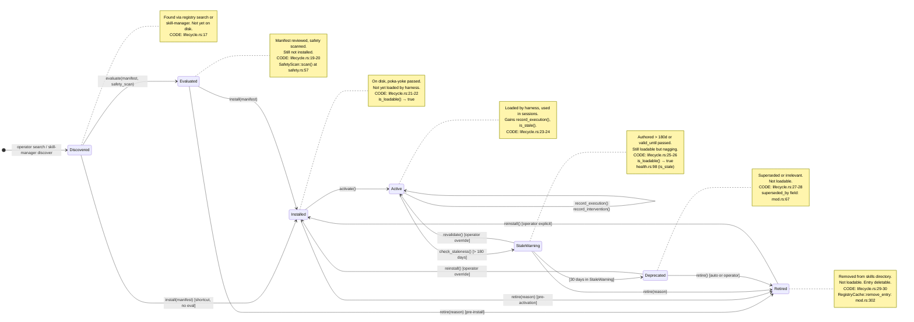
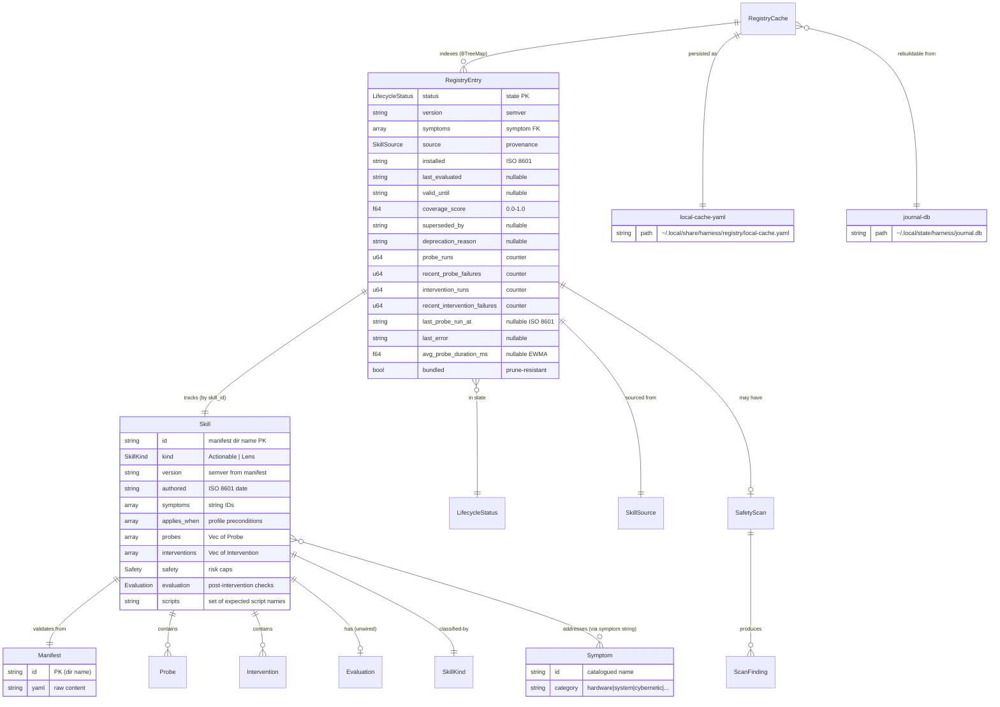

<!-- TOGAF_DOMAIN: Application Architecture -->
<!-- VERSION: 1.0.0 -->
<!-- STATUS: Active -->
<!-- LAST_UPDATED: 2026-05-15 -->

# Skill System — Entity-Relationship Diagrams

> Derived from `docs/architecture/skill-domain-model.ttl`.
> Node annotations reference `CODE_ANCHOR_GRAPH.md` entry points.
> Version: 1.0.0 | 2026-05-15

---

## ER-a: Skill Lifecycle State Machine

_Transition guards, journal events, and edge-case handling._



### Transition guards

| Transition | Guard | Journal Event | Code Locus |
|---|---|---|---|
| `→ Discovered` | Symptom catalogued (poka-yoke) | `skill.discovered` | `lifecycle.rs:63` |
| `→ Evaluated` | `SafetyScan::scan()` returns no Blocks | `skill.lifecycle.transition` | `lifecycle.rs:63`, `safety.rs:57` |
| `→ Installed` | Directory written, `parse_manifest()` succeeds | `skill.lifecycle.transition` | `lifecycle.rs:63` |
| `→ Active` | `is_loadable()` → true, probes exist | `skill.lifecycle.transition` | `lifecycle.rs:36-41` |
| `→ StaleWarning` | `is_stale(authored_date, today)` → true | `skill.stale` (warn severity) | `health.rs:98-103` |
| `→ Deprecated` | 30+ days in StaleWarning OR operator action | `skill.lifecycle.transition` | Not yet automated |
| `→ Retired` | Operator command or auto-prune | `skill.lifecycle.transition` | `mod.rs:302` |

### Edge cases

1. **Re-install after retirement**: `Retired → Installed` via `russell skill install --force`. The old `RegistryEntry` is upserted with new `installed` date and `LifecycleStatus::Installed`. Previous telemetry is reset (`probe_runs = 0`).

2. **Concurrent modification**: Two `russell chat` sessions could call `RegistryCache::with_update()` concurrently. Resolved as last-writer-wins (acceptable per JR-7 — cache is rebuildable). See `mod.rs:307-320`.

3. **Partial install recovery**: If the skills directory write fails mid-manifest, the `RegistryEntry` is not upserted. Next `russell skill list` discovers the orphaned directory. The `load_all()` function skips directories without valid `manifest.yaml` (`lib.rs:452`). Resolution: operator deletes orphan, or re-runs install.

4. **Knowledge skill lifecycle**: Lens-type skills (`SkillKind::Lens`) have no probes — they skip `Active` telemetry recording. They enter `StaleWarning` only via author-date staleness, not probe reliability. This is currently undifferentiated — Lens and Actionable skills share the same lifecycle without branching.

---

## ER-b: Registry Topology

_`RegistryEntry` ↔ `Skill` ↔ `Manifest` ↔ `SafetyScan`/`Evaluation`, including the `RegistryCache` ↔ `local-cache.yaml` ↔ `journal.db` derivation chain._



### Derivation chain & rebuild invariants (JR-7)

```
┌──────────────────────────────────────────────────────────────────────┐
│                     DERIVATION CHAIN                                 │
│                                                                      │
│  skills/ directory                    symptoms.yaml (compiled-in)    │
│       │                                       │                      │
│       ▼                                       ▼                      │
│  load_all(skills_dir) ──────────► load_symptoms_from_file()          │
│       │                                       │                      │
│       ▼                                       ▼                      │
│  Vec<Skill>                              Vec<String>                  │
│       │                                       │                      │
│       └───────────────┬───────────────────────┘                      │
│                       ▼                                              │
│              RegistryCache::load(path)  ←── local-cache.yaml (disk)  │
│                       │                                              │
│                       ▼                                              │
│         RegistryCache { skills: BTreeMap }                           │
│                       │                                              │
│              ┌────────┼────────┐                                     │
│              ▼        ▼        ▼                                     │
│        lookup()  by_status() coverage_gaps()                        │
│              │        │        │                                     │
│              ▼        ▼        ▼                                     │
│         symptom→skill  filter  uncatalogued symptoms                │
│                                                                      │
│  REBUILD: if local-cache.yaml is deleted, it can be regenerated      │
│  from load_all() + journal events. Telemetry counters are the        │
│  only state that can't be fully reconstructed (event counting is     │
│  lossy for recent_probe_failures vs probe_runs).                     │
└──────────────────────────────────────────────────────────────────────┘
```

**Rebuild procedure** (`russell skill sync`):
1. `load_all(skills_dir)` → `Vec<Skill>` (identity from manifests)
2. For each `Skill`, query `journal.db` for `action = skill_probe | skill_intervention` events
3. Reconstruct `probe_runs`, `intervention_runs`, `last_probe_run_at` from event timestamps
4. Reconstruct `recent_probe_failures` from events where `action = skill_probe` AND severity >= Alert
5. Reconstruct `avg_probe_duration_ms` from `duration_ms` field in probe events (EWMA reset)
6. `coverage_score` requires re-reading `KNOWLEDGE.md` existence (not stored in journal)
7. Upsert into fresh `RegistryCache`, save to `local-cache.yaml`

**Invariant**: After rebuild, `lookup_symptom()` and `coverage_gaps()` return identical results. Telemetry fields approximate the pre-rebuild state (EWMA resets to initial value from journal `duration_ms`).

---

## ER-c: Prompt Integration Pipeline

_Data flow from Sentinel samples → PromptRegistry templates → LlmClient port → Okapi adapter → response parsing → ACTION: protocol → Dispatcher → EvidenceBundle → journal._

```mermaid
flowchart TB
    subgraph "1. OBSERVE — Sentinel (russell-sentinel)"
        A1["Sentinel probes<br/>25 probes × 5min / extended"]
        A2["JournalWriter<br/>samples table (scope=host)"]
        A3["Baseline computer<br/>EWMA + p95 (30d)"]
        A1 --> A2
        A2 --> A3
    end

    subgraph "2. COMPOSE — Prompt Assembly (russell-meta)"
        B1["JournalReader<br/>reads samples + events"]
        B2["build_samples_table()<br/>prompt.rs:489"]
        B3["build_severity_block()<br/>prompt.rs:484"]
        B4["build_events_table()<br/>prompt.rs:533"]
        B5["PromptRegistry<br/>prompt_registry.rs:173"]
        B6["compose_templated()<br/>prompt.rs:357 ← FUTURE"]
        B7["compose_with_kask()<br/>prompt.rs:62 ← LEGACY"]
        B8["SoapPrompt { system, subjective, objective, rendered, temperature, max_tokens }<br/>client.rs:118"]
        A3 --> B1
        B1 --> B2
        B1 --> B3
        B1 --> B4
        B2 & B3 & B4 --> B5
        B5 --> B6
        B2 & B3 & B4 --> B7
        B6 --> B8
        B7 --> B8
    end

    subgraph "2a. KNOWLEDGE INJECTION"
        K1["SKill symptoms<br/>+ active symptoms (from events)"]
        K2["score_knowledge_relevance()<br/>prompt_registry.rs:442"]
        K3["score_knowledge_relevance_with_telemetry()<br/>prompt_registry.rs:494"]
        K4["select_knowledge()<br/>prompt_registry.rs:421"]
        K5["append_skill_knowledge_scored()<br/>prompt.rs:575"]
        K6["RegistryCache telemetry<br/>probe_runs, failures, EWMA"]
        K1 --> K2
        K2 --> K4
        K1 & K6 --> K3
        K3 --> K4
        K4 --> K5
        K5 --> B8
    end

    subgraph "3. CONSULT — LLM (russell-meta)"
        C1["LlmClient port<br/>client.rs:143"]
        C2["OkapiClient adapter<br/>localhost:11435"]
        C3["LlmResponse { content, model, latency_ms }<br/>client.rs:135"]
        B8 --> C1
        C1 --> C2
        C2 --> C3
    end

    subgraph "4. RESOLVE — ACTION Protocol (russell-meta)"
        D1["resolve() / resolve_with_kask()<br/>action.rs:251"]
        D2["ResolvedAction::Probe<br/>action.rs:29"]
        D3["ResolvedAction::Intervention<br/>action.rs:34"]
        D4["ResolvedAction::KaskTool<br/>action.rs:67"]
        D5["Consent gate<br/>chat consent flow"]
        C3 --> D1
        D1 --> D2
        D1 --> D3
        D1 --> D4
        D2 --> D5
        D3 --> D5
    end

    subgraph "5. DISPATCH — Execution (russell-skills)"
        E1["Dispatcher::dispatch()<br/>dispatch.rs:512"]
        E2["RunOutcome { exit_code, stdout, stderr, duration }<br/>dispatch.rs:62"]
        E3["write_evidence()<br/>dispatch.rs:672"]
        E4["Evidence bundle<br/>evidence/skill_id/step_id/ts/"]
        D5 -->|"consented"| E1
        E1 --> E2
        E2 --> E3
        E3 --> E4
    end

    subgraph "6. RECORD — Journal (russell-core)"
        F1["harness.event.v1<br/>action=skill_probe | skill_intervention"]
        F2["JournalWriter::append()<br/>journal events table"]
        F3["RegistryCache::record_execution()<br/>mod.rs:279"]
        E4 --> F1
        F1 --> F2
        F2 --> F3
    end

    subgraph "FEEDBACK LOOP"
        G1["RegistryCache telemetry<br/>closes loop to step 2a"]
        F3 --> G1
        G1 -.-> K6
    end

    %% ── Code anchor annotations ──────────────────────────────────────
    style B6 fill:#f9f,stroke:#333,stroke-width:2px,color:#000
    style B7 fill:#ddd,stroke:#999,stroke-dasharray: 5 5,color:#000

    subgraph Legend
        LEG1["⬜ Active path"] 
        LEG2["⬜ Dotted = Legacy"]
        LEG3["⬜ Pink = Future (not yet called)"]
    end
```



### Paths through the pipeline

| Phase | Legacy Path | Templated Path (Future) |
|---|---|---|
| **Caller** | `help.rs:102` `compose_and_augment_soap()` | Not yet wired |
| **Assembly** | `prompt.rs:62` `compose_with_kask()` - procedural `writeln!()` | `prompt.rs:357` `compose_templated()` - MiniJinja templates |
| **Knowledge** | `prompt.rs:663` `append_skill_knowledge()` - unconditional | `prompt.rs:575` `append_skill_knowledge_scored()` - relevance + telemetry feedback |
| **Inference hint** | None (hardcoded `temperature=0.2` in `oai_client.rs:90`) | From `[inference]` TOML header in `.md.j2` template |
| **Template** | Inline `writeln!()` strings | `soap.md.j2` / `chat_objective.md.j2` |

### KNOWLEDGE.md injection & relevance scoring intersection

```
                              ┌──────────────────┐
                              │  Active Symptoms  │
                              │  (from events:    │
                              │   warn/alert/crit)│
                              └────────┬─────────┘
                                       │
                    ┌──────────────────┼──────────────────┐
                    ▼                  ▼                  ▼
           ┌───────────────┐  ┌───────────────┐  ┌───────────────┐
           │  Skill A       │  │  Skill B       │  │  Skill C       │
           │  symptoms:     │  │  symptoms:     │  │  symptoms:     │
           │  [vram_oom]    │  │  [llm_slow]    │  │  [clock_skew]  │
           │  relevance:0.2 │  │  relevance:0.8 │  │  relevance:0.0 │
           └───────┬───────┘  └───────┬───────┘  └───────┬───────┘
                   │                  │                  │
    ┌──────────────┼──────────────────┼──────────────────┼──────────────┐
    │              ▼                  ▼                  ▼              │
    │  select_knowledge(slots, budget_tokens=3000)                      │
    │                                                                   │
    │  1. Sort by relevance (desc)                                      │
    │  2. Greedy fit within 3000 token budget                           │
    │  3. If skill_registry provided:                                   │
    │     relevance *= reliability_modifier                             │
    │     - reliable skills (failure < 10%): up to 1.2× boost          │
    │     - unreliable (failure > 50%): 0.7× floor                     │
    └──────────────────────────────────────────────────────────────────┘
                                       │
                                       ▼
                              ┌──────────────────┐
                              │  System prompt    │
                              │  = JACK_PERSONA   │
                              │  + Skill_B_KNOWL  │
                              │  + (within budget)│
                              └──────────────────┘
```

### Current gap: `compose_templated()` is defined but unused

The function at `prompt.rs:357` is fully implemented and tested but not called by any production code path. `compose_and_augment_soap()` in `help.rs:102` always calls `compose_with_kask()`. Migration requires:

1. Construct `PromptRegistry` at `russell-cli` startup (replace `prompt.rs:48-56` `compose()` wrapper)
2. Pass `RegistryCache` reference through `help.rs` → `compose_and_augment_soap()` 
3. Switch call from `compose_with_kask()` to `compose_templated()`
4. Verify output shape matches (both produce `SoapPrompt` with same fields)
5. Remove dead `compose_with_kask()` code
