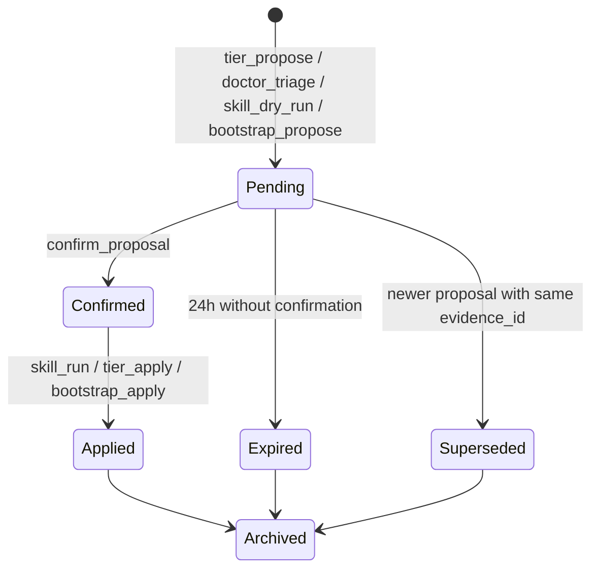

<!-- STATUS: Archived -->
<!-- LAST_UPDATED: 2026-04-18 -->

> **Archived.** See [`README.md`](README.md) for provenance. The
> subject of this document is outside the MVP boundary; this
> full design returns to active status when its phase opens.

<!--
audience: contributors extending Russell's MCP surface
last-reviewed: 2026-04-17
-->

# MCP surface

Russell is an MCP server over stdio
([ADR-0003](../adr/deferred/0003-mcp-transport.md)). Agent frontends —
Claude Desktop, Roo/Cline in VSCodium, Zed — call its tools to
inspect the machine, propose interventions, and confirm
them.

This file is the catalogue. When you add, rename, or rebalance a
tool, update this file in the same PR (required by
[`AGENTS.md`](../../AGENTS.md) §7).

## 1. Design rules

1. **Every tool declares a `risk_band`** at registration, even
   read-only ones (they declare `none`).
2. **Every tool with `risk_band >= medium`** routes through the
   propose / `confirm_proposal` pattern. There is no one-shot
   mutating tool.
3. **Every tool's input / output is snapshot-tested** with
   `insta`.
4. **Every tool has a matching CLI subcommand** unless an ADR
   justifies the asymmetry.
5. **All tool names are snake_case**, verbs first:
   `skill_run`, not `run_skill`.
6. **All tool I/O is JSON Schema validated** before dispatch.

## 2. Error surface

All tools return either a typed success payload or an error
object of the shape:

```json
{
  "error": {
    "code": "kill_switch_engaged | dry_run_only | unknown_symptom |
             manifest_id_rejected | precondition_failed |
             proposal_expired | proposal_not_found | rate_limited |
             internal",
    "message": "human-readable",
    "evidence_ref": "optional path or null"
  }
}
```

MCP-level protocol errors (malformed request) are separate and
follow the MCP spec.

## 3. Tool catalogue

Tools are grouped by concern. Risk bands follow
[`../standards/safety.md`](../standards/safety.md).

### 3.1 Status and journal (read-only)

| Tool | Risk | Summary |
|---|---|---|
| `system_status` | none | Profile summary, kill-switch state, last Sentinel cycle, active pauses, honeymoon remaining. |
| `journal_query` | none | Typed query over `events` / `samples` with time-range, severity, category filters. Pagination via opaque cursor. |
| `baseline_read` | none | EWMA mean / variance and p50/p95/p99 for a given probe. |
| `profile_read` | none | The current `profile.json` (or a named subset). |
| `list_skills` | none | Loaded skill manifests with their symptom lists, risk caps, and versions. |
| `list_timers` | none | All Russell systemd units and their last / next run. |
| `digest_render` | none | Render the weekly digest into Markdown + HTML; returns paths, not content. |
| `evidence_read` | none | Fetch a SOAP bundle's rendered Markdown and a file manifest. |
| `self_status` | none | Proprioception snapshot (see [`proprioception.md`](proprioception.md)): meta-Sentinel vitals, dispatcher lag, journal-writer lag, LLM RTT. |

### 3.2 Sentinel and probes (read-only; side-effect-free on host)

| Tool | Risk | Summary |
|---|---|---|
| `sentinel_run_once` | none | Fire the Sentinel ad-hoc and return the new sample set. |
| `probe_run` | none | Run a single named probe from a loaded manifest with `capture: stdout`. Refuses any probe with `risk != none`. |

### 3.3 Tier orchestration

| Tool | Risk | Summary |
|---|---|---|
| `tier_dry_run` | none | Produce the full would-do log for tier I / II / III without any mutation. |
| `tier_propose` | none | Like `tier_dry_run` but persists a proposal ID so it can be confirmed later. |
| `tier_apply` | varies | Applies a previously-proposed tier run. **Requires prior `confirm_proposal`** for any step whose own risk band is `medium+`. |

`tier_apply` without a prior proposal that covers it is
rejected with `error.code: proposal_not_found`.

### 3.4 Doctor and skills

| Tool | Risk | Summary |
|---|---|---|
| `doctor_triage` | none | Given a symptom class (and optional `--note`), assemble the SOAP bundle, run probes, and produce a proposal. Never executes `medium+` interventions. |
| `skill_dry_run` | none | Run a specific skill manifest against a synthetic or current symptom, emitting the would-do log only. |
| `skill_run` | varies | Execute a skill proposal. **Requires** a proposal ID; interventions above the effective cap are deferred to `confirm_proposal`. |
| `skill_verify_idempotent` | low | Run a skill twice and diff end-state; fails loudly if non-idempotent. |

### 3.5 Safety and governance

| Tool | Risk | Summary |
|---|---|---|
| `confirm_proposal` | medium | The andon cord. Takes an `evidence_id`, optionally a `step` (default: all eligible), and commits to the enumerated interventions. Refused if kill switch engaged or proposal expired. |
| `pause_module` | low | `russell pause` equivalent: records a cooldown for the named module until an RFC3339 timestamp. |
| `resume_module` | low | Clear a cooldown. |
| `kill_switch` | medium | Create or remove the global disable file. Creation is auto-allowed; removal is always `requires_confirmation`. |

### 3.6 Bootstrap and profile

| Tool | Risk | Summary |
|---|---|---|
| `bootstrap_probe` | none | Run the Probe phase (read-only hardware inventory) and return the findings. |
| `bootstrap_propose` | none | Compose a regimen proposal from probe output + hardware catalog. |
| `bootstrap_apply` | medium | Install timers, units, and `profile.json`. Requires `confirm_proposal`. First run resets the honeymoon window. |

### 3.7 Proprioception

| Tool | Risk | Summary |
|---|---|---|
| `self_triage` | none | Run a meta-Doctor pass against Russell itself; produces a SOAP bundle with `scope: self`. |
| `self_reflex_reset` | low | Re-arm a reflex arc (e.g. after a watchdog-killed subprocess); idempotent. |

See [ADR-0015](../adr/0015-proprioception-self-health.md) and
[`proprioception.md`](proprioception.md) for the failure classes.

## 4. Proposal lifecycle



The proposal's `evidence_id` is the shared handle across this
lifecycle. `evidence_read` always resolves, regardless of state.

## 5. Example interaction

An agent observes the user saying "ollama keeps timing out." The
flow is:

1. Agent → `doctor_triage({ symptom: "ollama_cuda_error", note:
   "user-reported ollama timeouts" })`.
2. Russell runs all `risk: none` probes in the `gpu-doctor`
   manifest, writes the SOAP bundle, returns the `evidence_id`
   and the proposed plan.
3. Agent renders the plan to the user, who approves.
4. Agent → `confirm_proposal({ evidence_id, step:
   "restart_ollama" })`.
5. Russell runs `restart_ollama` (risk: low, idempotent,
   rollback: none_needed), runs the `ollama_smoke` evaluation,
   appends events to the journal, returns success.
6. Later, agent → `evidence_read({ evidence_id })` to render
   the bundle in a chat window.

Steps 1, 4, and 6 are MCP tool calls. Step 5 is entirely
inside Russell: the LLM was asked only to rank IDs; the agent
and the user held the andon cord.

## 6. Backward compatibility

- Adding a new tool is non-breaking. Changing a tool's
  name, input schema, output schema, or risk band is
  breaking and requires both an ADR and a
  `BREAKING CHANGE:` footer
  ([`../standards/commits.md`](../standards/commits.md) §6).
- Deprecated tools live alongside their replacement for one
  minor release, emit a `deprecated` flag in their
  response, and are removed in the next minor release.
