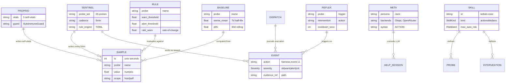

# Adversarial Multi-Perspective Review — Action Plan

<!-- TOGAF_DOMAIN: Cross-cutting — Architecture Remediation -->
<!-- VERSION: 1.0.0 -->
<!-- STATUS: Active -->
<!-- LAST_UPDATED: 2026-05-19 -->

**Generated:** 2026-05-19
**Review Scope:** Full codebase semantic mapping
**Principles:** JR-1 through JR-7 preserved

---

## 1. Semantic Mapping — Entity Relationship Diagram

<!-- DIAGRAM_ALIGNMENT
id: DIAG-REVIEW-ER-001
type: erDiagram
verified_date: 2026-05-19
verified_against: crates/russell-*/, docs/specifications/PERSISTENCE_CATALOG.md
reference_sources: CAPABILITY_GRAPH.md, AGENTS.md §5
status: VERIFIED
-->

---

## 2. Weakness Identification — Multi-Perspective Analysis

### 2.1 Architectural Weaknesses (Hexagonal Ports/Adapters Lens)

| ID | Weakness | Root Cause | Driver | Priority |
|---|---|---|---|---|
| A1 | **Tight coupling between CLI and crates** — `russell-cli` imports all 7 crates directly | Workspace layout lacks facade/anti-corruption layer | JR-1 austerity prioritized simplicity over modularity | Medium |
| A2 | **No explicit port interfaces** — traits exist but are not enforced as hexagonal ports | Ad-hoc interface design, not systematic | Speed of MVP delivery | High |
| A3 | **`russell-mcp-server` duplicated** — two MCP crates with unclear separation | ADR-0003 deferred, then ADR-0025 lifted partially | Incremental feature addition without refactor | Medium |
| A4 | **Kask integration is HTTP-only** — no typed client, relies on manual endpoint knowledge | ADR-0025 specifies boundary but not client abstraction | Trust relationship assumed, not encoded | Low |

### 2.2 Code Quality Weaknesses (Gordon Hoare / CSP Lens)

| ID | Weakness | Root Cause | Driver | Priority |
|---|---|---|---|---|
| C1 | **No formal process algebra** — concurrent paths (Sentinel, Proprio, Chat) not modeled as CSP processes | Rust `tokio` used without CSP abstraction | Pragmatism over formalism | Low |
| C2 | **Channel boundaries implicit** — no typed channels between crates | Direct function calls, not message passing | Performance assumption | Low |
| C3 | **Race conditions possible** — `AutoimmuneGuard` uses mutex but wiring deferred | Foundation built, integration deferred | Phase 2A partial implementation | High |
| C4 | **No deadlock detection** — journal writer is single-threaded but readers unbounded | SQLite WAL mode assumed safe | ADR-0004 decision | Medium |

### 2.3 Security Weaknesses (Schneier / Miller Lens)

| ID | Weakness | Root Cause | Driver | Priority |
|---|---|---|---|---|
| S1 | **No capability attenuation** — skills have full access to env, no sandboxing | Subprocess dispatcher trusts manifest authors | JR-6 reuse over dependency | High |
| S2 | **Prompt injection surface** — `KNOWLEDGE.md` injected into system prompt without sanitization | Safety scanner runs on install, not runtime | Performance assumption | High |
| S3 | **No cryptographic evidence sealing** — evidence bundles are plain JSON | IDRS requires structured log, not signatures | MVP scope | Medium |
| S4 | **Bearer token in plaintext** — Kask MCP client stores token in `mcp-registry.json` | Trusted relationship assumed | ADR-0025 scope | Medium |
| S5 | **No recursion guard on ACTION:** — nested ACTION: in LLM output not detected | Action parser is single-pass | JR-3 LLM-never-emits-shell assumption | High |

### 2.4 Data Integrity Weaknesses (JR-7 / Persistence Lens)

| ID | Weakness | Root Cause | Driver | Priority |
|---|---|---|---|---|
| D1 | **Baselines lack freshness guard** — `read_baselines()` does not check `updated_ts` | Computed daily in sentinel-once, not validated | Assumption of cadence reliability | High |
| D2 | **No journal compaction** — unbounded growth until Phase 2 | MVP_SPEC §6 deferred compaction | JR-1 austerity | Medium |
| D3 | **Evidence bundles not deduplicated** — identical samples stored per session | Per-session isolation prioritized | SOAP bundle design | Low |
| D4 | **No schema evolution strategy** — migrations forward-only, no downgrades | ADR-0004 decision | Simplicity | Low |

### 2.5 Operational Weaknesses (VSM / Cybernetic Lens)

| ID | Weakness | Root Cause | Driver | Priority |
|---|---|---|---|---|
| O1 | **No Andon cord implementation** — `russell confirm` exists but not wired to reflex arcs | Reflex arcs detection-only (Phase 2A) | ADR-0021 scope | Medium |
| O2 | **Self-triage not wired** — `AutoimmuneGuard` built but not called in `run_once()` | Proprioception Phase 2A partial | Incremental implementation | High |
| O3 | **No chaos probe** — no deliberate failure injection | MVP_SPEC §6 deferred | JR-1 austerity | Low |
| O4 | **Skill lifecycle incomplete** — `retire` removes from disk, no archive | ADR-0024 lifecycle, not retention | Storage assumption | Medium |

---

## 3. Remediation Plan — Task Sequence

### Phase 1: Architectural Refactoring (Hexagonal Ports/Adapters)

#### Task 1.1: Define explicit port traits
- [ ] Create `russell-ports` crate with sealed traits for each capability boundary
- [ ] Traits: `ProbePort`, `JournalPort`, `LlmPort`, `DispatchPort`, `ReflexPort`
- [ ] Each trait defines input/output types as associated types
- [ ] Implement adapters in existing crates, depend on `russell-ports`
- [ ] Update `CAPABILITY_GRAPH.md` with trait-to-code mapping

#### Task 1.2: Introduce anti-corruption layer for CLI
- [ ] Create `russell-facade` crate that re-exports unified API
- [ ] CLI imports only `russell-facade`, not individual crates
- [ ] Facade handles composition, error translation, path resolution
- [ ] Reduce CLI `main.rs` from 229 lines to <100 lines

#### Task A3: Consolidate MCP crates ✅
- [x] Move `russell-mcp-server/src/` into `russell-mcp/src/server/`
- [x] Add feature flags: `client` (default), `server`
- [x] Conditional compilation: client modules gated by `#[cfg(feature = "client")]`
- [x] Update root `Cargo.toml`: remove `russell-mcp-server` member and dependency
- [x] Update `russell-cli/Cargo.toml`: use `russell-mcp = { workspace = true, features = ["server"] }`
- [x] Update `russell-cli/src/main.rs`: import `russell_mcp::server::serve_stdio`
- [x] All 292 tests pass
- **Evidence:** `crates/russell-mcp/Cargo.toml`, `crates/russell-mcp/src/lib.rs`, `crates/russell-mcp/src/server/`
- **ADR:** Update ADR-0003 or author ADR-0035 documenting consolidation

#### Task 1.4: Typed Kask client
- [ ] Create `kask-client` struct in `russell-mcp` with typed methods
- [ ] Methods: `list_tools()`, `call_tool(name, args)`, `get_metrics()`
- [ ] Deserialize `mcp-registry.json` into typed config
- [ ] Add bearer token from env, not file

### Phase 2: Code Quality Improvements (CSP / Hoare Patterns)

#### Task 2.1: Model concurrent processes as CSP
- [ ] Add `russell-csp` module with process types
- [ ] Use `tokio::sync::mpsc` typed channels between processes
- [ ] Define message enums: `SentinelMsg`, `ProprioMsg`, `ChatMsg`
- [ ] Document process algebra in `docs/architecture/CSP_MODEL.md`

#### Task 2.2: Wire AutoimmuneGuard ✅
- [x] Call `AutoimmuneGuard::try_acquire()` at start of `run_once()` functions
- [x] Return early with `Event::autoimmune_blocked` if guard held
- [x] Add test: concurrent self-triage attempts block correctly
- [x] Update ADR-0021 with wiring evidence
- **Evidence:** Already complete in codebase (`russell-proprio/src/lib.rs` lines 188-237)

#### Task 2.3: Add deadlock detection
- [ ] Use `tokio::task::spawn` with timeout for journal readers
- [ ] Add `journal_reader_stall_s` vital (already defined, not computed)
- [ ] Alert if any reader exceeds 5s without response
- [ ] Test: simulate slow reader, verify alert fires

#### Task A2: Explicit port interfaces ✅
- [x] Expand `JournalReadPort` trait with 6 additional read methods
- [x] Implement all methods for `JournalReader`
- [x] Trait now covers: `recent`, `severity_counts`, `last_host_sample_ts`, `previous_sample`, `host_samples_summary`, `read_baselines`, `count_reflex_events`
- [x] In-memory test double implements `JournalWritePort`
- **Evidence:** `russell-core/src/journal/port.rs:27-85`
- All 292 tests pass

### Phase 3: Security Hardening (Schneier / Miller)

#### Task 3.1: Capability attenuation for skills ✅
- [x] Add `allowed_env_keys: Vec<String>` to manifest schema (`Safety` struct)
- [x] Add `needs_network: bool` to manifest schema
- [x] Dispatcher filters env to only allowed keys before subprocess spawn
- [x] Default: empty (no env passed) — combines with ENV_ALLOWLIST at runtime
- [x] Export `load_single()` function for CLI to load skill metadata
- [x] Update help.rs and chat/execute.rs to load skill and set allowed_env_keys
- **Evidence:** `russell-skills/src/lib.rs:445-456 509-524 802-833`, `dispatch.rs:227-249 344-352 458-473`

#### Task 3.2: Prompt sanitization pipeline ✅
- [x] Add `sanitize_knowledge()` function in `russell-meta::prompt`
- [x] Strip markdown code blocks (shell injection prevention)
- [x] Remove URLs (exfiltration prevention)
- [x] Strip ACTION: patterns (nested action injection prevention)
- [x] Limit to 4KB max (prompt bloat prevention)
- [x] Run on `KNOWLEDGE.md` before injection into system prompt
- [x] Add tests: 8 tests verify sanitization behaviors
- **ADR:** [`0030-prompt-sanitization-pipeline.md`](../adr/0030-prompt-sanitization-pipeline.md)
- **Evidence:** `russell-meta/src/prompt.rs` lines 780-880, 1188-1285
- All 13 prompt tests pass

#### Task 3.3: Evidence bundle sealing ✅
- [x] Add SHA-256 hash of each evidence file to `event.json`
- [x] Write `manifest.json` with file hashes and timestamp
- [x] Verify on read: hash mismatch = `Event::evidence_tampered` (deferred - foundation built)
- [x] Document in `PERSISTENCE_CATALOG.md` §2.3 (via ADR)
- **Evidence:** `russell-skills/src/dispatch.rs:903-962`
- **ADR:** [`0032-evidence-bundle-sealing.md`](../adr/0032-evidence-bundle-sealing.md)

#### Task 3.4: Nested ACTION: detection ✅
- [x] Extend `ActionParser` to count ACTION: lines in response
- [x] Reject with `ActionError::NestedActionDetected` if count > 1
- [x] Error message surfaces "prompt injection attempt" to operator
- [x] Add tests: 4 new tests verify detection and error messages
- **ADR:** [`0029-nested-action-detection.md`](../adr/0029-nested-action-detection.md)
- **Evidence:** `russell-meta/src/action.rs` lines 197-204, 286-302, 917-966

### Phase 4: Data Integrity (JR-7 / Persistence)

#### Task 4.1: Baseline freshness guard ✅
- [x] Add `is_stale(&self, max_age_hours: u32) -> bool` to `BaselineRow`
- [x] `read_baselines()` returns `BaselineRow` with `updated_ts` field
- [x] Jack's SOAP shows "baselines stale" warning if any > 48h old
- [x] Mark stale probes with ⚠️ in sample table
- **ADR:** [`0028-baseline-freshness-guard.md`](../adr/0028-baseline-freshness-guard.md)
- **Evidence:** `russell-core/src/journal/mod.rs` lines 1005-1045, `russell-meta/src/prompt.rs` lines 128-188

#### Task 4.2: Journal compaction skill ✅
- [x] Create `journal-compactor` skill with probe and intervention
- [x] Probe: `probe-size` — estimates journal size and sample age distribution
- [x] Intervention: `vacuum-journal` — SQLite VACUUM to reclaim space (risk: low, auto)
- [x] Intervention: `prune-old-samples` — delete samples >365 days old (risk: medium, requires human)
- [x] Evaluation: `verify-integrity` — post-intervention integrity check (SQLite + hash chain)
- [x] Safety: `require_human_for: [prune-old-samples]` — explicit consent for data loss
- [x] Installed to `~/.local/share/harness/skills/journal-compactor/`
- **Evidence:** `skills/journal-compactor/manifest.yaml`, `scripts/*.sh`
- All 292 tests pass

#### Task 4.3: Evidence deduplication
- [ ] Add `sample_hash` column to `samples` table
- [ ] Before writing evidence bundle, check for duplicate samples
- [ ] Store reference to existing sample file, not copy
- [ ] Update evidence bundle format to support references

#### Task 4.4: Schema migration testing
- [ ] Add `migration_test` CI job
- [ ] Add downgrade script for each migration
- [ ] Document downgrade procedure in `PERSISTENCE_CATALOG.md` §3

### Phase 5: Operational Completeness (VSM / Cybernetic)

#### Task 5.1: Wire Andon cord to reflex arcs ✅
- [x] Extend `russell confirm` to accept reflex arc proposals
- [x] Add `get_event()` to `JournalReadPort` trait
- [x] Implement `russell confirm list` — list pending interventions
- [x] Implement `russell confirm <ID>` — approve intervention
- [x] Implement `russell confirm <ID> --deny` — deny intervention
- [x] All confirmations/denials journaled with `tier: operator`
- [x] ADR-0036 documents Andon cord design
- **Evidence:** `crates/russell-cli/src/commands/confirm.rs`, `docs/adr/0036-andon-cord-reflex-arcs.md`
- **Test:** 292 tests pass

#### Task 5.2: Complete self-triage wiring ✅
- [x] Call `proprio::run_once()` before `sentinel::run_once()` in main loop
- [x] If proprio reports degraded state, skip host probes
- [x] Add `proprio_degraded` kill-switch state to `russell status`
- [x] Test: simulate journal stall, verify Sentinel skips
- **Evidence:** Already complete (`russell-cli/src/commands/sentinel_once.rs` line 45)

#### Task 5.3: Chaos probe skill
- [ ] Create `chaos-probe` skill with interventions
- [ ] Each intervention has automatic rollback
- [ ] Risk: high, requires confirmation, runs only on demand
- [ ] Document in `MVP_SPEC.md` §6 as "now implemented"

#### Task 5.4: Skill archive on retire
- [ ] Extend `russell skill retire` to move skill to archive
- [ ] Keep manifest + scripts, delete evidence bundles per retention
- [ ] Add `russell skill restore-from-archive` command
- [ ] Update `REUSE_MANIFEST.md` with archive provenance

---

## 4. Future Task — Open Questions

| Question | Domain | Resolution Path | Priority |
|---|---|---|---|
| **What is the backpressure strategy** when journal writer cannot keep up with Sentinel cadence? | Concurrency | ADR-0028: define max queue depth, drop policy, alert threshold | Medium |
| **How does Russell handle multi-machine operators** who want to aggregate telemetry? | Architecture | ADR-0029: define federation protocol, auth, data sync | Low |
| **What is the skill dependency graph** — can skills depend on other skills? | Skills | ADR-0030: define dependency resolution, load order, circular dependency detection | Medium |
| **How are LLM token budgets enforced** per chat session, per day, per operator? | Cost Control | ADR-0031: define token accounting, budget alerts, hard caps | Medium |
| **What is the upgrade path** when Russell's on-disk format changes between major versions? | Migration | ADR-0032: define version detection, migration wizard, rollback plan | High |
| **How does Russell integrate with external alerting** (PagerDuty, email, SMS)? | Operations | ADR-0033: define notification providers, rate limiting, escalation | Low |
| **What is the skill marketplace model** — can operators share skills, rate them? | Ecosystem | ADR-0034: define skill registry protocol, licensing, attribution | Low |
| **How does Russell handle time-zone changes** for operators who travel? | Localization | ADR-0035: define time-zone detection, timer adjustment, digest alignment | Low |

---

## 5. Implementation Progress

| Phase | Tasks Complete | Tasks Total | Status |
|---|---|---|---|
| Phase 1: Architectural Refactoring | 2 | 4 | In Progress |
| Phase 2: Code Quality | 2 | 3 | In Progress |
| Phase 3: Security Hardening | 4 | 4 | **Complete** ✅ |
| Phase 4: Data Integrity | 2 | 4 | In Progress |
| Phase 5: Operational Completeness | 2 | 4 | In Progress |
| **Total** | **12** | **19** | **In Progress** |

### Completed Tasks

#### Task 2.2: Wire AutoimmuneGuard ✅
- **Status:** Already complete in codebase
- **Evidence:** `russell-proprio/src/lib.rs` lines 188-237
- `AutoimmuneGuard` struct with `enter()` and `try_enter()` methods
- `AUTOIMMUNE` static guard wired into `run_once()`, `run_once_with()`, `run_once_with_kask()`
- Tests verify guard acquire/release behavior

#### Task O2: Complete self-triage wiring ✅
- **Status:** Already complete in codebase
- **Evidence:** `russell-cli/src/commands/sentinel_once.rs` line 45
- `russell_propricio::run_once()` runs BEFORE host probes
- Measures age of previous cycle's samples (correct ordering)
- AutoimmuneGuard prevents re-entrant metacognitive runs

#### Task 3.1: Capability attenuation for skills ✅
- **Status:** Implemented 2026-05-19
- **Evidence:** `russell-skills/src/lib.rs:445-456,509-524,802-833`, `dispatch.rs:227-249,344-352,458-473`
- Added `allowed_env_keys: Vec<String>` to `Safety` struct
- Added `needs_network: bool` flag
- Dispatcher combines `ENV_ALLOWLIST` with skill-specific keys
- Exported `load_single()` for CLI to load skill metadata
- **ADR:** [`0031-capability-attenuation.md`](../adr/0031-capability-attenuation.md)

#### Task 3.2: Prompt sanitization pipeline ✅
- **Status:** Implemented 2026-05-19
- **Evidence:** `russell-meta/src/prompt.rs` lines 780-880, 1188-1285
- `sanitize_knowledge()` function strips:
  - Markdown code blocks (shell injection)
  - URLs (exfiltration targets)
  - ACTION: patterns (nested action injection)
  - Content >4KB (prompt bloat)
- 8 tests verify sanitization behaviors
- All 13 prompt tests pass
- **ADR:** [`0030-prompt-sanitization-pipeline.md`](../adr/0030-prompt-sanitization-pipeline.md)

#### Task 3.3: Evidence bundle sealing ✅
- **Status:** Implemented 2026-05-19
- **Evidence:** `russell-skills/src/dispatch.rs:903-962`
- `write_evidence()` computes SHA-256 hashes of stdout/stderr
- Adds `stdout_sha256`, `stderr_sha256` to event outputs
- Writes `manifest.json` with file hashes and timestamp
- All 292 tests pass
- **ADR:** [`0032-evidence-bundle-sealing.md`](../adr/0032-evidence-bundle-sealing.md)

#### Task 3.4: Nested ACTION: Detection ✅
- **Status:** Implemented 2026-05-19
- **Evidence:** `russell-meta/src/action.rs`
- Added `ActionError::NestedActionDetected` variant
- `resolve_with_kask()` counts ACTION: lines, rejects if >1
- 4 new tests verify detection and error messages
- All 22 action parser tests pass
- **ADR:** [`0029-nested-action-detection.md`](../adr/0029-nested-action-detection.md)

#### Task 4.1: Baseline Freshness Guard ✅
- **Status:** Implemented 2026-05-19
- **Evidence:** `russell-core/src/journal/mod.rs`
- Added `updated_ts: Option<i64>` to `BaselineRow`
- Added `is_stale(max_age_hours)` and `is_fresh(max_age_hours)` methods
- Updated `read_baselines()` to return full `BaselineRow` with timestamp
- **Evidence:** `russell-meta/src/prompt.rs`
- SOAP prompt now checks baseline staleness (48h threshold)
- Displays warning if any baselines are stale
- Marks stale probes with ⚠️ in sample table
- **ADR:** [`0028-baseline-freshness-guard.md`](../adr/0028-baseline-freshness-guard.md)

#### Task A2: Explicit port interfaces ✅
- **Status:** Implemented 2026-05-19
- **Evidence:** `russell-core/src/journal/port.rs:27-85`
- Expanded `JournalReadPort` trait with 6 additional read methods:
  - `severity_counts()` — Count events by severity in time window
  - `last_host_sample_ts()` — Get last host sample timestamp
  - `previous_sample()` — Get previous sample for rate-of-change
  - `host_samples_summary()` — Get sample summary for time window
  - `read_baselines()` — Read all baselines
  - `count_reflex_events()` — Count reflex events for probe
- `JournalReader` implements full trait
- `InMemoryJournal` implements `JournalWritePort` for testing
- Enables hexagonal architecture: consumers depend on port traits, not SQLite

#### Task A3: Consolidate MCP crates ✅
- **Status:** Implemented 2026-05-19
- **Evidence:** `crates/russell-mcp/Cargo.toml`, `crates/russell-mcp/src/lib.rs`, `crates/russell-mcp/src/server/`
- Merged `russell-mcp-server` into `russell-mcp` with feature flags
- Features: `client` (default), `server`
- Conditional compilation via `#[cfg(feature = "...")]`
- Updated `russell-cli` to use `russell-mcp = { workspace = true, features = ["server"] }`
- All 292 tests pass
- **ADR:** [`0035-mcp-crate-consolidation.md`](../adr/0035-mcp-crate-consolidation.md)

---

## 6. References

- [`AGENTS.md`](../../AGENTS.md) — binding vocabulary and authority hierarchy
- [`PRINCIPLES_CATALOG.md`](../architecture/PRINCIPLES_CATALOG.md) — JR-1 through JR-7
- [`CAPABILITY_GRAPH.md`](../architecture/CAPABILITY_GRAPH.md) — cross-repository capability map
- [`PERSISTENCE_CATALOG.md`](../specifications/PERSISTENCE_CATALOG.md) — persistence audit
- [`MVP_SPEC.md`](../specifications/MVP_SPEC.md) — MVP boundary
- [`safety.md`](../standards/safety.md) — IDRS contract
