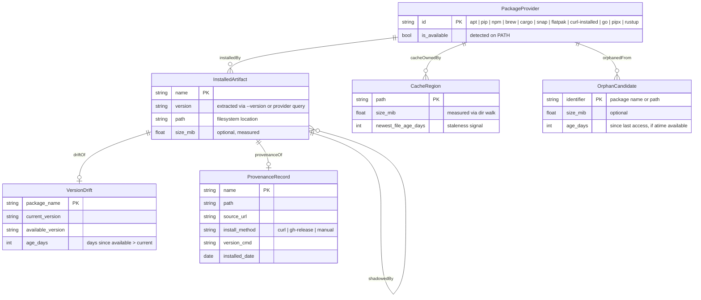

<!-- TOGAF_DOMAIN: Application -->
<!-- VERSION: 0.1.0 -->
<!-- STATUS: Draft -->
<!-- LAST_UPDATED: 2026-05-06 -->


# Task 1 — Domain Model: RDF Graph and Entity-Relationship Diagram

## Design Principle

Every entity in this model satisfies JR-1: Russell can observe it
without privilege escalation or host mutation. If Russell cannot
read it, it does not exist in the model.

The Tool/Connector separation (per `audit-crate.md`) applies at
the model boundary:
- **Tools** transform raw observations into domain entities (parsing, classifying, correlating).
- **Connectors** acquire raw observations from the host (syscalls, subprocess stdout, HTTP responses).

The domain model itself is pure — it describes *what* Russell
knows, not *how* it acquires knowledge.

---

## 1. Entity Classes

### `harness:PackageProvider`

A source from which software artifacts are installed on the host.

| Instance | Detection (Connector) | Available signal |
|---|---|---|
| `apt` | `which apt` | upgradable count, autoremovable count |
| `pip` | `which pip` or `which pip3` | outdated count, installed list |
| `pipx` | `which pipx` | outdated apps, list |
| `npm` | `which npm` | global outdated count |
| `brew` | `which brew` | outdated count, leaves |
| `cargo` | `ls ~/.cargo/bin` | installed binary count |
| `snap` | `which snap` | held revisions count |
| `flatpak` | `which flatpak` | unused runtimes count |
| `curl-installed` | `provenance.toml` entries | stale/missing count |
| `go` | `which go` | `~/go/bin` binary count |
| `rustup` | `which rustup` | toolchain count, outdated |

### `harness:InstalledArtifact`

A named thing on disk with a version, installed by a provider.
Russell observes: name, version (if extractable), install path,
provider, size on disk (if measurable).

### `harness:CacheRegion`

A directory whose contents are pruneable without functional loss.
Russell observes: path, size in MiB, owning provider, last-modified
timestamp of newest file.

| Known regions | Provider | Typical path |
|---|---|---|
| pip cache | pip | `~/.cache/pip` |
| npm cache | npm | `~/.npm/_cacache` |
| cargo registry | cargo | `~/.cargo/registry/cache` |
| HuggingFace hub | pip/curl | `~/.cache/huggingface` |
| brew downloads | brew | `$(brew --cache)` |
| apt archives | apt | `/var/cache/apt/archives` |
| Ollama models | curl-installed | `~/.ollama/models` |
| Podman layers | podman | `~/.local/share/containers` |

### `harness:OrphanCandidate`

A file, directory, or package with no live reverse-dependency.
Russell observes: path or package name, owning provider, size,
age since last access (if available via `atime`).

### `harness:VersionDrift`

A tuple: (package_name, current_version, available_version, age_days).
Russell observes this by comparing installed version against
provider's reported latest.

### `harness:ProvenanceRecord`

Origin metadata for a binary that lacks package-manager tracking.
Russell reads (never writes) from `provenance.toml`. Fields:
name, path, source URL, install method, version command,
version pattern, install date, GitHub release repo (optional).

---

## 2. Predicates (RDF Triples)

```turtle
@prefix harness: <https://russell.local/ontology/> .

# Installation relationship
harness:InstalledArtifact harness:installedBy harness:PackageProvider .

# Dependency graph (within a single provider)
harness:InstalledArtifact harness:dependsOn harness:InstalledArtifact .

# Cache ownership
harness:CacheRegion harness:cacheOwnedBy harness:PackageProvider .

# Orphan provenance
harness:OrphanCandidate harness:orphanedFrom harness:PackageProvider .

# Version drift attachment
harness:VersionDrift harness:driftOf harness:InstalledArtifact .

# Provenance attachment
harness:ProvenanceRecord harness:provenanceOf harness:InstalledArtifact .

# Cross-provider conflict (shadowing)
harness:InstalledArtifact harness:shadowedBy harness:InstalledArtifact .
```

### Example Triples

```turtle
# numpy installed via pip shadows apt's python3-numpy
_:numpy-pip a harness:InstalledArtifact ;
    harness:installedBy _:pip ;
    harness:shadowedBy _:numpy-apt .

_:numpy-apt a harness:InstalledArtifact ;
    harness:installedBy _:apt .

# pip cache region
_:pip-cache a harness:CacheRegion ;
    harness:cacheOwnedBy _:pip .

# zed binary with provenance
_:zed a harness:InstalledArtifact ;
    harness:installedBy _:curl-installed .

_:zed-provenance a harness:ProvenanceRecord ;
    harness:provenanceOf _:zed .

# Stale snap revision as orphan
_:firefox-rev-4231 a harness:OrphanCandidate ;
    harness:orphanedFrom _:snap .
```

---

## 3. Mermaid ER Diagram



<!-- DIAGRAM_ALIGNMENT
id: DIAG-DISKPKG-001
type: erDiagram
verified_date: 2026-05-13
verified_against: DISK_PKG_HYGIENE_SPEC.md §2 (entity classes); PRINCIPLES_CATALOG.md JR-1 (austerity)
reference_sources: 00-semantic-decomposition.md (root causes); PERSISTENCE_CATALOG.md (journal schema)
status: VERIFIED
-->

<!-- DIAGRAM_ALIGNMENT
id: DIAG-DISKPKG-001
type: erDiagram
verified_date: 2026-05-13
verified_against: DISK_PKG_HYGIENE_SPEC.md §2 (entity classes); PRINCIPLES_CATALOG.md JR-1 (austerity)
reference_sources: 00-semantic-decomposition.md (root causes); PERSISTENCE_CATALOG.md (journal schema)
status: VERIFIED
-->

---

## 4. Cardinality Notes

| Predicate | From | To | Cardinality | Rationale |
|---|---|---|---|---|
| `installedBy` | InstalledArtifact | PackageProvider | N:1 | Each artifact has exactly one canonical provider |
| `dependsOn` | InstalledArtifact | InstalledArtifact | N:M | Transitive dependency graph |
| `cacheOwnedBy` | CacheRegion | PackageProvider | N:1 | Each cache dir belongs to one provider |
| `orphanedFrom` | OrphanCandidate | PackageProvider | N:1 | Orphan was originally from one provider |
| `driftOf` | VersionDrift | InstalledArtifact | 1:1 | One drift record per artifact at any point in time |
| `provenanceOf` | ProvenanceRecord | InstalledArtifact | 1:1 | One provenance record per tracked binary |
| `shadowedBy` | InstalledArtifact | InstalledArtifact | N:M | Multiple providers can shadow each other |

---

## 5. Model Constraints (JR-1 Compliance)

The model is **minimal**:

1. No entity for packages Russell cannot enumerate (e.g., manually compiled binaries without `provenance.toml` entries are invisible until the operator registers them).
2. No `dependsOn` edges for providers that don't expose dependency graphs (pip's dependency info is unreliable; we record it as best-effort).
3. `shadowedBy` requires cross-provider correlation — expensive, so it's a Phase 3 Doctor assessment, not a Phase 2 probe.
4. `CacheRegion` instances are a fixed, curated list (not auto-discovered). Adding a new cache region requires a code change.

---

## 6. Connector Boundary: Jack / Kask Integration

When Russell needs to **share** this domain model with an external
system (Jack's LLM consultation, or the hKask platform), the
connector boundary is:

| Direction | Connector | Data shape |
|---|---|---|
| Russell → Jack (LLM) | Ollama / OpenRouter HTTP POST | SOAP bundle with samples serialized as Objective text |
| Russell → hKask (MCP) | MCP tool response | JSON conforming to `harness.event.v1` or sample arrays |
| Jack → Russell | LLM response text | Unstructured assessment (Russell does NOT parse for commands — JR-3) |

The **tool** that prepares data for these connectors is the SOAP
bundle composer (`russell-meta::soap`). It transforms domain
samples into prompt text. The **connector** is the HTTP client
that transmits it. These are never conflated in the same module.
