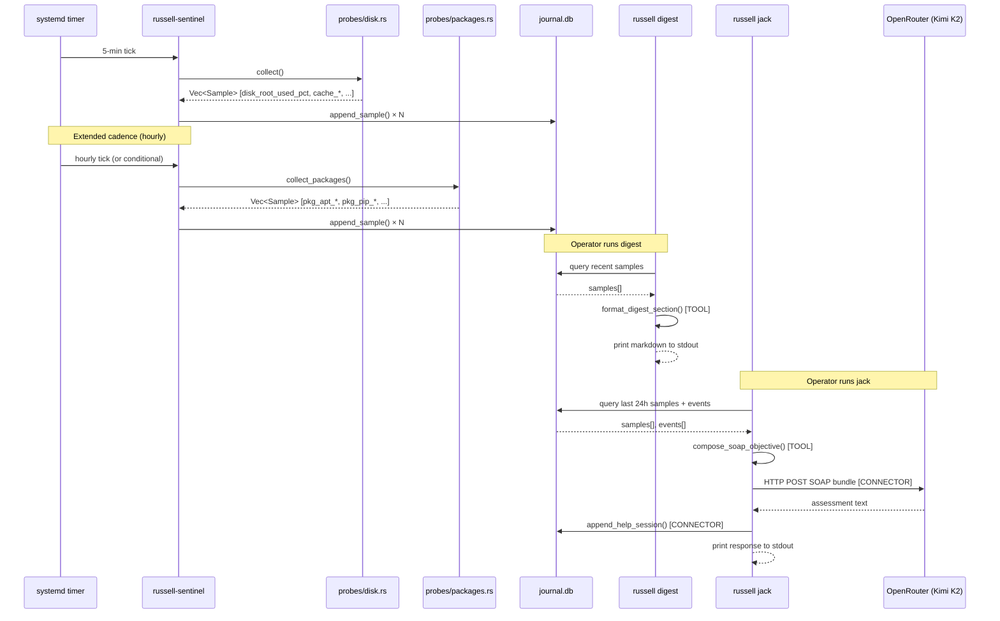

# Task 5 — Integration: Wiring into Russell's Hexagonal Architecture

## Crate Topology Mapping

| Layer | Crate | New additions |
|---|---|---|
| **Domain ports** | `russell-core` | `provider.rs` — `ProviderHealth` trait; `Sample` type (moved from sentinel) |
| **Infrastructure adapters** | `russell-sentinel` | `probes/disk.rs`, `probes/packages.rs`, `probes/provenance.rs` |
| **Orchestration** | `russell-sentinel` | `collect()` extended; `collect_extended()` for longer-cadence probes |
| **Persistence** | `russell-core::journal` | No new tables — `samples` table already accepts arbitrary probe names |
| **Surface (read)** | `russell-cli` | `russell digest` already summarizes samples; no new verbs |
| **Surface (LLM)** | `russell-doctor` | SOAP Objective includes disk/pkg samples; Jack assesses them |

---

## Tool/Connector Architecture Map

The audit-crate.md discipline applied to the full data flow:

```
┌─────────────────────────────────────────────────────────────────┐
│                        TOOL LAYER (pure)                         │
├─────────────────────────────────────────────────────────────────┤
│ compute_used_pct()      parse_apt_upgradable()                  │
│ bytes_to_mib()          parse_pip_outdated_json()               │
│ extract_version()       compare_versions()                      │
│ compose_soap_objective()  format_digest_section()               │
└──────────────────────────────┬──────────────────────────────────┘
                               │ formed data
┌──────────────────────────────▼──────────────────────────────────┐
│                     CONNECTOR LAYER (I/O)                        │
├─────────────────────────────────────────────────────────────────┤
│ statvfs("/")            Command::new("apt")                     │
│ read_dir(cache_path)    Command::new("pip")                     │
│ read_provenance_toml()  github_releases_api()                   │
│ JournalWriter::append_sample()                                  │
│ OpenRouter HTTP POST (Doctor → LLM)                             │
│ MCP tool response (Russell → Kask)                              │
└─────────────────────────────────────────────────────────────────┘
```

Key insight: **The LLM call is a connector, not a tool.** It
transfers formed data (the SOAP bundle) across a network boundary.
The SOAP bundle composition is the tool. These must never be
conflated in the same function.

Similarly: **The MCP response is a connector.** When Kask queries
Russell for machine status, the MCP handler is a connector that
transfers journal data outward. The query logic (selecting relevant
samples, formatting) is the tool.

---

## Data Flow: Probe → Journal → Surface

### Standard Cadence (5 minutes) — Disk Probes

```
Timer fires (systemd)
  → russell sentinel-once
    → probes::collect()
      → memory::collect()     [existing: mem, swap, loadavg]
      → disk::collect()       [NEW: statvfs, cache sizes, tmp age]
    → JournalWriter::append_sample() for each Sample
    → proprio::check()        [self-vital]
```

### Extended Cadence (hourly/daily) — Package Probes

```
Timer fires (hourly — russell-sentinel-extended.timer per ADR-0019)
  → russell sentinel-once --extended
    → probes::collect_extended()
      → packages::collect_packages()
        → for each provider in registry:
            → provider.is_available()?
            → provider.observe()
              → run_cmd() [connector]
              → parse_*() [tool]
      → provenance::observe()
        → read_provenance_toml() [connector]
        → run_version_cmd() [connector]
        → extract_version() [tool]
        → check_github_latest() [connector, rate-limited]
        → compare_versions() [tool]
    → JournalWriter::append_sample() for each Sample
```

### Surface: Digest

```
russell digest --since-hours 24
  → JournalReader::query_samples(since, probes=["disk_*", "pkg_*", "cache_*"])
    → format_digest_section() [tool: format samples into markdown]
  → print to stdout
```

### Surface: Jack (LLM Connector)

```
russell jack --note "disk seems full"
  → JournalReader::query_samples(last_24h)  [connector: read from journal]
  → compose_soap_objective(samples, events) [tool: form the SOAP bundle]
  → OpenRouter POST with zdr:true           [connector: transfer to LLM]
  → print response                          [connector: transfer to operator]
  → JournalWriter::append_help_session()    [connector: persist evidence]
```

The Jack/Kask connector carries disk and package health data to
the LLM for assessment. Jack can then reason about:
- "Your root partition is 87% full and cache_huggingface_mib is 45 GiB — consider pruning old models"
- "You have 12 apt packages pending update and 3 provenance-tracked binaries are stale"
- "snap has 8 disabled revisions consuming ~4 GiB — safe to remove with `snap remove --revision`"

Jack **recommends**. He does not execute. The operator acts.

---

## Sequence Diagram



---

## Phase 2 Rules Integration

When the rule engine lands, thresholds are defined in operator-owned
TOML files under `~/.config/harness/rules.d/`:

### `rules.d/disk-hygiene.toml`

```toml
[disk_root_used_pct]
warn = 80.0
alert = 90.0
crit = 95.0

[inode_root_used_pct]
warn = 80.0
alert = 90.0
crit = 95.0

[cache_total_mib]
warn = 50000.0
alert = 150000.0

[tmp_age_max_days]
warn = 30.0
alert = 90.0
```

### `rules.d/pkg-ecosystem.toml`

```toml
[pkg_apt_upgradable_count]
warn = 20.0
alert = 100.0

[pkg_apt_autoremovable_count]
warn = 10.0
alert = 50.0

[pkg_pip_outdated_count]
warn = 10.0
alert = 50.0

[pkg_provenance_missing_count]
warn = 1.0
alert = 3.0

[pkg_provenance_stale_count]
warn = 3.0
alert = 10.0

[pkg_snap_held_revisions]
warn = 5.0
alert = 15.0
```

Until the rule engine exists, these thresholds are informational —
surfaced in digest and available to Jack in the SOAP Objective.
The rule engine evaluates them and emits `harness.event.v1` records
with appropriate severity when breached.

---

## No New CLI Verbs Required

The existing six MVP verbs are sufficient:

| Verb | How it uses disk/pkg data |
|---|---|
| `russell status` | Shows probe count, last run time |
| `russell list` | Shows recent events (including threshold breaches when rules land) |
| `russell digest` | Summarizes disk/pkg samples in markdown sections |
| `russell sentinel-once` | Fires disk probes (and extended probes if cadence met) |
| `russell jack` | Includes all samples in SOAP Objective for LLM assessment |
| `russell profile` | Unchanged |

No `russell disk` or `russell packages` verb. JR-1: when in doubt, cut.
