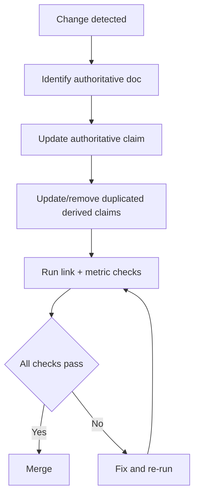

# Russell Documentation Standards

<!-- TOGAF_DOMAIN: Cross-cutting — Governance -->
<!-- VERSION: 1.0.0 -->
<!-- STATUS: Active -->
<!-- LAST_UPDATED: 2026-04-18 -->

This standard defines the **minimum enforceable process** for keeping
Russell's documentation corpus small, high-signal, and aligned with
the code. It is deliberately modelled on UDQL's documentation
standard (see `Clones/UDQL/docs/standards/DOCUMENTATION_STANDARDS.md`)
but sized for a single-host terrier.

Russell's corpus will never be large. That is a feature, not a gap.

## 1. Authority Hierarchy

When claims conflict, precedence is:

1. [`AGENTS.md`](../../AGENTS.md) — orientation and the binding
   vocabulary.
2. [`docs/README.md`](../README.md) — portal and critical set.
3. [`docs/status/CONSOLIDATED-STATUS.md`](../status/CONSOLIDATED-STATUS.md)
   — where we actually are.
4. [`docs/specifications/MVP_SPEC.md`](../specifications/MVP_SPEC.md)
   — the pinned MVP boundary.
5. [`docs/architecture/PRINCIPLES_CATALOG.md`](../architecture/PRINCIPLES_CATALOG.md).
6. The relevant ADR under [`docs/adr/`](../adr/).

## 2. Critical Set Policy

Only documents listed in [`docs/README.md`](../README.md) §2 are
**authoritative**. Everything else is supplementary.

- Supplementary documents may add detail.
- Supplementary documents must not contradict authoritative claims.
- If a PR cannot reconcile a contradiction in the same changeset,
  the stale duplicated claim must be removed.

## 3. Mandatory Update Gate (per change)

Before merge, all four checks must pass:

1. **Authority-first update** — the authoritative doc is edited
   before any derived docs.
2. **Link integrity** — no broken internal links in edited
   authoritative docs (verify with the project's link checker
   — see §12).
3. **Metric integrity** — any quoted counts in edited docs match
   current command output.
4. **Diagram integrity** — changed Mermaid diagrams retain valid
   `DIAGRAM_ALIGNMENT` metadata (see §4).



<!-- DIAGRAM_ALIGNMENT
id: DIAG-DOCSTD-GATE-001
type: flowchart
verified_date: 2026-04-18
verified_against: docs/README.md
reference_sources: UDQL DOCUMENTATION_STANDARDS.md §3
status: VERIFIED
-->

## 4. Mermaid Alignment Rule

Every Mermaid diagram in authoritative docs must include a
verification comment immediately below the fence:

```markdown
<!-- DIAGRAM_ALIGNMENT
id: DIAG-XXX-NNN
type: flowchart | sequenceDiagram | stateDiagram-v2 | gantt
verified_date: YYYY-MM-DD
verified_against: path/to/source
reference_sources: Author (Year) | upstream ref
status: VERIFIED | STALE | DEPRECATED
-->
```

`id` prefix convention: `DIAG-<topic>-<label>-<NNN>` where `<topic>`
is a short screaming-snake tag (`DOCSTD`, `ARCH`, `PRINCIPLES`,
`JOURNAL`, `DOCTOR`).

## 5. Artifact Lifecycle

Russell is small; every file in the corpus is reachable from the
portal or is archived. There are no orphans.

### 5.1 When a document is superseded

1. Move it to [`docs/archive/`](../archive/).
2. Add a one-line provenance entry to
   [`docs/archive/README.md`](../archive/README.md) citing the
   superseding document and date.
3. Search the repo for references to the old path and update
   them (or remove them if they were stale).

### 5.2 When a decision is deferred

ADRs whose subject is explicitly outside the MVP go under
[`docs/adr/deferred/`](../adr/deferred/). They retain their
`Status: Accepted` line and remain load-bearing for their
future phase. Being deferred is not a demotion; it is a
sequencing fact.

### 5.3 Agent obligations

Every contributor (human or AI) who creates, modifies, or
supersedes a doc must, in the same changeset:

| Obligation | Failure mode if skipped |
|---|---|
| Archive superseded docs | Stale docs contradict active corpus |
| Update directory READMEs | New docs are undiscoverable |
| Fix dangling references | Broken links erode trust |
| Update portal counts in `docs/README.md` | Stale counts misrepresent corpus state |
| Retain the `last_updated` frontmatter | Freshness tracking breaks |

## 6. Audience-First Principle

Every document declares its intended audience. Controlled
vocabulary:

| Value | Meaning |
|---|---|
| `operators` | The human running Russell on their workstation |
| `developers` | Contributors writing Rust |
| `contributors` | New / occasional contributors |
| `architects` | Structural decision-makers |
| `agents` | AI agents reading Russell to act on its behalf |

Documents without `audience` fail the update gate.

## 7. Voice and Register

Russell documents use three registers. Pick the one that matches
the document's primary reader-task; mix only at section
boundaries.

| Register | Used in | Characteristics | Example |
|---|---|---|---|
| **Narrative-metaphorical** | THE_JACK, PRINCIPLES_CATALOG intros, THE_PRIMER | Conversational, uses the Jack Russell / Jack McFarland metaphor | "Jack is small but mighty. He watches the house, not the street." |
| **Formal-architectural** | Specifications, architecture docs, ADRs | Precise, RFC 2119 keywords, traceable | "The journal MUST refuse unknown schema versions per ADR-0006." |
| **Procedural-operational** | Guides, runbooks, CONTRIBUTING | Action-oriented, "you" direct | "Run `cargo test --workspace` before you push." |

## 8. Freshness

- Every document has `last_updated: YYYY-MM-DD` in its frontmatter.
- 0–90 days: fresh. No action.
- 91–180 days: review. Verify or reconfirm explicitly.
- 181+ days: stale. Update, archive, or explicitly exempt.

## 9. Diataxis Quadrants

| Diataxis | Reader mode | Russell documents |
|---|---|---|
| **Tutorials** | Learning | `docs/architecture/THE_JACK.md` |
| **How-to guides** | Doing | `CONTRIBUTING.md`, `docs/operations/*.md` |
| **Reference** | Checking facts | `docs/adr/`, `docs/specifications/`, `docs/architecture/overview.md` |
| **Explanation** | Understanding | `docs/architecture/PRINCIPLES_CATALOG.md`, `cybernetic-health-harness.md` |

When adding a document, name its quadrant. A document that
tries to be all four serves none.

## 10. Frontmatter Template

Every new authoritative document begins with:

```yaml
---
title: "Short Title Case"
audience: [operators, developers]
last_updated: YYYY-MM-DD
togaf_phase: "Preliminary | A | B | C | D | E | F | G | H | Requirements Management"
version: "MAJOR.MINOR.PATCH"
status: "Active | Proposed | Superseded | Deprecated"
---
```

Plus an HTML block for CI tooling:

```markdown
<!-- TOGAF_DOMAIN: <domain> -->
<!-- VERSION: MAJOR.MINOR.PATCH -->
<!-- STATUS: Active -->
<!-- LAST_UPDATED: YYYY-MM-DD -->
```

## 11. TOGAF Integration

Russell uses a minimal TOGAF mapping; the full matrix lives at
[`docs/architecture/TOGAF_TRACEABILITY_MATRIX.md`](../architecture/TOGAF_TRACEABILITY_MATRIX.md).

Every document carries one `togaf_phase` tag. Valid values:

- `Preliminary` — standards, policies, principles.
- `A` — Vision. `cybernetic-health-harness.md`, PRINCIPLES_CATALOG.
- `B` — Business. (not applicable to a single-user tool; skip.)
- `C` — Information Systems. Specifications, data architecture.
- `D` — Technology. Tech choices, runtime, dependencies.
- `E/F` — Migration. Plans, roadmaps.
- `G` — Governance. Status, operations.
- `H` — Change Management. ADRs.
- `Requirements Management` — cross-cutting specifications.

## 12. Verification Commands

```sh
# All active docs (excluding archive).
find docs -type f -name '*.md' -not -path 'docs/archive/*' | wc -l

# Archive docs.
find docs/archive -type f -name '*.md' | wc -l

# Active ADRs.
find docs/adr -maxdepth 1 -type f -name '*.md' | wc -l

# Deferred ADRs.
find docs/adr/deferred -maxdepth 1 -type f -name '*.md' | wc -l

# Check frontmatter `last_updated` is present.
for f in $(find docs -name '*.md' -not -path 'docs/archive/*'); do
  head -20 "$f" | grep -q last_updated || echo "MISSING last_updated: $f"
done
```

## 13. References

- The Open Group. (2022). *TOGAF Standard, 10th Edition*.
- Procida, D. (2021). *Diátaxis: A systematic approach to technical
  documentation authoring*. https://diataxis.fr/
- Hackos, J. (1994). *Managing Your Documentation Projects*. Wiley.
- Gentle, A. (2017). *Docs Like Code*. Just Write Click.
- UDQL. (2026). *Discourse Documentation Standards v9.0.0*.
  `Clones/UDQL/docs/standards/DOCUMENTATION_STANDARDS.md`.
