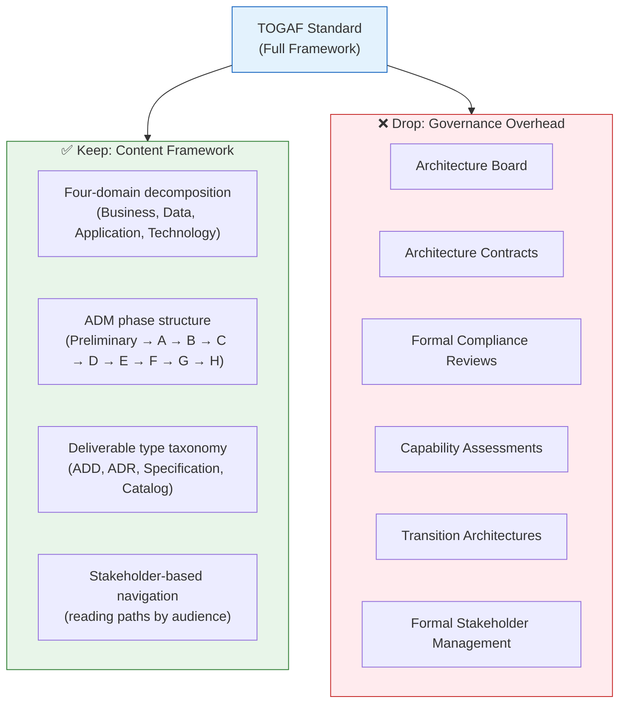

<!-- TOGAF_DOMAIN: Cross-cutting -->
<!-- VERSION: 0.11.0 -->
<!-- STATUS: Active -->
<!-- LAST_UPDATED: 2026-05-09 -->


# TOGAF-Lite for Open Source

**A reusable pattern for applying TOGAF's content framework to open-source documentation without governance overhead**

---

## Table of Contents

1. [Pattern Summary](#1-pattern-summary)
2. [Problem](#2-problem)
3. [Context](#3-context)
4. [Forces](#4-forces)
5. [Solution](#5-solution)
6. [How Peripheral Does It](#6-how-peripheral-does-it)
7. [Documentation Philosophy](#7-documentation-philosophy)
8. [Adaptation Principles](#8-adaptation-principles)
9. [Template: Minimal TOGAF-Lite Documentation Structure](#9-template-minimal-togaf-lite-documentation-structure)
10. [Known Uses](#10-known-uses)
11. [Consequences](#11-consequences)
12. [Related Patterns](#12-related-patterns)
13. [References](#13-references)

---

## 1. Pattern Summary

| Field | Value |
|-------|-------|
| **Pattern Name** | TOGAF-Lite for Open Source |
| **Classification** | Documentation Architecture Pattern |
| **Intent** | Apply TOGAF's structural organizing principles to open-source project documentation without adopting TOGAF's enterprise governance overhead |
| **Also Known As** | Lightweight ADM, TOGAF-as-Skeleton |
| **Applicability** | Open-source projects with 20+ documentation files, multi-audience documentation needs, or complex system architectures |

---

## 2. Problem

Open-source projects need documentation structure, but they face a difficult choice:

- **No structure:** Documentation grows organically. Files accumulate in a flat directory. READMEs become catch-all documents. New contributors can't find anything. The project lead can't maintain consistency. Documentation quality degrades as the project scales.

- **Full enterprise architecture framework (TOGAF, Zachman, DODAF):** These frameworks provide comprehensive documentation taxonomies, but they require governance boards, architecture contracts, formal review processes, stakeholder committees, and compliance audits. A single-developer or small-team open-source project cannot sustain this overhead. The cure is worse than the disease.

The gap between "no structure" and "enterprise framework" is where most open-source projects live — and suffer.

---

## 3. Context

This pattern applies when:

- The project has grown beyond what a single README can document (typically >10 documentation files)
- Multiple audiences need different information (developers, operators, architects, contributors)
- The system has enough architectural complexity that decisions need recording and tracing
- The project lacks the resources for full enterprise architecture governance
- Documentation maintainers (human or AI) need a predictable structure to navigate and update

This pattern does NOT apply when:

- The project is small enough for a single README (< 5 documentation files)
- All readers have the same information needs (single audience)
- The project operates within an organization that already mandates a specific framework
- Documentation is auto-generated from code (API docs, rustdoc, JSDoc)

---

## 4. Forces

The following forces are in tension:

| Force | Description |
|-------|-------------|
| **Discoverability** | Readers must find the right document quickly |
| **Maintainability** | Documentation must evolve with the system without becoming stale |
| **Scalability** | Structure must accommodate growth from 10 to 100+ documents |
| **Overhead** | Every structural element must justify its existence for a small team |
| **Traceability** | Decisions, requirements, and specifications should link to each other |
| **Onboarding** | New contributors must understand the documentation layout without prior training |
| **AI Agent Navigation** | AI coding assistants increasingly navigate project documentation and need predictable structure |

---

## 5. Solution

**Use TOGAF's content framework (ADM phases, deliverable types, domain decomposition) as a structural organizing principle — without the governance processes.**

TOGAF provides two separable components:

1. **Content Framework** — A taxonomy for organizing architectural content into domains (Business, Data, Application, Technology), phases (Preliminary → A → B → C → D → E → F → G → H), and deliverable types (Architecture Definition Documents, Architecture Decision Records, specifications, catalogs).

2. **Governance Processes** — Architecture boards, architecture contracts, compliance reviews, formal stakeholder management, capability assessments, transition architectures.

The TOGAF-Lite pattern adopts (1) and discards (2).



*Figure 1: TOGAF-Lite decomposition — retain structural insights, discard governance ceremony.*

<!-- DIAGRAM_ALIGNMENT
id: DIAG-PATTERN-001
type: flowchart
verified_date: 2026-05-11
verified_against: docs/architecture/DOC-ARCHITECTURE.md §11
reference_sources: REF-TOGAF-10 (The Open Group 2022)
status: VERIFIED
-->

### 5.1 Core Insight

> "TOGAF is designed to be adapted to the organization's needs."
> — *TOGAF Standard, 10th Edition*, §2.5[^togaf]

TOGAF itself authorizes pragmatic adaptation. The key insight is that TOGAF's *taxonomy* (how it classifies content) is valuable independently of TOGAF's *process* (how it governs that content). The taxonomy provides:

- A principled decomposition of what requires documentation into domains
- A natural ordering of documentation from vision → architecture → implementation → operations
- A vocabulary for document types that readers can learn once and apply to any TOGAF-Lite project
- A framework for traceability: requirements → architecture → decisions → implementation

### 5.2 The Four-Domain Mapping

TOGAF's four architecture domains map naturally to software projects:

| TOGAF Domain | Software Project Meaning | Typical Documents |
|-------------|------------------------|-------------------|
| **Business Architecture** (Phase B) | What the system *does* — business logic, workflows, use cases | Business rules, workflow descriptions, domain models |
| **Data Architecture** (Phase C) | What the system *stores and represents* — data models, storage | Schema documentation, data flow diagrams, persistence design |
| **Application Architecture** (Phase C) | How the system *structures itself* — components, interfaces, APIs | Component maps, API documentation, interface contracts |
| **Technology Architecture** (Phase D) | What the system *runs on* — infrastructure, tooling, deployment | Deployment guides, CI/CD configuration, dependency management |

This decomposition works because any software system — from a browser extension to a distributed database — has business logic, data management, component structure, and infrastructure concerns.

---

## 6. How Peripheral Does It

The Peripheral project applies the TOGAF-Lite pattern to organize a documentation corpus of **~35 active files** across 10 directories, governing a system of **17 crates in a single Rust workspace** (`crates/*`).[^peripheral_docs] The project is a distributed, all-Rust agentic harness for large-scale social simulation. The following sections describe the concrete implementation.

### 6.1 Directory-to-Phase Mapping

Peripheral maps each documentation directory to one or more TOGAF ADM phases:[^peripheral_docarch]

| Directory | TOGAF Phase | Content |
|-----------|-------------|---------|
| `docs/standards/` | Preliminary | 3 standards: documentation standards, coding standards, principles catalog (13 principles) |
| `docs/architecture/` | Phases A–D | Architecture Vision, four domain documents (Business, Data, Application, Technology), consolidated Architecture Specification (3290 lines), Reference Models (50+ citations, 8 Mermaid diagrams), Diagrams Index, TOGAF-Lite pattern |
| `docs/architecture/adr/` | Phase H | 3 accepted Architecture Decision Records (platform dispatch, jury formation, precedent storage) |
| `docs/specifications/` | Requirements Management | Architecture Requirements Specification (functional and non-functional requirements) |
| `docs/plans/` | Phases E–F | Implementation continuation prompt (handoff document) |
| `docs/operations/` | Phase G | Deployment guide, User guide |
| `docs/status/` | Phase G | Consolidated project status (single source of truth for crate and documentation status) |
| `docs/reviews/` | Phase G | 2 adversarial architecture reviews (world-building coherence, Cockburn/Fowler lens) |
| `docs/research/` | Supporting corpus | 1 research document (improv orchestration protocol) |
| Git history | Architecture Repository | Canonical archive of record. Recover retired docs via `git log --all --diff-filter=D -- <path>` + `git show <sha>:<path>`. A local `docs/archive/` directory has gitignore status; maintainers may use it for personal reference. |

### 6.2 Audience-Based Navigation Paths

Peripheral's documentation portal (`docs/README.md` v2.0.0) defines five navigation paths based on reader role:[^peripheral_docs]

| Audience | Path Through Documentation |
|----------|---------------------------|
| **Newcomers** | Architecture Vision → Business Architecture → Project Status → AGENTS.md |
| **Developers** | AGENTS.md → Application Architecture → Architecture Specification → ADR Index → Coding Standards → Deployment Guide |
| **Architects** | Architecture Vision → Requirements Specification → Reference Models → Principles Catalog → Adversarial Reviews → ADR Index |
| **Operators** | Deployment Guide → User Guide → Technology Architecture |
| **Researchers** | Reference Models → Research Documents → Architecture Vision → Business Architecture |

Each path provides a curated reading order that matches the reader's information needs, preventing the "wall of links" problem where the project presents all documents equally.

### 6.3 ADR Convention

Peripheral uses Architecture Decision Records (ADRs) as lightweight replacements for TOGAF Architecture Contracts.[^nygard] Each ADR captures:

- **Status** — Proposed, Accepted, Deprecated, Superseded
- **Context** — The situation that motivated the decision
- **Decision** — The decision and its rationale
- **Consequences** — Trade-offs accepted
- **TOGAF Phase** — Which ADM phase this decision relates to

Peripheral maintains **3 accepted ADRs**, collectively serving the change management function of TOGAF Phase H:

| ADR | Decision | Date |
|-----|----------|------|
| ADR-001 | Platform Dispatch Scope — minimal `PlatformCore` trait, per-platform dispatch | 2026-04-14 |
| ADR-003 | Jury Formation and Deliberation — panel formation, precedent fast path, independence | 2026-04-15 |
| ADR-004 | Precedent Storage and Retrieval — precedent as canvas state, embedding-based retrieval | 2026-04-15 |

### 6.4 Documentation Standards

A formal documentation standard (`docs/standards/DOCUMENTATION_STANDARDS.md`) governs all documents:[^peripheral_docstandards]

- Required metadata headers (Domain, Version, Last-Updated, Status, TOGAF Phase, Audience)
- Semantic versioning adapted for documentation (MAJOR.MINOR.PATCH)
- Mermaid diagram conventions with DIAGRAM_ALIGNMENT verification metadata
- Citation format: APA 7th edition
- Cross-reference conventions (relative paths, section references)
- README-driven navigation (every directory has a README portal)
- Document lifecycle: Draft → Active → Deprecated → Superseded → Archived
- Quality gates per Hackos: audience identification, status marker, version required before publication

### 6.5 TOGAF Alignment Note

Peripheral's documentation portal includes an explicit TOGAF Alignment Note that maps each ADM phase to the documents that fulfill it, demonstrating ADM cycle coverage:

| ADM Phase | Peripheral Document(s) |
|-----------|-------------------|
| Preliminary | Principles Catalog (13 principles), Documentation Standards, Coding Standards, TOGAF-Lite |
| A — Vision | Architecture Vision (v1.0.0) |
| B — Business | Business Architecture (v1.0.0) |
| C — Data | Data Architecture (v1.0.0) |
| C — Application | Application Architecture (v1.0.0), Architecture Specification (v2.0.0) |
| D — Technology | Technology Architecture (v1.0.0) |
| E–F — Migration | Continuation Prompt, Plans directory |
| G — Governance | Project Status, Deployment Guide, User Guide, 2 Adversarial Reviews |
| H — Change Management | 3 accepted ADRs |
| Central — Requirements | Architecture Requirements Specification (v1.0.0) |
| Reference Models | Reference Models (50+ citations, 8 diagrams) |

---

## 7. Documentation Philosophy

The TOGAF-Lite pattern provides *structural rigor* — where to put things and how to name them. But structure alone does not produce good documentation. This section articulates two complementary philosophical influences that shape how Peripheral writes documentation, not just where it files it.

### 7.1 Documentation as Conversation (Anne Gentle)

Anne Gentle's work on community-driven documentation[^gentle-docs] and docs-as-code[^gentle-code] informs the following principles:

| Principle | Application in Peripheral |
|-----------|-------------------------|
| **Documentation is a conversation, not a monument** | Documents are living artifacts. The archive exists precisely so that active documents never become museums of obsolete information. |
| **Every document needs a clear audience and a clear "why this matters"** | The `Audience` metadata field (§8.3) and reading paths (§6.2) exist because of this principle. If you can't name the reader, don't write the document. |
| **Lightweight authoring over heavy tooling** | Plain Markdown, Mermaid diagrams, YAML frontmatter. No proprietary doc toolchain. A contributor with a text editor can update any document in the corpus. |
| **Contributor accessibility** | If a new contributor can't understand how to update a doc in 5 minutes, the process is too heavy. The templates in §8 exist to lower that barrier. |
| **"Getting started" paths matter as much as reference** | The Newcomer reading path (§6.2) and THE_PRIMER exist because onboarding documentation is not optional — it is the first impression of the project's intellectual seriousness. |
| **TOGAF provides rigor; the writing provides warmth** | Structure without voice is a filing cabinet. Peripheral's vision and primer documents use narrative voice deliberately; specifications use formal voice deliberately. The register matches the reader's needs. |

### 7.2 Information Process Maturity (Dr. JoAnne Hackos)

Dr. JoAnne Hackos's Information Process Maturity Model (IPMM)[^hackos-ipmm] and lifecycle management methodology[^hackos-projects] inform the governance infrastructure:

| Principle | Application in Peripheral |
|-----------|-------------------------|
| **Aspire to IPMM Level 3 (Organized/Repeatable)** | The TOGAF-Lite structure, metadata standards, and archive policy establish repeatable processes. The CI validation pipeline (`docs-check.yml`) enforces them mechanically. Level 4 (Managed) infrastructure exists in the metrics tracking and freshness validation. |
| **Every document must serve a defined audience with analyzed needs** | The `audience` field in document metadata is mandatory, not decorative. Reading paths (§6.2) draw from audience task analysis, not organizational convenience. |
| **Lifecycle management is non-negotiable** | Creation → review → approval → update → deprecation → archival. The document lifecycle state machine in DOC-ARCHITECTURE §10 implements this directly. |
| **Metrics matter** | Track document freshness (`last_updated` fields), cross-reference integrity (link checking), audience coverage (reading path completeness), and archive hygiene. |
| **Quality gates before publication** | No document ships without audience identification and implementation status markers. The mandatory metadata header (§8.3) is the quality gate. |
| **Terminology consistency** | The glossary in DOCUMENTATION_STANDARDS §6–§7 and the controlled vocabulary for subsystem names prevent terminology drift across a 92-document corpus. |

### 7.3 The Three Pillars

TOGAF-Lite + Gentle + Hackos form the three pillars of the Peripheral documentation methodology:

- **TOGAF-Lite** answers *"where does this document go?"* — structural taxonomy
- **Gentle** answers *"how should this document read?"* — voice, tone, contributor accessibility
- **Hackos** answers *"how do we keep this corpus healthy?"* — lifecycle, metrics, quality gates

No single framework is sufficient. TOGAF without Gentle produces bureaucratic documentation that nobody reads. TOGAF without Hackos produces documentation that rots. All three together produce a corpus that is navigable, readable, and maintainable.

---

## 8. Adaptation Principles

> **Lessons Learned (2026-04-15 Documentation Review):** A comprehensive documentation review on 2026-04-15 revealed that the TOGAF-Lite pattern had succeeded structurally but needed governance reinforcement. The archive directory contained only 4 documents despite 30+ supersession events — a gap caused by agent workflows that created replacement documents without completing the archive step. Metric counts quoted in governance documents had drifted from reality (the pattern document cited 161 active docs; the actual count was 92 after cleanup). These findings motivated the addition of §7 (Documentation Philosophy) above, the freshness tracking requirements in DOCUMENTATION_STANDARDS, and the explicit lifecycle stages in DOC-ARCHITECTURE. The lesson: TOGAF-Lite's structural taxonomy scales well, but without Hackos-style lifecycle discipline and Gentle-style contributor accessibility, governance artifacts accumulate technical debt silently.

When applying TOGAF-Lite to your project, follow these principles:

### 7.1 What to Keep

| TOGAF Element | Why It's Valuable | Effort Level |
|---------------|-------------------|-------------|
| **Four-domain decomposition** | Prevents "everything in one doc" problem; scales with project growth | Low — just create four directories |
| **ADM phase ordering** | Provides natural document progression (vision → architecture → implementation → operations) | Low — map directories to phases |
| **Deliverable type taxonomy** | Readers learn one vocabulary for document types across projects | Low — name documents by type |
| **Stakeholder-based navigation** | Different audiences find what they need without reading everything | Medium — requires curating reading paths |
| **Architecture Decision Records** | Lightweight decision tracking that scales from 1 to 100+ decisions | Low — adopt the ADR convention[^nygard] |
| **Architecture Repository (archive)** | Preserves organizational memory; prevents re-investigation of resolved questions | Low — create an archive directory |
| **Principles Catalog** | Makes implicit design values explicit and reviewable | Medium — requires articulating principles |

### 7.2 What to Drop

| TOGAF Element | Why It's Too Heavy | What to Use Instead |
|---------------|-------------------|---------------------|
| **Architecture Board** | Requires multi-stakeholder coordination | Project lead or maintainer group serves as architecture authority |
| **Architecture Contracts** | Formal approval workflows with signatures | ADRs with status tracking (Proposed → Accepted) |
| **Compliance Reviews** | Scheduled formal reviews with auditors | Automated linting + periodic documentation quality audits |
| **Capability Assessments** | Organizational maturity evaluations | Implicit in project status tracking |
| **Transition Architectures** | Multiple interim architectural states | Single active architecture with plans documenting evolution |
| **Full ADM Cycle iteration** | TOGAF mandates cycling through all phases | Continuous evolution via ADRs and plans |
| **Formal Stakeholder Management** | Stakeholder influence matrices, RACI charts | Audience identification in document metadata headers |

### 7.3 Scaling Guidelines

| Project Size | Recommended Adoption Level |
|-------------|---------------------------|
| **< 10 docs** | Minimal: single README with section structure matching the four domains |
| **10–30 docs** | Light: directory-per-domain, ADR directory, standards file, documentation portal |
| **30–75 docs** | Standard: full TOGAF-Lite as described in this pattern, with reading paths and archive |
| **75+ docs** | Extended: add documentation inventory matrix, automated link checking, diagram verification |

---

## 9. Template: Minimal TOGAF-Lite Documentation Structure

The following template provides a starting point for any open-source project adopting TOGAF-Lite. Copy this structure and adapt it to your project.

```
docs/
│
├── README.md                    ← Documentation portal (navigation hub)
│                                  TOGAF Phase: A — Architecture Vision
│
├── standards/
│   └── README.md                ← Project standards
│                                  TOGAF Phase: Preliminary
│
├── architecture/
│   ├── README.md                ← Architecture index
│   ├── VISION.md                ← System purpose, stakeholders, capabilities
│   │                              TOGAF Phase: A — Architecture Vision
│   ├── BUSINESS.md              ← What the system does (domain logic, workflows)
│   │                              TOGAF Phase: B — Business Architecture
│   ├── DATA.md                  ← What the system stores (data models, persistence)
│   │                              TOGAF Phase: C — Data Architecture
│   ├── APPLICATION.md           ← How the system structures itself (components, APIs)
│   │                              TOGAF Phase: C — Application Architecture
│   ├── TECHNOLOGY.md            ← What the system runs on (infrastructure, tooling)
│   │                              TOGAF Phase: D — Technology Architecture
│   └── adr/
│       ├── README.md            ← ADR index
│       │                          TOGAF Phase: H — Change Management
│       └── ADR-001-*.md         ← Architecture Decision Records
│
├── operations/
│   ├── README.md                ← Operations index
│   │                              TOGAF Phase: G — Implementation Governance
│   ├── DEPLOYMENT.md            ← How to deploy
│   └── USER_GUIDE.md            ← How to use
│
├── plans/
│   └── README.md                ← Active work plans
│                                  TOGAF Phase: E–F — Opportunities & Migration
│
└── archive/
    └── README.md                ← Historical documents
                                   TOGAF Phase: Architecture Repository
```

### 9.1 Template: Documentation Portal (docs/README.md)

```markdown
# [Project Name] Documentation

## Quick Navigation

| Section | Contents | Audience |
|---------|----------|----------|
| `architecture/` | System architecture documents | All |
| `architecture/adr/` | Architecture Decision Records | Engineers |
| `operations/` | Deployment and usage guides | Operators |
| `standards/` | Project standards and policies | Contributors |
| `plans/` | Active implementation plans | Engineers |

## Key Entry Points

| I am… | Start here |
|-------|-----------|
| **New to the project?** | `architecture/VISION.md` |
| **Deploying?** | `operations/INSTALLATION.md` |
| **Contributing code?** | `architecture/APPLICATION.md` |

## TOGAF Alignment Note

This documentation follows the TOGAF-Lite pattern — using TOGAF's
content framework as a structural organizing principle without
governance overhead. See [TOGAF-Lite for Open Source] for details.
```

### 9.2 Template: ADR Format

```markdown
# ADR-NNN: [Decision Title]

**Status:** [Proposed | Accepted | Deprecated | Superseded]
**Date:** YYYY-MM-DD
**TOGAF Phase:** [A | B | C | D | E | F | G | H]

## Context

[What situation motivated this decision?]

## Decision

[The decision and its rationale]

## Consequences

[What trade-offs did the team accept? What are the risks?]

## References

[Academic citations, related ADRs, specifications]
```

### 9.3 Template: Document Metadata Header

```markdown
# Document Title

**Domain:** [Business | Data | Application | Technology | Cross-cutting]
**Version:** [MAJOR.MINOR.PATCH]
**Last-Updated:** [YYYY-MM-DD]
**Status:** [Active | Draft | Deprecated | Superseded]
**Audience:** [Who should read this]
```

---

## 10. Known Uses

### 10.1 Peripheral (Distributed social simulation harness)

The Peripheral project applies the TOGAF-Lite pattern to a corpus of **~35 active documentation files** organized across 10 directories, governing a system of **17 crates in a single Rust workspace** (`crates/*`).[^peripheral_docs] The project is a distributed, all-Rust agentic harness for large-scale social simulation with CRDT social fabrics, neuro-symbolic reasoning, and token-incentivized compute. Key characteristics:

- **Five domain architecture documents** covering Vision, Business, Data, Application, and Technology architecture, plus a consolidated Architecture Specification (v2.0.0, 3290 lines) detailing all 17 crates
- **3 accepted Architecture Decision Records** with TOGAF phase alignment (platform dispatch, jury formation, precedent storage)
- **ADM cycle coverage** from Preliminary Phase through Phase H, with explicit mapping in the documentation portal (v2.0.0)
- **Architecture Requirements Specification** extracting functional and non-functional requirements with traceability to source documents and implementation crates
- **Five audience-based navigation paths** (Newcomers, Developers, Architects, Operators, Researchers) in the documentation portal
- **Formal documentation standards** with metadata headers (Domain, Version, Last-Updated, Status, TOGAF Phase, Audience), DIAGRAM_ALIGNMENT verification blocks (8 verified diagrams), APA 7th citation format
- **Principles Catalog** with 13 governing design principles spanning architecture (P-01 through P-10) and documentation methodology (P-11 through P-13), each with rationale and traceability
- **Archive policy** with provenance tracking template for superseded documents, enforced by AGENTS.md §2.4
- **Adversarial review process** — 2 pre-implementation adversarial reviews (world-building coherence, Cockburn/Fowler anti-pattern analysis) with findings incorporated into architecture revisions
- **Reference Models** document with 50+ academic citations (APA 7th) and 8 Mermaid diagrams tracing intellectual ancestry across 14 topic sections

The project demonstrates TOGAF-Lite at the "Standard" tier (30–75 docs per §8.3), with ~35 active documents maintaining structural coherence. The team applied TOGAF-Lite retroactively to a project that had grown beyond a single README, validating that the pattern supports incremental adoption. The integration of Gentle's documentation-as-conversation philosophy and Hackos's lifecycle management methodology (§7) provides the complementary governance that structural taxonomy alone cannot deliver.

### 10.2 Kask (Agent-native container platform)

The Kask project applies the TOGAF-Lite pattern to a corpus of **75 active documentation files** organized across 11 directories, governing a system of **58 Cargo workspace packages across two Rust workspaces** (`stack/` with 38 packages and `arsenal/` with 20 packages).[^kask_docs] The project is an agent-native container platform where the *kask* — a typed, composable container — manages collections of AI artifacts (agents, tools, LLM models, connectors, and data) with policy constraints, automatically exposing them as MCP tools, A2A skills, or HTTP services. Key characteristics:

- **Six domain architecture documents** covering Vision, Business, Data, Application, Technology, plus a consolidated Architecture Definition spanning all TOGAF B/C/D phases
- **12 active Architecture Decision Records** with TOGAF phase alignment (ADR-003, 004, 006, 026, T1, T3, T7, T9, T10, T14, T15, T16)
- **ADM cycle coverage** from Preliminary Phase through Phase H, with explicit mapping in the documentation portal
- **Requirements specification with traceability matrix** linking 20 functional and 6 non-functional requirements to implementation evidence (crate, module, test or command)
- **Five audience-based navigation paths** in the documentation portal (Newcomers, Operators, Developers, Architects, AI Agents)
- **Formal documentation standards** with 6-field metadata headers, DIAGRAM_ALIGNMENT verification blocks, APA 7th citation format, and the Writing Excellence 4-perspective rubric
- **Principles Catalog** with 10 governing architectural principles, each traced to AGENTS.md enforcement
- **Mermaid diagrams** in a formal Diagrams Index with verification status
- **Multi-workspace documentation consolidation** demonstrating pattern adoption after the corpus grew beyond a single-workspace scale
- **Research directory** for pre-implementation investigation that still informs active architecture

The project demonstrates TOGAF-Lite at the "Standard" tier (30–75 docs per §8.3), with 75 active documents, documentation inventory tracking, automated link checking, and diagram verification. The Kask adoption validates that the pattern scales to multi-workspace projects where structural consistency across 58 workspace packages requires strong taxonomy.

---

## 11. Consequences

### 11.1 Benefits

| Benefit | Description |
|---------|-------------|
| **Immediate navigability** | Readers find documents via domain structure and reading paths, not by searching a flat directory |
| **Scalable growth** | New documents have a natural home based on their TOGAF domain; the structure doesn't need redesign as the corpus grows |
| **Decision traceability** | ADRs create an audit trail of architectural decisions that new contributors can follow |
| **AI agent compatibility** | Predictable directory structure and metadata headers enable AI coding assistants to navigate documentation effectively |
| **Cross-project vocabulary** | Projects using TOGAF-Lite share a common vocabulary for document types (ADR, Architecture Vision, etc.) |
| **Low adoption cost** | Anyone can create a basic TOGAF-Lite structure in under an hour |

### 11.2 Liabilities

| Liability | Description | Mitigation |
|-----------|-------------|------------|
| **Learning curve** | Contributors unfamiliar with TOGAF must learn the phase vocabulary | Include a TOGAF Alignment Note in the documentation portal; the vocabulary is small (10 phases, 4 domains) |
| **Over-structuring risk** | Small projects may create empty directories | Start minimal (§7.3); add structure only when the project outgrows the current level |
| **Maintenance burden** | You must update README portals when documents enter or leave | Treat this as a Broken Windows item — enforce at review time |
| **TOGAF drift** | The pattern may diverge from TOGAF conventions over time | Document all deviations explicitly (as Peripheral does in its Pragmatic Simplification section) |

---

## 12. Related Patterns

| Pattern | Relationship |
|---------|-------------|
| **Architecture Decision Records**[^nygard] | ADRs are a key component of TOGAF-Lite, replacing formal Architecture Contracts |
| **Diátaxis**[^diataxis] | Diátaxis classifies documentation by purpose (tutorial, how-to, reference, explanation); TOGAF-Lite classifies by architectural domain. The two are complementary: Diátaxis organizes *within* a directory, TOGAF-Lite organizes *across* directories |
| **Arc42**[^arc42] | Arc42's twelve-section template provides a pragmatic architecture documentation structure. TOGAF-Lite's four domain documents collectively cover all twelve Arc42 sections |
| **Documentation as Code** | Treating documentation as code (version-controlled, reviewed, CI-validated) is a complementary practice that enhances TOGAF-Lite's maintainability |
| **README-Driven Development** | The practice of writing the README before the code. TOGAF-Lite extends this to every directory with README portals |

---

## 13. References

[^togaf]: The Open Group. (2022). *TOGAF Standard, 10th Edition*. The Open Group. https://www.opengroup.org/togaf. The foundational enterprise architecture framework from which this pattern derives its structural taxonomy. §2.5 explicitly authorizes adaptation: "TOGAF is designed to be adapted to the organization's needs."

[^nygard]: Nygard, M. (2011). "Documenting Architecture Decisions." Cognitect. https://cognitect.com/blog/2011/11/15/documenting-architecture-decisions. The original ADR proposal. ADRs serve as TOGAF-Lite's lightweight replacement for formal Architecture Contracts.

[^diataxis]: Procida, D. (2021). *Diátaxis: A systematic approach to technical documentation authoring*. https://diataxis.fr/. Complementary framework that classifies documentation by purpose (tutorial, how-to, reference, explanation). Diátaxis organizes *within* a directory; TOGAF-Lite organizes *across* directories.

[^arc42]: Starke, G. & Hruschka, P. (2022). *arc42 in Practice: Practical Hints and Tricks for Software Architecture Documentation*. Leanpub. https://arc42.org. Pragmatic architecture documentation template with twelve sections. TOGAF-Lite's four domain documents collectively cover all Arc42 sections.

[^cockburn]: Cockburn, A. (2001). *Agile Software Development*. Addison-Wesley. "A document is barely sufficient when its purpose is clear and it would cause harm to write less." Informs the pragmatic simplification philosophy of TOGAF-Lite.

[^ambler]: Ambler, S. W. (2002). *Agile Modeling: Effective Practices for Extreme Programming and the Unified Process*. Wiley. "Create Simple Content" — create documentation at the last responsible moment and keep it as simple as possible. Informs the "drop governance overhead" principle.

[^iso42010]: ISO/IEC/IEEE. (2011). *Systems and Software Engineering — Architecture Description*. ISO/IEC/IEEE 42010:2011. The architecture description standard that informs TOGAF-Lite's viewpoint and correspondence conventions.

[^peripheral_docs]: Peripheral Project. (2026). "Peripheral Documentation Portal." `docs/README.md` v2.0.0. The documentation portal demonstrating TOGAF-Lite in practice. ~35 active files, 17 crates in 1 workspace, verified 2026-04-15.

[^peripheral_docarch]: Peripheral Project. (2026). "Peripheral Architecture Documentation." `docs/architecture/README.md` v2.0.0. The architecture directory index listing all architecture documents with TOGAF phase mappings.

[^peripheral_docstandards]: Peripheral Project. (2026). "Peripheral Documentation Standards." `docs/standards/DOCUMENTATION_STANDARDS.md` v1.0.0. The standards document governing metadata headers, lifecycle, citation requirements, and diagram conventions.

[^gentle-docs]: Gentle, A. (2012). *Conversation and Community: The Social Web for Documentation*. XML Press. Articulates the principle that documentation is an ongoing dialogue with the community, not a static deliverable.

[^gentle-code]: Gentle, A. (2017). *Docs Like Code*. Just Write Click. Treats documentation with the same rigor as software: version-controlled, reviewed, tested, and deployed through CI/CD pipelines.

[^hackos-projects]: Hackos, J. (1994). *Managing Your Documentation Projects*. Wiley. Establishes lifecycle management for documentation: planning, development, review, production, and maintenance as a governed process.

[^hackos-ipmm]: Hackos, J. (2006). *Information Development: Managing Your Documentation Projects, Portfolio, and People*. Wiley. Introduces the Information Process Maturity Model (IPMM) with five levels: Ad hoc → Rudimentary → Organized/Repeatable → Managed/Sustainable → Optimizing.

---

*This pattern specification lives as part of the Kask documentation corpus. It aims to be self-contained and reusable by other open-source projects. Pattern updated 2026-05-12: corrected counts after consolidation (38 stack + 20 arsenal = 58 workspace packages, 75 active docs). See Kask's `docs/README.md` for the Kask-specific TOGAF-Lite mapping.*

[^kask_docs]: Kask Project. (2026). "Kask Documentation Portal." `docs/README.md` v5.4.0. The documentation portal demonstrating TOGAF-Lite at Standard tier. 67 active files and 64 Cargo workspace packages in 2 workspaces, verified 2026-05-08.
