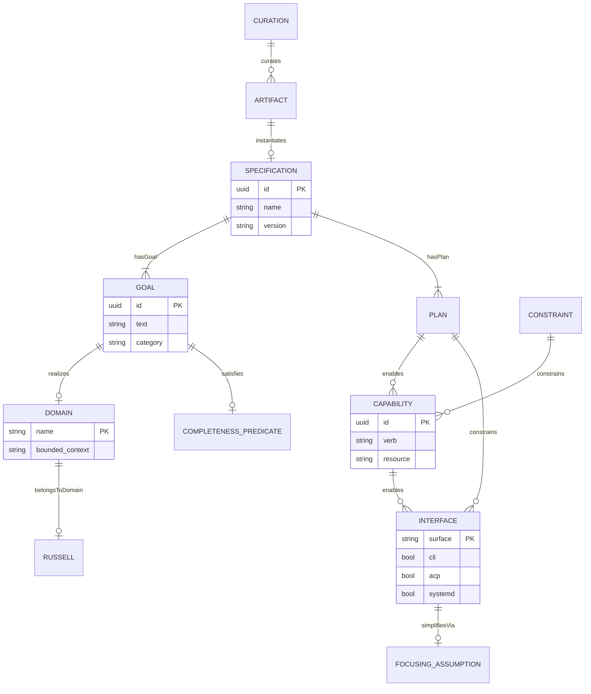

# DDMVSS — Domain-Driven Minimal Viable Specification Set

**Purpose:** The smallest set of specifications that fully defines Russell as a cybernetic health harness, plus the methodology that produces it.

**Axiom:** `Specification ≡ ⟨Goals, Plan⟩` — one vocabulary, two registers.  
**Axiom:** `Goal ≡ Requirement` — bidirectional equivalence.  
**Focusing simplification:** `CLI ≡ ACP ≡ systemd` — three surfaces, one functional core.  
**Design principle:** *Specifications are invitations to curate, not gates to govern.* Each spec defines a capability surface, not a constraint boundary.

---

## Contents

| Section | Description |
|---------|-------------|
| [§1 Semantic Map](#1-semantic-map) | RDF/Turtle graph of DDMVSS domain |
| [§2 DDMVSS Categories](#2-ddmvss-categories--goal-group-taxonomy) | Goal-group taxonomy for Russell |
| [§3 Completeness Predicates](#3-completeness-predicates) | When is Russell "done"? |
| [§4 Russell Self-Application](#4-russell-self-application) | DDMVSS applied to Russell |
| [§5 Open Questions](#5-open--underspecified-questions) | Identified gaps |
| [§6 References](#6-references) | Citations |

---

## 1. Semantic Map

### 1.1 RDF/Turtle Graph

```turtle
@prefix : <https://russell.dev/ontology/ddmvss#> .
@prefix rdfs: <http://www.w3.org/2000/01/rdf-schema#> .

:Specification  a :CompositeEntity ;
    :hasGoal    :Goal ;
    :hasPlan    :Plan ;
    :servedBy   :Curation .

:Goal           a :SemanticUnit ;
    :realizes       :Domain ;
    :satisfies      :CompletenessPredicate ;
    :composesInto   :Specification .

:Plan           a :SyntacticUnit ;
    :enables        :Capability ;
    :constrains     :Interface .

:Domain         a :BoundedContext ;
    :belongsToDomain :Russell .

:Capability     a :GrantedAuthority ;
    :enables        :Interface .

:Constraint     a :BoundaryCondition ;
    :constrains     :Capability ;
    :constrains     :Interface .

:Interface      a :Surface ;
    :simplifiesVia  :FocusingAssumption .

:Russell        a :MinimalSystem ;
    :satisfies      :CompletenessPredicate .

:Curation       a :LifecycleProcess ;
    :curates        :Artifact ;
    :evaluates      :CompletenessPredicate .

:Artifact       a :SpecOutput ;
    :instantiates   :Specification .
```

### 1.2 Mermaid ER Diagram



<!-- DIAGRAM_ALIGNMENT
id: DIAG-RUSSELL-DDMVSS-001
verified_date: 2026-05-25
verified_against: crates/russell-core/src/event.rs; crates/russell-meta/src/help.rs
status: VERIFIED
-->

---

## 2. DDMVSS Categories — Goal-Group Taxonomy

### 2.1 Category Definitions

| # | Category | Completeness Predicate | Min Artifacts (≤3) | Cross-References |
|---|----------|----------------------|---------------------|-----------------|
| 1 | **Domain** | Every probe type has a named term in Russell vocabulary | Vocabulary catalog, bounded-context map, entity inventory | → Capability (verbs), → Persistence (journal schema) |
| 2 | **Capability** | Every domain verb has a granted capability with risk band | Capability grant table, IDRS policy, verb inventory | → Domain (ontology), → Trust (risk bands), → Interface (surface) |
| 3 | **Interface** | CLI, ACP, and systemd all exercise the same capability set | Interface equivalence matrix, CLI commands, ACP methods | → Capability (verbs), → Composition (skill registry) |
| 4 | **Composition** | Skills compose via manifest without code change | Manifest schema, dispatcher rules, skill lifecycle | → Capability (atoms), → Domain (ontology) |
| 5 | **Trust & Security** | Every mutation satisfies IDRS contract | IDRS contract, risk band policy, kill switch | → Capability (mutations), → Observability (audit) |
| 6 | **Observability** | Every probe emits a journal row with hash chain | Journal schema, proprioception vitals, EWMA baselines | → Trust (audit), → Lifecycle (health) |
| 7 | **Persistence** | Every domain entity has a storage schema | Journal schema, profile schema, evidence bundles | → Domain (entities), → Observability (samples) |
| 8 | **Lifecycle** | Bootstrap, evolution, and deprecation are expressible | Bootstrap sequence, ADR lifecycle, skill lifecycle | → Composition (registry), → Observability (health) |
| 9 | **Curation** | Every spec artifact has been evaluated | Curation decision log, coherence score | → Domain (vocabulary), → Observability (audit) |

### 2.2 Completeness Predicate Formal Definition

```
complete?(G, category) :=
  ∀ goal ∈ G[category]:
    ∃ criterion ∈ goal.criteria:
      criterion.satisfied = true
  ∧ ∀ cross_ref ∈ G[category].cross_references:
    complete?(G, cross_ref.target_category)

curated?(G) :=
  ∀ artifact ∈ G.artifacts:
    ∃ decision ∈ {Merge, Revise, Defer, Discard}:
      artifact.curation_decision = decision
      ∧ decision.rationale ≠ ∅

MVP-complete(G) := complete?(G, c) for all 9 categories ∧ curated?(G)
```

---

## 3. Completeness Predicates

### 3.1 Russell-Specific Predicates

| Predicate | Root Driver | Failure Mode if Absent |
|-----------|-------------|----------------------|
| `hasGoal` | A spec without goals is a plan without purpose | Spec degenerates into a task list |
| `hasPlan` | Goals without plans are wishes | Spec is aspirational, not executable |
| `realizes` | Goals must anchor to a bounded context | Goals become generic; no context to test against |
| `constrains` | Unconstrained capabilities are ambient authority | Security model collapses; any agent can mutate |
| `enables` | Capabilities must surface through interfaces | System has powers no one can exercise |
| `belongsToDomain` | Domain membership prevents scope creep | Spec tries to cover Russell + hKask + Okapi |
| `satisfies` | Without completeness predicate, "done" is undefined | MVP never ships; infinite refinement |
| `composesInto` | Atomic specs must compose | Each new feature requires full re-specification |
| `simplifiesVia` | Focusing assumptions collapse dimensions | Spec surface triples; redundant docs per interface |
| `curates` | Specs are living collections requiring evaluation | Specs become stale artifacts; no feedback loop |

### 3.2 Russell Vocabulary Extension

Russell's domain-specific terms:

| Term | Domain | Definition |
|------|--------|-----------|
| `sentinel` | Observe | Continuous low-cost telemetry collector |
| `journal` | Remember | SQLite database with hash chain |
| `jack` | Cry-for-help | Persona that consults LLM |
| `skill` | Act | YAML manifest + scripts |
| `proprioception` | Self-watch | Russell's self-observation |
| `IDRS` | Constrain | Idempotent / Dry-run / Rollback / Structured-log |
| `risk-band` | Constrain | none / low / medium / high / critical |
| `consent` | Gate | Operator approval for interventions |

---

## 4. Russell Self-Application

### 4.1 Bounded Contexts

Russell's bounded contexts (discovered from code):

| Context | Crate(s) | Verb | Domain |
|---------|----------|------|--------|
| `sentinel` | `russell-sentinel` | Observe | probes, samples, rules |
| `journal` | `russell-core` | Remember | events, baselines, evidence |
| `jack` | `russell-meta` | Cry-for-help | persona, SOAP, inference |
| `skill` | `russell-skills` | Act | manifests, dispatcher, IDRS |
| `acp` | `russell-acp-server` | Report | sessions, macaroons |
| `proprioception` | `russell-proprio` | Self-watch | self-vitals, reflex |
| `profile` | `russell-core` | — | host-info, gpu-info |
| `operator` | `russell-cli` | — | commands, pod |

### 4.2 Capability Grant Table

| Operation | Resource | Action | Risk Band | IDRS? |
|-----------|----------|--------|-----------|-------|
| Run probe | `probe:{id}` | Execute | none | Yes |
| Run intervention | `intervention:{id}` | Execute | low+ | Yes |
| Install skill | `skill:{id}` | Install | low | Yes |
| Prune skill | `skill:{id}` | Prune | low | Yes |
| Retire skill | `skill:{id}` | Retire | medium | Yes |
| Query journal | `journal:*` | Read | none | N/A |
| Export evidence | `evidence:{id}` | Export | none | N/A |

### 4.3 Interface Equivalence Matrix

| Capability | CLI | ACP | systemd |
|------------|-----|-----|---------|
| Run sentinel | `russell sentinel-once` | `acp/probe/run` | `russell-sentinel.timer` |
| Query journal | `russell list` | `acp/journal/query` | N/A |
| Run skill | `russell skill run <id>` | `acp/skill/run` | N/A |
| Install skill | `russell skill install <id>` | N/A | N/A |
| Self-triage | `russell self-triage` | N/A | N/A |

**Focusing assumption:** `CLI ≡ ACP ≡ systemd` — three projections of one core.

### 4.4 Gaps Discovered

1. **No formal completeness predicate** — Russell lacks a machine-checkable "done" definition
2. **No curation decision log** — ADRs lack explicit Merge/Revise/Defer/Discard decisions
3. **No coherence metric** — No way to measure spec collection coherence
4. **Vocabulary not grounded** — Terms like "sentinel" lack formal definitions in a vocabulary catalog

---

## 5. Open / Underspecified Questions

### 5.1 Completeness

- **Q1:** How do we formally define "Russell is complete"? What are the machine-checkable criteria?
- **Q2:** Should completeness be per-bounded-context or system-wide?

### 5.2 Curation

- **Q3:** Who curates Russell's specs? The operator? An automated process?
- **Q4:** How do we track curation decisions over time?

### 5.3 Vocabulary

- **Q5:** Should Russell have a formal vocabulary catalog like hKask's hLexicon?
- **Q6:** How do we prevent vocabulary drift (e.g., "sentinel" vs "telemetry collector")?

### 5.4 Composition

- **Q7:** How do skills compose? Can skill A invoke skill B?
- **Q8:** What are the cascade rules for skill composition?

---

## 6. References

- hKask DDMVSS: `~/Clones/hKask/docs/architecture/DDMVSS.md`
- Evans, E. (2003). *Domain-Driven Design*. Addison-Wesley.
- Miller, M.S. (2003). "Robust Composition: Towards a Unified Approach to Access Control and Concurrency Control." PhD thesis, Johns Hopkins.
- Beer, S. (1972). *Brain of the Firm*. Wiley.
