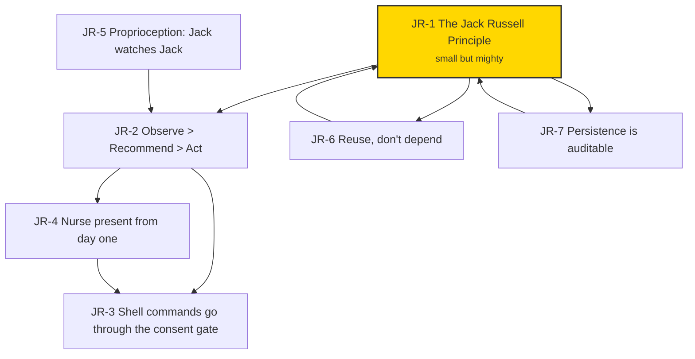

# Russell Principles

**Purpose:** The seven principles (JR-1 through JR-7) and four corollaries (C1-C4) that govern Russell's behavior.

**Axiom:** *Though she be but little, she is fierce.* — Shakespeare, *A Midsummer Night's Dream* III.ii.

---

## Principles

### JR-1: Austere by Default

**Statement:** Russell is austere by default. Every feature must earn its place against the cost it adds to boot time, binary size, cognitive load, and attack surface. Russell prefers **one small, resilient loop that always runs** over five clever loops that sometimes do. When in doubt, cut.

**Rationale:** A Jack Russell terrier is a 12-inch dog that runs all day, catches rats, never gets bored, never needs a team. The wrong response to "we need more" is usually "less, better."

**Consequence:** Cost: fewer features shipped per quarter. Buy: a system that works when you are not watching it, whose failure modes you can name, and that does not collapse under its own weight.

**Linked ADRs:** ADR-0001 (scope), ADR-0013 (workspace layout).

---

### JR-2: Observe > Recommend > Act

**Statement:** Russell's default posture is **observe > recommend > act**. Any mutation is the exception, not the rule. Any mutation must satisfy IDRS (Idempotent, Dry-runnable, Rollback-able, Structured-logged).

**Rationale:** *Primum non nocere* (Hippocratic corpus, *Epidemics* I.11). A health harness that breaks the patient is worse than no harness.

**Consequence:** Cost: Russell will not magically fix things. Buy: Russell will not magically break things.

**Linked ADRs:** ADR-0008, ADR-0011.

---

### JR-3: Shell Commands Go Through the Consent Gate

**Statement:** The LLM may propose shell commands. Every command goes through the safety classifier and the consent gate before execution. Destructive commands are blocked. The LLM proposes; the operator consents; the dispatcher executes.

**Rationale:** An absolute prohibition on shell output prevented Jack from helping with the most common operator requests — installing packages, checking versions, reading logs. The LLM already understands these tasks; silencing it subtracted value. The right boundary is at execution, not at suggestion: the operator reviews every command before it runs.

**Consequence:** Cost: the safety classifier is heuristic and may misclassify rare edge cases. Buy: Jack can now help with any task the operator would do at a shell, while destructive commands remain blocked and all mutations require consent.

**Linked ADRs:** ADR-0050 (supersedes ADR-0008).

---

### JR-4: Small but Present — The Nurse

**Statement:** Russell must be able to **cry for help** from day one. The Nurse is a single verb (`russell jack`) that assembles the current observations, sends them through the LLM router (default: local Okapi, opt-in: OpenRouter with ZDR), writes the round-trip to disk, and prints the response. It does not act. It does not parse. It does not dispatch. It **notices**.

**Rationale:** A system that *can never* check in never does. Russell's nurse-channel must already exist in habit form from day one.

**Consequence:** Cost: one round-trip to the configured LLM backend per `russell jack`, one persona file. Buy: Russell's operator is never alone with a wedged machine.

**Linked ADRs:** ADR-0008, ADR-0016.

---

### JR-5: Proprioception — Jack Watches Jack

**Statement:** Russell watches himself the same way he watches the host. Even in MVP, one self-vital always exists: **"did the Sentinel run when it was supposed to?"** As he grows, the set grows — but the first vital is non-optional.

**Rationale:** A controller that cannot detect its own degraded state will confidently report on a host while itself being the most broken service on the box.

**Consequence:** Cost: one extra row-type in the journal, one extra check per Sentinel cycle. Buy: no silent Russell failure.

**Linked ADRs:** ADR-0015.

---

### JR-6: Reuse, Don't Depend

**Statement:** Russell **copies** code from upstream workspaces rather than depending on them. Every copy registers in `REUSE_MANIFEST.md` with its source path, upstream commit at copy time, local modifications, and sync policy.

**Rationale:** Russell's operator is *one person*. A dependency graph that reaches into other workspaces is a failure mode waiting to happen.

**Consequence:** Cost: the operator maintains a sync manifest. Buy: Russell stays small, self-contained, and always-builds.

**Linked ADRs:** ADR-0013 (workspace), ADR-0017.

---

### JR-7: Persistence is Auditable

**Statement:** Everywhere Russell remembers something, it is documented — what table, what file, what schema version, what retention. There are no hidden caches, no "temporary" state files that become permanent, no state that persists without a row in `PERSISTENCE_CATALOG.md`.

**Rationale:** An operator cannot reason about their machine if Russell holds state they cannot see.

**Consequence:** Cost: one more document to keep current. Buy: a full `rm -rf ~/.local/state/harness/` always cleanly resets Russell. No orphans, no surprises.

**Linked ADRs:** ADR-0004, ADR-0006.

---

## Corollaries

### C-1: "First Do No Harm" is a Refusal Posture, Not a Slogan

When a skill is unsure, it refuses. When the LLM is low-confidence, Jack defers. When proprioception reports a degraded Russell, the host Sentinel keeps collecting but Jack halts. (JR-2, JR-5.)

---

### C-2: Persistence is SQLite

One database, one writer, one place to look. (JR-7, ADR-0004.)

---

### C-3: Copy with Citation; Sync with Intent

Never copy-and-forget. Every imported file carries a comment header pointing at the upstream source. (JR-6.)

---

### C-4: The Persona is a File, Not a Framework

Jack's voice lives in `crates/russell-meta/prompts/jack.md`. Changing his voice is editing one file; it is a reviewed change, not a setting. (JR-1, JR-4.)

---

## Relationship Map

<!-- DIAGRAM_ALIGNMENT
id: DIAG-PRINCIPLES-REL-001
verified_date: 2026-05-25
verified_against: AGENTS.md §3
status: VERIFIED
-->

JR-1 roots the tree. Everything else either mechanises it or follows from it.

---

## DDMVSS Context Mapping

Each principle maps directly to bounded contexts and their artifacts. No phase middleman.

| Principle | DDMVSS Context(s) | Primary Artifact(s) |
|---|---|---|
| JR-1 | All | This catalog, `MVP_SPEC.md` |
| JR-2 | `sentinel`, `skill`, `jack` | ADR-0008, ADR-0023, `safety.md` |
| JR-3 | `jack`, `skill` | ADR-0008, ADR-0023 |
| JR-4 | `jack` | `THE_JACK.md`, ADR-0016 |
| JR-5 | `proprioception` | ADR-0015, ADR-0021 |
| JR-6 | `operator` | ADR-0013, ADR-0017, `REUSE_MANIFEST.md` |
| JR-7 | `journal` | ADR-0004, ADR-0006, `PERSISTENCE_CATALOG.md` |

---

## Amending the Catalog

Adding or altering a principle requires a superseding ADR that cites this catalog and the specific JR-N under change. Principles are never deleted silently; they move to an archive block at the bottom of this file with the superseding ADR referenced.

---

## References

- Hippocratic corpus. *Epidemics* I.11. ~400 BCE. *Primum non nocere*.
- Evans, E. (2003). *Domain-Driven Design*. Addison-Wesley.
