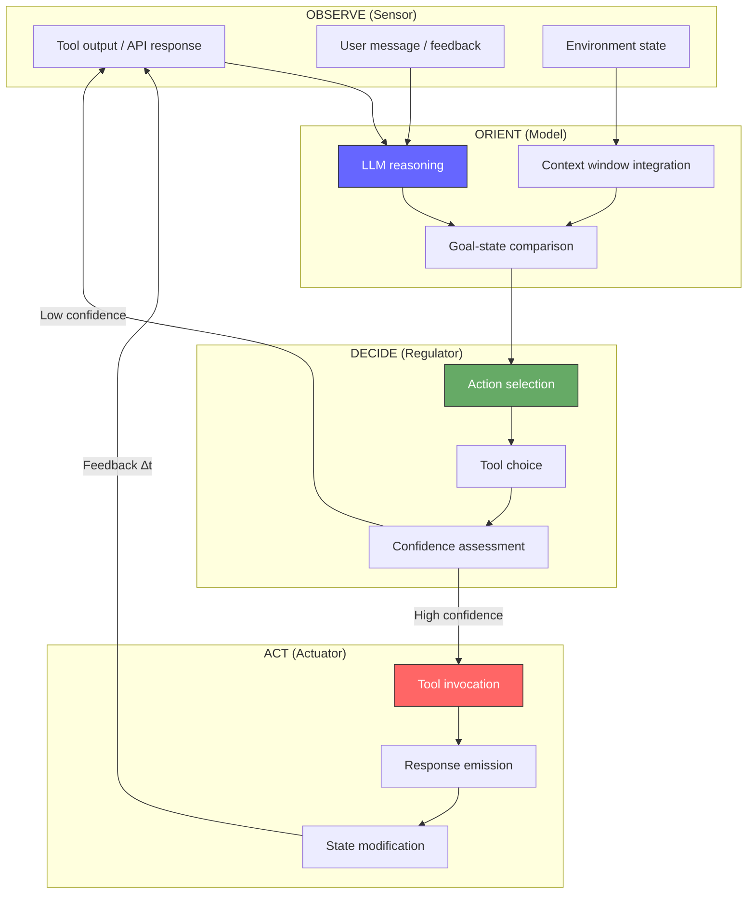
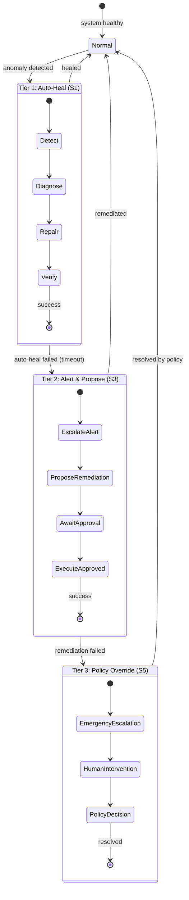

# Agentic Systems

> Cybernetics of AI agent loops (OODA, MAPE-K), hierarchical agent control mapped to VSM, cognitive maneuverability, agentic pathologies, self-healing resilience patterns, and durable execution.

---

## Cybernetics of Agentic Systems

### The Agent Loop as Cybernetic Feedback

Every AI agent — from a single LLM-backed tool-calling loop to a fleet of coordinated autonomous systems — implements a **cybernetic feedback loop**. The agent observes its environment, orients within a model of the world, decides on an action, executes it, and feeds the result back into observation. This is not metaphor; it is the literal control-theoretic structure.

Two established frameworks formalize this:

#### OODA Loop (Boyd 1987)

John Boyd's **Observe-Orient-Decide-Act** loop, developed for fighter-pilot decision superiority, maps directly to agent control:

| OODA Phase | Agent Operation | Cybernetic Function |
|-----------|----------------|---------------------|
| **Observe** | Read tool output, parse environment state | Sensor — raw variety intake |
| **Orient** | LLM reasoning, context integration, mental model update | Model construction (Conant-Ashby) |
| **Decide** | Select next action from available tools/strategies | Regulator output selection |
| **Act** | Execute tool call, emit response, modify state | Actuator — variety output |

Boyd's key insight: **the combatant who cycles through OODA faster and with higher accuracy wins**. For agents: cognitive maneuverability — the speed and fidelity of the feedback loop — determines effectiveness. A hallucinating agent cycles fast but with zero accuracy. A stuck agent has high accuracy but zero speed.

#### MAPE-K (Kephart & Chess 2003)

IBM's autonomic computing loop adds **explicit knowledge** as a persistent element:

| MAPE-K Phase | Agent Operation | Cybernetic Function |
|-------------|----------------|---------------------|
| **Monitor** | Collect observations, tool outputs, user feedback | System 3 monitoring |
| **Analyze** | Assess situation against goals, detect anomalies | System 4 intelligence |
| **Plan** | Construct action sequence, select tools | Regulator variety selection |
| **Execute** | Invoke tools, produce artifacts | System 1 operations |
| **Knowledge** | Persistent memory, learned heuristics, context | Internal model (Good Regulator) |

MAPE-K makes explicit what OODA leaves implicit: the **knowledge base** is a persistent model that the agent must maintain, update, and occasionally restructure (double-loop learning).

### Agent OODA Loop with Cybernetic Annotations

### Hierarchical Agent Control Mapped to VSM

The VSM's recursive structure maps naturally to multi-agent architectures:

| VSM System | Agent Architecture Level | Function | Example |
|-----------|------------------------|----------|---------|
| **S1** | Individual agent | Operational autonomy — executes tasks within its domain | Code-writing agent, research agent, testing agent |
| **S2** | Coordination layer | Anti-oscillation between agents — prevents conflict, manages shared resources | Message bus, work queue, lock manager |
| **S3** | Orchestrator | Resource allocation, goal decomposition, ensures synergy between S1 agents | Task planner, workload balancer |
| **S3*** | Audit / evaluation | Sporadic verification that agents are making progress and staying aligned | Evaluation harness, output validator |
| **S4** | Intelligence / planning | Scans external environment, models future tasks, identifies capability gaps | Strategy agent, capability assessor |
| **S5** | Governance / policy | Identity, constraints, constitutional rules, balances stability vs. adaptation | System prompt, RBAC policy, safety guardrails |

### Cognitive Maneuverability

Boyd's concept of **cognitive maneuverability** — the ability to rapidly cycle through OODA with high fidelity — translates to agent systems as:

- **Cycle speed**: How quickly the agent completes observe → orient → decide → act
- **Orientation accuracy**: Does the agent's model match reality? (Conant-Ashby)
- **Decision quality**: Does the selected action actually reduce the gap between current and goal state?
- **Adaptation rate**: How quickly does the agent restructure when its model fails? (Ultrastability)

An agent with high cognitive maneuverability can handle novel situations by rapidly updating its orientation (model) and selecting appropriate actions from a high-variety repertoire.

### Agentic Pathologies as Cybernetic Failures

| Agent Pathology | Cybernetic Diagnosis | Structural Cause |
|----------------|---------------------|-----------------|
| **Infinite loops** | Positive feedback runaway | Action produces observation that triggers same action; no negative feedback to dampen |
| **Goal drift** | Broken setpoint reference | Agent loses connection to original goal; orientation phase corrupted |
| **Hallucination propagation** | Model-reality divergence (Conant-Ashby violation) | Agent's internal model diverges from external truth; no verification feedback |
| **Tool call storms** | Oscillation from high gain + delay | Over-correction cycles; each correction overshoots |
| **Stuck/spinning** | Requisite variety failure | Agent's action repertoire insufficient for the disturbance encountered |
| **Context window overflow** | Channel capacity exceeded (Shannon) | Information variety exceeds the finite channel; signal degradation |
| **Multi-agent deadlock** | Missing S2 coordination | No anti-oscillation mechanism between competing agents |
| **Cascading failures** | Uncontrolled positive feedback across agent boundaries | One agent's failure amplified through connected agents |

---

## Agent Self-Healing and Resilience Patterns

### Self-Healing as Cybernetic Closed Loop

Self-healing is not a feature — it is a **cybernetic closed loop** with five phases:

1. **Detect** — sensor identifies deviation from homeostatic range (System 3 monitoring)
2. **Diagnose** — orient within model to identify root cause (System 4 intelligence)
3. **Isolate** — contain the failure to prevent propagation (System 2 coordination)
4. **Repair** — execute corrective action (System 1 operational response)
5. **Verify** — confirm essential variables returned to viable range (System 3* audit)

If any phase is missing, the loop is **broken** and self-healing fails silently.

### Erlang/OTP as Cybernetic Architecture

The Erlang/OTP "let it crash" philosophy (Armstrong 2003) is a cybernetic design pattern:

- **Supervision trees** are variety amplifiers — they expand the system's response repertoire to match the variety of possible failures
- **Process isolation** is variety attenuation — failures are contained within boundaries, preventing variety explosion across the system
- **Restart strategies** implement negative feedback — deviation (crash) triggers correction (restart) toward homeostatic state
- **Escalation** implements algedonic signals — if a supervisor cannot handle the failure, pain propagates upward

This is **variety engineering** applied to fault tolerance: the supervision tree's variety (restart strategies × depth × breadth) must match the variety of failure modes in the supervised processes.

### Three-Tier Escalation as Algedonic Hierarchy

| Tier | VSM Mapping | Response Type | Example |
|------|-------------|---------------|---------|
| **Tier 1** | S1 self-correction | Automatic, immediate, bounded retry | Restart process, retry request, clear cache |
| **Tier 2** | S3 intervention | Alert + proposed remediation, requires confirmation | Scale resources, failover, notify on-call |
| **Tier 3** | S5 policy override | Emergency escalation, human decision, policy change | Circuit break entire subsystem, rollback deployment |

### Anti-Oscillation (S2 Coordination Function)

Restart loops are a cybernetic **oscillation** — the system cycles between failure and restart without reaching stability. The S2 coordination function prevents this through:

- **Backoff strategies** — exponentially increasing delay between restarts (reducing loop gain)
- **Restart budgets** — maximum restarts within a window (bounded positive feedback)
- **State checkpointing** — restart from last-known-good state rather than initial state (reducing loop delay)
- **Cooldown coordination** — prevent multiple agents from simultaneously restart-looping on shared resources (thundering herd prevention)

### Stuck Detection as Requisite Variety Failure

An agent that is "alive and completely stuck" represents a **Conant-Ashby violation** — the agent's model has diverged from reality so completely that its regulator variety is insufficient for the actual situation. Detection requires:

- **Progress metrics** distinct from activity metrics (the agent is doing things, but making no progress)
- **Timeout on goal convergence** — if distance-to-goal is not decreasing, the feedback loop has failed
- **Diversity monitoring** — if the agent's actions become repetitive (variety collapse), its regulator has failed

### Durable Execution as Ultrastability

Temporal-style durable execution implements Ashby's ultrastability:

- **Inner loop** (single-loop): handles routine recovery — retry transient failures, resume from checkpoint, compensate known errors
- **Outer loop** (double-loop): restructures parameters when inner loop fails — change strategy, escalate tier, modify goals
- The workflow's **persistent state** is the Good Regulator's model — it must accurately represent what has been done, what remains, and what went wrong

### Recursive Failure Avoidance

Second-order cybernetics demands: **self-diagnostic systems must not consume the resources they monitor.**

- A health-check that uses the same database connection pool it monitors will fail alongside the monitored system
- A monitoring agent that consumes the same context window as the working agent reduces the working agent's channel capacity
- An alerting system that routes through the same network path as the system it monitors will go dark in the same outage

This is the **monitoring independence principle**: the observer must be structurally decoupled from the observed system's failure modes.
