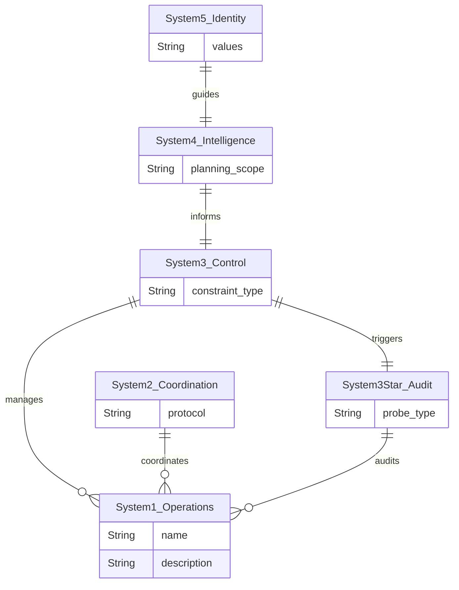

# Classical Foundations

> Historical origins of cybernetics, first-order cybernetics (Ashby's Law, Homeostat, Black Box), Beer's Viable System Model, and second-order cybernetics (von Foerster, Maturana & Varela).

---

## Historical Foundations

### The Wartime Crucible (1940s)

Cybernetics emerged from World War II research. **Norbert Wiener** (1894–1964), a mathematician at MIT, collaborated with engineer **Julian Bigelow** and physiologist **Arturo Rosenblueth** on anti-aircraft fire-control systems. The core problem — predicting the future position of a moving target based on observed trajectory — forced them to formalize concepts of **feedback**, **prediction**, and **purposeful behavior** applicable to both machines and organisms.

Two foundational papers appeared in 1943:

1. **"Behavior, Purpose and Teleology"** (Rosenblueth, Wiener, Bigelow 1943) — argued that the same analysis of purposeful, feedback-driven behavior applies to servomechanisms and living organisms. This erased the machine/organism distinction at the level of behavioral analysis.

2. **"A Logical Calculus of the Ideas Immanent in Nervous Activity"** (McCulloch & Pitts 1943) — the first formal model of neural networks as logical circuits, demonstrating that networks of simple threshold neurons could compute any logical function.

Wiener coined "cybernetics" (from Greek *kybernetes*, "steersman") and published the founding text in 1948: *Cybernetics: Or Control and Communication in the Animal and the Machine*.

### The Macy Conferences (1946–1953)

Ten conferences funded by the Josiah Macy, Jr. Foundation in New York City, initially titled *"Feedback Mechanisms and Circular Causal Systems in Biological and Social Systems."* Chaired by **Warren McCulloch**, they became the crucible for transdisciplinary cybernetics.

Key participants and their contributions:

| Figure | Field | Contribution |
|--------|-------|-------------|
| Norbert Wiener | Mathematics | Feedback theory, information in control systems |
| John von Neumann | Mathematics/Physics | Game theory, self-reproducing automata, computing architecture |
| Claude Shannon | Communications | Mathematical theory of communication, information entropy (1948) |
| Warren McCulloch | Neurophysiology | Neural netoperationalls, conference chair |
| Walter Pitts | Logic/Mathematics | Logical calculus of neural activity |
| W. Ross Ashby | Psychiatry/Cybernetics | Homeostat, requisite variety, ultrastability |
| Gregory Bateson | Anthropology | Circular causality in social systems, deutero-learning |
| Margaret Mead | Anthropology | Cross-disciplinary communication, social feedback |
| Heinz von Foerster | Physics/Engineering | Conference editor, later founded second-order cybernetics |

Margaret Mead described cybernetics as *"a form of cross-disciplinary thought which made it possible for members of many disciplines to communicate with each other easily in a language which all could understand."*

### Core Concepts from the Founders

**Feedback loops** — Circular causal processes where outputs return as inputs. The departure from linear cause-and-effect thinking. In a feedback loop, effects become causes.

**Negative feedback** — Counteracts deviations from a desired state. The thermostat: temperature rises above setpoint → heater turns off; temperature falls below → heater turns on. Deviation is *negated* by corrective action. Negative feedback produces **stability**.

**Positive feedback** — Amplifies deviations rather than correcting them. A microphone near its speaker creates a screech. In social systems: bank runs (fear → withdrawals → more fear → more withdrawals). Positive feedback drives **growth, innovation, and phase transitions** — but uncontrolled positive feedback leads to runaway and system destruction.

**Viable systems require both**: positive feedback for adaptation and growth, negative feedback for stability and survival.

**Circular causality** — Effects become causes in closed causal loops. Every element in the loop is simultaneously cause and effect. Linear causal analysis ("A causes B") is inadequate for circular systems.

**Information** — Shannon's mathematical framework (1948) for quantifying information, channel capacity, noise, and redundancy. Wiener placed information alongside matter and energy as a fundamental quantity: *"Information is information, not matter or energy."*

---

## First-Order Cybernetics: The Science of Observed Systems

First-order cybernetics studies systems from outside — the observer is separate from the observed system. This is the cybernetics of **observed systems**.

### Ashby's Law of Requisite Variety (1956)

The First Law of Cybernetics, from W. Ross Ashby's *An Introduction to Cybernetics*:

> **"Only variety can absorb variety."**

Formally: for a regulator (R) to effectively control a system (S) against disturbances (D), the variety of R must be **at least as great** as the variety of D. The regulator's capacity as a controller cannot exceed its capacity as a channel of communication.

Ashby proved this is mathematically equivalent to **Shannon's Theorem 10** — the amount of noise removable by a correction channel is bounded by that channel's information capacity.

**Engineering implications:**

| System Variety | Regulator Variety | Result |
|---------------|-------------------|--------|
| 1000 failure modes | 50 test scenarios | **Variety deficit** — 950 unregulated failure modes |
| 300 behavioral patterns | 3 response types | **Regulatory failure** — management blind to 99% of behavior |
| 21 behavioral properties | 21 property monitors | **Requisite variety achieved** — full regulatory coverage |

The law applies at **every regulatory interface**: test harness ↔ system, monitoring ↔ operations, management ↔ teams, CI/CD ↔ deployments.

### Ashby's Homeostat (1948)

A physical machine built from four interconnected Royal Air Force bomb-control units. It demonstrated:

- **Adaptive behavior without explicit programming** — the machine found stable configurations through random search
- **Ultrastability** — double feedback: an inner loop adjusts behavior within current parameters; an outer loop changes the parameters themselves when essential variables go out of bounds

Wiener called it *"one of the great philosophical contributions of the present day."*

**Ultrastability is the mechanical precursor to double-loop learning**: the inner loop handles routine perturbations; the outer loop restructures the system when routine adjustments fail.

### Black Box Methodology

Study systems by their **input-output behavior** without assuming knowledge of internal structure:

1. Apply inputs
2. Observe outputs
3. Infer the system's behavioral repertoire
4. Test boundary conditions where the inferred model might break

This is the cybernetic foundation of **behavioral testing**: the test harness treats the system under test as a black box, probing its behavior without assuming its implementation is correct.

---

## Beer's Viable System Model (VSM)

**Stafford Beer** (1926–2002) applied cybernetic principles to organizational management in *Brain of the Firm* (1972), *The Heart of Enterprise* (1979), and *Diagnosing the System for Organisations* (1985).

The VSM describes **the minimum internal anatomy any organization needs to survive in a changing environment**. It identifies five necessary systems, plus an audit function:

### The Five (+1) Systems

| System | Name | Function | Looks | Software Analogy |
|--------|------|----------|-------|-----------------|
| **S1** | Operations | Primary activities producing the system's purpose. Multiple autonomous operational units. | Inside, Now | Microservices, workers, business logic modules |
| **S2** | Coordination | Dampens oscillations between S1 units. Prevents conflict. Anti-oscillatory. | Between S1s | Service mesh, message queues, scheduling, conflict resolution |
| **S3** | Control | Manages internal environment. Allocates resources, sets targets, ensures S1 synergy. | Inside, Now | Orchestrator, resource manager, SLO enforcement |
| **S3*** | Audit | Sporadic direct access to S1, bypassing S3's normal channels. Verifies model matches reality. | Into S1 | **Test harness**, chaos engineering, penetration testing |
| **S4** | Intelligence | Scans external environment. Models the future. Identifies threats and opportunities. | Outside, Then | Threat intelligence, technology radar, A/B testing, canary deployments |
| **S5** | Policy | Defines identity, purpose, values. Balances S3 (stability) vs S4 (adaptation). Ultimate authority. | Identity | Architectural principles, governance, constitutional constraints |

#### Viable System Model Mapping (ER Diagram)

### System 3* — The Audit Function

System 3* is Beer's mechanism for **ground truth verification**. System 3 normally relies on filtered, attenuated information flowing up from System 1 through System 2. But this information may be distorted, delayed, or dishonest. System 3* provides **sporadic, direct access** to operational reality.

Key properties:
- **Sporadic, not continuous** — continuous monitoring overwhelms the system and destroys operational autonomy
- **Direct access** — bypasses the normal information channels that may filter or distort
- **Verifies the model** — checks whether System 3's understanding matches actual operations
- **Triggers corrective action** when discrepancies are found

**This is exactly the function of an adversarial test harness.** It bypasses the system's own reporting (which may be dishonest or incomplete) and directly probes operational reality.

### Algedonic Signals

From Greek *algos* (pain) and *hedos* (pleasure). **Emergency signals that bypass normal management channels** and escalate directly through levels of recursion.

- When **actuality deviates from capability** — an algedonic alert fires
- If corrective action is **not taken in timely fashion**, the alert **escalates** to the next recursive level
- **Pain signals**: performance failures, capability breaches, existential threats
- **Pleasure signals**: performance-improving innovations, breakthrough results

**Software analogs**: circuit breakers, PagerDuty alerts, automated rollbacks, SLO breach notifications. Alert fatigue is a **broken algedonic channel** — the pain signal exists but has been attenuated to zero by overuse.

### The Recursion Principle

The VSM is **recursive** — every viable system contains viable systems modelable with an identical cybernetic description. A department within a company is itself a viable system containing teams that are viable systems.

**For software**: the same VSM structure should hold at the microservice level, the service cluster level, the platform level, and the enterprise level. If the model breaks at any level of recursion, that level lacks viability.

### Variety Engineering

Beer operationalized Ashby's Law through **variety engineering**:

- **Variety attenuation** (filtering): Reducing variety flowing from operations to management. You cannot process every data point. Examples: dashboards, KPIs, exception-based reporting, log aggregation.
- **Variety amplification**: Increasing management's response variety to match operational complexity. Examples: delegation, empowerment, policy frameworks, automated responses.

**Beer's First Axiom of Management**: The sum of horizontal variety disposed by operational elements equals the sum of vertical variety disposed by the components of corporate cohesion.

---

## Second-Order Cybernetics: The Observer in the System

### The Fundamental Shift (1970s)

In 1974, **Heinz von Foerster** articulated the distinction:
- **First-order cybernetics**: the cybernetics of **observed** systems
- **Second-order cybernetics**: the cybernetics of **observing** systems

Von Foerster called it *"the control of control and the communication of communication."* The fundamental shift: **the observer is not outside the system — the observer is part of the system being studied.**

### Autopoiesis (Maturana & Varela 1980)

An autopoietic system is:
- **Self-producing**: generates its own components
- **Organizationally closed**: its organization is defined by its own processes
- **Structurally coupled** to its environment: interacts with environment but identity is determined by internal organization

**Software implication**: a truly viable software system must maintain its own identity (purpose, invariants, contracts) while structurally coupling to a changing environment (user demands, infrastructure changes, threat landscape).

### Constructivism and Self-Reference

Radical constructivism (von Glasersfeld) holds that knowledge is actively constructed by cognitive processes. There is no direct access to "objective reality" — all knowledge is mediated by the observer's cognitive apparatus.

**For adversarial review**: every test result, every metric, every observation is **constructed** by the observing system (the test harness). The test harness is not a neutral window onto the system — it is a participant that shapes what it observes. A test suite that only tests happy paths has constructed a reality in which the system is always healthy.

---

## References

### Primary Sources

| Work | Author(s) | Year | Key Contribution |
|------|-----------|------|-----------------|
| *Behavior, Purpose and Teleology* | Rosenblueth, Wiener, Bigelow | 1943 | Founded cybernetics as behavioral science |
| *A Logical Calculus of Ideas Immanent in Nervous Activity* | McCulloch, Pitts | 1943 | First formal neural netoperationall |
| *Cybernetics* | Wiener | 1948 | Founding text — feedback, information, circular causality |
| *A Mathematical Theory of Communication* | Shannon | 1948 | Information theory — entropy, channel capacity, noise |
| *Design for a Brain* | Ashby | 1952 | Homeostat, ultrastability, adaptive behavior |
| *An Introduction to Cybernetics* | Ashby | 1956 | **Law of Requisite Variety**, variety, black box method |
| *Every Good Regulator Must Be a Model of That System* | Conant, Ashby | 1970 | Good Regulator theorem |
| *Brain of the Firm* | Beer | 1972 | **Viable System Model (VSM)** — Systems 1–5 |
| *Cybernetics of Cybernetics* | von Foerster (ed.) | 1974 | **Second-order cybernetics** |
| *Double Loop Learning in Organizations* | Argyris | 1977 | Double-loop learning from Ashby's ultrastability |
| *The Heart of Enterprise* | Beer | 1979 | Variety engineering, organizational axioms |
| *Autopoiesis and Cognition* | Maturana, Varela | 1980 | **Autopoiesis** — self-producing systems |
| *Diagnosing the System for Organisations* | Beer | 1985 | Practical VSM methodology |
| *Perceived Risk, Trust, and Democracy* | Slovic | 1993 | Asymmetric trust — destruction faster than construction |

### Application to Software Systems

- Test harness architectures map naturally to Beer 1972 (System 3/4/5 mappings)
- Trust dynamics in multi-component systems use Slovic 1993 asymmetry
- Test suite health monitoring implements second-order cybernetics (monitoring the monitor)
- Double-loop remediation derives from Argyris 1977 (parameter vs. structural change)
- Behavioral property taxonomies define requisite variety for test harness coverage
- Policy/strategy layers implement Beer's System 5 adjusting System 1 via System 3/4 intelligence
