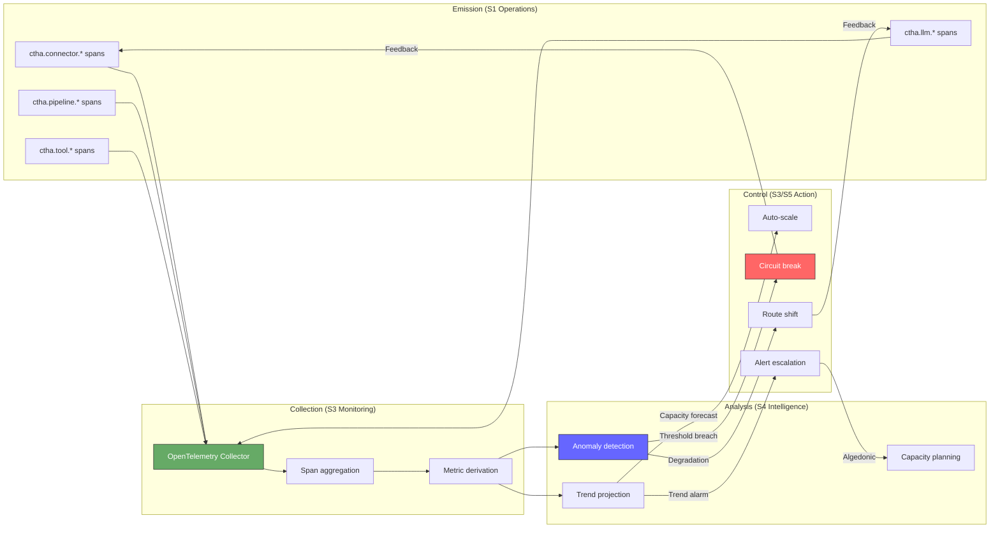

# CTHA and Agent Observability

> CTHA (Cybernetic Telemetric Homeostatic Architecture) mapped to VSM, OpenTelemetry GenAI conventions, agent health metrics, and agent observability as cybernetic feedback.

---

## CTHA — Cybernetic Telemetric Homeostatic Architecture

### Overview

CTHA is the **nervous system** of the Kask platform — a structured telemetry architecture using OpenTelemetry spans in the `ctha.*` namespace. It implements Beer's VSM nervous system in code: every significant operation emits structured signals that flow through cybernetic channels to enable self-regulation.

### CTHA Mapped to VSM Nervous System

Beer's VSM defines specific information channels between systems. CTHA implements these as structured span namespaces:

| CTHA Namespace | VSM Channel | Cybernetic Function | Signal Type |
|---------------|-------------|--------------------|----|
| `ctha.connector.*` | S1 → S3 (afferent) | Sensor signals — external I/O observation | Latency, success/failure, payload characteristics |
| `ctha.pipeline.*` | S1 internal | Operational flow — S1 activity within processing stages | Stage duration, throughput, queue depth |
| `ctha.tool.*` | S3* → S1 | Governance signals — tool invocation as audit event | Tool selection, permission check, execution result |
| `ctha.llm.*` | S4 function | Intelligence routing — model selection, fallback, provider choice | Model ID, token usage, routing decision rationale |
| `ctha.error.class` | Algedonic channel | Pain classification — error severity and type for escalation routing | Error category, severity, blast radius |

### CTHA Observation → Control Loop

### OpenTelemetry GenAI Semantic Conventions

CTHA aligns with the emerging OpenTelemetry GenAI semantic conventions — standardized cybernetic instrumentation for AI systems:

- `gen_ai.system` — identifies the LLM provider (S4 intelligence source)
- `gen_ai.request.model` — specific model selected (routing decision)
- `gen_ai.usage.input_tokens` / `output_tokens` — channel capacity consumption
- `gen_ai.response.finish_reason` — termination signal (normal completion vs. truncation vs. error)

These conventions provide a **shared vocabulary** for cybernetic instrumentation across the AI ecosystem — the same function Shannon's information theory served for communications engineering.

### Agent Health Metrics Beyond Liveness

Traditional liveness checks (is the process alive?) are necessary but radically insufficient for agents. CTHA must instrument:

| Metric Category | What It Measures | Cybernetic Analog |
|----------------|-----------------|-------------------|
| **Cognitive readiness** | Can the agent reason correctly about the current task? | Regulator model accuracy (Conant-Ashby) |
| **Progress rate** | Is distance-to-goal decreasing? | Feedback loop gain — is correction actually occurring? |
| **Reasoning quality** | Are decisions well-grounded in observations? | Orientation fidelity (Boyd) |
| **Tool effectiveness** | Are tool calls producing useful results? | Actuator effectiveness — is the output variety appropriate? |
| **Context utilization** | How much channel capacity remains? | Shannon channel capacity — approaching limits? |

### Monitoring the Monitor

CTHA must itself be observable — this is a **second-order requirement**:

- CTHA's own collector health must be monitored by an independent path
- Telemetry pipeline failures must not silently degrade observability
- The monitoring system's resource consumption must be bounded and separate from operational resources
- If CTHA goes silent, that silence itself must be detectable (watchdog pattern)

This is the recursive challenge of second-order cybernetics: **who watches the watchers?** The answer is structural: the monitoring path must be architecturally independent from the operational path it observes.

---

## Agent Observability as Cybernetic Feedback

### Beyond Traditional Observability

Traditional observability (metrics, logs, traces) was designed for **deterministic systems** — code that does the same thing given the same inputs. Agent observability must handle **non-deterministic, goal-directed systems** where the same input may produce different (yet valid) action sequences.

| Traditional Signal | Agent-Specific Extension | Why It Matters |
|-------------------|------------------------|----------------|
| **Latency** | Reasoning time vs. stuck time | An agent thinking for 30s may be productive; one looping for 30s is not |
| **Error rate** | Decision quality rate | An agent can succeed at tool calls while making poor decisions |
| **Throughput** | Progress rate toward goal | High activity ≠ high progress (the "busy but stuck" failure) |
| **Availability** | Cognitive availability | Agent may be "up" but context-saturated, hallucinating, or goal-drifted |

### Progress as the Essential Variable

For cybernetic systems, **essential variables** are those that must remain within viable range for the system to survive (Beer 1979). For agents, the primary essential variable is **progress toward goal**.

- **Activity** is not progress — an agent executing tool calls is active but may not be progressing
- **Progress** requires a metric structurally distinct from activity: distance-to-goal, subtasks completed, information gained
- When progress flatlines while activity continues, the system is in **homeostatic failure** — the feedback loop is broken or the regulator lacks requisite variety

### Distributed Tracing Across Agent Boundaries

In multi-agent systems, causality is **circular** — Agent A's output becomes Agent B's input, whose output feeds back to Agent A. Distributed tracing must reconstruct these circular causal chains:

- **Trace context propagation** across agent invocations preserves causal ordering
- **Span links** (rather than parent-child) model peer interactions and circular causality
- **Baggage propagation** carries goal context so downstream agents can be evaluated against the original intent

### Fleet-Level Observability as Variety Attenuation

Individual agent telemetry has extremely high variety — every reasoning step, tool call, and intermediate result. Fleet-level observability must **attenuate** this variety to human-manageable levels:

- Individual agent spans → aggregated per-agent health scores
- Per-agent health → fleet health dashboard
- Anomalous individuals surface through statistical deviation (not by examining all individuals)

This is Beer's **variety attenuation** in practice: the management layer cannot process every operational signal, so signals must be filtered to preserve the essential while discarding the routine.

### AI-Enhanced Dashboards as Variety Amplification

Conversely, AI-powered observability tools (e.g., natural-language query of traces, automated root-cause analysis) serve as **variety amplifiers** — they expand the human operator's response repertoire:

- Natural-language trace query amplifies the operator's diagnostic variety
- Automated anomaly detection amplifies the operator's attention bandwidth
- AI-suggested remediations amplify the operator's action repertoire

### Agents Monitoring Agents (Second-Order Observability)

When agents monitor other agents (e.g., an evaluation agent assessing a coding agent), we enter **second-order cybernetics in practice**:

- The monitoring agent has its own feedback loop — it can also fail, hallucinate, or drift
- The monitoring agent's model of the observed agent may be inaccurate (Conant-Ashby applies recursively)
- Recursive monitoring creates the risk of **infinite regress** — practical systems must terminate the recursion with a structural guarantee (e.g., the final watchdog is a simple deterministic check, not another agent)

### Quick Reference: Observability Signals

| Observability Signal | Cybernetic Function | Agent Pathology Detected |
|---------------------|--------------------|-----------------------|
| Progress rate flatline | Broken feedback loop (no error correction occurring) | Stuck agent, infinite loop, variety exhaustion |
| Reasoning token explosion | Channel capacity approaching limit | Context window overflow, hallucination onset |
| Tool call repetition | Oscillation (same correction attempted repeatedly) | Failed orientation, incorrect model |
| Multi-agent message storm | Positive feedback between agents (amplification) | Coordination failure, missing S2 damping |
| Goal drift in reasoning | Setpoint reference corruption | Broken connection to original objective |
| Silent agent (no spans) | Algedonic channel failure | Crash, deadlock, or monitoring path failure |
| High activity + zero progress | Requisite variety failure | Agent's repertoire insufficient for disturbance |
