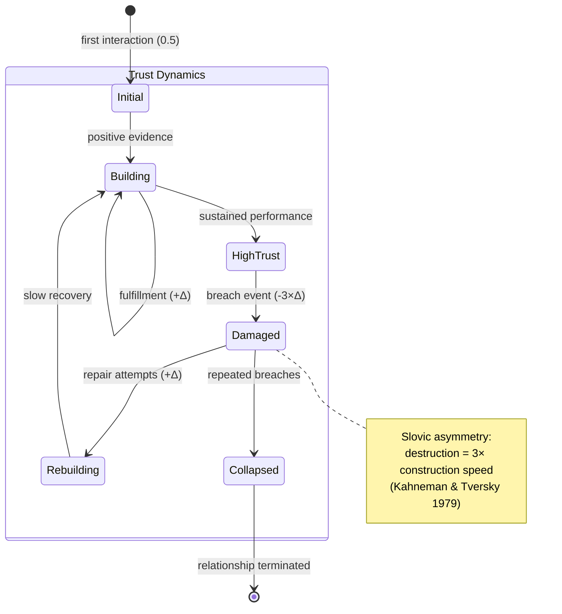
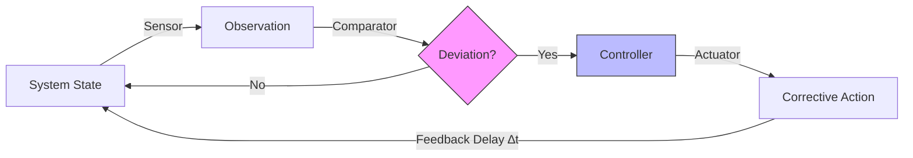
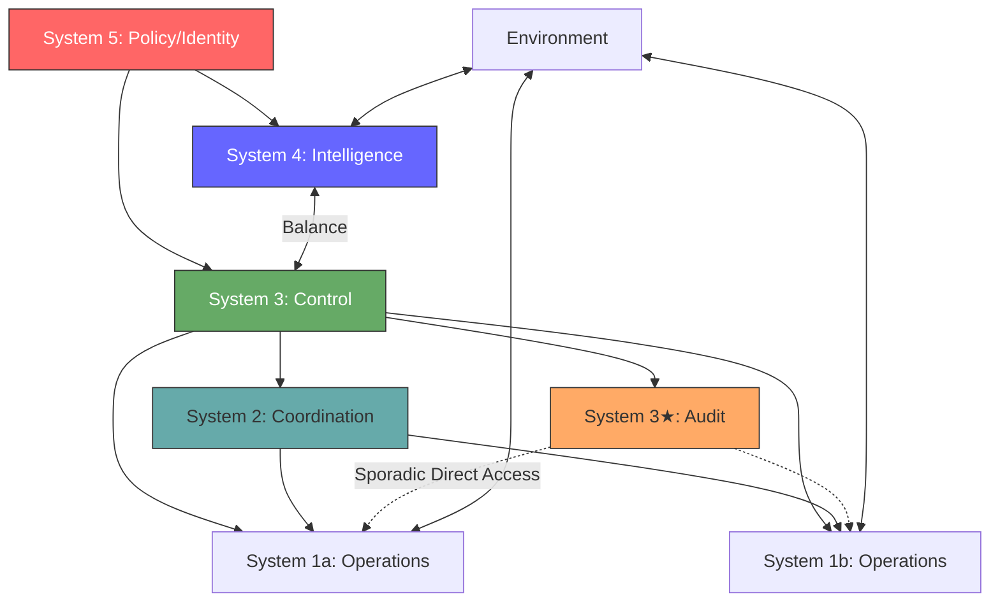
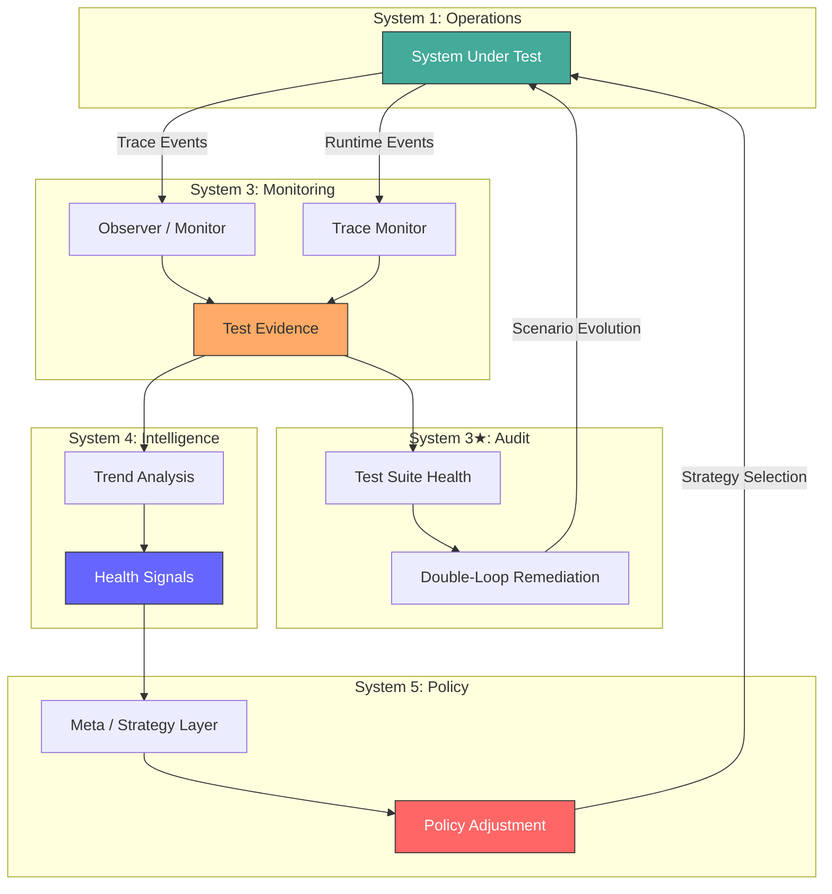
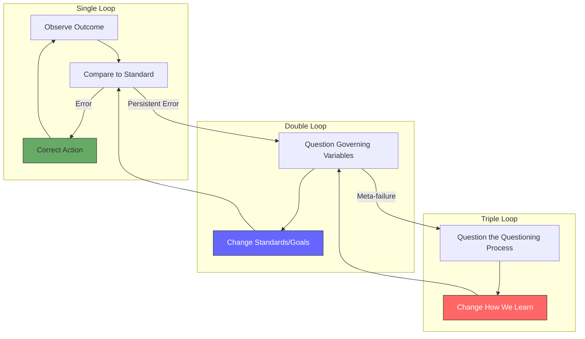

# Methods and Tools

> Cybernetic analysis methods (feedback loop analysis, variety analysis, double-loop learning, circular causality, Good Regulator analysis), modern software applications, Mermaid diagrams, and decision trees.

---

## Cybernetic Methods and Tools

### 1. Feedback Loop Analysis

Map all feedback loops in the system. For each loop, determine:

| Property | Question | Pathology |
|----------|----------|-----------|
| **Polarity** | Negative (stabilizing) or positive (amplifying)? | Misidentified polarity → wrong intervention |
| **Delay** | How long between action and feedback? | Excessive delay → oscillation |
| **Gain** | How strongly does feedback affect the system? | Too high → oscillation; too low → sluggish response |
| **Closure** | Is the loop actually closed? | Open loop → flying blind |
| **Fidelity** | Does the signal accurately represent what it claims? | Dishonest signal → worse than no signal |

**A system with broken feedback loops cannot self-correct.**

### 2. Variety Analysis

For each regulatory interface:
1. Enumerate the **system's variety** (possible states, failure modes, behavioral patterns)
2. Enumerate the **regulator's variety** (possible responses, test scenarios, control actions)
3. Apply Ashby's Law: does the regulator have **requisite variety**?
4. If not: **attenuate** the system's variety (simplify, constrain) or **amplify** the regulator's variety (add responses, expand coverage)

### 3. Double-Loop Learning (Argyris 1977)

Explicitly derived from Ashby's ultrastability:

| Loop | Question | Cybernetic Analog |
|------|----------|-------------------|
| **Single** | "Are we doing things right?" | Negative feedback, error correction |
| **Double** | "Are we doing the right things?" | Ultrastability, parameter change |
| **Triple** | "How do we decide what's right?" | Second-order cybernetics, reflexivity |

### 4. Circular Causality Diagrams

Map causal relationships as **circles, not lines**. Identify:
- **Reinforcing loops** (positive feedback, marked R or +)
- **Balancing loops** (negative feedback, marked B or -)
- **Delays** (marked with ∆t)
- **Leverage points** where small interventions produce large effects

### 5. Conant-Ashby Good Regulator Analysis

From Conant & Ashby (1970):

> **"Every good regulator of a system must be a model of that system."**

For every regulatory component (test harness, monitoring system, auto-scaler):
1. What is the regulator's **model** of the system?
2. Where does the model **diverge** from reality?
3. Is the model **updated** when the system changes?
4. Does the model include **failure modes**, or only success modes?

---

## Modern Applications to Software Systems

### Observability as Cybernetic Feedback

| Observability Pillar | Cybernetic Function |
|---------------------|---------------------|
| **Metrics** | Attenuated variety — aggregate signals from high-variety operations |
| **Logs** | Raw variety — detailed operational state, requiring attenuation |
| **Traces** | Causal chain reconstruction — mapping circular causality in distributed systems |
| **Alerts** | Algedonic signals — pain signals bypassing normal channels |

The Conant-Ashby theorem applies directly: **your observability system is only as good a regulator as it is a model of the system it observes.**

### Test Harnesses as System 3* Audit

A test harness, viewed through the VSM, is a **System 3* function**:
- Provides **sporadic, direct access** to operational reality
- **Bypasses normal reporting channels** (the system's own logs, metrics, status pages)
- **Verifies the model** — does the system behave as its contracts claim?
- **Triggers corrective action** when discrepancies are found (test failures → fixes)

The **adversarial** test harness adds a dimension: it actively seeks the **boundary between claimed behavior and actual behavior**, probing for dishonest code, silent degradation, and mock passthroughs.

### Trust as a Cybernetic Variable

Trust is regulated through feedback:
- **Built** through consistent, verified behavior (positive feedback from successful audits)
- **Destroyed** by dishonest behavior, silent failures, or broken feedback loops
- **Requires continuous verification** — System 3* audits maintain trust
- **Follows Slovic asymmetry** (1993): trust is destroyed faster than it is built (empirically ~3× asymmetry)
- **Has variety** — different stakeholders trust different aspects at different levels

#### Trust Lifecycle — Slovic Asymmetry (State Diagram)



### Self-Healing as Cybernetic Loop

Self-healing implements the cybernetic feedback loop:
1. **Observe** (System 3/3* — monitor operational state)
2. **Orient** (System 4 — compare against model, identify anomaly)
3. **Decide** (System 5/3 — select corrective action)
4. **Act** (System 1 — execute remediation)

Self-healing requires **closed feedback loops with appropriate delay and gain**: too slow and the system fails before correction; too aggressive and the correction causes oscillation.

---

## Applying the Cybernetic Audit to Software Test Harnesses

A cybernetic test harness architecture maps naturally to Beer's VSM:

| Test Harness Component | VSM Role | Cybernetic Function |
|------------------------|----------|---------------------|
| System under test | System 1 | Operations — primary activities |
| Observation/monitoring layer | System 3 | Control — extracts behavioral measurements |
| Real-time trace monitors | System 3 (real-time) | Real-time monitoring of ordering, regression |
| Multi-state test evidence (richer than pass/fail) | Signal format | Variety-preserving signal |
| Test suite health monitoring | System 4 monitoring System 3* | Second-order cybernetics — monitoring the monitor |
| Health signals → strategy layer | System 3 → System 4 | Intelligence informed by monitoring (Beer 1972) |
| Policy/strategy adjustment | System 5 adjusting System 1 | Policy adjusts operations based on S3/S4 intelligence |
| Algedonic alerts | Algedonic channel | Pain signals bypassing normal channels |
| Trend analysis | System 4 extrapolation | Predictive intelligence from monitoring trends |
| Double-loop remediation | Ultrastability | Outer loop changes governing variables, not just actions |
| Behavioral property taxonomy | Variety specification | Defines the regulatory variety the harness must match |
| Asymmetric trust dynamics | Trust dynamics | Trust destroyed faster than built (Slovic 1993) |

### Adversarial Review Questions for Test Harnesses

Using the Cybernetic Audit Checklist:

1. **Requisite Variety**: Do the behavioral properties cover the system's actual failure space? Are there failure modes orthogonal to all monitored properties?

2. **Good Regulator**: Does the health signal model accurately represent the system's health? Where might the model and reality diverge? (e.g., averaging across properties may mask per-property pathologies)

3. **Feedback Closure**: Is the monitoring → strategy → operations → monitoring loop actually closed? Are all links connected and functional? Are there dead code paths where signals are emitted but never consumed?

4. **Variety Engineering**: Is the attenuation layer correctly filtering noise while preserving signal? Is the control layer's response diversity sufficient?

5. **Observer Coupling**: Does the test instrumentation alter system behavior? Does global shared state introduce test-time coupling?

6. **Second-Order**: Does test suite health monitoring actually influence behavior, or is it a broken feedback loop (detects but doesn't act)?

7. **Dishonesty Detection**: Can the system produce "SATISFIED" evidence when underlying behavior is degrading? Does the evidence model prevent this?

---

## Mermaid Diagrams

### Cybernetic Feedback Loop



### Viable System Model



### Test Harness Feedback Architecture (Generic)



### Double-Loop Learning



---

## Decision Trees

### "Which cybernetic analysis should I apply?"

```
Is there a specific failure or anomaly?
├── YES → Feedback Loop Analysis
│   ├── Is the loop closed? → Check FEEDBACK CLOSURE
│   ├── Is there oscillation? → Check delay and gain
│   └── Is there runaway? → Check for uncontrolled positive feedback
└── NO → Structural Analysis
    ├── Is this about test coverage? → REQUISITE VARIETY analysis
    ├── Is this about monitoring? → VARIETY ENGINEERING analysis
    ├── Is this about organizational viability? → VSM analysis
    ├── Is this about trust? → Trust dynamics + Slovic asymmetry
    └── Is this about the monitoring system itself? → Second-order analysis
```

### "Is this test harness cybernetically sound?"

```
Does it have requisite variety?
├── NO → Expand test scenarios to match failure modes
└── YES
    Does it model the system accurately? (Good Regulator)
    ├── NO → Update model to match system behavior
    └── YES
        Are all feedback loops closed?
        ├── NO → Connect broken loops
        └── YES
            Does observation change the observed? (Observer coupling)
            ├── YES → Decouple or account for coupling
            └── NO
                Does it apply recursively at all levels?
                ├── NO → Add tests at missing levels
                └── YES → Harness is cybernetically sound ✓
```
