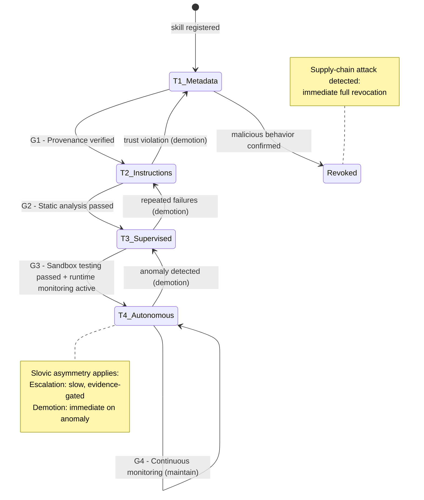

# Skill Trust and Lifecycle Governance

> The four-tier trust model, progressive disclosure as variety attenuation, trust escalation/demotion gates, supply-chain attacks as variety injection, and RBAC as variety engineering.

---

## The Four-Tier Trust Model

Skills (composable capability units loaded into agent containers) operate at different trust levels. Each tier maps to a cybernetic governance concept:

| Trust Tier | Access Level | Cybernetic Concept | Governance Model |
|-----------|-------------|-------------------|-----------------|
| **T1: Metadata** | Name, description, schema only | Black box methodology — observe declared interface only | No execution; variety fully attenuated |
| **T2: Instructions** | Read skill instructions and prompts | System 3 filtered channel — controlled information flow | Read access; operational model visible |
| **T3: Supervised** | Execute with approval gates | System 3* sporadic audit with mandatory approval | Sandboxed execution; output verified before commit |
| **T4: Autonomous** | Full autonomous execution | System 1 operational autonomy | Full delegation; monitored but not gated |

## Progressive Disclosure as Variety Attenuation

The context window is a **finite information channel** (Shannon). Loading full skill instructions for every available skill would exceed channel capacity, degrading signal quality. Progressive disclosure applies variety attenuation:

- **T1**: Only skill name + schema loaded → minimal channel consumption
- **T2**: Instructions loaded on-demand → variety admitted when needed
- **T3/T4**: Full operational context → variety admitted for execution

This is **information-theoretic variety engineering**: match the variety admitted to the channel to the variety needed for the current task. Don't load 50,000 tokens of skill instructions when 200 tokens of metadata suffice.

## Trust Escalation and Verification Gates

| Gate | Name | Cybernetic Function | Verification Method |
|------|------|--------------------|--------------------|
| **G1** | Provenance | Variety filtering — reject unverified sources | Signature verification, source registry check |
| **G2** | Static Analysis | Model validation — verify declared vs. actual behavior | AST analysis, permission scanning, dependency audit |
| **G3** | Sandbox Testing | System 3* audit — sporadic direct probe in isolated environment | Sandboxed execution, output validation, resource monitoring |
| **G4** | Runtime Monitoring | Continuous System 3 — operational monitoring during autonomous execution | Behavioral drift detection, resource consumption tracking |

## Trust Demotion as Algedonic Signal

Trust demotion follows **Slovic asymmetry** (1993): trust is destroyed faster than it is built. A single anomalous behavior triggers immediate demotion, while escalation requires sustained evidence through multiple gates.

Demotion triggers (algedonic signals):
- **Resource anomaly** — skill consuming unexpected resources (variety injection attempt)
- **Output divergence** — skill producing results inconsistent with declared capability
- **Permission escalation** — skill attempting operations beyond its declared scope
- **Behavioral drift** — skill's behavior changing over time without corresponding version change

## Supply-Chain Attacks as Variety Injection

A malicious skill is a **variety injection attack** — it introduces uncontrolled variety into the system through a trusted channel. The cybernetic defense:

1. **Attenuation at intake** (G1): Reject skills from unverified sources
2. **Model verification** (G2): Verify that declared capability matches actual behavior
3. **Sandboxed observation** (G3): Run in isolated environment, observe actual variety produced
4. **Runtime containment** (G4): Bound the variety a skill can express even at T4

## RBAC as Variety Engineering

Role-Based Access Control for skills is **variety engineering** at the governance layer:

- **Roles attenuate** the variety of operations available to each actor
- **Permissions amplify** specific actors' variety for their domain
- **Separation of duties** prevents any single actor from expressing the full system variety
- **Least privilege** minimizes the regulatory interface between each actor and the system
