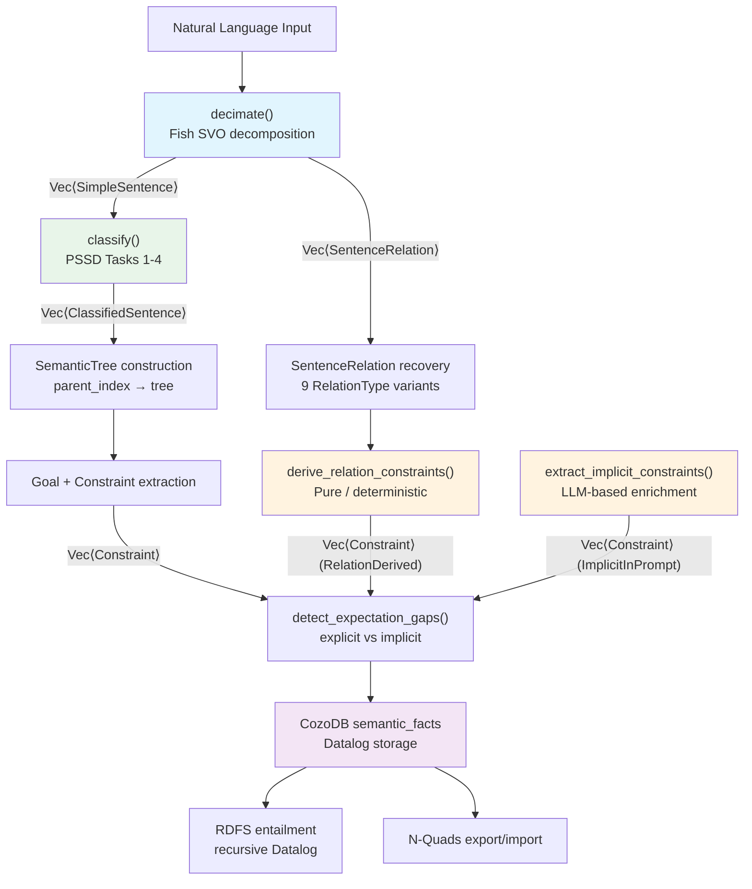
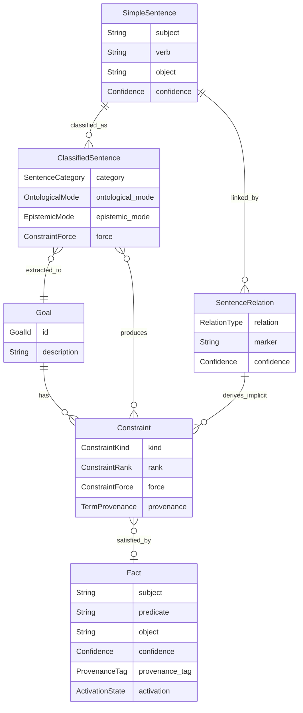

# Pragmatic Semantics

## Overview

A **pragmatic semantic analysis framework** treating meaning as grounded in practical consequences (James 1907). Integrates three disciplines: (1) the PSSD pipeline transforming natural language through SVO decomposition, ontological/epistemic classification, constraint extraction, and Datalog storage with RDFS entailment; (2) reference model diagramming anchoring every function on a formal model with Mermaid visualization and traceable implementation alignment; (3) spaCy-grounded linguistic analysis underpinning the Fish sentence decomposition. Extended with neuro-symbolic dual-memory architecture, agent cognitive graph memory, semantic interoperability protocols (MCP/A2A/ANP), KG reasoning (SymAgent), and semantic skill specification.

The "pragmatic" modifier means: prefer actionable consequences over abstract correctness. When full satisfaction is impossible, relax guidelines (never guardrails or prohibitions) in epistemic-strength order.

## When to Use This Skill

- Design/implement semantic type systems, knowledge representation, or Datalog inference
- Implement PSSD pipeline stages, Fish-sentence SVO decomposition, or constraint extraction
- Work with RDFS entailment, OWL-RL reasoning, or ontology discovery
- Implement constraint systems (guardrails, prohibitions, guidelines, OT ranking)
- Work with provenance tracking, confidence propagation, or semiring algebra
- Implement RDF import/export (N-Quads) or CozoDB Datalog queries
- Design conversational discourse types (Turn, SpeechAct, DiscourseRelation)
- Work with implicit constraint extraction or expectation gap detection
- Create reference model diagrams, verify diagram-code alignment, or choose diagram types
- Design NLP pipelines for semantic extraction, extend SVO decomposition
- Implement neuro-symbolic architectures, agent cognitive memory, or belief revision
- Work with MCP/A2A/ANP semantic interoperability or skill routing

## When NOT to Use This Skill

- For Rust code refactoring → use `rust-expertise` skill
- For cybernetic/control-theory aspects → use `pragmatic-cybernetics` skill
- For pixel-perfect design mockups or interactive UI → use Figma or D3.js
- For LLM prompt engineering or generative AI → spaCy handles NLU, not NLG

---

## Pipeline Overview (Mermaid)



---

## Quick Reference Table

| Concept | Implementation | Reference | Status |
|---------|---------------|-----------|--------|
| IS/OUGHT distinction | `OntologicalMode::Descriptive \| Prescriptive` | Hare (1952), Hume (1739) | ✅ |
| Mood/Modality | `EpistemicMode::Declarative \| Subjunctive \| Probabilistic` | Palmer (2001) | ✅ |
| Constraint classification | `ConstraintForce::from_modality()` → 5 variants | PSSD Task 4 | ✅ |
| Force graduation | `Tone{Straight, Tentative(f64), Oneiric}` | Austin (1962) §2.4.6 | ✅ |
| Atomic semantic unit | `SimpleSentence{subject, verb, object, source_span, confidence}` | Fish (2011) | ✅ |
| Classified semantic unit | `ClassifiedSentence` + PSSD 1-4 + `UtteranceForm` + `PredicateType` | PSSD Tasks 1-4 | ✅ |
| Sentence category | `SentenceCategory::Goal \| Constraint \| Task` | DCT pipeline | ✅ |
| Inter-sentence relations | `RelationType` — 9 variants | Architecture §3 | ✅ |
| Term provenance | `TermProvenance` — 4 variants (DirectlyStated, Implicit, Inherited, RelationDerived) | Architecture §4 | ✅ |
| Triple storage | CozoDB `semantic_facts{fact_id => subject, ..., valid_from: String, valid_to: String, ...}` | RDF 1.1 | ✅ |
| Subclass entailment | CozoDB recursive Datalog on `rdfs_classes` | RDFS Semantics | ✅ |
| Constraint ranking | `ConstraintRank` (OT-style) | Prince & Smolensky (2004) | ✅ |
| Constraint distribution | `ConstraintDistribution::PerGoal \| Combined \| Sequential` | Cross-goal semantics | ✅ |
| Discourse framework | `Turn`, `SpeechAct`, `DiscourseRelation`, `EpistemicLevel` | ADR-019 | ✅ |
| Confidence propagation | `ProvenanceSemiring` (MinMax, Product) | Li et al. (2023) | ✅ |
| Memory decay | `ActivationState` power-law B_i = ln(Σ t_j^{-d}) | Anderson & Lebiere (1998) | ✅ |
| RDF interop | N-Quads export/import with `http://discourse.dev/` namespace | W3C N-Quads | ✅ |
| Pragmatic fallback | Relax guidelines in epistemic order, never relax guardrails/prohibitions | James (1907) | ✅ |
| Reference model diagrams | Mermaid flowchart/state/ER/sequence/class for formal models | Sveidqvist (2014) | ✅ |
| Reference-implementation alignment | Diagram metadata + alignment verification | AGENTS.md policy | ✅ |
| SVO linguistic grounding | spaCy POS/dep/NER pipeline for Fish decomposition | Honnibal & Montani (2017) | ✅ |
| Dependency parsing | Arc-eager transition-based parser for syntactic structure | Universal Dependencies | ✅ |
| Modal/hedge detection | spaCy Matcher patterns for PSSD epistemic axis | Pattern matching | ✅ |

---

## Semantic Type Relationships (ER Diagram)



---

## Semantic Anti-Pattern Table

| Anti-Pattern | What Goes Wrong | Correct Approach |
|---|---|---|
| **Treating all constraints as guidelines** | Guardrails can be violated; user requirements ignored | Always check `ConstraintForce` — guardrails/prohibitions are inviolable |
| **Using `Option<String>` for `source_span`** | Type mismatch — actual type is `Option<(usize, usize)>` | Use byte offset tuple for traceability |
| **Storing `valid_from`/`valid_to` as Int** | Schema mismatch — actual CozoDB schema uses `String` (RFC 3339) | Use `String` type with `to_rfc3339()` |
| **Parameterizing `@` in time-travel** | CozoDB parser rejects `$param` in `@` position | Embed timestamp directly in query string via `format!()` |
| **Ignoring `Tone` in confidence** | Missing force graduation; `Tentative` items treated as `Straight` | Apply `effective_weight = confidence.value() * tone.factor()` |
| **Conflating OntologicalMode with EpistemicMode** | IS/OUGHT and certainty are orthogonal axes | Cross them via the 2×3 classification matrix → 5-variant ConstraintForce |
| **Skipping `TermProvenance` on derived constraints** | Implicit constraints appear as directly stated; debugging impossible | Always set provenance: `RelationDerived`, `ImplicitInPrompt`, `ContextuallyInherited` |
| **Treating Evidence/Hypothesis as violable constraints** | They are informational, not enforcement — `is_met()` always returns true | Use them as context, not constraints; do not add to constraint satisfaction checks |
| **Using infix `or` in CozoDB** | Syntax error — CozoDB uses function-call form | Use `or(expr1, expr2, expr3)` |
| **Flattening SentenceRelation → Constraint without the mapping table** | Wrong constraint kinds/forces; Scope relations should be Guardrails | Follow the `derive_relation_constraints()` mapping table exactly |
| **Diagram without reference model citation** | No anchor for alignment verification; diagram drifts from theory | Every diagram must cite its reference model in metadata block |
| **Implementation diagram that doesn't match code** | Misleading documentation; false confidence in alignment | Update diagram when code changes; verify via alignment checklist |
| **Using `en_core_web_sm` for semantic similarity** | Small models lack word vectors; similarity returns 0.0 | Use `en_core_web_lg` or `en_core_web_trf` for similarity tasks |
| **Processing text in a loop with `nlp()`** | Creates new Doc each time, slow | Use `nlp.pipe(texts)` for batch processing |

---

## Semantic Review Checklist

Before merging any change that touches the pragmatic semantics pipeline, verify all items:

| # | Check | Rationale |
|---|-------|-----------|
| 1 | Every `ClassifiedSentence` carries `ontological_mode`, `epistemic_mode`, `force` | PSSD Tasks 1-4 traceability |
| 2 | `ConstraintForce` is derived via `from_modality()` or `from_modality_with_prohibition()`, never hardcoded | Linguistic grounding |
| 3 | Guardrail/Prohibition `is_met()` uses ε-tolerance (1e-9), not exact `== 1.0` | Floating-point safety |
| 4 | `composed_satisfaction()` returns `None` for leaves and Evidence/Hypothesis | Contract: only tree-composition for applicable forces |
| 5 | `TermProvenance` is set on every constraint (never left as default when actually derived) | Debuggability and trust |
| 6 | `Tone` is propagated through `ContextItem` and applied in confidence calculations | Force graduation correctness |
| 7 | CozoDB `valid_from`/`valid_to` stored as RFC 3339 `String`, not `Int` | Schema compatibility |
| 8 | Time-travel `@` timestamp embedded in query string, not as `$param` | CozoDB parser limitation |
| 9 | Text search uses `or()` function-call form | CozoDB syntax requirement |
| 10 | `SentenceRelation` → constraint mapping follows the 4-rule table | Deterministic derivation correctness |
| 11 | Discourse `Turn` annotations are all `Option` (progressive annotation invariant) | Capture-first, annotate-later design |
| 12 | `SpeechAct` classification maps correctly to Discourse operations (Directive→Goal, Assertive→Fact, etc.) | Discourse-to-cycle integration |
| 13 | All file paths from skill use `../../` prefix (not `../`) | Relative path from `skills/pragmatic-semantics/` |
| 14 | Spec claims use `PSSD Spec:` prefix; code claims use `Implementation:` prefix | Prevent spec/code conflation |
| 15 | Every new function/subsystem has reference diagram + implementation diagram | Reference-implementation alignment discipline |
| 16 | Diagram alignment metadata block is present and `verified_date` is current | AGENTS.md diagram alignment policy |
| 17 | Mapping table documents all divergences between reference and implementation | No silent drift between theory and code |
| 18 | Mermaid diagrams render correctly in GitHub Markdown | Platform compatibility |

---

## Routing Decision Tree

```
Is the task about...?
├── PSSD pipeline, Fish SVO, classification, Tone, UtteranceForm, PredicateType?
│   └── → references/pssd-pipeline.md
├── Constraints, forces, OT ranking, composed_satisfaction, distribution?
│   └── → references/constraint-system.md
├── CozoDB, Datalog, RDFS, queries, N-Quads?
│   └── → references/datalog-store.md
├── Discourse, turns, speech acts, epistemic levels?
│   └── → references/discourse-framework.md
├── Provenance, confidence, memory decay, semirings?
│   └── → references/provenance-confidence.md
├── Diagramming, alignment, Four Artifacts, Mermaid syntax?
│   └── → references/diagramming-discipline.md (+ mermaid-*.md for full syntax)
├── Inter-sentence relations, implicit constraints, TermProvenance?
│   └── → references/implicit-extraction.md
├── Neuro-symbolic, dual-memory, OWL-RL, SHACL, ontology builder?
│   └── → references/neuro-symbolic.md
├── Agent memory, belief revision, typed edges, consolidation?
│   └── → references/cognitive-memory.md
├── MCP/A2A/ANP semantic interop, tool discovery, OASF?
│   └── → references/semantic-interop.md
├── KG reasoning, SymAgent, materialization, defeasible reasoning?
│   └── → references/kg-reasoning.md
├── Skill specification, routing, progressive disclosure, trust?
│   └── → references/skill-specification.md
├── NLP pipeline, spaCy, linguistic markers, POS/dep/NER?
│   └── → references/spacy-linguistic-model.md (+ spacy-pipeline-components.md)
└── Mermaid syntax (full 19+ types), theming, rendering, CLI?
    └── → references/mermaid-diagram-types.md (+ mermaid-rendering-and-config.md)
```

---

## Framework Component Maturity

| Component | Status |
|-----------|--------|
| PSSD specification | ✅ Stable |
| Fish-RDF encoding bridge | ✅ Stable |
| SVO encoding verbs | ✅ Stable |
| Extraction pipeline | ✅ Stable |
| Linguistic classifiers | ✅ Stable |
| Implicit constraint extraction | ✅ Stable |
| Fact types | ✅ Stable |
| Sentence types | ✅ Stable |
| Constraint types | ✅ Stable |
| Conversational discourse framework | ✅ Stable |
| Datalog semantic store | ✅ Stable |
| RDFS entailment | ✅ Stable |
| Provenance engine | ✅ Stable |
| Activation state (ACT-R) | ✅ Stable |
| Expectation gap detection | 🚧 Functional, heuristic |
| Tone propagation in pipeline | ✅ Type defined, 🚧 full integration |
| Cross-goal constraint distribution | ✅ Type defined, 🔲 full multi-goal solver |
| Reference model diagramming discipline | ✅ Defined |
| Mermaid syntax and rendering | ✅ Stable |
| Linguistic analysis foundations | ✅ Stable |
| Neuro-symbolic knowledge architecture | ✅ Defined |
| Agent cognitive graph memory | ✅ Defined |
| Semantic interoperability protocols | ✅ Defined |
| KG reasoning for agents | ✅ Defined |
| Semantic skill specification | ✅ Defined |

---

## Linked Reference Files

| File | Read When | Content |
|------|-----------|---------|
| [references/pssd-pipeline.md](references/pssd-pipeline.md) | Working on PSSD Tasks 1-7, Fish SVO decomposition, Tone, UtteranceForm, PredicateType, DCT pipeline, linguistic grounding | Full PSSD pipeline specification, type definitions, DCT diagrams, spaCy-to-PSSD mapping, pattern matching |
| [references/constraint-system.md](references/constraint-system.md) | Working with ConstraintForce, OT ranking, composed_satisfaction, ConstraintKind, ConstraintDistribution | Force hierarchy, satisfaction thresholds, composition rules, AcquisitionMethod taxonomy |
| [references/datalog-store.md](references/datalog-store.md) | CozoDB schema, Datalog queries, RDFS entailment, time-travel, N-Quads export/import | Complete CozoDB `:create` schema, query patterns (supersession, transitive closure, text search), RDF interop |
| [references/discourse-framework.md](references/discourse-framework.md) | Conversational structure: Turn, SpeechAct, discourse relations, epistemic levels | Austin/Searle speech act taxonomy, Turn type structure, RelationKind variants, EpistemicLevel mapping |
| [references/provenance-confidence.md](references/provenance-confidence.md) | Provenance tracking, confidence propagation, memory decay | ProvenanceSemiring trait, MinMax/Product semirings, DerivationPath, ACT-R ActivationState |
| [references/diagramming-discipline.md](references/diagramming-discipline.md) | Creating/verifying reference model diagrams, alignment discipline, diagram type selection | Four Artifacts, alignment steps, mapping table format, worked example, diagram type selection, Mermaid syntax quick reference, best practices and anti-patterns |
| [references/implicit-extraction.md](references/implicit-extraction.md) | Inter-sentence relations, derive_relation_constraints(), TermProvenance | 9 RelationType variants, deterministic derivation mapping table, 4 TermProvenance variants |
| [references/neuro-symbolic.md](references/neuro-symbolic.md) | Neuro-symbolic architecture, dual-memory, OWL-RL, SHACL, ontology builder | Dual-memory diagram, CozoDB mapping, ontology builder pipeline, CAR pipeline, OWL-RL Datalog patterns, PROV-O |
| [references/cognitive-memory.md](references/cognitive-memory.md) | Agent memory, belief revision, typed edges, consolidation, multi-agent | Six edge types, AGM postulates, TermProvenance-to-edge mapping, consolidation phases, shared memory |
| [references/semantic-interop.md](references/semantic-interop.md) | MCP/A2A/ANP integration, tool discovery, OASF, capability exchange | MCP primitives, A2A Agent Cards, two-stage routing diagram, OASF taxonomy, protocol comparison, N-Quads interchange |
| [references/kg-reasoning.md](references/kg-reasoning.md) | KG reasoning, SymAgent patterns, OWL-RL materialization, defeasible reasoning | Three-agent architecture, PSSD-to-KG mapping, OWL-RL strategies, materialization loop, Datalog extensions, incompleteness handling |
| [references/skill-specification.md](references/skill-specification.md) | Skill routing, progressive disclosure, skill composition, trust lifecycle | SKILL.md as semantic artifact, variety attenuation, PSSD routing diagram, CSP composition, trust levels |
| [references/mermaid-diagram-types.md](references/mermaid-diagram-types.md) | Need full syntax for a specific Mermaid diagram type | All 19 Mermaid diagram types with complete syntax, examples, and formal models |
| [references/mermaid-rendering-and-config.md](references/mermaid-rendering-and-config.md) | Configuring themes, directives, CLI, platform integration | Rendering pipeline, theme variables, `classDef` styling, `mmdc` CLI, accessibility |
| [references/spacy-linguistic-model.md](references/spacy-linguistic-model.md) | Understanding POS tags, dependencies, entity encoding, vectors | Complete Universal Dependencies POS tags, dependency relations, NER types, morphological features, Matcher patterns |
| [references/spacy-pipeline-components.md](references/spacy-pipeline-components.md) | Building custom components, training, transformer integration | Custom component API, EntityRuler, spacy-transformers, `config.cfg` training, Prodigy workflows |

---

## Theoretical Foundation Cross-References

| Topic | Key Reference | Relevance |
|-------|-------------|-----------|
| Fish-RDF Encoding Bridge | Fish (2011), W3C RDF 1.1 | SVO → RDF triple conversion |
| Conversational Discourse Framework | Austin (1962), Searle (1969), Mann & Thompson (1988) | Turn, SpeechAct, first-class types |
| Provenance Semiring | Green et al. (2007), Li et al. (2023) | Confidence propagation algebra |
| ACT-R Activation | Anderson & Lebiere (1998) | Memory decay model |
| Constraint Enforcement | Prince & Smolensky (2004) | OT-style constraint ranking |
| IS/OUGHT Classification | Hare (1952), Hume (1739) | Ontological mode axis |
| Neuro-Symbolic Integration | Hitzler et al. (2022), Garcez et al. (2019) | Dual-memory architecture combining symbolic + subsymbolic |
| AGM Belief Revision | Alchourrón, Gärdenfors, Makinson (1985) | Formal postulates for agent belief update |
| SHACL Validation | W3C SHACL (2017) | Shape constraints for RDF graph validation |
| OWL-RL Reasoning | W3C OWL 2 Profiles (2012) | Tractable subset of OWL for rule-based materialization |
| PROV-O Ontology | W3C PROV-O (2013) | Provenance interchange in named graphs |
| MCP Protocol | Anthropic (2024) | Model-context integration primitives |
| A2A Protocol | Google (2025) | Agent-to-agent capability advertisement |
| Shannon Channel Capacity | Shannon (1948) | Information-theoretic basis for progressive disclosure |
| Ashby's Law of Requisite Variety | Ashby (1956) | Variety attenuation in skill routing |

---

**Version**: 5.0.0
**Last Updated**: 2026-05-08
**Merged from**: pragmatic-semantics v4.0.0 (extended with neuro-symbolic architecture, cognitive memory, interoperability protocols, KG reasoning, semantic skill specification)
