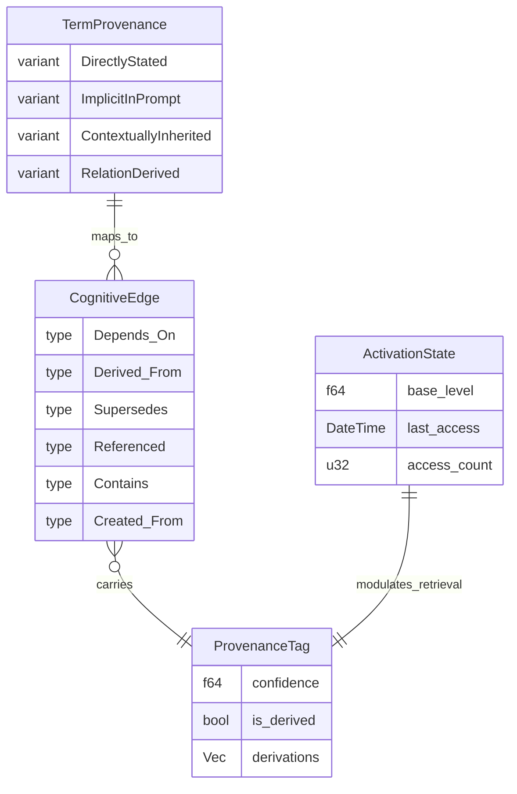

# Cognitive Memory

Agent Memory as Cognitive Graph: six typed edge types, belief revision (AGM postulates), memory consolidation, multi-agent shared memory, and mapping to existing types.

---

## Agent Memory as Cognitive Graph

Agent memory is not a flat key-value store — it is a **cognitive graph** with typed edges, immutable revisions, and formal belief revision semantics. This section defines the graph-native memory architecture that extends the existing `Fact`, `ProvenanceTag`, and `ActivationState` types into a full cognitive substrate.

### Graph-Native Cognitive Memory (Kumiho Architecture)

The memory graph consists of:

- **Nodes** — immutable content-addressed revisions (facts, experiences, beliefs, plans)
- **Tag pointers** — mutable named references to specific revisions (analogous to git refs)
- **Typed edges** — directed, labeled relationships carrying semantic meaning
- **URI addressing** — every node is globally addressable via `mem://{agent_id}/{node_hash}`

### Six Typed Edge Types

| Edge Type | Semantics | Formal Property | Example |
|-----------|-----------|-----------------|---------|
| `Depends_On` | Validity dependency — if target is retracted, source validity is questionable | Transitive | "Conclusion C `Depends_On` Premise P" |
| `Derived_From` | Evidential provenance — source was computed/extracted from target | Transitive, Irreflexive | "Summary S `Derived_From` Document D" |
| `Supersedes` | Belief revision — source replaces target as current belief | Anti-symmetric, Irreflexive | "Fact_v2 `Supersedes` Fact_v1" |
| `Referenced` | Associative mention — weak link indicating co-occurrence | Symmetric | "Plan P `Referenced` Entity E" |
| `Contains` | Bundle membership — source is a collection containing target | Anti-symmetric, Transitive | "Session S `Contains` Turn T" |
| `Created_From` | Generative lineage — source was produced by process applied to target | Irreflexive | "Response R `Created_From` Prompt P" |

### Mapping to Existing Types

| `TermProvenance` Variant | Primary Edge Type | Rationale |
|--------------------------|-------------------|-----------|
| `DirectlyStated` | `Created_From` (user input) | User utterance → fact |
| `ImplicitInPrompt` | `Derived_From` (extraction) | LLM inference from context |
| `ContextuallyInherited` | `Depends_On` (session) | Carried forward from prior turn |
| `RelationDerived` | `Derived_From` (rule) | Produced by `derive_relation_constraints()` |

### Formal Belief Revision (AGM Postulates)

When new evidence contradicts existing beliefs, agents apply AGM-style revision (Alchourrón, Gärdenfors, Makinson 1985):

1. **Success** — the new information is always accepted into the belief set
2. **Inclusion** — revision does not add beliefs beyond what is required by the new information
3. **Vacuity** — if the new information is consistent with existing beliefs, revision = expansion
4. **Consistency** — the revised belief set is consistent (unless the new information itself is contradictory)
5. **Minimal change** — retract as few existing beliefs as possible

**Implementation mapping:** When a `Supersedes` edge is created, the system:
- Marks the superseded node's `ActivationState` for accelerated decay
- Propagates retraction along `Depends_On` edges (transitively — beliefs depending on retracted beliefs are also questioned)
- Recomputes confidence via `ProvenanceSemiring` for affected derivation paths

### Memory Consolidation

Asynchronous LLM-driven consolidation compresses memory over time:

| Phase | Trigger | Operation | ACT-R Analog |
|-------|---------|-----------|--------------|
| **Decay** | `ActivationState` below threshold | Node marked dormant (not deleted) | Power-law decay: B_i = ln(Σ t_j^{-d}) |
| **Compression** | N dormant nodes in cluster | LLM summarizes cluster → single node with `Derived_From` edges | Chunk formation |
| **Restructuring** | Contradiction detected | Belief revision → `Supersedes` edges | Retrieval-induced forgetting |
| **Promotion** | Repeated access pattern | Increase base-level activation | Frequency × recency strengthening |

### Multi-Agent Shared Memory

The same cognitive graph serves as shared memory in multi-agent systems. Agent outputs are nodes with `Created_From` edges tracing to the agent's process. Other agents discover these via:
- Graph traversal (follow `Contains` edges within a shared session)
- Vector similarity (find relevant outputs regardless of graph position)
- Type queries (Datalog: find all nodes of type `Plan` with `Depends_On` edges to a given `Goal`)

This maps directly to the kask bitemporal store: each agent writes to its own named graph, time-travel queries let agents observe each other's state at any point.
