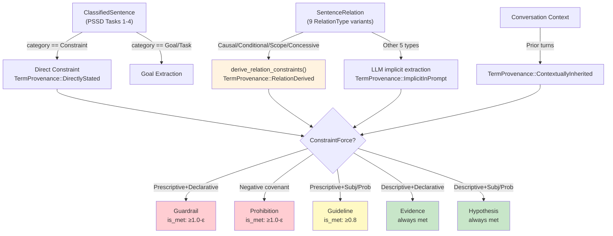

# Constraint System

ConstraintForce hierarchy, ConstraintKind with OT ranking, composed_satisfaction, ConstraintDistribution, and the constraint type hierarchy diagram.

---

## The Constraint System

Constraints are the typed output of the PSSD pipeline, with OT-style ranking (Prince & Smolensky 2004) and tree-structured propagation (Dechter 2003).

**ConstraintForce hierarchy:** `Guardrail ≈ Prohibition (inviolable) >> Guideline (relaxable) >> Evidence ≈ Hypothesis (informational)`

**Implementation:** `ConstraintForce` — 5 variants:

| Variant | Ontological × Epistemic | `is_met()` threshold | Composed |
|---------|------------------------|---------------------|----------|
| `Guardrail` | Prescriptive + Declarative | ≥ 1.0 - ε (ε = 1e-9) | Conjunctive (min) |
| `Prohibition` | Prescriptive + negative covenant | ≥ 1.0 - ε | Conjunctive (min) |
| `Guideline` | Prescriptive + Subjunctive/Probabilistic | ≥ 0.8 | Average (mean) |
| `Evidence` | Descriptive + Declarative | Always true | Not composed |
| `Hypothesis` | Descriptive + Subjunctive/Probabilistic | Always true | Not composed |

**`composed_satisfaction()` API:**

```rust
/// Returns None for: leaf constraints, children not found, Evidence/Hypothesis force.
pub fn composed_satisfaction(&self, all_constraints: &[Constraint]) -> Option<Confidence>
```

Composition rules: Guardrail/Prohibition → conjunctive `min()` of children; Guideline → `mean()` of children.

**ConstraintDistribution — cross-goal semantics:**

| Variant | Meaning |
|---------|---------|
| `PerGoal` (default) | Applies to each goal independently |
| `Combined` | Applies to the combined result across goals |
| `Sequential` | Applies to the order/sequence of goals |

**ConstraintKind:** 9 categories with OT rank ranges:

| Kind | Default Rank | Range |
|------|-------------|-------|
| Temporal | 35 | 31-40 |
| Entity | 45 | 41-50 |
| Relational | 55 | 51-60 |
| Value | 65 | 61-70 |
| Confidence | 75 | 71-80 |
| Coherence | 85 | 81-90 |
| Format | 95 | 91-100 |
| Scope | 105 | 101-110 |
| Quality | 115 | 111-120 |

---

## Constraint Type Hierarchy (Mermaid)



---

## AcquisitionMethod Taxonomy

**Implementation:** `AcquisitionMethod` — 28 variants (`#[non_exhaustive]`), groupable into categories:

| Category | Variants |
|----------|---------|
| **User Input** | `UserInput`, `TextMessage`, `StructuredMessage`, `RichMessage` |
| **LLM Generation** | `LlmGeneration`, `SparAdvocateLlm`, `SparCriticLlm` |
| **Inference** | `ForwardChaining`, `BackwardChaining`, `DefeasibleReasoning`, `NativeInference`, `CognitiveReasoning` |
| **Memory/Retrieval** | `VectorSimilarity`, `SemanticRecall`, `SkillExtraction`, `SeedKnowledge` |
| **Encoding Pipeline** | `Structure`, `Print` |
| **External** | `Delegation`, `Import`, `ActualizerOutput`, `DtrustModule` |
| **System** | `DiffMutation`, `BlackboardPublish`, `OkhEvidence`, `AsExperience` |
| **Special** | `Test`, `Custom(String)` |
