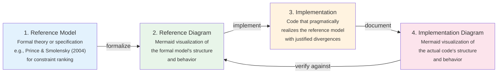
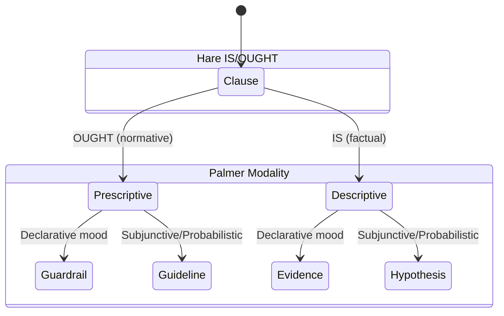
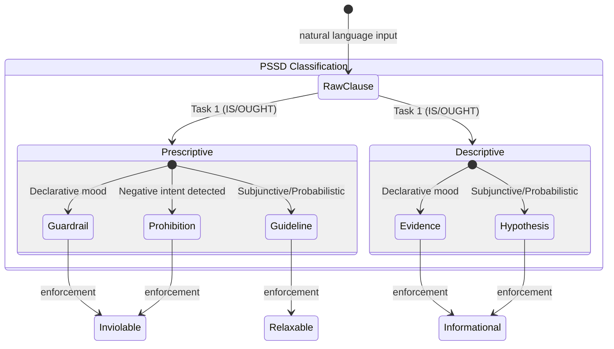
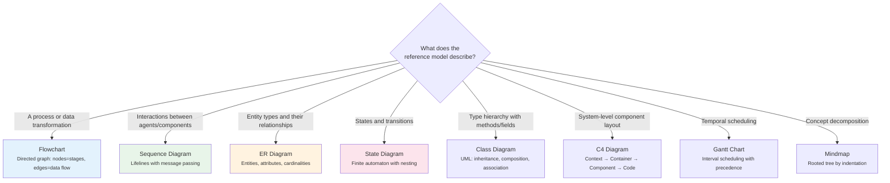

# Diagramming Discipline

The Semantic Discipline (Reference Model to Implementation), the Four Artifacts, Alignment Verification, Diagram Type Selection, Mapping Tables, and Mermaid best practices.

---

## The Semantic Discipline — Reference Model to Implementation

> **This is the central organizing principle of the pragmatic semantics skill.** Every function in Discourse exists in a chain: **Reference → Diagram → Code → Diagram → Verification**.

### The Four Artifacts

For every non-trivial function or subsystem, four artifacts must exist:



| Artifact | Purpose | Form | Example |
|----------|---------|------|---------|
| **Reference Model** | The formal theory being implemented | Academic paper, specification, ADR | Prince & Smolensky (2004) for OT ranking |
| **Reference Diagram** | Visual specification of what the code *should* do | Mermaid in docs/ or spec | State diagram of constraint force classification |
| **Implementation** | The actual code | Source files | `ConstraintForce::from_modality()` |
| **Implementation Diagram** | Visual documentation of what the code *does* do | Mermaid in doc comments or docs/ | Flowchart of actual `from_modality()` logic |

### The Alignment Discipline

**Step 1: Identify the reference model.** Before writing any function, cite the formal reference. This is not optional — it is the anchor that prevents implementation drift.

**Step 2: Diagram the reference model.** Choose the Mermaid diagram type that best captures the formal model's structure (see §Diagram Type Selection for Semantic Systems below). This diagram is the *specification*.

**Step 3: Implement pragmatically.** Write the code. The implementation may diverge from the reference model — this is expected and necessary (pragmatism). Every divergence must be documented with a rationale.

**Step 4: Diagram the implementation.** Create a Mermaid diagram of what the code actually does. This diagram is the *documentation*.

**Step 5: Map and verify.** Overlay the reference diagram and implementation diagram. Every node/edge in the reference diagram should have a corresponding element in the implementation diagram. Divergences must be listed in a mapping table.

### Mapping Table Format

Every function with a reference model should include a mapping table in its documentation:

| Reference Model Element | Implementation Element | Status | Divergence Rationale |
|------------------------|----------------------|--------|---------------------|
| OT Constraint ranking (strict dominance) | `ConstraintRank` with u32 ranges | ✅ Aligned | Discrete rank ranges approximate strict dominance |
| 2-variant ConstraintForce {Guardrail, Guideline} | 5-variant `ConstraintForce` | ⚠️ Extended | Evidence/Hypothesis for descriptive clauses, Prohibition for negative covenants |
| Harmonic grammar (continuous weights) | Not implemented | 🔲 Gap | OT ranking sufficient for current use; HG reserved for future |

### Diagram Alignment Metadata

Per AGENTS.md requirements, all diagrams must carry alignment metadata:

```
<!-- DIAGRAM_ALIGNMENT
id: DIAG-SEM-001
verified_date: YYYY-MM-DD
verified_against: src/core/constraint.rs
reference_sources: Prince & Smolensky (2004), Hare (1952)
status: VERIFIED
mapping_table: docs/mappings/constraint-force-alignment.md
-->
```

### Alignment Verification Checklist

Before claiming any diagrammed function is aligned:

| # | Check | Method |
|---|-------|--------|
| 1 | Reference model is cited with specific section/page | Visual inspection |
| 2 | Reference diagram exists and matches the cited model | Compare diagram against source text |
| 3 | Implementation diagram exists and matches the code | Trace code paths against diagram edges |
| 4 | Mapping table exists listing all elements | Completeness check — no orphan elements |
| 5 | Divergences are documented with rationale | Every ⚠️ or 🔲 has a non-empty rationale |
| 6 | Diagram metadata block is present and current | `verified_date` within 2 weeks or since last change |
| 7 | Both diagrams use consistent node naming | Reference `Guardrail` ↔ Implementation `Guardrail` (not `GR`) |

### Worked Example: Constraint Force Classification

**Reference model:** PSSD Spec (§8), extending Hare (1952) IS/OUGHT × Palmer (2001) Mood/Modality.

**Reference diagram** (what the theory says):



**Implementation diagram** (what the code does):



**Mapping table:**

| Reference (Hare × Palmer) | Implementation (PSSD) | Status | Divergence |
|---|---|---|---|
| Prescriptive + Declarative → Guardrail | `ConstraintForce::Guardrail` via `from_modality()` | ✅ Aligned | — |
| Prescriptive + Subj/Prob → Guideline | `ConstraintForce::Guideline` via `from_modality()` | ✅ Aligned | — |
| Descriptive + Declarative → (not in spec) | `ConstraintForce::Evidence` | ⚠️ Extended | Spec only covers prescriptive; descriptive clauses need a force type for pipeline uniformity |
| Descriptive + Subj/Prob → (not in spec) | `ConstraintForce::Hypothesis` | ⚠️ Extended | Same rationale as Evidence |
| (not in spec) | `ConstraintForce::Prohibition` via `from_modality_with_prohibition()` | ⚠️ Extended | Negative covenants ("must not", "never") are semantically distinct from positive guardrails; Austin (1962) negative performatives |
| Enforcement: Guardrail inviolable | `is_met()` threshold ≥ 1.0 - ε | ✅ Aligned | ε = 1e-9 for floating-point safety |
| Enforcement: Guideline relaxable | `is_met()` threshold ≥ 0.8 | ✅ Aligned | Threshold is heuristic; adjustable |

---

## Diagram Type Selection for Semantic Systems

Mermaid (Sveidqvist 2014) provides 19+ diagram types. For semantic system modeling, a subset of diagram types covers the overwhelming majority of needs. The selection should be driven by the **formal model** underlying the reference, not by aesthetic preference.

### Primary Diagram Types for Semantic Systems

| Communication Goal | Diagram Type | Formal Model | Discourse Usage |
|-------------------|-------------|--------------|------------|
| Data flow through a pipeline | **Flowchart** (`flowchart TD/LR`) | Directed graph G=(V,E) | PSSD pipeline, DCT extraction, constraint derivation |
| Message exchange between components | **Sequence** (`sequenceDiagram`) | Message Sequence Chart (ITU-T Z.120) | LLM ↔ Pipeline interaction, conversational turns |
| Type hierarchy and relationships | **ER Diagram** (`erDiagram`) | Entity-Relationship model (Chen 1976) | Semantic type relationships, Datalog schema |
| State transitions and lifecycles | **State Diagram** (`stateDiagram-v2`) | Finite Automaton (Q,Σ,δ,q₀,F) / Harel Statecharts | Constraint force classification, task lifecycle |
| Class/struct relationships | **Class Diagram** (`classDiagram`) | UML class metamodel | Type hierarchies, trait relationships |
| System architecture | **C4 Diagram** (`C4Context`) | C4 model (Brown 2011) | System-level views of semantic system components |

### Matching Reference Model to Diagram Type



### Core Mermaid Syntax Quick Reference

**Flowchart** — for pipelines and data flow:
```
flowchart TD          %% TD=top-down, LR=left-right
    A[Rectangle]  --> B(Rounded)
    B --> C{Diamond / Decision}
    C -->|Yes| D[[Subroutine]]
    C -->|No| E[(Database)]
    subgraph "Grouped Section"
        F --> G
    end
```

Node shapes: `[text]` rectangle, `(text)` rounded, `{text}` diamond, `((text))` circle, `[(text)]` stadium, `[[text]]` subroutine, `>text]` asymmetric, `{{text}}` hexagon.

Edge types: `-->` solid arrow, `---` solid line, `-.->` dotted arrow, `==>` thick arrow, `--text-->` labeled edge, `<-->` bidirectional.

**Sequence Diagram** — for component interactions:
```
sequenceDiagram
    participant C as Client
    participant S as Server
    C->>+S: Request        %% ->> solid (sync), -->> dashed (return)
    S-->>-C: Response      %% + activate, - deactivate
    alt Success
        C->>S: Process
    else Failure
        C->>S: Retry
    end
```

Blocks: `alt`/`else`, `opt`, `loop`, `par`, `critical`, `break`, `rect` (highlight).

**ER Diagram** — for data models:
```
erDiagram
    ENTITY_A ||--o{ ENTITY_B : "relationship"
    ENTITY_A { string name PK }
```

Cardinality: `||` exactly one, `o|` zero or one, `}|` one or more, `o{` zero or more.

**State Diagram** — for state machines:
```
stateDiagram-v2
    [*] --> StateA
    StateA --> StateB : event
    state StateA {
        [*] --> Nested
    }
```

**Class Diagram** — for type hierarchies:
```
classDiagram
    class Parent { +method() ReturnType }
    Parent <|-- Child : extends
    Parent *-- Owned : composition
    Parent o-- Ref : aggregation
```

For full syntax of all 19+ diagram types, see [mermaid-diagram-types.md](mermaid-diagram-types.md).
For theming, directives, CLI, and platform integration, see [mermaid-rendering-and-config.md](mermaid-rendering-and-config.md).

### Diagramming Best Practices for Reference Models

| Practice | Why |
|----------|-----|
| **One diagram per concept** | Split complex systems into focused diagrams that each map to a single reference |
| **Label every edge** | Unlabeled edges force the reader to infer semantics — this undermines the reference mapping |
| **Use subgraphs for reference boundaries** | Group nodes that correspond to a single section of the reference model |
| **Consistent node naming across reference and implementation diagrams** | Enables mechanical comparison; `Guardrail` in both, not `Guardrail` vs `GR` |
| **Direction follows data flow** | `TD` for hierarchies/pipelines, `LR` for temporal sequences |
| **Style sparingly for semantic meaning** | 2-3 colors max: one for inviolable, one for relaxable, one for informational |
| **Always include `accTitle` and `accDescr`** | Accessibility: screen readers need text alternatives for SVG diagrams |

### Diagramming Anti-Patterns

| Anti-Pattern | Problem | Fix |
|---|---|---|
| **Diagram without reference citation** | No way to verify alignment | Always cite the reference model in diagram metadata |
| **Implementation diagram without reference diagram** | No specification to verify against | Create the reference diagram first, always |
| **Everything in one diagram** | Unreadable; obscures reference mapping | Split into focused diagrams with explicit reference scope |
| **Diagram that doesn't match the code** | Misleading documentation; stale specification | Update diagram when code changes (AGENTS.md policy) |
| **Wrong diagram type for the formal model** | Sequence diagram for a state machine, etc. | Match the formal model's mathematical structure to the diagram type |
| **Hardcoded positions** | Fragile to content changes | Let dagre/ELK layout engine handle positioning |
