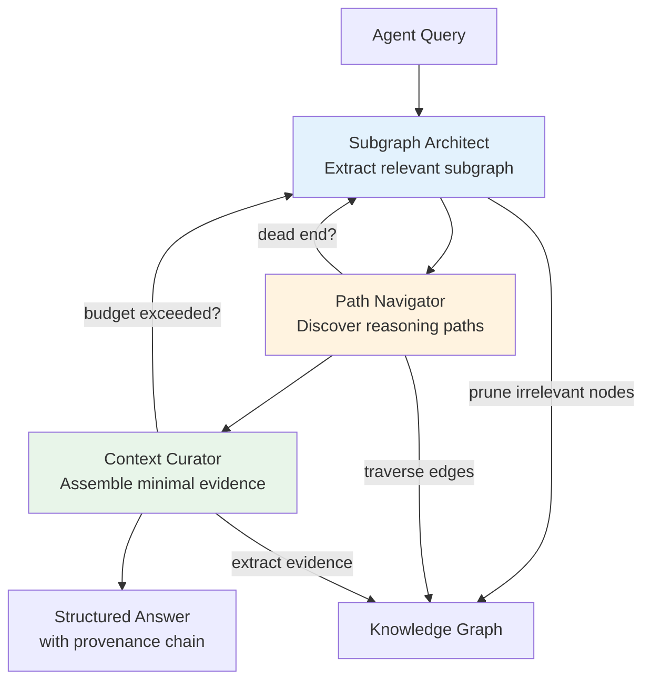

# Knowledge Graph Reasoning for Agents

SymAgent three-agent architecture, OWL-RL reasoning strategies, materialization loop, extending Datalog patterns, defeasible reasoning, and KG incompleteness handling.

---

## Knowledge Graph Reasoning for Agents

Knowledge graphs are not static databases — for agents, they are **dynamic environments** where complex reasoning unfolds as multi-step interactive processes. The SymAgent pattern treats the KG as a world to navigate, not merely a store to query.

### Three-Agent Architecture for KG Reasoning

| Agent Role | Operation | PSSD Pipeline Analog |
|------------|-----------|---------------------|
| **Subgraph Architect** | Edits graph structure — adds/removes nodes and edges to focus reasoning | Fish `compute_decimate()` — reduce to essential structure |
| **Path Navigator** | Discovers reasoning paths through the graph — which edges connect query to answer | PSSD Tasks 1-4 — classify relevance of each path segment |
| **Context Curator** | Assembles minimal evidence from traversed paths within token/step budget | Constraint extraction — budget as constraint, evidence as satisfier |



### Mapping to PSSD Pipeline

| PSSD Stage | KG Reasoning Operation | Shared Formal Basis |
|------------|----------------------|---------------------|
| Decimation (Fish SVO) | Subgraph extraction — reduce KG to relevant triples | Information compression: retain semantic core |
| Classification (Tasks 1-4) | Path assessment — which edges are relevant to query? | Categorization: IS (factual edges) vs OUGHT (constraint edges) |
| Constraint extraction | Budget-aware curation — token limits, step limits as constraints | OT ranking: hard budget = Guardrail, soft preference = Guideline |
| OT satisfaction | Path selection under competing constraints | Simultaneous satisfaction of relevance + budget + completeness |
| Provenance tracking | Derivation chain through graph — which edges support conclusion | `DerivationPath{rule_name, antecedent_ids, path_confidence}` |

### OWL-RL Reasoning Strategies

Beyond RDFS transitivity, full OWL-RL provides:

| Strategy | Rule Pattern | New Inferences |
|----------|-------------|----------------|
| **Symmetric closure** | `owl:SymmetricProperty(P)` ∧ `P(x,y)` → `P(y,x)` | Bidirectional relationships |
| **Transitive closure** | `owl:TransitiveProperty(P)` ∧ `P(x,y)` ∧ `P(y,z)` → `P(x,z)` | Multi-hop paths collapsed |
| **Inverse properties** | `owl:inverseOf(P,Q)` ∧ `P(x,y)` → `Q(y,x)` | Dual-direction traversal |
| **Property chains** | `owl:propertyChainAxiom(P,[Q,R])` ∧ `Q(x,y)` ∧ `R(y,z)` → `P(x,z)` | Composed relationships |
| **Has-value restriction** | `owl:hasValue(C,P,v)` ∧ `P(x,v)` → `rdf:type(x,C)` | Type inference from values |
| **Intersection/Union** | `owl:intersectionOf(C,[A,B])` ∧ `type(x,A)` ∧ `type(x,B)` → `type(x,C)` | Class composition |

### Materialization Loop

Fixed-point inference computes all derivable triples:

```
REPEAT:
    new_triples = apply_all_rules(current_graph)
    current_graph = current_graph ∪ new_triples
UNTIL new_triples = ∅
```

Each iteration's output carries `ProvenanceTag` with:
- `is_derived: true`
- `derivations` listing the rule applied and antecedent fact IDs
- `confidence` computed via the active `ProvenanceSemiring` (conjoin over premises)

### Extending Existing Datalog Patterns

| Existing Pattern | KG Reasoning Extension |
|-----------------|----------------------|
| `types[class] := *rdfs_types{entity, class}` | Base type assertion |
| `types[super] := types[sub], *rdfs_classes{subclass: sub, superclass: super}` | RDFS subclass transitivity |
| (new) `types[class] := *semantic_facts{subject: entity, predicate: p, object: v}, *owl_has_value{class, property: p, value: v}` | OWL has-value type inference |
| (new) `inferred[s, p, o] := *semantic_facts{subject: s, predicate: p, object: o}` | Base case for materialization |
| (new) `inferred[o, p, s] := inferred[s, p, o], *owl_symmetric{property: p}` | Symmetric closure |
| (new) `inferred[s, p, o] := inferred[s, p, mid], inferred[mid, p, o], *owl_transitive{property: p}` | Transitive closure |

### Defeasible Reasoning

When KG knowledge conflicts with LLM generation:

1. **KG facts with high confidence** (ProvenanceTag.confidence ≥ 0.9) override LLM assertions — KG is the ground truth layer
2. **KG facts with medium confidence** (0.5–0.9) trigger deliberation — the agent must explicitly reason about the conflict
3. **KG facts with low confidence** (<0.5) may be superseded by LLM evidence — create `Supersedes` edge with new provenance

This maps directly to ConstraintForce: KG high-confidence facts are **Guardrails** (inviolable), medium are **Guidelines** (relaxable with justification), low are **Hypotheses** (informational only).

### KG Incompleteness Handling

When the graph lacks an answer, bridge to external sources:

1. **Detect gap** — query returns empty or below confidence threshold
2. **Formulate external query** — transform graph query into natural language (reverse Fish: triple → sentence)
3. **Bridge via MCP** — invoke appropriate tool (web search, document retrieval, API call)
4. **Integrate result** — extract triples from response, validate via SHACL, persist with `AcquisitionMethod::Delegation` provenance
