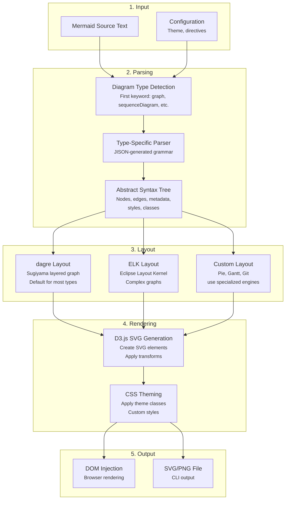

# Mermaid Rendering Pipeline, Configuration, and Integration

## Table of Contents

1. [Rendering Pipeline Architecture](#rendering-pipeline-architecture)
2. [Theming System](#theming-system)
3. [Directives and Configuration](#directives-and-configuration)
4. [CLI Usage](#cli-usage)
5. [Platform Integration](#platform-integration)
6. [Accessibility](#accessibility)
7. [Troubleshooting](#troubleshooting)

---

## Rendering Pipeline Architecture



### Stage Details

| Stage | Technology | Purpose |
|-------|-----------|---------|
| **Detection** | Regex on first line | Identifies diagram type from keyword (`graph`, `sequenceDiagram`, etc.) |
| **Parsing** | JISON (Bison for JS) | Each diagram type has its own grammar definition; produces type-specific AST |
| **Layout** | dagre (default) | Sugiyama-style layered graph drawing: rank assignment → ordering → coordinate assignment |
| **Layout** | ELK (optional) | More sophisticated layout for complex graphs; requires `%%{init: {"flowchart": {"useMaxWidth": false}} }%%` |
| **Rendering** | D3.js | Creates SVG elements (rect, path, text, polygon) from layout coordinates |
| **Theming** | CSS classes | Theme-defined CSS variables applied to SVG elements |

### Layout Engines

**dagre** (default): Based on Sugiyama et al. (1981) layered graph drawing algorithm. Assigns nodes to layers (ranks), minimizes edge crossings within layers, and computes coordinates. Suitable for most diagrams. [GitHub](https://github.com/dagrejs/dagre)

**ELK** (optional): Eclipse Layout Kernel, a more sophisticated layout engine supporting multiple layout algorithms (layered, force-directed, radial, box). Better for large or complex graphs. Requires explicit opt-in.

---

## Theming System

### Built-in Themes

| Theme | Description | Best For |
|-------|-------------|----------|
| `default` | Light background, blue nodes | General documentation |
| `dark` | Dark background, light nodes | Dark-mode documentation |
| `forest` | Green tones | Nature/environmental docs |
| `neutral` | Grayscale | Print-friendly, formal docs |
| `base` | Minimal, fully customizable | Custom branding |

### Applying Themes

```
%%{init: {'theme': 'dark'}}%%
graph TD
    A --> B
```

### Custom Theme Variables

```
%%{init: {
    'theme': 'base',
    'themeVariables': {
        'primaryColor': '#4a86c8',
        'primaryTextColor': '#fff',
        'primaryBorderColor': '#3a76b8',
        'lineColor': '#555',
        'secondaryColor': '#ff8c00',
        'tertiaryColor': '#e8f5e9',
        'fontFamily': 'Inter, sans-serif',
        'fontSize': '14px',
        'noteBkgColor': '#fff3e0',
        'noteTextColor': '#333',
        'actorBkg': '#e3f2fd',
        'actorTextColor': '#1565c0'
    }
}}%%
```

### Key Theme Variables

| Variable | Affects | Default (light) |
|----------|---------|-----------------|
| `primaryColor` | Main node fill | `#ECECFF` |
| `primaryTextColor` | Text on primary nodes | `#333` |
| `primaryBorderColor` | Primary node border | `#9370DB` |
| `lineColor` | Edge/arrow color | `#333` |
| `secondaryColor` | Alt node fill | `#ffffde` |
| `tertiaryColor` | Third color | `#ECECFF` |
| `fontFamily` | All text | `"trebuchet ms", verdana, arial` |
| `fontSize` | Base font size | `16px` |
| `noteBkgColor` | Note background | `#fff5ad` |
| `edgeLabelBackground` | Edge label background | `#e8e8e8` |

### Per-Node Styling with classDef

```
graph TD
    A:::critical --> B:::normal --> C:::success
    
    classDef critical fill:#f44336,stroke:#d32f2f,color:#fff
    classDef normal fill:#e3f2fd,stroke:#1565c0
    classDef success fill:#4caf50,stroke:#388e3c,color:#fff
```

---

## Directives and Configuration

### Init Directive Syntax

```
%%{init: { <key>: <value>, ... }}%%
```

Must appear as the **first line** of the Mermaid source. Controls global and diagram-specific settings.

### Global Configuration Keys

| Key | Type | Purpose |
|-----|------|---------|
| `theme` | string | Theme name (`default`, `dark`, `forest`, `neutral`, `base`) |
| `themeVariables` | object | Override individual theme variables |
| `logLevel` | number | 1=debug, 2=info, 3=warn, 4=error, 5=fatal |
| `securityLevel` | string | `strict` (default), `loose`, `antiscript`, `sandbox` |
| `startOnLoad` | boolean | Auto-render on page load |
| `maxTextSize` | number | Max chars in diagram source (default: 50000) |
| `fontFamily` | string | Override font for all text |

### Diagram-Specific Configuration

```
%%{init: {
    'flowchart': {
        'curve': 'basis',
        'padding': 20,
        'nodeSpacing': 50,
        'rankSpacing': 50,
        'useMaxWidth': true,
        'htmlLabels': true,
        'defaultRenderer': 'dagre-d3'
    }
}}%%
```

| Diagram | Key Settings |
|---------|-------------|
| **flowchart** | `curve` (basis/linear/cardinal), `padding`, `nodeSpacing`, `rankSpacing`, `htmlLabels` |
| **sequence** | `mirrorActors`, `bottomMarginAdj`, `actorMargin`, `messageAlign`, `showSequenceNumbers` |
| **gantt** | `titleTopMargin`, `barHeight`, `barGap`, `topPadding`, `sectionFontSize`, `numberSectionStyles` |
| **class** | `titleTopMargin`, `arrowMarkerAbsolute`, `dividerMargin`, `padding` |
| **state** | `titleTopMargin`, `noteMargin`, `forkWidth`, `forkHeight`, `miniPadding` |
| **er** | `titleTopMargin`, `diagramPadding`, `layoutDirection`, `minEntityWidth`, `entityPadding` |
| **pie** | `textPosition` (0-1 for label position) |

---

## CLI Usage (mermaid-cli / mmdc)

### Installation

```bash
npm install -g @mermaid-js/mermaid-cli
```

### Generate SVG from Mermaid file

```bash
mmdc -i diagram.mmd -o diagram.svg
mmdc -i diagram.mmd -o diagram.png -b transparent
mmdc -i diagram.mmd -o diagram.pdf
```

### Batch processing

```bash
mmdc -i input/ -o output/   # Process all .mmd files in directory
```

### With custom theme/config

```bash
mmdc -i diagram.mmd -o diagram.svg -t dark
mmdc -i diagram.mmd -o diagram.svg -c config.json
```

**config.json** example:
```json
{
    "theme": "forest",
    "themeVariables": {
        "primaryColor": "#4a86c8"
    }
}
```

> **Source**: [mermaid-js/mermaid-cli](https://github.com/mermaid-js/mermaid-cli)

---

## Platform Integration

### GitHub (Native)

Mermaid renders natively in GitHub Markdown since February 2022:

````markdown

````

Supported in: README, issues, pull requests, wikis, discussions.

### GitLab (Native)

````markdown

````

### Documentation Generators

| Platform | Integration Method |
|----------|-------------------|
| **Docusaurus** | `@docusaurus/theme-mermaid` plugin (native) |
| **MkDocs** | `mkdocs-mermaid2-plugin` or `superfences` extension |
| **Hugo** | Shortcode or JS include |
| **Sphinx** | `sphinxcontrib-mermaid` extension |
| **Notion** | Native `/mermaid` block |
| **Obsidian** | Native Mermaid code blocks |
| **Confluence** | Mermaid plugin / macro |
| **Jupyter** | `mermaid` magic command or HTML iframe |

### JavaScript API

```javascript
import mermaid from 'mermaid';

mermaid.initialize({
    startOnLoad: true,
    theme: 'default',
    securityLevel: 'loose',
    flowchart: { useMaxWidth: false }
});

// Render programmatically
const { svg } = await mermaid.render('diagram-id', diagramSource);
document.getElementById('output').innerHTML = svg;
```

> **Source**: Mermaid API docs: [mermaid.js.org/config/setup/modules/mermaidAPI](https://mermaid.js.org/config/setup/modules/mermaidAPI.html)

---

## Accessibility

### Alt Text via accTitle and accDescr

```
graph TD
    accTitle: System Architecture Overview
    accDescr: Shows the main components of the Discourse system and their connections
    A[Agent] --> B[Memory]
    A --> C[LLM]
```

- `accTitle` — Short accessible title (used as SVG `<title>` element)
- `accDescr` — Longer description (used as SVG `<desc>` element)
- Both are read by screen readers

### Best Practices for Accessible Diagrams

| Practice | Why |
|----------|-----|
| Always include `accTitle` and `accDescr` | Screen readers need text alternatives |
| Use meaningful node labels | Not just "A", "B", "C" |
| Label all edges | Relationship meaning should be explicit |
| Provide text description alongside diagram | Not everyone can see the SVG |
| Use high-contrast themes | `neutral` theme works well for color blindness |

---

## Troubleshooting

| Problem | Cause | Fix |
|---------|-------|-----|
| Diagram not rendering | Syntax error in first line | Ensure diagram type keyword is on first line |
| Unexpected line breaks | Special characters in labels | Wrap labels in quotes: `A["Label with spaces"]` |
| Layout is cramped | Too many nodes, default spacing | Increase `nodeSpacing` and `rankSpacing` in config |
| Edges crossing badly | dagre layout limitations | Try different direction (LR vs TD) or reorder nodes |
| Font not applied | CSP blocking external fonts | Use system fonts or configure CSP |
| Diagram too wide | `useMaxWidth: true` default | Set `useMaxWidth: false` or reduce nodes |
| Security warning | `securityLevel: strict` blocks features | Use `loose` for HTML labels, `sandbox` for untrusted input |
| Subgraph labels missing | Missing quotes | Use `subgraph "Label Text"` with quotes |

---

## References

- Mermaid Official Docs: [mermaid.js.org](https://mermaid.js.org/)
- Mermaid GitHub: [mermaid-js/mermaid](https://github.com/mermaid-js/mermaid)
- Mermaid CLI: [mermaid-js/mermaid-cli](https://github.com/mermaid-js/mermaid-cli)
- Mermaid Live Editor: [mermaid.live](https://mermaid.live/)
- dagre: [dagrejs/dagre](https://github.com/dagrejs/dagre)
- ELK: [kieler/elkjs](https://github.com/kieler/elkjs)
- GitHub Mermaid announcement: [github.blog](https://github.blog/2022-02-14-include-diagrams-in-your-markdown-files-with-mermaid/)
