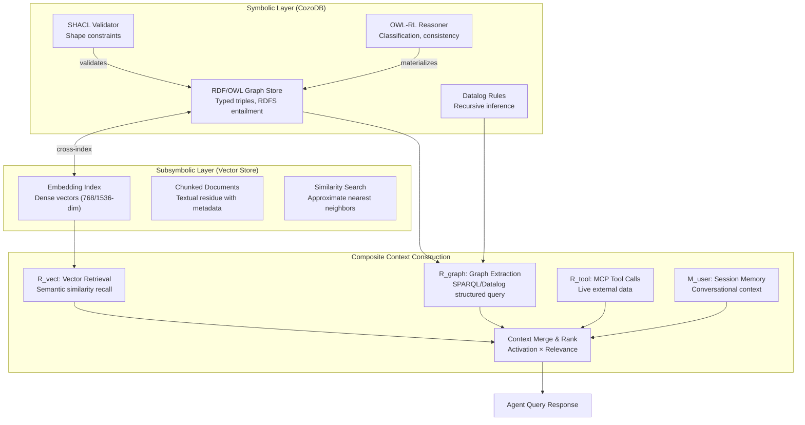

# Neuro-Symbolic Knowledge Architecture

Dual-memory architecture (RDF/OWL symbolic + vector subsymbolic), OWL-RL reasoning, SHACL validation, ontology builder pipeline, Large Ontology Models (CAR pipeline), and provenance in the neuro-symbolic stack.

---

## Neuro-Symbolic Knowledge Architecture

The dual-memory architecture unifies **symbolic structure** (RDF/OWL graph — typing, constraints, verifiability, logical inference) with **subsymbolic recall** (vector store — textual residue, similarity retrieval, associative linking). Neither alone is sufficient: graphs provide precision and compositionality; vectors provide tolerance and recall over unstructured residue.

### Dual-Memory Architecture



### Mapping to Existing CozoDB Semantic Store

The existing `semantic_facts` relation IS the RDF graph layer — each row encodes a typed triple with provenance. The vector layer adds a parallel embedding index over the same entities:

| Layer | Existing Implementation | Extended Capability |
|-------|------------------------|-------------------|
| **Graph (symbolic)** | `semantic_facts{fact_id, subject, predicate, object, ...}` | OWL-RL materialization loop; SHACL validation pre-commit |
| **RDFS hierarchy** | `rdfs_classes{subclass, superclass}` + recursive Datalog | Extended to OWL symmetric/transitive/inverse properties |
| **Vector (subsymbolic)** | — (new layer) | Embedding index over entity descriptions, chunk text |
| **Cross-index** | — (new bridge) | `entity_embeddings{entity_iri, vector, chunk_source}` |
| **Composite retrieval** | — (new orchestration) | R_vect ∪ R_graph ∪ R_tool ∪ M_user with activation-weighted ranking |

### Ontology Builder Pipeline

Documents, dialogues, and API responses flow through an LLM extraction stage that produces candidate triples, followed by symbolic validation before persistence:

1. **Extraction** — LLM parses unstructured text into candidate `(subject, predicate, object, type)` tuples using the Fish SVO pipeline for structural decomposition
2. **Normalization** — Entity resolution against existing ontology IRIs; new entities minted under namespace
3. **Validation (Structural)** — SHACL shapes enforce cardinality, typing, and property constraints:
   - `sh:minCount` / `sh:maxCount` — cardinality bounds
   - `sh:datatype`, `sh:class` — range type constraints
   - `sh:pattern` — lexical form validation
4. **Validation (Logical)** — OWL-RL consistency checking:
   - No individual is simultaneously an instance of two disjoint classes
   - Property domain/range typing is consistent
   - Transitive/symmetric closure does not produce contradictions
5. **Persistence** — Valid triples written as N-Quads into CozoDB with full `ProvenanceTag` (source, confidence, derivation)

### Large Ontology Models — CAR Pipeline

The Construct-Align-Reason (CAR) pipeline enables autonomous ontology construction from raw data:

| Stage | Operation | Existing Analog |
|-------|-----------|----------------|
| **Construct** | LLM extraction → candidate graph | Fish `compute_decimate()` + PSSD classification |
| **Align** | Graph-aware entity linking to existing ontology | `SentenceRelation` inter-sentence linking |
| **Reason** | Deterministic OWL-RL inference producing new materialized facts | RDFS `types[class]` recursive Datalog extended to OWL-RL |

### Extending RDFS Entailment to OWL-RL

The existing recursive Datalog pattern `types[super] := types[sub], *rdfs_classes{subclass: sub, superclass: super}` provides simple subclass transitivity. OWL-RL extends this with:

```cozo
%% OWL symmetric property inference
symmetric_closure[s, p, o] := *semantic_facts{subject: s, predicate: p, object: o}
symmetric_closure[o, p, s] := symmetric_closure[s, p, o], *owl_symmetric_properties{property: p}

%% OWL transitive property inference (fixed-point)
transitive_closure[s, p, o] := *semantic_facts{subject: s, predicate: p, object: o}
transitive_closure[s, p, o] := transitive_closure[s, p, mid], transitive_closure[mid, p, o],
    *owl_transitive_properties{property: p}

%% OWL inverse property inference
inverse_inferred[o, inv_p, s] := *semantic_facts{subject: s, predicate: p, object: o},
    *owl_inverse_properties{property: p, inverse: inv_p}
```

### Provenance in the Neuro-Symbolic Stack

Every fact in a named graph carries PROV-O properties, extending the existing `ProvenanceSemiring`:

| PROV-O Property | Maps To | Existing System |
|----------------|---------|-----------------|
| `prov:wasDerivedFrom` | Source triple/document IRI | `DerivationPath.antecedent_ids` |
| `prov:generatedAtTime` | RFC 3339 timestamp | `semantic_facts.valid_from` |
| `prov:wasAttributedTo` | Agent/pipeline stage IRI | `AcquisitionMethod` variant |
| `prov:wasGeneratedBy` | Activity IRI (extraction/inference) | `TermProvenance` variant |
| `prov:hadConfidence` | `Confidence.value()` | `ProvenanceTag.confidence` |

The semiring algebra (§Provenance and Confidence Propagation) applies identically to OWL-RL derived facts: `conjoin` for multi-premise rules, `disjoin` for alternative derivation paths.
