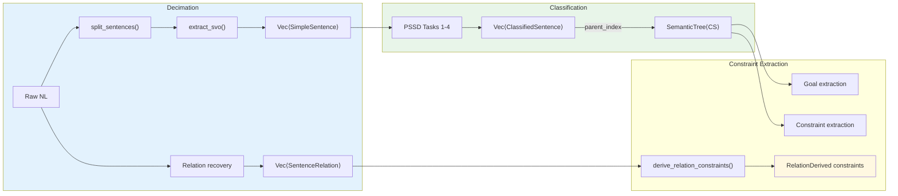
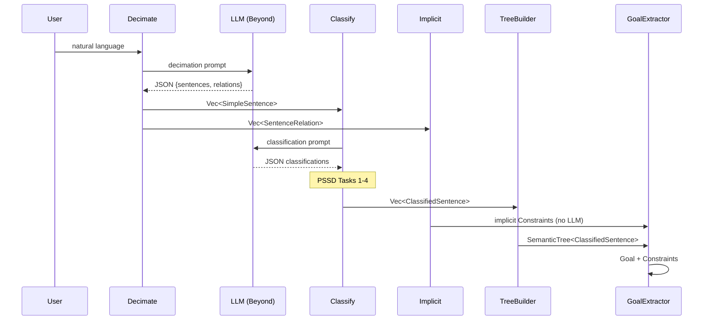
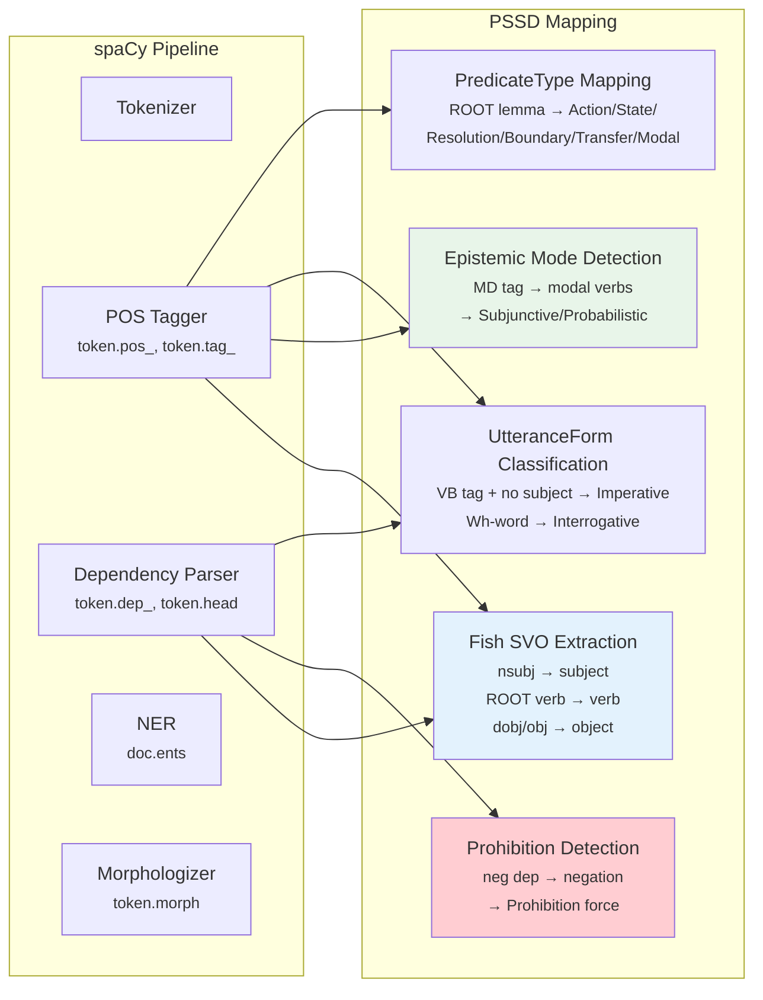

# PSSD Pipeline

The 7-task Pragmatic Semantic Software Development pipeline: from natural language through Fish SVO decomposition, PSSD classification (Tasks 1-7), Tone, UtteranceForm, PredicateType, SentenceCategory, and the DCT extraction pipeline.

---

## The PSSD Pipeline (Pragmatic Semantic Software Development)

The 7-task pipeline that transforms natural language into typed constraints:

- **PSSD Spec: Task 1 — IS/OUGHT Classification.** Every clause is either descriptive (what IS) or prescriptive (what OUGHT).
  **Implementation:** `pre_classify_ontological()` maps to `OntologicalMode {Descriptive, Prescriptive}`. Reference: Hare (1952) *The Language of Morals*, extending Hume's (1739) is-ought distinction.

- **PSSD Spec: Task 2 — Mood/Modality Analysis.** Declarative (firm assertion), Subjunctive (hypothetical), Probabilistic (hedged).
  **Implementation:** `pre_classify_epistemic()` maps to `EpistemicMode {Declarative, Subjunctive, Probabilistic}`. Reference: Palmer (2001).

- **PSSD Spec: Task 3 — Tagging Architecture.** Attach ontological + epistemic metadata to every clause.
  **Implementation:** `ClassifiedSentence` carries: `ontological_mode`, `epistemic_mode`, `force`, `utterance_form`, `predicate_type`, `goal_orientation`, `semantic_weight`.

- **PSSD Spec: Task 4 — Constraint Classification Matrix.** Cross the two axes:

  | | Declarative | Subjunctive/Probabilistic |
  |---|---|---|
  | **Prescriptive** | Guardrail | Guideline |
  | **Descriptive** | Evidence | Hypothesis |

  **Implementation:** `ConstraintForce::from_modality()`. Note: `Prohibition` is a 5th variant added via `from_modality_with_prohibition()` when negative covenant markers are detected.

- **PSSD Spec: Task 5 — Constraint Satisfaction.** Seek simultaneous satisfaction of ALL constraints. CSP-first, not optimization-first (Bistarelli et al. 1999).
  **Implementation:** [`Constraint.is_met()`](../../core/crates/discourse-types/src/core/constraint.rs:292) — force-sensitive satisfaction check.

- **PSSD Spec: Task 6 — Pragmatic Fallback.** When full satisfaction is impossible, relax guidelines in epistemic-strength order (weakest hedge first). Guardrails and prohibitions remain inviolable. The system never pretends partial is complete.

- **PSSD Spec: Task 7 — Unified Output.** Results plus full semantic audit trail.

Full specification: See the PSSD (Pragmatic Semantic Software Development) specification document.

### Spec vs Implementation Divergence

The PSSD spec (§8) defines a 2-variant `ConstraintForce` (Guardrail, Guideline). The implementation has evolved beyond the spec:

| PSSD Spec (§8) | Implementation | Divergence |
|----------------|----------------|------------|
| `ConstraintForce{Guardrail, Guideline}` | `ConstraintForce{Guardrail, Guideline, Evidence, Hypothesis, Prohibition}` | 5 variants; Evidence/Hypothesis for descriptive clauses, Prohibition for negative covenants |
| No `Tone` type | `Tone{Straight, Tentative(f64), Oneiric}` | Force graduation added (Austin etiolation) |
| No `UtteranceForm` | `UtteranceForm{Imperative, Interrogative, Indicative, Conditional, Subjunctive}` | Observable syntactic form classification |
| No `PredicateType` | `PredicateType{Action, State, Resolution, Boundary, Transfer, Modal}` | Verb semantic categorization |
| No `SentenceCategory` | `SentenceCategory{Goal, Constraint, Task}` | DCT pipeline output labels |
| No `TermProvenance` | `TermProvenance{DirectlyStated, ImplicitInPrompt, ContextuallyInherited, RelationDerived}` | Constraint derivation tracking |
| No `SentenceRelation` | `SentenceRelation` with 9 `RelationType` variants | Inter-sentence semantic recovery |
| No discourse framework | Full discourse framework (ADR-019): `Turn`, `SpeechAct`, `DiscourseRelation` | First-class conversation capture |

**Rule:** When citing types, always use `PSSD Spec:` prefix for spec claims and `Implementation:` prefix for code claims to prevent conflation.

---

## Fish Sentences — The Atomic Semantic Unit

Stanley Fish (2011) identified the simple sentence (Subject-Verb-Object) as "the most powerful structure in expression." The `compute_decimate()` operation breaks complex natural language into these atomic SVO triples.

**Implementation:** `SimpleSentence`

```rust
pub struct SimpleSentence {
    pub subject: String,
    pub verb: String,
    pub object: String,
    /// Character offsets in original text for traceability
    pub source_span: Option<(usize, usize)>,  // F-1: tuple, NOT Option<String>
    pub confidence: Confidence,
}
```

**Verb recognition details:**
- `COPULAS`: `{"is", "are", "was", "were", "has", "have", "had"}` — 7 copula verbs with O(1) lookup
- `ACTION_VERBS`: 25 recognized action verbs (causes, contains, requires, produces, enables, prevents, supports, includes, represents, defines, creates, uses, belongs_to, part_of, relates_to, stands, sits, lives, runs, built, made, wrote, invented, discovered, founded) — O(1) lookup
- `extract_svo()` finds verb position, splits into (subject, verb, object)
- `split_sentences()` splits on `.!?` boundaries
- The Fish-to-RDF encoding bridge converts these to RDF-compatible triples where verb = predicate

## Tone — Force Graduation

**Implementation:** `Tone` (Austin's etiolated performatives — force gradient)

```rust
pub enum Tone {
    Straight,           // factor() → 1.0 (normal force)
    Tentative(f64),     // factor() → v   (force reduced — hedging, 0.0–1.0)
    Oneiric,            // factor() → 0.0 (force fully suspended — dream mode)
}
```

**Confidence interaction rule:** `effective_weight = confidence.value() * tone.factor()`

**Merge rule:** Most cautious (lowest factor) wins — `Tone::merge(a, b)`.

## UtteranceForm and PredicateType

**Implementation:** `UtteranceForm` — observable syntactic form (NOT inner state):

| Variant | Pattern | Example |
|---------|---------|---------|
| `Imperative` | Verb-first, no subject | "Close the door" |
| `Interrogative` | Wh-movement, inversion | "What is X?" |
| `Indicative` (default) | Subject-verb-object | "X is Y" |
| `Conditional` | If-then | "If X, then Y" |
| `Subjunctive` | Irrealis | "Were it so" |

**Implementation:** `PredicateType` — semantic action category of a verb:

| Variant | Verbs | Semantic Mapping |
|---------|-------|-------------|
| `Action` | tell, create, build, help | Active operation |
| `State` (default) | is, has, contains | Fact assertion |
| `Resolution` | find, determine, what is | Query / inquiry |
| `Boundary` | keep, limit, ensure | Constraint attachment |
| `Transfer` | explain, show, give | Information sharing |
| `Modal` | should, must, might | Modality marker |

## SentenceCategory — DCT Classification Output

**Implementation:** `SentenceCategory`

| Variant | Meaning | Downstream |
|---------|---------|-----------|
| `Goal` | What the user wants to achieve or know | Goal extraction |
| `Constraint` | Conditions that must hold during or after execution | Constraint extraction |
| `Task` | Concrete actions or steps to perform | Task decomposition |

---

## The DCT Pipeline (Decimation-Classification-Tree)



### DCT Extraction Pipeline (Sequence Diagram)



**Pipeline stages:**

1. **Decimation:** `NL → Vec<SimpleSentence> + Vec<SentenceRelation>`
2. **Classification:** `Vec<SimpleSentence> → Vec<ClassifiedSentence>` (PSSD Tasks 1-4, adding `ontological_mode`, `epistemic_mode`, `force`, `utterance_form`, `predicate_type`, `category`)
3. **Tree Construction:** `Vec<ClassifiedSentence> → SemanticTree<ClassifiedSentence>` (via `parent_index`)
4. **Goal Extraction:** `SemanticTree → Goal with Vec<Constraint>`
5. **Implicit Extraction:** `Vec<SentenceRelation> → Vec<Constraint>` (deterministic + LLM)

---

## Linguistic Analysis Foundations

> **Why this section exists:** The Fish sentence decomposition (`decimate()` → SVO triples) and PSSD classification (Tasks 1-4) are grounded in formal linguistics. Understanding the linguistic model is necessary for extending the extraction pipeline, debugging misclassifications, and designing new semantic markers.

### How spaCy Supports the PSSD Pipeline

The PSSD extraction pipeline's linguistic classifications map directly to spaCy's linguistic model:



### Linguistic Grounding of Fish Sentence Decomposition

The SVO extraction in `extract_svo()` relies on dependency parsing. The mapping from Universal Dependencies to Fish sentence components:

| spaCy Dependency | Fish Component | Example | Notes |
|-----------------|----------------|---------|-------|
| `nsubj` (nominal subject) | `SimpleSentence.subject` | **Fox** jumped | Head's nominal subject |
| `ROOT` verb | `SimpleSentence.verb` | Fox **jumped** | Sentence root is the main verb |
| `dobj`/`obj` (direct object) | `SimpleSentence.object` | Fox ate **cake** | Head's direct object |
| `prep` + `pobj` (prepositional) | `SimpleSentence.object` (fallback) | Jumped over **dog** | When no direct object exists |
| `nsubjpass` (passive subject) | `SimpleSentence.object` | **Cake** was eaten | Passive voice inverts S/O |
| `acomp`/`attr` (predicate) | `SimpleSentence.object` | Fox is **quick** | Copular sentences |

**Verb recognition in `extract_svo()` — linguistic basis:**
- `COPULAS`: `{"is", "are", "was", "were", "has", "have", "had"}` — 7 copula verbs. Linguistically, these are `AUX` POS tags that function as main verbs in equative/attributive constructions.
- `ACTION_VERBS`: 25 recognized action verbs — these map to spaCy `VERB` POS tags with specific lemmas. The list is extensible.
- [`split_sentences()`](../../crates/discourse-verbs/src/encoding.rs:136) splits on `.!?` boundaries — corresponds to spaCy's `Sentencizer` rule-based segmentation.

### Linguistic Markers for PSSD Classification Axes

The PSSD classification tasks map to specific linguistic features detectable by POS tagging and morphological analysis:

**Task 1 — IS/OUGHT (OntologicalMode):**

| Linguistic Marker | spaCy Detection | PSSD Classification |
|------------------|----------------|-------------------|
| Modal verbs: must, should, shall | `tag_ == "MD"` | Prescriptive (OUGHT) |
| Imperative mood: verb-first, no subject | `dep_ == "ROOT"` + no `nsubj` child | Prescriptive (OUGHT) |
| Indicative with copula | `lemma_ == "be"` + `dep_ == "ROOT"` | Descriptive (IS) |
| Hedged assertion | `token.morph` contains `Mood=Sub` | Context-dependent |

**Task 2 — Mood/Modality (EpistemicMode):**

| Linguistic Marker | spaCy Detection | PSSD Classification |
|------------------|----------------|-------------------|
| Unhedged assertion | No modal, indicative mood | Declarative |
| Subjunctive mood | `Mood=Sub` in morphology | Subjunctive |
| Hedging adverbs: perhaps, maybe, possibly | `lemma_` in hedge set + `pos_ == "ADV"` | Probabilistic |
| Modal + weak commitment: might, could, may | `tag_ == "MD"` + weak modal lemma | Probabilistic |
| Modal + strong commitment: must, shall, will | `tag_ == "MD"` + strong modal lemma | Declarative |

**Prohibition Detection (negative covenant markers):**

| Linguistic Pattern | spaCy Detection | Result |
|-------------------|----------------|--------|
| "must not", "shall not" | `tag_ == "MD"` + `dep_ == "neg"` child | `ConstraintForce::Prohibition` |
| "never", "under no circumstances" | `lemma_ == "never"` or negation adverb | `ConstraintForce::Prohibition` |
| "do not", "don't" | `dep_ == "neg"` on auxiliary | `ConstraintForce::Prohibition` |

### spaCy Pattern Matching for Semantic Marker Detection

The Matcher pattern language enables rule-based detection of linguistic structures relevant to PSSD:

```python
# Modal verb + main verb → candidate for Prescriptive classification
modal_pattern = [
    {"TAG": "MD"},                              # Modal verb
    {"POS": "ADV", "OP": "*"},                  # Optional adverb(s)
    {"POS": "VERB"}                             # Main verb
]

# Negated modal → candidate for Prohibition
negated_modal_pattern = [
    {"TAG": "MD"},                              # Modal verb
    {"LOWER": {"IN": ["not", "n't", "never"]}}, # Negation
    {"POS": "ADV", "OP": "*"},                  # Optional adverb(s)
    {"POS": "VERB"}                             # Main verb
]

# Hedging pattern → candidate for Probabilistic epistemic mode
hedge_pattern = [
    {"LEMMA": {"IN": ["perhaps", "maybe", "possibly", "probably", "likely"]}}
]

# Conditional marker → candidate for Conditional UtteranceForm
conditional_pattern = [
    {"LOWER": "if"},
    {"IS_ALPHA": True, "OP": "+"},
    {"LOWER": {"IN": [",", "then"]}}
]
```

### spaCy Object Model Quick Reference

| Object | Description | Key Attributes |
|--------|-------------|---------------|
| `Doc` | Container for annotated text | `.ents`, `.sents`, `.noun_chunks`, `.cats` |
| `Token` | Single word/punctuation | `.pos_`, `.tag_`, `.dep_`, `.head`, `.lemma_`, `.morph`, `.ent_type_` |
| `Span` | Contiguous slice of Doc | `.label_`, `.start`, `.end`, `.root` |
| `Lexeme` | Context-independent word type | `.is_stop`, `.is_alpha`, `.vector` |
| `Vocab` | Shared string store | `.vectors`, string-to-hash mapping |

**Model selection for Discourse:**

| Model | When to Use | Tradeoff |
|-------|-------------|----------|
| `en_core_web_sm` (12 MB) | Fast extraction, no similarity needed | No word vectors |
| `en_core_web_lg` (560 MB) | Need word vectors for semantic similarity | Larger memory footprint |
| `en_core_web_trf` (438 MB) | Highest accuracy for NER/classification | Slowest; needs GPU for speed |

For complete POS tag sets, dependency relations, NER entity types, and morphological features, see [spacy-linguistic-model.md](spacy-linguistic-model.md).
For custom component development, training pipeline, and transformer integration, see [spacy-pipeline-components.md](spacy-pipeline-components.md).
