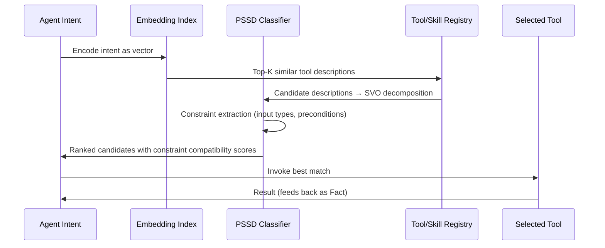

# Semantic Interoperability Protocols

MCP as semantic plumbing, A2A Agent Cards, semantic matching for tool/skill discovery, Open Agent Schema Framework (OASF), protocol comparison, and N-Quads as interchange format.

---

## Semantic Interoperability Protocols

The semantic pipeline does not exist in isolation — it connects to the broader agent ecosystem through standardized interoperability protocols. This section defines how MCP, A2A, and ontology-driven discovery integrate with the PSSD framework.

### MCP as Semantic Plumbing

The Model Context Protocol (MCP) provides three primitive types:

| MCP Primitive | Direction | Semantic Role | PSSD Analog |
|---------------|-----------|---------------|-------------|
| **Tools** | Model → Server | Functions the model can invoke | `PredicateType::Action` — active operations |
| **Resources** | Application → Model | Data the application exposes | `Fact` — structured knowledge for context |
| **Prompts** | User → Model | Templates the user can invoke | `Goal` — user intent structured as procedure |

MCP tool descriptions are natural language — they ARE Fish sentences subject to PSSD decomposition:
- Tool name → Subject (the tool as agent)
- Tool description → SVO decomposition of capability
- Parameter schema → Constraint extraction (types as constraints)
- Return schema → Object specification

### A2A Agent Cards

Agent-to-Agent (A2A) protocol uses Agent Cards — JSON at `/.well-known/agent.json` — as capability advertisement:

```json
{
  "name": "semantic-analyzer",
  "description": "Decomposes natural language into SVO triples and classifies constraints",
  "skills": [
    {
      "id": "pssd-classify",
      "name": "PSSD Classification",
      "description": "Classifies sentences by ontological mode, epistemic mode, and constraint force",
      "inputModes": ["text/plain"],
      "outputModes": ["application/json"]
    }
  ],
  "authentication": { "schemes": ["bearer"] }
}
```

**PSSD applied to Agent Cards:** The skill descriptions in Agent Cards are natural language subject to Fish decomposition:
- "Decomposes natural language into SVO triples" → `(agent, decomposes, natural_language)` + `(agent, produces, svo_triples)`
- "Classifies sentences by ontological mode" → `(agent, classifies, sentences)` with constraint: `by_axis(ontological_mode)`

### Semantic Matching for Tool/Skill Discovery

Tool discovery uses a two-stage hierarchical routing (MCP-Zero pattern):



**Stage 1 (Recall):** Vector similarity between agent intent embedding and tool description embeddings → broad candidate set
**Stage 2 (Precision):** PSSD pipeline decomposes candidates, extracts constraints, checks compatibility with agent context → ranked shortlist

### Open Agent Schema Framework (OASF)

OASF provides a multi-dimensional taxonomy for capability queries:

| Dimension | Examples | Query Pattern |
|-----------|----------|---------------|
| **Skill** | classification, extraction, generation, reasoning | `?skill rdf:type oasf:Classification` |
| **Domain** | code, natural-language, vision, audio | `?agent oasf:hasDomain "natural-language"` |
| **Feature** | streaming, batch, real-time, async | `?tool oasf:supportsFeature oasf:Streaming` |

This maps to the RDFS class hierarchy: skills are classes, agents are instances, features are properties. The existing `rdfs_classes` relation can encode the OASF taxonomy directly.

### Protocol Comparison

| Aspect | MCP Tool | A2A Agent Card | ANP Capability | OASF Skill |
|--------|----------|----------------|----------------|------------|
| **Format** | JSON Schema | JSON (`.well-known`) | JSON-LD | RDF/OWL |
| **Discovery** | Static config / registry | DNS + HTTP | Ontology query | SPARQL |
| **Description** | Natural language + schema | Natural language + modes | Formal ontology terms | Taxonomic classes |
| **Composition** | Client orchestration | Task delegation | Semantic chaining | Constraint satisfaction |
| **PSSD decomposition** | Tool desc → Fish SVO | Skill desc → Fish SVO | Already formal | Already formal |
| **Constraint source** | Parameter schemas | Input/output modes | Domain/range typing | Class hierarchy |

### N-Quads as Interchange Format

The existing RDF interoperability layer maps directly to agent capability exchange. An agent's capabilities can be serialized as N-Quads:

```nquads
<mem://agent-1/skill/pssd-classify> <rdf:type> <oasf:Classification> <graph://agent-1/capabilities> .
<mem://agent-1/skill/pssd-classify> <oasf:inputMode> "text/plain" <graph://agent-1/capabilities> .
<mem://agent-1/skill/pssd-classify> <oasf:outputMode> "application/json" <graph://agent-1/capabilities> .
<mem://agent-1/skill/pssd-classify> <rdfs:subClassOf> <oasf:SemanticAnalysis> <graph://agent-1/capabilities> .
```

This enables cross-agent capability reasoning via the same Datalog infrastructure used for fact inference.
