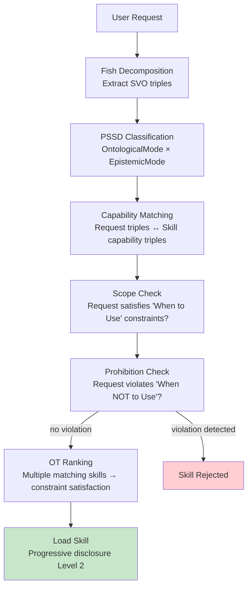

# Skill Specification

Semantic Skill Specification: SKILL.md as semantic artifact, progressive disclosure as variety attenuation, skill routing through the PSSD pipeline, skill composition as constraint satisfaction, and skill trust lifecycle.

---

## Semantic Skill Specification

SKILL.md files are themselves semantic artifacts — their frontmatter is structured metadata, their body is procedural knowledge, and their routing logic is constraint satisfaction. This section formalizes the semantics of skill specification.

### SKILL.md as Semantic Artifact

Applying the PSSD pipeline to skill specification itself:

| SKILL.md Section | PSSD Decomposition | Semantic Type |
|------------------|-------------------|---------------|
| `name` | Identity triple: `(skill, is_named, value)` | Fact (DirectlyStated) |
| `description` | Fish SVO → capability triples | Multiple Facts |
| `tags` | `(skill, rdf:type, tag_class)` for each tag | Class membership assertions |
| `sources` | `(skill, prov:wasDerivedFrom, source)` for each | Provenance chain |
| "When to Use" | Scope constraints — conditions under which skill applies | Guidelines (Prescriptive + Subjunctive) |
| "When NOT to Use" | Prohibitions — conditions under which skill must NOT be invoked | Prohibitions (Prescriptive + Negative) |
| Pipeline sections | Procedural knowledge — ordered operations | Goals with ordered Constraints |
| Anti-pattern table | Negative examples with corrections | Prohibition + Evidence pairs |
| Review checklist | Verification constraints — all must be satisfied | Guardrails (Prescriptive + Declarative) |

### Progressive Disclosure as Variety Attenuation

Shannon's channel capacity theorem (1948): a channel of capacity C can transmit at most C bits per use. The context window is a finite-capacity channel. Progressive disclosure is **optimal source coding** — transmit the minimum bits required for the current routing decision:

| Level | Content | Token Budget | Purpose |
|-------|---------|-------------|---------|
| **Level 1** | Frontmatter metadata (name, description, tags) | ~100 tokens | Routing decision — does this skill apply? |
| **Level 2** | SKILL.md body (full procedural knowledge) | ~5,000–20,000 tokens | Execution — how to perform the task |
| **Level 3** | Referenced files (references/, scripts/) | Variable | Deep detail — specific syntax, examples, data |

This IS Ashby's Law of Requisite Variety applied to agent context: only load variety sufficient to handle the current perturbation. Level 1 attenuates the full skill catalog to a shortlist; Level 2 provides execution knowledge; Level 3 provides reference detail on demand.

### Skill Routing Through the PSSD Pipeline

### Skill Composition as Constraint Satisfaction

When multiple skills are triggered, their constraints must be simultaneously satisfied. This is identical to the existing CSP approach (§PSSD Task 5):

1. **Collect** all candidate skill constraints (scope + prohibitions from each)
2. **Check** mutual consistency — Skill A's scope must not violate Skill B's prohibitions
3. **Rank** via OT — if constraints conflict, higher-ranked skill's constraints dominate
4. **Compose** — load compatible skills in dependency order

### Skill Trust Lifecycle

A new skill progresses through trust levels mapped to `TermProvenance`:

| Trust Level | `TermProvenance` Analog | Meaning | Transition Trigger |
|-------------|------------------------|---------|-------------------|
| **Unverified** | `ImplicitInPrompt` | Skill exists but not validated against use | Initial registration |
| **Verified** | `DirectlyStated` | Skill has been tested and confirmed working | Successful execution + review |
| **Inherited** | `ContextuallyInherited` | Skill trusted by association (same author, repo) | Provenance chain from verified skill |
| **Derived** | `RelationDerived` | Skill composed from verified sub-skills | Formal composition proof |

This trust model applies the same epistemic-strength ordering used for constraint relaxation: unverified skills are relaxed first under resource pressure (analogous to guidelines), while verified skills maintain their context allocation (analogous to guardrails).
