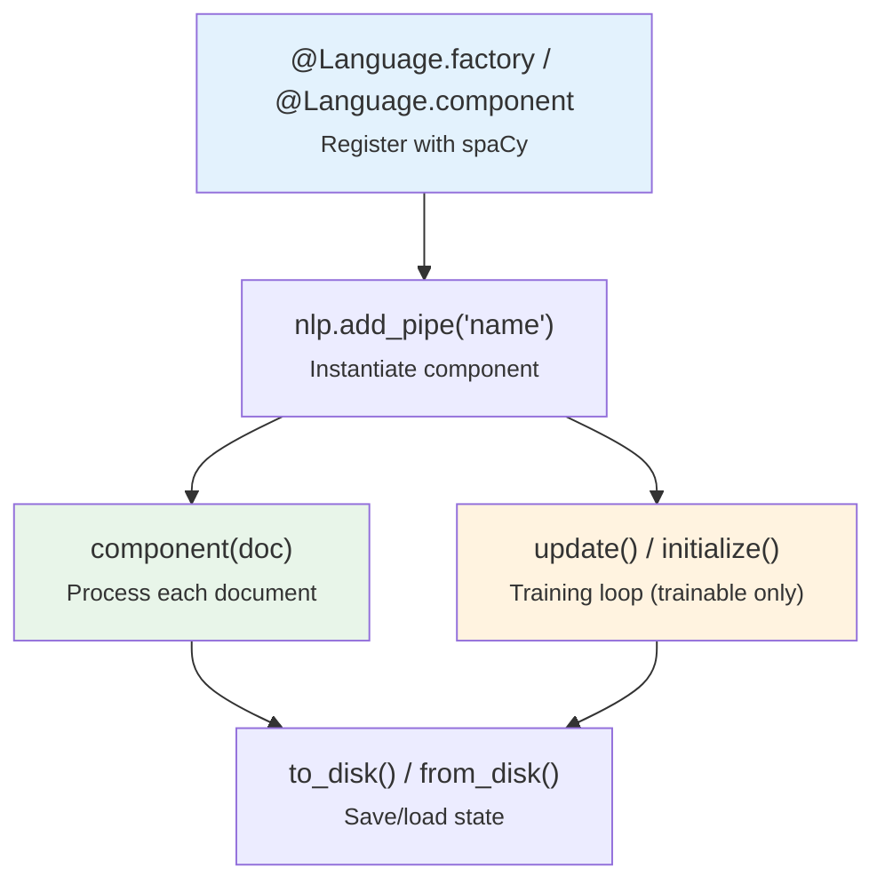
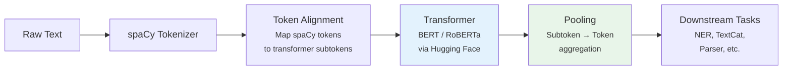
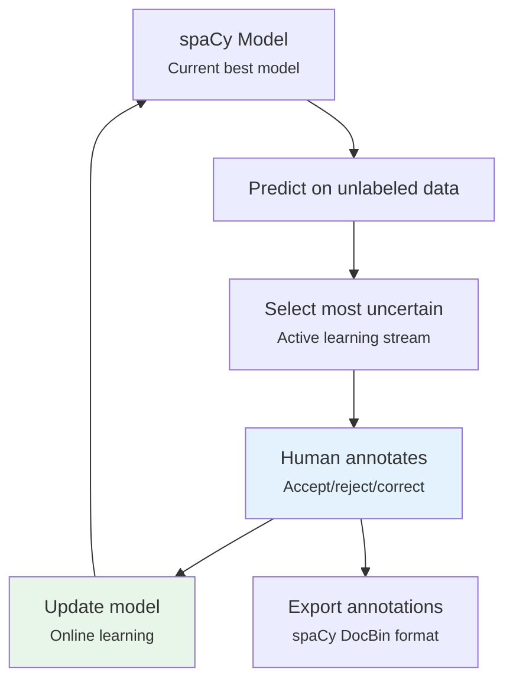

# spaCy Pipeline Components — Complete Reference

## Table of Contents

1. [Custom Component Development](#custom-component-development)
2. [Built-in Component Configuration](#built-in-component-configuration)
3. [Transformer Integration](#transformer-integration)
4. [Training Deep Dive](#training-deep-dive)
5. [Prodigy Integration](#prodigy-integration)
6. [Serialization and Packaging](#serialization-and-packaging)

---

## Custom Component Development

### Stateless Component (Function)

```python
from spacy.language import Language

@Language.component("my_component")
def my_component(doc):
    """A simple stateless component."""
    for token in doc:
        if token.text == "Discourse":
            token._.is_discourse_term = True
    return doc

# Register custom attribute
from spacy.tokens import Token
Token.set_extension("is_discourse_term", default=False)

# Add to pipeline
nlp.add_pipe("my_component", after="ner")
```

### Stateful Component (Factory)

```python
@Language.factory(
    "term_highlighter",
    default_config={"terms": [], "label": "CUSTOM"},
)
def create_term_highlighter(nlp, name, terms: list, label: str):
    return TermHighlighter(nlp, terms, label)

class TermHighlighter:
    def __init__(self, nlp, terms, label):
        self.nlp = nlp
        self.terms = set(terms)
        self.label = label
    
    def __call__(self, doc):
        spans = []
        for i, token in enumerate(doc):
            if token.text.lower() in self.terms:
                spans.append(doc[i:i+1])
        doc.spans["highlighted"] = spans
        return doc
    
    def to_disk(self, path, exclude=tuple()):
        # Serialize component data
        import json
        data = {"terms": list(self.terms), "label": self.label}
        with open(path / "data.json", "w") as f:
            json.dump(data, f)
    
    def from_disk(self, path, exclude=tuple()):
        import json
        with open(path / "data.json") as f:
            data = json.load(f)
        self.terms = set(data["terms"])
        self.label = data["label"]
        return self
```

### Component Lifecycle



### Custom Extensions

```python
from spacy.tokens import Doc, Token, Span

# Token-level extension
Token.set_extension("is_technical", default=False)

# Doc-level extension
Doc.set_extension("summary", default=None)
Doc.set_extension("word_count", getter=lambda doc: len(doc))

# Span-level extension
Span.set_extension("confidence", default=0.0)

# Property extension (computed on access)
Token.set_extension("reversed", getter=lambda token: token.text[::-1])

# Method extension
Doc.set_extension("top_entities", method=lambda doc, n=5: 
    sorted(doc.ents, key=lambda e: e.end - e.start, reverse=True)[:n])
```

> **Source**: spaCy docs — [Processing Pipelines](https://spacy.io/usage/processing-pipelines). [Custom Components](https://spacy.io/usage/processing-pipelines#custom-components).

---

## Built-in Component Configuration

### EntityRuler (Rule-Based NER)

```python
# Add before statistical NER for rule-based overrides
ruler = nlp.add_pipe("entity_ruler", before="ner")

# Pattern types:
# 1. Exact string match
patterns = [{"label": "ORG", "pattern": "Explosion AI"}]

# 2. Token-level patterns
patterns.append({
    "label": "TECH",
    "pattern": [
        {"LOWER": {"IN": ["spacy", "prodigy", "thinc"]}},
        {"IS_DIGIT": True, "OP": "?"}  # optional version number
    ]
})

# 3. With pattern ID for tracking
patterns.append({
    "label": "GPE", 
    "pattern": "Berlin",
    "id": "berlin_city"
})

ruler.add_patterns(patterns)
```

### SpanCategorizer (Overlapping Entities)

Unlike NER which assigns non-overlapping entities, SpanCategorizer supports overlapping spans:

```python
# In config.cfg:
# [components.spancat]
# factory = "spancat"
# spans_key = "sc"

# Access results:
doc = nlp("Apple announced new iPhone in California")
for span in doc.spans["sc"]:
    print(span.text, span.label_, span.start, span.end)
# "Apple" → ORG, PRODUCT (both labels, overlapping)
```

### Sentencizer (Rule-Based Sentence Segmentation)

```python
# Use when you don't need the full dependency parser
nlp.add_pipe("sentencizer")
# Much faster than parser-based sentence splitting
```

### Retokenizer (Merge/Split Tokens)

```python
doc = nlp("New York City is big")
with doc.retokenize() as retokenizer:
    spans = [(doc[0:3], {"LEMMA": "New York City"})]
    for span, attrs in spans:
        retokenizer.merge(span, attrs=attrs)
# Now doc[0].text == "New York City"
```

---

## Transformer Integration

### spacy-transformers

spacy-transformers bridges Hugging Face Transformers with spaCy's pipeline.[^trf]

[^trf]: spacy-transformers: [explosion/spacy-transformers](https://github.com/explosion/spacy-transformers)

```bash
pip install spacy-transformers
python -m spacy download en_core_web_trf
```

### Architecture



### config.cfg for Transformer Pipeline

```ini
[components.transformer]
factory = "transformer"

[components.transformer.model]
@architectures = "spacy-transformers.TransformerModel.v3"
name = "roberta-base"
tokenizer_config = {"use_fast": true}

[components.transformer.model.get_spans]
@span_getters = "spacy-transformers.strided_spans.v1"
window = 128
stride = 96

[components.ner]
factory = "ner"

[components.ner.model]
@architectures = "spacy.TransitionBasedParser.v2"

[components.ner.model.tok2vec]
@architectures = "spacy-transformers.TransformerListener.v1"
grad_factor = 1.0
```

### Model Comparison

| Model | Size | Speed | Accuracy (NER) | Vectors |
|-------|------|-------|-----------------|---------|
| `en_core_web_sm` | 12 MB | Fastest | 85.3 F1 | None |
| `en_core_web_md` | 40 MB | Fast | 85.3 F1 | 20K 300d |
| `en_core_web_lg` | 560 MB | Medium | 86.4 F1 | 685K 300d |
| `en_core_web_trf` | 438 MB | Slower | 89.9 F1 | Contextual |

> **Source**: [spaCy Models](https://spacy.io/models). Benchmarks on OntoNotes 5.

---

## Training Deep Dive

### Data Format (.spacy DocBin)

```python
from spacy.tokens import DocBin
import spacy

nlp = spacy.blank("en")
db = DocBin()

# Convert annotated data to spaCy format
training_data = [
    ("Apple is a company in California", {"entities": [(0, 5, "ORG"), (25, 35, "GPE")]}),
    ("Google opened offices in Berlin", {"entities": [(0, 6, "ORG"), (25, 31, "GPE")]}),
]

for text, annotations in training_data:
    doc = nlp.make_doc(text)
    ents = []
    for start, end, label in annotations["entities"]:
        span = doc.char_span(start, end, label=label)
        if span:
            ents.append(span)
    doc.ents = ents
    db.add(doc)

db.to_disk("./train.spacy")
```

### Callbacks and Custom Training

```python
# In config.cfg:
[training.logger]
@loggers = "spacy.ConsoleLogger.v1"
progress_bar = true

# Custom batching
[training.batcher]
@batchers = "spacy.batch_by_padded.v1"
discard_oversize = true
size = 2000
buffer = 256
```

### Evaluation Metrics

| Task | Primary Metric | spaCy Key |
|------|---------------|-----------|
| NER | F1 (entity-level) | `ents_f`, `ents_p`, `ents_r` |
| POS Tagging | Accuracy | `tag_acc`, `pos_acc` |
| Dependency Parsing | UAS/LAS | `dep_uas`, `dep_las` |
| Text Classification | F1 (macro) | `cats_macro_f` |
| Sentence Segmentation | F1 | `sents_f` |
| Speed | Words/sec | `speed` |

---

## Prodigy Integration

Prodigy is Explosion's annotation tool with active learning, integrating directly with spaCy.[^prodigy]

[^prodigy]: Prodigy: [prodi.gy](https://prodi.gy/). Not open-source; requires license.

### Active Learning Workflow



### Common Prodigy Commands

```bash
# NER annotation with active learning
prodigy ner.manual my_dataset en_core_web_sm ./data.jsonl --label ORG,PERSON,GPE

# NER correction (model suggestions)
prodigy ner.correct my_dataset en_core_web_sm ./data.jsonl --label ORG,PERSON,GPE

# Text classification
prodigy textcat.manual my_dataset ./data.jsonl --label POSITIVE,NEGATIVE

# Train from Prodigy annotations
prodigy train ./output --ner my_dataset --lang en
```

---

## Serialization and Packaging

### Save/Load Pipeline

```python
# Save to directory
nlp.to_disk("./my_model")

# Load from directory
nlp = spacy.load("./my_model")

# Save/load individual components
nlp.get_pipe("ner").to_disk("./ner_component")
```

### Create Distributable Package

```bash
# Package a trained model
python -m spacy package ./model-best ./packages \
    --name my_custom_model \
    --version 1.0.0 \
    --meta '{"description": "Custom NER model for Discourse entities"}'

# Install the package
cd packages/en_my_custom_model-1.0.0
pip install .

# Use in code
nlp = spacy.load("en_my_custom_model")
```

### spaCy Projects

```yaml
# project.yml
title: "My NLP Project"
vars:
  lang: "en"
  train: "corpus/train.spacy"
  dev: "corpus/dev.spacy"

workflows:
  all:
    - preprocess
    - train
    - evaluate

commands:
  - name: preprocess
    help: "Convert data to spaCy format"
    script:
      - "python scripts/preprocess.py"
    deps:
      - "assets/raw_data.jsonl"
    outputs:
      - "corpus/train.spacy"
      - "corpus/dev.spacy"

  - name: train
    help: "Train the model"
    script:
      - "python -m spacy train configs/config.cfg --output training/ --paths.train ${vars.train} --paths.dev ${vars.dev}"
    deps:
      - "configs/config.cfg"
      - "corpus/train.spacy"
      - "corpus/dev.spacy"
    outputs:
      - "training/model-best"
```

> **Source**: spaCy docs — [Projects](https://spacy.io/usage/projects). [Training](https://spacy.io/usage/training).

---

## References

- spaCy documentation: [spacy.io](https://spacy.io/)
- spaCy GitHub: [explosion/spaCy](https://github.com/explosion/spaCy)
- spacy-transformers: [explosion/spacy-transformers](https://github.com/explosion/spacy-transformers)
- Thinc (ML library): [explosion/thinc](https://github.com/explosion/thinc)
- Prodigy: [prodi.gy](https://prodi.gy/)
- spaCy Universe (community): [spacy.io/universe](https://spacy.io/universe)
